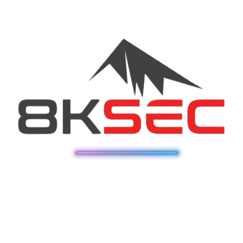

# HackTricks

<figure><figcaption></figcaption></figure>

_Hacktricks logos & motion design by_ [_@ppiernacho_](https://www.instagram.com/ppieranacho/)_._


**Welcome to the wiki where you will find each hacking trick/technique/whatever I have learnt from CTFs, real life apps, reading researches, and news.**


To get started follow this page where you will find the **typical flow** that **you should follow when pentesting** one or more **machines:**


[pentesting-methodology.md](generic-methodologies-and-resources/pentesting-methodology.md)


## Platinum Sponsors

_Your company could be here._

## Corporate Sponsors

### [STM Cyber](https://www.stmcyber.com)

<figure><figcaption></figcaption></figure>

[**STM Cyber**](https://www.stmcyber.com) is a great cybersecurity company whose slogan is **HACK THE UNHACKABLE**. They perform their own research and develop their own hacking tools to **offer several valuable cybersecurity services** like pentesting, Red teams and training.

You can check their **blog** in [**https://blog.stmcyber.com**](https://blog.stmcyber.com)

**STM Cyber** also support cybersecurity open source projects like HackTricks :)

### [RootedCON](https://www.rootedcon.com/)

<figure><figcaption></figcaption></figure>

[**RootedCON**](https://www.rootedcon.com) is the most relevant cybersecurity event in **Spain** and one of the most important in **Europe**. With **the mission of promoting technical knowledge**, this congress is a boiling meeting point for technology and cybersecurity professionals in every discipline.



### [Intigriti](https://www.intigriti.com)

<figure><figcaption></figcaption></figure>

**Intigriti** is the **Europe's #1** ethical hacking and **bug bounty platform.**

**Bug bounty tip**: **sign up** for **Intigriti**, a premium **bug bounty platform created by hackers, for hackers**! Join us at [**https://go.intigriti.com/hacktricks**](https://go.intigriti.com/hacktricks) today, and start earning bounties up to **$100,000**!



### [Trickest](https://trickest.com/?utm\_campaign=hacktrics\&utm\_medium=banner\&utm\_source=hacktricks)

<figure><figcaption></figcaption></figure>

\
Use [**Trickest**](https://trickest.com/?utm\_campaign=hacktrics\&utm\_medium=banner\&utm\_source=hacktricks) to easily build and **automate workflows** powered by the world's **most advanced** community tools.

Get Access Today:



### [Intruder](https://www.intruder.io/?utm\_source=referral\&utm\_campaign=hacktricks)

<figure><figcaption></figcaption></figure>

Stay a step ahead in the cybersecurity game.

[**Intruder**](https://www.intruder.io/?utm\_source=referral\&utm\_campaign=hacktricks) makes vulnerability management easy. Keep track of your attack surface, see where your company is vulnerable, and prioritize issues that leave your systems most exposed so you can focus on what matters most.

Run thousands of checks with a single platform that covers your entire tech stack from internal infrastructure to web apps, APIs and cloud systems. Integrate seamlessly with [AWS, GCP, Azure](https://www.intruder.io/cloud-vulnerability-scanning-for-aws-google-cloud-and-azure) and streamline DevOps so your team can implement fixes faster.

Intruder never rests. Round-the-clock protection monitors your systems 24/7. Want to learn more? Visit their site and take it for a spin with [**a free trial**](https://www.intruder.io/?utm\_source=referral\&utm\_campaign=hacktricks).



### [HACKENPROOF](https://bit.ly/3xrrDrL)

<figure><figcaption></figcaption></figure>

**HackenProof is home to all crypto bug bounties.**

**Get rewarded without delays**\
HackenProof bounties launch only when their customers deposit the reward budget. You'll get the reward after the bug is verified.

**Get experience in web3 pentesting**\
Blockchain protocols and smart contracts are the new Internet! Master web3 security at its rising days.

**Become the web3 hacker legend**\
Gain reputation points with each verified bug and conquer the top of the weekly leaderboard.

[**Sign up on HackenProof**](https://hackenproof.com/register) start earning from your hacks!



### [WebSec](https://websec.nl/)

<figure><figcaption></figcaption></figure>

[**WebSec**](https://websec.nl) is a professional cybersecurity company based in **Amsterdam** which helps **protecting** businesses **all over the world** against the latest cybersecurity threats by providing **offensive-security services** with a **modern** approach.

WebSec is an **all-in-one security company** which means they do it all; Pentesting, **Security** Audits, Awareness Trainings, Phishing Campagnes, Code Review, Exploit Development, Security Experts Outsourcing and much more.

Another cool thing about WebSec is that unlike the industry average WebSec is **very confident in their skills**, to such an extent that they **guarantee the best quality results**, it states on their website "**If we can't hack it, You don't pay it!**". For more info take a look at their [**website**](https://websec.nl/en/) and [**blog**](https://websec.nl/blog/)!

In addition to the above WebSec is also a **committed supporter of HackTricks.**



### [DragonJAR](https://www.dragonjar.org/)

<figure><figcaption></figcaption></figure>

[**DragonJAR is a leading offensive cybersecurity company**](https://www.dragonjar.org/) **located in Colombia**. DragonJAR offers [comprehensive offensive cybersecurity services, such as **pentesting**](https://www.dragonjar.org/servicios-de-seguridad-informatica) in various areas and practically **any technology**, **Red Team** attack simulations, **physical** security testing, **stress testing**, social engineering, source **code security review**, and cybersecurity training. Additionally, they organize the **DragonJAR Security Conference**, [an international cybersecurity congress](https://www.dragonjarcon.org/) that has been held for over a decade, becoming a showcase for the latest security research in Spanish and of great relevance in the region.

[**DragonJAR es una empresa líder en ciberseguridad ofensiva**](https://www.dragonjar.org/) **ubicada en Colombia**, DragonJAR ofrece [servicios integrales de seguridad informática ofensiva, como **pentesting**](https://www.dragonjar.org/servicios-de-seguridad-informatica) en diversas áreas y prácticamente **cualquier tecnología**, simulaciones de ataque **Red Team**, pruebas de seguridad **física**, **pruebas de estrés**, ingeniería social, revisión de seguridad en **código fuente** y capacitación en seguridad informática. Asimismo, organiza la **DragonJAR Security Conference**, [un congreso internacional de seguridad informática](https://www.dragonjarcon.org/) que se ha realizado durante más de una década, convirtiéndose en el escaparate para las últimas investigaciones de seguridad en español y de gran relevancia en la región.

## License

**Copyright © Carlos Polop 2023. Except where otherwise specified (the external information copied into the book belongs to the original authors), the text on** [**HACK TRICKS**](https://github.com/carlospolop/hacktricks) **by Carlos Polop is licensed under the**[ **Attribution-NonCommercial 4.0 International (CC BY-NC 4.0)**](https://creativecommons.org/licenses/by-nc/4.0/)**.**\
**If you want to use it with commercial purposes, contact me.**

## **Disclaimer**


This book, 'HackTricks,' is intended for educational and informational purposes only. The content within this book is provided on an 'as is' basis, and the authors and publishers make no representations or warranties of any kind, express or implied, about the completeness, accuracy, reliability, suitability, or availability of the information, products, services, or related graphics contained within this book. Any reliance you place on such information is therefore strictly at your own risk.

The authors and publishers shall in no event be liable for any loss or damage, including without limitation, indirect or consequential loss or damage, or any loss or damage whatsoever arising from loss of data or profits arising out of, or in connection with, the use of this book.

Furthermore, the techniques and tips described in this book are provided for educational and informational purposes only, and should not be used for any illegal or malicious activities. The authors and publishers do not condone or support any illegal or unethical activities, and any use of the information contained within this book is at the user's own risk and discretion.

The user is solely responsible for any actions taken based on the information contained within this book, and should always seek professional advice and assistance when attempting to implement any of the techniques or tips described herein.

By using this book, the user agrees to release the authors and publishers from any and all liability and responsibility for any damages, losses, or harm that may result from the use of this book or any of the information contained within it.


<a href="https://cloud.hacktricks.xyz/pentesting-cloud/pentesting-cloud-methodology"><strong>☁️ HackTricks Cloud ☁️</strong></a> -<a href="https://twitter.com/hacktricks_live"><strong>🐦 Twitter 🐦</strong></a> - <a href="https://www.twitch.tv/hacktricks_live/schedule"><strong>🎙️ Twitch 🎙️</strong></a> - <a href="https://www.youtube.com/@hacktricks_LIVE"><strong>🎥 Youtube 🎥</strong></a>

* Do you work in a **cybersecurity company**? Do you want to see your **company advertised in HackTricks**? or do you want to have access to the **latest version of the PEASS or download HackTricks in PDF**? Check the [**SUBSCRIPTION PLANS**](https://github.com/sponsors/carlospolop)!
* Discover [**The PEASS Family**](https://opensea.io/collection/the-peass-family), our collection of exclusive [**NFTs**](https://opensea.io/collection/the-peass-family)
* Get the [**official PEASS & HackTricks swag**](https://peass.creator-spring.com)
* **Join the** [**💬**](https://emojipedia.org/speech-balloon/) [**Discord group**](https://discord.gg/hRep4RUj7f) or the [**telegram group**](https://t.me/peass) or **follow** me on **Twitter** [**🐦**](https://github.com/carlospolop/hacktricks/tree/7af18b62b3bdc423e11444677a6a73d4043511e9/\[https:/emojipedia.org/bird/README.md)[**@carlospolopm**](https://twitter.com/hacktricks\_live)**.**
* **Share your hacking tricks by submitting PRs to the** [**hacktricks repo**](https://github.com/carlospolop/hacktricks) **and** [**hacktricks-cloud repo**](https://github.com/carlospolop/hacktricks-cloud).

