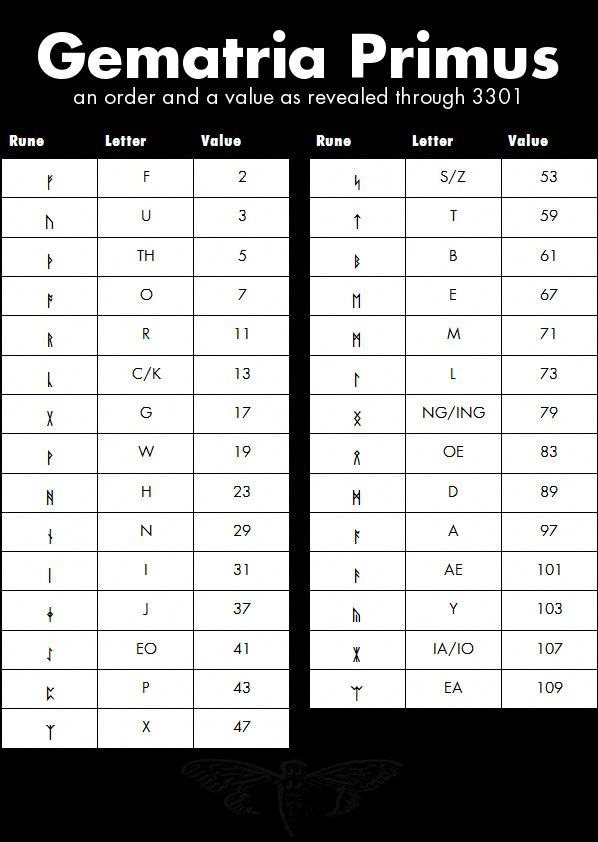

# Crypto CTFs Tricks

## Online Hashes DBs

* _**Google it**_
* [http://hashtoolkit.com/reverse-hash?hash=4d186321c1a7f0f354b297e8914ab240](http://hashtoolkit.com/reverse-hash?hash=4d186321c1a7f0f354b297e8914ab240)
* [https://www.onlinehashcrack.com/](https://www.onlinehashcrack.com)
* [https://crackstation.net/](https://crackstation.net)
* [https://md5decrypt.net/](https://md5decrypt.net)
* [https://www.onlinehashcrack.com](https://www.onlinehashcrack.com)
* [https://gpuhash.me/](https://gpuhash.me)
* [https://hashes.org/search.php](https://hashes.org/search.php)
* [https://www.cmd5.org/](https://www.cmd5.org)
* [https://hashkiller.co.uk/Cracker/MD5](https://hashkiller.co.uk/Cracker/MD5)
* [https://www.md5online.org/md5-decrypt.html](https://www.md5online.org/md5-decrypt.html)

## Magic Autosolvers

* ****[**https://github.com/Ciphey/Ciphey**](https://github.com/Ciphey/Ciphey)****
* ****[https://gchq.github.io/CyberChef/](https://gchq.github.io/CyberChef/) (Magic module)

## Encoders

Most of encoded data can be decoded with these 2 ressources:

* [https://www.dcode.fr/tools-list](https://www.dcode.fr/tools-list)
* [https://gchq.github.io/CyberChef/](https://gchq.github.io/CyberChef/)

### Substitution Autosolvers

* [https://www.boxentriq.com/code-breaking/cryptogram](https://www.boxentriq.com/code-breaking/cryptogram)
* [https://quipqiup.com/](https://quipqiup.com) - Very good !

#### Caesar - ROTx Autosolvers

* [https://www.nayuki.io/page/automatic-caesar-cipher-breaker-javascript](https://www.nayuki.io/page/automatic-caesar-cipher-breaker-javascript)

#### Atbash Cipher

* [http://rumkin.com/tools/cipher/atbash.php](http://rumkin.com/tools/cipher/atbash.php)

### Similar to BASE64

Check all bases with: [https://github.com/mufeedvh/basecrack](https://github.com/mufeedvh/basecrack)

* **Base32** \[_A-Z2-7=_]
  * `NBXWYYLDMFZGCY3PNRQQ====`
* **Base58** \[_123456789ABCDEFGHJKLMNPQRSTUVWXYZabcdefghijkmnopqrstuvwxyz_]
  * `2yJiRg5BF9gmsU6AC`
* **Base62** \[_0-9A-Za-z_]
  * `g2AextRZpBKRBzQ9`
* **Base64** \[_A-Za-z0-9+/=_]
  * `aG9sYWNhcmFjb2xh`
* **Base85 --> Like Ascii85**
* **ATOM-128** \[_/128GhIoPQROSTeUbADfgHijKLM+n0pFWXY456xyzB7=39VaqrstJklmNuZvwcdEC_]
  * `MIc3KiXa+Ihz+lrXMIc3KbCC`
* **HAZZ15** \[_HNO4klm6ij9n+J2hyf0gzA8uvwDEq3X1Q7ZKeFrWcVTts/MRGYbdxSo=ILaUpPBC5_]
  * `DmPsv8J7qrlKEoY7`
* **MEGAN35** \[_3GHIJKLMNOPQRSTUb=cdefghijklmnopWXYZ/12+406789VaqrstuvwxyzABCDEF5_]
  * `kLD8iwKsigSalLJ5`
* **ZONG22** \[_ZKj9n+yf0wDVX1s/5YbdxSo=ILaUpPBCHg8uvNO4klm6iJGhQ7eFrWczAMEq3RTt2_]
  * `ayRiIo1gpO+uUc7g`
* **ESAB46** \[]
  * `3sHcL2NR8WrT7mhR`
* **MEGAN45** \[]
  * `kLD8igSXm2KZlwrX`
* **TIGO3FX** \[]
  * `7AP9mIzdmltYmIP9mWXX`
* **TRIPO5** \[]
  * `UE9vSbnBW6psVzxB`
* **FERON74** \[]
  * `PbGkNudxCzaKBm0x`
* **GILA7** \[]
  * `D+nkv8C1qIKMErY1`
* **Citrix CTX1** \[]
  * `MNGIKCAHMOGLKPAKMMGJKNAINPHKLOBLNNHILCBHNOHLLPBK`

[http://k4.cba.pl/dw/crypo/tools/eng_atom128c.html](http://k4.cba.pl/dw/crypo/tools/eng_atom128c.html) - 404 Dead: [https://web.archive.org/web/20190228181208/http://k4.cba.pl/dw/crypo/tools/eng_hackerize.html](https://web.archive.org/web/20190228181208/http://k4.cba.pl/dw/crypo/tools/eng_hackerize.html)

### HackerizeXS \[_╫Λ↻├☰┏_]

```
╫☐↑Λ↻Λ┏Λ↻☐↑Λ
```

* [http://k4.cba.pl/dw/crypo/tools/eng_hackerize.html](http://k4.cba.pl/dw/crypo/tools/eng_hackerize.html) - 404 Dead: [https://web.archive.org/web/20190228181208/http://k4.cba.pl/dw/crypo/tools/eng_hackerize.html](https://web.archive.org/web/20190228181208/http://k4.cba.pl/dw/crypo/tools/eng_hackerize.html)

### Morse

```
.... --- .-.. -.-. .- .-. .- -.-. --- .-.. .-
```

* [http://k4.cba.pl/dw/crypo/tools/eng_morse-encode.html](http://k4.cba.pl/dw/crypo/tools/eng_morse-encode.html) - 404 Dead: [https://gchq.github.io/CyberChef/](https://gchq.github.io/CyberChef/)

### UUencoder

```
begin 644 webutils_pl
M2$],04A/3$%(3TQ!2$],04A/3$%(3TQ!2$],04A/3$%(3TQ!2$],04A/3$%(
M3TQ!2$],04A/3$%(3TQ!2$],04A/3$%(3TQ!2$],04A/3$%(3TQ!2$],04A/
F3$%(3TQ!2$],04A/3$%(3TQ!2$],04A/3$%(3TQ!2$],04A/3$$`
`
end
```

* [http://www.webutils.pl/index.php?idx=uu](http://www.webutils.pl/index.php?idx=uu)

### XXEncoder

```
begin 644 webutils_pl
hG2xAEIVDH236Hol-G2xAEIVDH236Hol-G2xAEIVDH236Hol-G2xAEIVDH236
5Hol-G2xAEE++
end
```

* [www.webutils.pl/index.php?idx=xx](https://github.com/carlospolop/hacktricks/tree/bf578e4c5a955b4f6cdbe67eb4a543e16a3f848d/crypto/www.webutils.pl/index.php?idx=xx)

### YEncoder

```
=ybegin line=128 size=28 name=webutils_pl
ryvkryvkryvkryvkryvkryvkryvk
=yend size=28 crc32=35834c86
```

* [http://www.webutils.pl/index.php?idx=yenc](http://www.webutils.pl/index.php?idx=yenc)

### BinHex

```
(This file must be converted with BinHex 4.0)
:#hGPBR9dD@acAh"X!$mr2cmr2cmr!!!!!!!8!!!!!-ka5%p-38K26%&)6da"5%p
-38K26%'d9J!!:
```

* [http://www.webutils.pl/index.php?idx=binhex](http://www.webutils.pl/index.php?idx=binhex)

### ASCII85

```
<~85DoF85DoF85DoF85DoF85DoF85DoF~>
```

* [http://www.webutils.pl/index.php?idx=ascii85](http://www.webutils.pl/index.php?idx=ascii85)

### Dvorak keyboard

```
drnajapajrna
```

* [https://www.geocachingtoolbox.com/index.php?lang=en\&page=dvorakKeyboard](https://www.geocachingtoolbox.com/index.php?lang=en\&page=dvorakKeyboard)

### A1Z26

Letters to their numerical value

```
8 15 12 1 3 1 18 1 3 15 12 1
```

### Affine Cipher Encode

Letter to num `(ax+b)%26` (_a_ and _b_ are the keys and _x_ is the letter) and the result back to letter

```
krodfdudfrod
```

### SMS Code

**Multitap** [replaces a letter](https://www.dcode.fr/word-letter-change) by repeated digits defined by the corresponding key code on a mobile [phone keypad](https://www.dcode.fr/phone-keypad-cipher) (This mode is used when writing SMS).\
For example: 2=A, 22=B, 222=C, 3=D...\
You can identify this code because you will see** several numbers repeated**.

You can decode this code in: [https://www.dcode.fr/multitap-abc-cipher](https://www.dcode.fr/multitap-abc-cipher)

### Bacon Code

Substitude each letter for 4 As or Bs (or 1s and 0s)

```
00111 01101 01010 00000 00010 00000 10000 00000 00010 01101 01010 00000
AABBB ABBAB ABABA AAAAA AAABA AAAAA BAAAA AAAAA AAABA ABBAB ABABA AAAAA
```

### Runes



## Compression

**Raw Deflate** and **Raw Inflate** (you can find both in Cyberchef) can compress and decompress data without headers.

## Easy Crypto

### XOR - Autosolver

* [https://wiremask.eu/tools/xor-cracker/](https://wiremask.eu/tools/xor-cracker/)

### Bifid

A keywork is needed

```
fgaargaamnlunesuneoa
```

### Vigenere

A keywork is needed

```
wodsyoidrods
```

* [https://www.guballa.de/vigenere-solver](https://www.guballa.de/vigenere-solver)
* [https://www.dcode.fr/vigenere-cipher](https://www.dcode.fr/vigenere-cipher)
* [https://www.mygeocachingprofile.com/codebreaker.vigenerecipher.aspx](https://www.mygeocachingprofile.com/codebreaker.vigenerecipher.aspx)

## Strong Crypto

### Fernet

2 base64 strings (token and key)

```
Token:
gAAAAABWC9P7-9RsxTz_dwxh9-O2VUB7Ih8UCQL1_Zk4suxnkCvb26Ie4i8HSUJ4caHZuiNtjLl3qfmCv_fS3_VpjL7HxCz7_Q==

Key:
-s6eI5hyNh8liH7Gq0urPC-vzPgNnxauKvRO4g03oYI=
```

* [https://asecuritysite.com/encryption/ferdecode](https://asecuritysite.com/encryption/ferdecode)

### Samir Secret Sharing

A secret is splitted in X parts and to recover it you need Y parts (_Y <=X_).

```
8019f8fa5879aa3e07858d08308dc1a8b45
80223035713295bddf0b0bd1b10a5340b89
803bc8cf294b3f83d88e86d9818792e80cd
```

[http://christian.gen.co/secrets/](http://christian.gen.co/secrets/)

### OpenSSL brute-force

* [https://github.com/glv2/bruteforce-salted-openssl](https://github.com/glv2/bruteforce-salted-openssl)
* [https://github.com/carlospolop/easy_BFopensslCTF](https://github.com/carlospolop/easy_BFopensslCTF)

## Tools

* [https://github.com/Ganapati/RsaCtfTool](https://github.com/Ganapati/RsaCtfTool)
* [https://github.com/lockedbyte/cryptovenom](https://github.com/lockedbyte/cryptovenom)
* [https://github.com/nccgroup/featherduster](https://github.com/nccgroup/featherduster)
