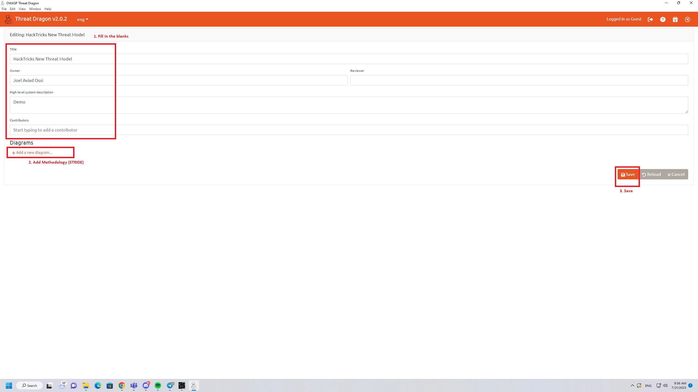
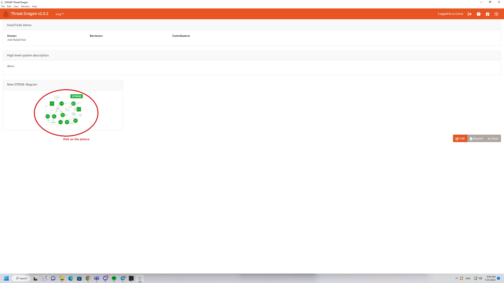
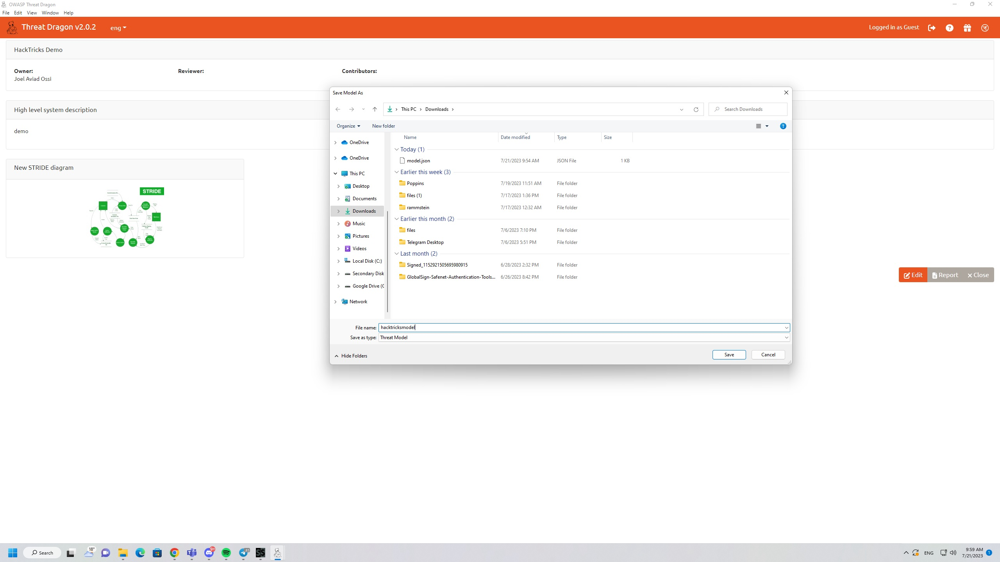
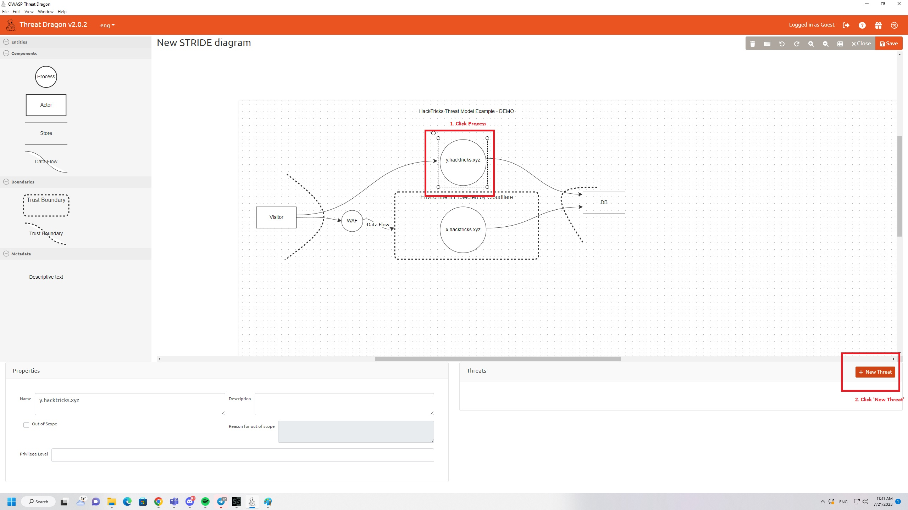
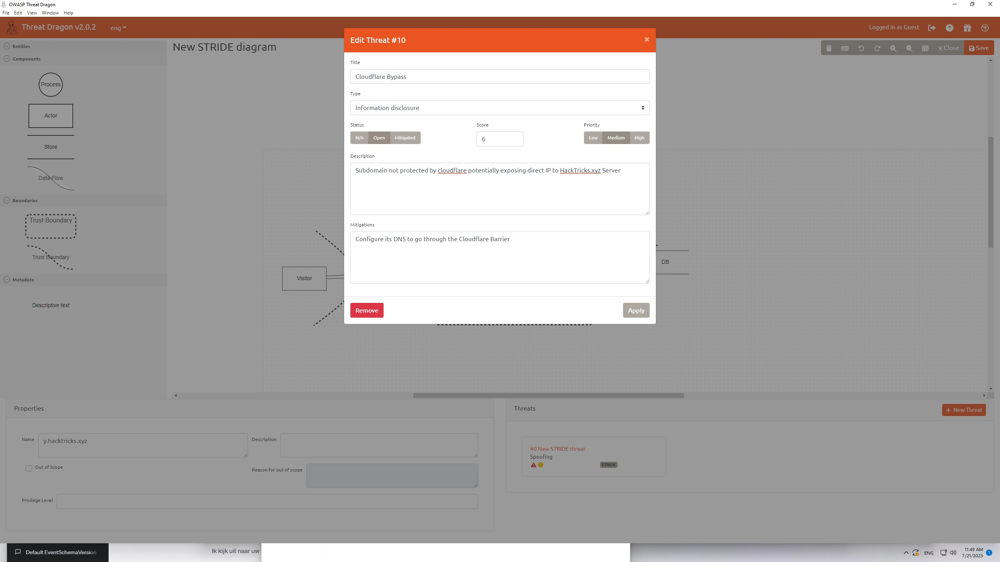
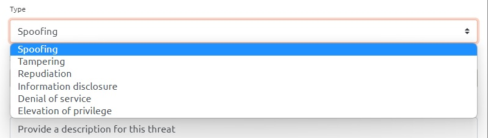
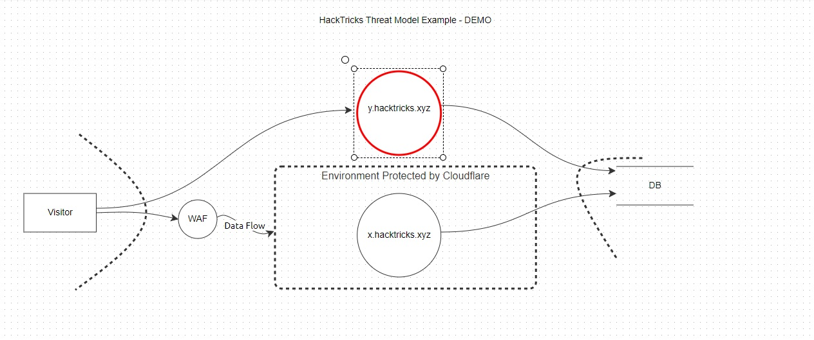

# Threat Modeling

## Threat Modeling

Welcome to HackTricks' comprehensive guide on Threat Modeling! Embark on an exploration of this critical aspect of cybersecurity, where we identify, understand, and strategize against potential vulnerabilities in a system. This thread serves as a step-by-step guide packed with real-world examples, helpful software, and easy-to-understand explanations. Ideal for both novices and experienced practitioners looking to fortify their cybersecurity defenses.

### Commonly Used Scenarios

1. **Software Development**: As part of the Secure Software Development Life Cycle (SSDLC), threat modeling helps in **identifying potential sources of vulnerabilities** in the early stages of development.
2. **Penetration Testing**: The Penetration Testing Execution Standard (PTES) framework requires **threat modeling to understand the system's vulnerabilities** before carrying out the test.

### Threat Model in a Nutshell

A Threat Model is typically represented as a diagram, image, or some other form of visual illustration that depicts the planned architecture or existing build of an application. It bears resemblance to a **data flow diagram**, but the key distinction lies in its security-oriented design.

Threat models often feature elements marked in red, symbolizing potential vulnerabilities, risks, or barriers. To streamline the process of risk identification, the CIA (Confidentiality, Integrity, Availability) triad is employed, forming the basis of many threat modeling methodologies, with STRIDE being one of the most common. However, the chosen methodology can vary depending on the specific context and requirements.

### The CIA Triad

The CIA Triad is a widely recognized model in the field of information security, standing for Confidentiality, Integrity, and Availability. These three pillars form the foundation upon which many security measures and policies are built, including threat modeling methodologies.

1. **Confidentiality**: Ensuring that the data or system is not accessed by unauthorized individuals. This is a central aspect of security, requiring appropriate access controls, encryption, and other measures to prevent data breaches.
2. **Integrity**: The accuracy, consistency, and trustworthiness of the data over its lifecycle. This principle ensures that the data is not altered or tampered with by unauthorized parties. It often involves checksums, hashing, and other data verification methods.
3. **Availability**: This ensures that data and services are accessible to authorized users when needed. This often involves redundancy, fault tolerance, and high-availability configurations to keep systems running even in the face of disruptions.

### Threat Modeling Methodlogies

1. **STRIDE**: Developed by Microsoft, STRIDE is an acronym for **Spoofing, Tampering, Repudiation, Information Disclosure, Denial of Service, and Elevation of Privilege**. Each category represents a type of threat, and this methodology is commonly used in the design phase of a program or system to identify potential threats.
2. **DREAD**: This is another methodology from Microsoft used for risk assessment of identified threats. DREAD stands for **Damage potential, Reproducibility, Exploitability, Affected users, and Discoverability**. Each of these factors is scored, and the result is used to prioritize identified threats.
3. **PASTA** (Process for Attack Simulation and Threat Analysis): This is a seven-step, **risk-centric** methodology. It includes defining and identifying security objectives, creating a technical scope, application decomposition, threat analysis, vulnerability analysis, and risk/triage assessment.
4. **Trike**: This is a risk-based methodology that focuses on defending assets. It starts from a **risk management** perspective and looks at threats and vulnerabilities in that context.
5. **VAST** (Visual, Agile, and Simple Threat modeling): This approach aims to be more accessible and integrates into Agile development environments. It combines elements from the other methodologies and focuses on **visual representations of threats**.
6. **OCTAVE** (Operationally Critical Threat, Asset, and Vulnerability Evaluation): Developed by the CERT Coordination Center, this framework is geared toward **organizational risk assessment rather than specific systems or software**.

## Tools

There are several tools and software solutions available that can **assist** with the creation and management of threat models. Here are a few you might consider.

### [SpiderSuite](https://github.com/3nock/SpiderSuite)

An advance cross-platform and multi-feature GUI web spider/crawler for cyber security professionals. Spider Suite can be used for attack surface mapping and analysis.

**Usage**

1. Pick a URL and Crawl

<figure><figcaption></figcaption></figure>

2. View Graph

<figure><figcaption></figcaption></figure>

### [OWASP Threat Dragon](https://github.com/OWASP/threat-dragon/releases)

An open-source project from OWASP, Threat Dragon is both a web and desktop application that includes system diagramming as well as a rule engine to auto-generate threats/mitigations.

**Usage**

1. Create New Project

<figure><figcaption></figcaption></figure>

Sometimes it could look like this:

<figure><figcaption></figcaption></figure>

2. Launch New Project

<figure><figcaption></figcaption></figure>

3. Save The New Project

<figure><figcaption></figcaption></figure>

4. Create your model

You can use tools like SpiderSuite Crawler to give you inspiration, a basic model would look something like this

<figure><figcaption></figcaption></figure>

Just a little bit of explanation about the entities:

* Process (The entity itself such as Webserver or web functionality)
* Actor (A Person such as a Website Visitor, User or Administrator)
* Data Flow Line (Indicator of Interaction)
* Trust Boundary (Different network segments or scopes.)
* Store (Things where data are stored at such as Databases)

5. Create a Threat (Step 1)

First you have to pick the layer you wish to add a threat to

<figure><figcaption></figcaption></figure>

Now you can create the threat

<figure><figcaption></figcaption></figure>

Keep in mind that there is a difference between Actor Threats and Process Threats. If you would add a threat to an Actor then you will only be able to choose "Spoofing" and "Repudiation. However in our example we add threat to a Process entity so we will see this in the threat creation box:

<figure><figcaption></figcaption></figure>

6. Done

Now your finished model should look something like this. And this is how you make a simple threat model with OWASP Threat Dragon.

<figure><figcaption></figcaption></figure>

### [Microsoft Threat Modeling Tool](https://aka.ms/threatmodelingtool)

This is a free tool from Microsoft that helps in finding threats in the design phase of software projects. It uses the STRIDE methodology and is particularly suitable for those developing on Microsoft's stack.
