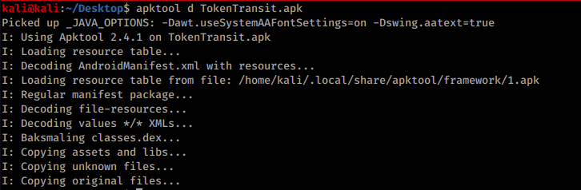
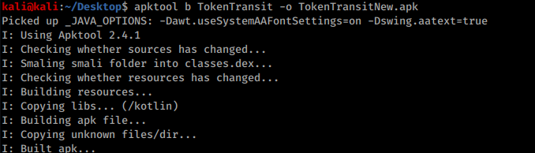

# Make APK Accept CA Certificate

Some applications don't like user downloaded certificates, so in order to inspect web traffic for some apps we actually have to decompile the application & add a few things & recompile it.

## Automatic

The tool [**https://github.com/shroudedcode/apk-mitm**](https://github.com/shroudedcode/apk-mitm) will **automatically **make the necessary changes to the application to start capturing the requests and will also disable certificate pinning (if any).

## Manual

First we decompile the app: `apktool d *file-name*.apk`



Then we go into the **Manifest.xml** file & scroll down to the `<\application android>` tag & we are going to add the following line if it isn't already there:

`android:networkSecurityConfig="@xml/network_security_config`

Before adding:


After adding:


Now go into the **res/xml** folder & create/modify a file named network_security_config.xml with the following contents:

```markup
<network-security-config>  
      <base-config>  
            <trust-anchors>  
                <!-- Trust preinstalled CAs -->  
                <certificates src="system" />  
                <!-- Additionally trust user added CAs -->  
                <certificates src="user" />  
           </trust-anchors>  
      </base-config>  
 </network-security-config>
```

Then save the file & back out of all the directories & rebuild the apk with the following command: `apktool b *folder-name/* -o *output-file.apk*`



Finally, you need just to **sign the new application**. [Read this section of the page Smali - Decompiling/\[Modifying\]/Compiling to learn how to sign it](smali-changes.md#sing-the-new-apk).
