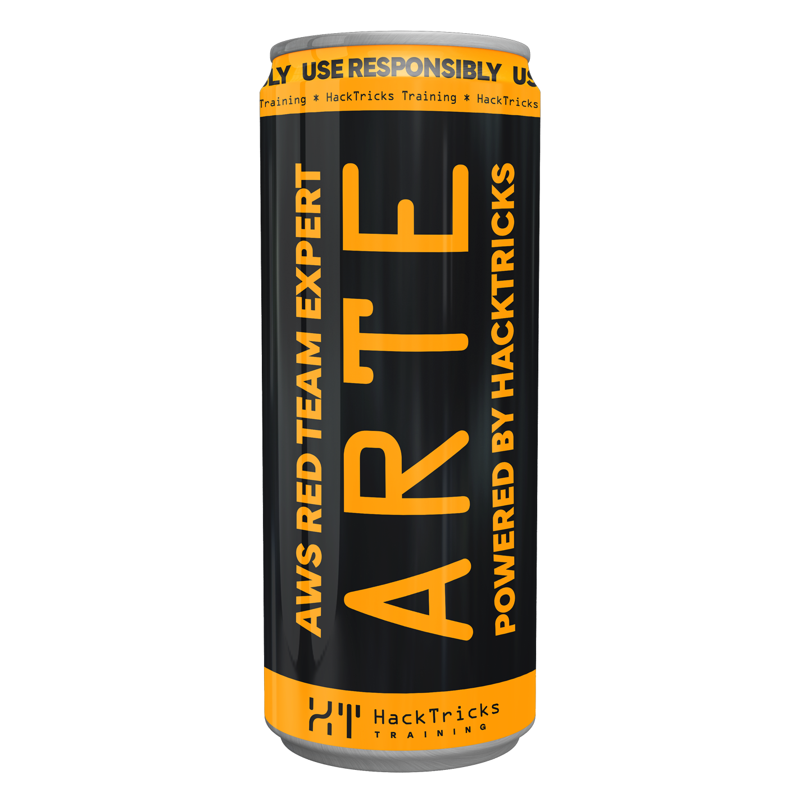
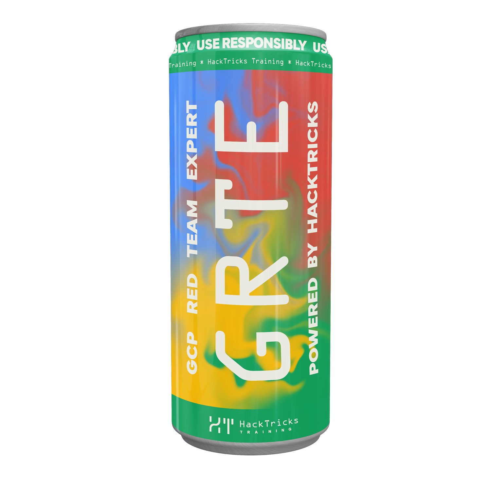

# Cookies Hacking


Learn & practice AWS Hacking:[**HackTricks Training AWS Red Team Expert (ARTE)**](https://training.hacktricks.xyz/courses/arte)\
Learn & practice GCP Hacking: [**HackTricks Training GCP Red Team Expert (GRTE)**](https://training.hacktricks.xyz/courses/grte)

<details>

<summary>Support HackTricks</summary>

* Check the [**subscription plans**](https://github.com/sponsors/carlospolop)!
* **Join the** 💬 [**Discord group**](https://discord.gg/hRep4RUj7f) or the [**telegram group**](https://t.me/peass) or **follow** us on **Twitter** 🐦 [**@hacktricks\_live**](https://twitter.com/hacktricks_live)**.**
* **Share hacking tricks by submitting PRs to the** [**HackTricks**](https://github.com/carlospolop/hacktricks) and [**HackTricks Cloud**](https://github.com/carlospolop/hacktricks-cloud) github repos.

</details>


## Cookie Attributes

Cookies come with several attributes that control their behavior in the user's browser. Here’s a rundown of these attributes in a more passive voice:

### Expires and Max-Age

The expiry date of a cookie is determined by the `Expires` attribute. Conversely, the `Max-age` attribute defines the time in seconds until a cookie is deleted. **Opt for `Max-age` as it reflects more modern practices.**

### Domain

The hosts to receive a cookie are specified by the `Domain` attribute. By default, this is set to the host that issued the cookie, not including its subdomains. However, when the `Domain` attribute is explicitly set, it encompasses subdomains as well. This makes the specification of the `Domain` attribute a less restrictive option, useful for scenarios where cookie sharing across subdomains is necessary. For instance, setting `Domain=mozilla.org` makes cookies accessible on its subdomains like `developer.mozilla.org`.

### Path

A specific URL path that must be present in the requested URL for the `Cookie` header to be sent is indicated by the `Path` attribute. This attribute considers the `/` character as a directory separator, allowing for matches in subdirectories as well.

### Ordering Rules

When two cookies bear the same name, the one chosen for sending is based on:

* The cookie matching the longest path in the requested URL.
* The most recently set cookie if the paths are identical.

### SameSite

* The `SameSite` attribute dictates whether cookies are sent on requests originating from third-party domains. It offers three settings:
  * **Strict**: Restricts the cookie from being sent on third-party requests.
  * **Lax**: Allows the cookie to be sent with GET requests initiated by third-party websites.
  * **None**: Permits the cookie to be sent from any third-party domain.

Remember, while configuring cookies, understanding these attributes can help ensure they behave as expected across different scenarios.

| **Request Type** | **Example Code**                   | **Cookies Sent When** |
| ---------------- | ---------------------------------- | --------------------- |
| Link             | \<a href="...">\</a>               | NotSet\*, Lax, None   |
| Prerender        | \<link rel="prerender" href=".."/> | NotSet\*, Lax, None   |
| Form GET         | \<form method="GET" action="...">  | NotSet\*, Lax, None   |
| Form POST        | \<form method="POST" action="..."> | NotSet\*, None        |
| iframe           | \<iframe src="...">\</iframe>      | NotSet\*, None        |
| AJAX             | $.get("...")                       | NotSet\*, None        |
| Image            | \                   | NetSet\*, None        |

Table from [Invicti](https://www.netsparker.com/blog/web-security/same-site-cookie-attribute-prevent-cross-site-request-forgery/) and slightly modified.\
A cookie with _**SameSite**_ attribute will **mitigate CSRF attacks** where a logged session is needed.

**\*Notice that from Chrome80 (feb/2019) the default behaviour of a cookie without a cookie samesite** **attribute will be lax** ([https://www.troyhunt.com/promiscuous-cookies-and-their-impending-death-via-the-samesite-policy/](https://www.troyhunt.com/promiscuous-cookies-and-their-impending-death-via-the-samesite-policy/)).\
Notice that temporary, after applying this change, the **cookies without a SameSite** **policy** in Chrome will be **treated as None** during the **first 2 minutes and then as Lax for top-level cross-site POST request.**

## Cookies Flags

### HttpOnly

This avoids the **client** to access the cookie (Via **Javascript** for example: `document.cookie`)

#### **Bypasses**

* If the page is **sending the cookies as the response** of a requests (for example in a **PHPinfo** page), it's possible to abuse the XSS to send a request to this page and **steal the cookies** from the response (check an example in [https://hackcommander.github.io/posts/2022/11/12/bypass-httponly-via-php-info-page/](https://hackcommander.github.io/posts/2022/11/12/bypass-httponly-via-php-info-page/).
* This could be Bypassed with **TRACE** **HTTP** requests as the response from the server (if this HTTP method is available) will reflect the cookies sent. This technique is called **Cross-Site Tracking**.
  * This technique is avoided by **modern browsers by not permitting sending a TRACE** request from JS. However, some bypasses to this have been found in specific software like sending `\r\nTRACE` instead of `TRACE` to IE6.0 SP2.
* Another way is the exploitation of zero/day vulnerabilities of the browsers.
* It's possible to **overwrite HttpOnly cookies** by performing a Cookie Jar overflow attack:


[cookie-jar-overflow.md](cookie-jar-overflow.md)


* It's possible to use [**Cookie Smuggling**](./#cookie-smuggling) attack to exfiltrate these cookies

### Secure

The request will **only** send the cookie in an HTTP request only if the request is transmitted over a secure channel (typically **HTTPS**).

## Cookies Prefixes

Cookies prefixed with `__Secure-` are required to be set alongside the `secure` flag from pages that are secured by HTTPS.

For cookies prefixed with `__Host-`, several conditions must be met:

* They must be set with the `secure` flag.
* They must originate from a page secured by HTTPS.
* They are forbidden from specifying a domain, preventing their transmission to subdomains.
* The path for these cookies must be set to `/`.

It is important to note that cookies prefixed with `__Host-` are not allowed to be sent to superdomains or subdomains. This restriction aids in isolating application cookies. Thus, employing the `__Host-` prefix for all application cookies can be considered a good practice for enhancing security and isolation.

### Overwriting cookies

So, one of the protection of `__Host-` prefixed cookies is to prevent them from being overwritten from subdomains. Preventing for example [**Cookie Tossing attacks**](cookie-tossing.md). In the talk [**Cookie Crumbles: Unveiling Web Session Integrity Vulnerabilities**](https://www.youtube.com/watch?v=F_wAzF4a7Xg) ([**paper**](https://www.usenix.org/system/files/usenixsecurity23-squarcina.pdf)) it's presented that it was possible to set \_\_HOST- prefixed cookies from subdomain, by tricking the parser, for example, adding "=" at the beggining or at the beginig and the end...:

<figure><figcaption></figcaption></figure>

Or in PHP it was possible to add **other characters at the beginning** of the cookie name that were going to be **replaced by underscore** characters, allowing to overwrite `__HOST-` cookies:

<figure><figcaption></figcaption></figure>

## Cookies Attacks

If a custom cookie contains sensitive data check it (specially if you are playing a CTF), as it might be vulnerable.

### Decoding and Manipulating Cookies

Sensitive data embedded in cookies should always be scrutinized. Cookies encoded in Base64 or similar formats can often be decoded. This vulnerability allows attackers to alter the cookie's content and impersonate other users by encoding their modified data back into the cookie.

### Session Hijacking

This attack involves stealing a user's cookie to gain unauthorized access to their account within an application. By using the stolen cookie, an attacker can impersonate the legitimate user.

### Session Fixation

In this scenario, an attacker tricks a victim into using a specific cookie to log in. If the application does not assign a new cookie upon login, the attacker, possessing the original cookie, can impersonate the victim. This technique relies on the victim logging in with a cookie supplied by the attacker.

If you found an **XSS in a subdomain** or you **control a subdomain**, read:


[cookie-tossing.md](cookie-tossing.md)


### Session Donation

Here, the attacker convinces the victim to use the attacker's session cookie. The victim, believing they are logged into their own account, will inadvertently perform actions in the context of the attacker's account.

If you found an **XSS in a subdomain** or you **control a subdomain**, read:


[cookie-tossing.md](cookie-tossing.md)


### [JWT Cookies](../hacking-jwt-json-web-tokens.md)

Click on the previous link to access a page explaining possible flaws in JWT.

JSON Web Tokens (JWT) used in cookies can also present vulnerabilities. For in-depth information on potential flaws and how to exploit them, accessing the linked document on hacking JWT is recommended.

### Cross-Site Request Forgery (CSRF)

This attack forces a logged-in user to execute unwanted actions on a web application in which they're currently authenticated. Attackers can exploit cookies that are automatically sent with every request to the vulnerable site.

### Empty Cookies

(Check further details in the[original research](https://blog.ankursundara.com/cookie-bugs/)) Browsers permit the creation of cookies without a name, which can be demonstrated through JavaScript as follows:

```js
document.cookie = "a=v1"
document.cookie = "=test value;" // Setting an empty named cookie
document.cookie = "b=v2"
```

The result in the sent cookie header is `a=v1; test value; b=v2;`. Intriguingly, this allows for the manipulation of cookies if an empty name cookie is set, potentially controlling other cookies by setting the empty cookie to a specific value:

```js
function setCookie(name, value) {
    document.cookie = `${name}=${value}`;
}

setCookie("", "a=b"); // Setting the empty cookie modifies another cookie's value
```

This leads to the browser sending a cookie header interpreted by every web server as a cookie named `a` with a value `b`.

#### Chrome Bug: Unicode Surrogate Codepoint Issue

In Chrome, if a Unicode surrogate codepoint is part of a set cookie, `document.cookie` becomes corrupted, returning an empty string subsequently:

```js
document.cookie = "\ud800=meep";
```

This results in `document.cookie` outputting an empty string, indicating permanent corruption.

#### Cookie Smuggling Due to Parsing Issues

(Check further details in the[original research](https://blog.ankursundara.com/cookie-bugs/)) Several web servers, including those from Java (Jetty, TomCat, Undertow) and Python (Zope, cherrypy, web.py, aiohttp, bottle, webob), mishandle cookie strings due to outdated RFC2965 support. They read a double-quoted cookie value as a single value even if it includes semicolons, which should normally separate key-value pairs:

```
RENDER_TEXT="hello world; JSESSIONID=13371337; ASDF=end";
```

#### Cookie Injection Vulnerabilities

(Check further details in the[original research](https://blog.ankursundara.com/cookie-bugs/)) The incorrect parsing of cookies by servers, notably Undertow, Zope, and those using Python's `http.cookie.SimpleCookie` and `http.cookie.BaseCookie`, creates opportunities for cookie injection attacks. These servers fail to properly delimit the start of new cookies, allowing attackers to spoof cookies:

* Undertow expects a new cookie immediately after a quoted value without a semicolon.
* Zope looks for a comma to start parsing the next cookie.
* Python's cookie classes start parsing on a space character.

This vulnerability is particularly dangerous in web applications relying on cookie-based CSRF protection, as it allows attackers to inject spoofed CSRF-token cookies, potentially bypassing security measures. The issue is exacerbated by Python's handling of duplicate cookie names, where the last occurrence overrides earlier ones. It also raises concerns for `__Secure-` and `__Host-` cookies in insecure contexts and could lead to authorization bypasses when cookies are passed to back-end servers susceptible to spoofing.

### Cookies $version and WAF bypasses

According to [**this blogpost**](https://portswigger.net/research/bypassing-wafs-with-the-phantom-version-cookie), it might be possible to use the cookie attribute **`$Version=1`** to make the backend use an old logic to parse the cookie due to the **RFC2109**. Moreover, other values just as **`$Domain`** and **`$Path`** can be used to modify the behaviour of the backend with the cookie.

#### Bypassing value analysis with quoted-string encoding

This parsing indicate to unescape escaped values inside the cookies, so "\a" becomes "a". This can be useful to bypass WAFS as:

* `eval('test') => forbidden`
* `"\e\v\a\l\(\'\t\e\s\t\'\)" => allowed`

#### Bypassing cookie-name blocklists

In the RFC2109 it's indicated that a **comma can be used as a separator between cookie values**. And also it's possible to add **spaces and tabs before an after the equal sign**. Therefore a cookie like  `$Version=1; foo=bar, abc = qux` doesn't generate the cookie  `"foo":"bar, admin = qux"` but the cookies `foo":"bar"` and `"admin":"qux"`. Notice how 2 cookies are generated and how admin got removed the space before and after the equal sign.

#### Bypassing value analysis with cookie splitting

Finally different backdoors would join in a string different cookies passed in different cookie headers like in:&#x20;

```
GET / HTTP/1.1
Host: example.com
Cookie: param1=value1;
Cookie: param2=value2;
```

Which could allow to bypass a WAF like in this example:

```
Cookie: name=eval('test//
Cookie: comment')

Resulting cookie: name=eval('test//, comment') => allowed
```

### Extra Vulnerable Cookies Checks

#### **Basic checks**

* The **cookie** is the **same** every time you **login**.
* Log out and try to use the same cookie.
* Try to log in with 2 devices (or browsers) to the same account using the same cookie.
* Check if the cookie has any information in it and try to modify it
* Try to create several accounts with almost the same username and check if you can see similarities.
* Check the "**remember me**" option if it exists to see how it works. If it exists and could be vulnerable, always use the cookie of **remember me** without any other cookie.
* Check if the previous cookie works even after you change the password.

#### **Advanced cookies attacks**

If the cookie remains the same (or almost) when you log in, this probably means that the cookie is related to some field of your account (probably the username). Then you can:

* Try to create a lot of **accounts** with usernames very **similar** and try to **guess** how the algorithm is working.
* Try to **bruteforce the username**. If the cookie saves only as an authentication method for your username, then you can create an account with username "**Bmin**" and **bruteforce** every single **bit** of your cookie because one of the cookies that you will try will the one belonging to "**admin**".
* Try **Padding** **Oracle** (you can decrypt the content of the cookie). Use **padbuster**.

**Padding Oracle - Padbuster examples**

```bash
padbuster <URL/path/when/successfully/login/with/cookie> <COOKIE> <PAD[8-16]>
# When cookies and regular Base64
padbuster http://web.com/index.php u7bvLewln6PJPSAbMb5pFfnCHSEd6olf 8 -cookies auth=u7bvLewln6PJPSAbMb5pFfnCHSEd6olf

# If Base64 urlsafe or hex-lowercase or hex-uppercase --encoding parameter is needed, for example:
padBuster http://web.com/home.jsp?UID=7B216A634951170FF851D6CC68FC9537858795A28ED4AAC6
7B216A634951170FF851D6CC68FC9537858795A28ED4AAC6 8 -encoding 2
```

Padbuster will make several attempts and will ask you which condition is the error condition (the one that is not valid).

Then it will start decrypting the cookie (it may take several minutes)

If the attack has been successfully performed, then you could try to encrypt a string of your choice. For example, if you would want to **encrypt** **user=administrator**

```
padbuster http://web.com/index.php 1dMjA5hfXh0jenxJQ0iW6QXKkzAGIWsiDAKV3UwJPT2lBP+zAD0D0w== 8 -cookies thecookie=1dMjA5hfXh0jenxJQ0iW6QXKkzAGIWsiDAKV3UwJPT2lBP+zAD0D0w== -plaintext user=administrator
```

This execution will give you the cookie correctly encrypted and encoded with the string **user=administrator** inside.

**CBC-MAC**

Maybe a cookie could have some value and could be signed using CBC. Then, the integrity of the value is the signature created by using CBC with the same value. As it is recommended to use as IV a null vector, this type of integrity checking could be vulnerable.

**The attack**

1. Get the signature of username **administ** = **t**
2. Get the signature of username **rator\x00\x00\x00 XOR t** = **t'**
3. Set in the cookie the value **administrator+t'** (**t'** will be a valid signature of **(rator\x00\x00\x00 XOR t) XOR t** = **rator\x00\x00\x00**

**ECB**

If the cookie is encrypted using ECB it could be vulnerable.\
When you log in the cookie that you receive has to be always the same.

**How to detect and attack:**

Create 2 users with almost the same data (username, password, email, etc.) and try to discover some pattern inside the given cookie

Create a user called for example "aaaaaaaaaaaaaaaaaaaaaaaaaaaaaaaaaaaaaaaaaaaaaaaaaa" and check if there is any pattern in the cookie (as ECB encrypts with the same key every block, the same encrypted bytes could appear if the username is encrypted).

There should be a pattern (with the size of a used block). So, knowing how are a bunch of "a" encrypted you can create a username: "a"\*(size of the block)+"admin". Then, you could delete the encrypted pattern of a block of "a" from the cookie. And you will have the cookie of the username "admin".

## References

* [https://blog.ankursundara.com/cookie-bugs/](https://blog.ankursundara.com/cookie-bugs/)
* [https://www.linkedin.com/posts/rickey-martin-24533653\_100daysofhacking-penetrationtester-ethicalhacking-activity-7016286424526180352-bwDd](https://www.linkedin.com/posts/rickey-martin-24533653_100daysofhacking-penetrationtester-ethicalhacking-activity-7016286424526180352-bwDd)
* [https://portswigger.net/research/bypassing-wafs-with-the-phantom-version-cookie](https://portswigger.net/research/bypassing-wafs-with-the-phantom-version-cookie)


Learn & practice AWS Hacking:[**HackTricks Training AWS Red Team Expert (ARTE)**](https://training.hacktricks.xyz/courses/arte)\
Learn & practice GCP Hacking: [**HackTricks Training GCP Red Team Expert (GRTE)**](https://training.hacktricks.xyz/courses/grte)

<details>

<summary>Support HackTricks</summary>

* Check the [**subscription plans**](https://github.com/sponsors/carlospolop)!
* **Join the** 💬 [**Discord group**](https://discord.gg/hRep4RUj7f) or the [**telegram group**](https://t.me/peass) or **follow** us on **Twitter** 🐦 [**@hacktricks\_live**](https://twitter.com/hacktricks_live)**.**
* **Share hacking tricks by submitting PRs to the** [**HackTricks**](https://github.com/carlospolop/hacktricks) and [**HackTricks Cloud**](https://github.com/carlospolop/hacktricks-cloud) github repos.

</details>

