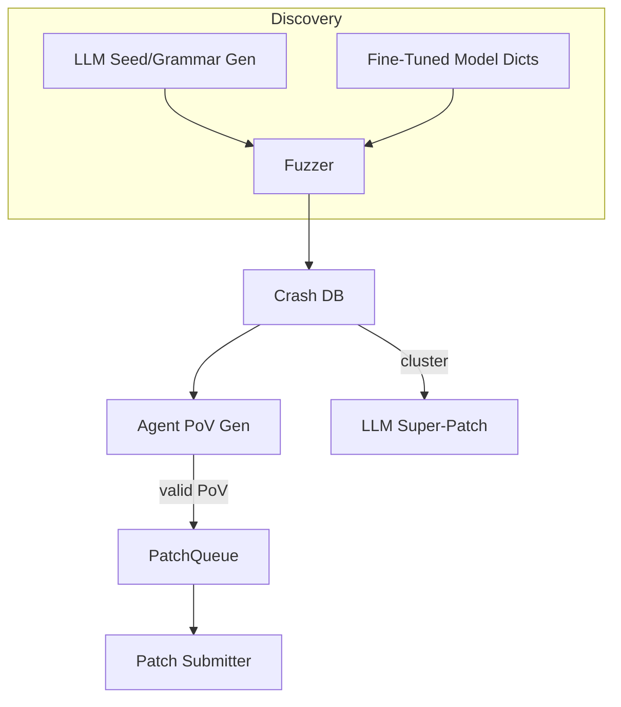

# AI-Assisted Fuzzing & Automated Vulnerability Discovery

{{#include ../banners/hacktricks-training.md}}

## Visão Geral
Modelos de linguagem de grande escala (LLMs) podem potencializar pipelines tradicionais de pesquisa de vulnerabilidades gerando entradas semanticamente ricas, evoluindo gramáticas, raciocinando sobre dados de falhas e até propondo correções para múltiplos bugs. Esta página coleta os padrões mais eficazes observados durante as finais do Desafio Cibernético da DARPA (AIxCC) e outras pesquisas públicas.

O que se segue não é uma descrição de um sistema de competição específico, mas uma abstração das técnicas para que você possa reproduzi-las em seus próprios fluxos de trabalho.

---

## 1. Entradas de Semente Geradas por LLM

Fuzzers tradicionais guiados por cobertura (AFL++, libFuzzer, Honggfuzz…) começam com um pequeno corpus de sementes e mutam bytes de forma cega. Quando o formato de entrada alvo é complexo (SQL, URLs, protocolos binários personalizados), mutações aleatórias geralmente quebram a sintaxe antes que ramificações interessantes sejam alcançadas.

LLMs podem resolver esse problema de inicialização emitindo *geradores de sementes* – scripts curtos que produzem **entradas sintaticamente corretas, mas relevantes para a segurança**. Por exemplo:
```prompt
SYSTEM: You are a helpful security engineer.
USER:
Write a Python3 program that prints 200 unique SQL injection strings targeting common anti-pattern mistakes (missing quotes, numeric context, stacked queries).  Ensure length ≤ 256 bytes / string so they survive common length limits.
```

```python
# gen_sqli_seeds.py (truncated)
PAYLOADS = [
"1 OR 1=1 -- ",
"' UNION SELECT NULL,NULL--",
"0; DROP TABLE users;--",
...
]
for p in PAYLOADS:
print(p)
```
Execute uma vez e alimente a saída diretamente no corpus inicial do fuzzer:
```bash
python3 gen_sqli_seeds.py > seeds.txt
afl-fuzz -i seeds.txt -o findings/ -- ./target @@
```
Benefícios:
1. Validade semântica → cobertura mais profunda no início.
2. Re-gerável: ajuste o prompt para focar em XSS, travessia de caminho, blobs binários, etc.
3. Barato (< 1 ¢ com GPT-3.5).

### Dicas
* Instrua o modelo a *diversificar* o comprimento e a codificação da carga útil (UTF-8, URL-encoded, UTF-16-LE) para contornar filtros superficiais.
* Peça um *único script autossuficiente* – evita problemas de formatação JSON.

---

## 2. Fuzzing de Evolução Gramatical

Uma variante mais poderosa é deixar o LLM **evoluir uma gramática** em vez de sementes concretas. O fluxo de trabalho (“padrão Grammar Guy”) é:

1. Gere uma gramática inicial ANTLR/Peach/LibFuzzer via prompt.
2. Fuzz por N minutos e colete métricas de cobertura (arestas / blocos atingidos).
3. Resuma as áreas do programa não cobertas e alimente o resumo de volta no modelo:
```prompt
A gramática anterior acionou 12 % das arestas do programa. Funções não alcançadas: parse_auth, handle_upload. Adicione / modifique regras para cobrir essas.
```
4. Mescle as novas regras, re-fuzz, repita.

Esqueleto de pseudo-código:
```python
for epoch in range(MAX_EPOCHS):
grammar = llm.refine(grammar, feedback=coverage_stats)
save(grammar, f"grammar_{epoch}.txt")
coverage_stats = run_fuzzer(grammar)
```
Pontos principais:
* Mantenha um *orçamento* – cada refinamento usa tokens.
* Use instruções `diff` + `patch` para que o modelo edite em vez de reescrever.
* Pare quando Δcobertura < ε.

---

## 3. Geração de PoV (Exploit) Baseada em Agentes

Depois que um crash é encontrado, você ainda precisa de uma **prova de vulnerabilidade (PoV)** que a acione de forma determinística.

Uma abordagem escalável é gerar *milhares* de agentes leves (<process/thread/container/prisoner>), cada um executando um LLM diferente (GPT-4, Claude, Mixtral) ou configuração de temperatura.

Pipeline:
1. Análise estática/dinâmica produz *candidatos a bugs* (struct com PC de crash, fatia de entrada, mensagem de sanitização).
2. Orquestrador distribui candidatos para os agentes.
3. Etapas de raciocínio do agente:
a. Reproduzir o bug localmente com `gdb` + entrada.
b. Sugerir carga útil mínima de exploit.
c. Validar exploit em sandbox. Se sucesso → submeter.
4. Tentativas falhadas são **re-colocadas como novas sementes** para fuzzing de cobertura (loop de feedback).

Vantagens:
* A paralelização oculta a falta de confiabilidade de um único agente.
* Autoajuste de temperatura/tamanho do modelo com base na taxa de sucesso observada.

---

## 4. Fuzzing Direcionado com Modelos de Código Ajustados

Ajuste um modelo de peso aberto (por exemplo, Llama-7B) em código-fonte C/C++ rotulado com padrões de vulnerabilidade (overflow de inteiro, cópia de buffer, string de formato). Então:

1. Execute análise estática para obter lista de funções + AST.
2. Solicite ao modelo: *“Dê entradas de dicionário de mutação que provavelmente quebrarão a segurança da memória na função X”*.
3. Insira esses tokens em um `AFL_CUSTOM_MUTATOR`.

Exemplo de saída para um wrapper `sprintf`:
```
{"pattern":"%99999999s"}
{"pattern":"AAAAAAAA....<1024>....%n"}
```
Empiricamente, isso reduz o tempo até a falha em mais de 2× em alvos reais.

---

## 5. Estratégias de Patching Guiadas por IA

### 5.1 Super Patches
Peça ao modelo para *agrupar* assinaturas de falhas e propor um **único patch** que remove a causa raiz comum. Envie uma vez, conserte vários bugs → menos penalidades de precisão em ambientes onde cada patch errado custa pontos.

Esboço do prompt:
```
Here are 10 stack traces + file snippets.  Identify the shared mistake and generate a unified diff fixing all occurrences.
```
### 5.2 Taxa de Patch Especulativa
Implemente uma fila onde patches confirmados validados por PoV e patches *especulativos* (sem PoV) são intercalados em uma proporção de 1:​N ajustada às regras de pontuação (por exemplo, 2 especulativos : 1 confirmado). Um modelo de custo monitora penalidades vs. pontos e ajusta N automaticamente.

---

## Juntando Tudo
Um CRS (Sistema de Raciocínio Cibernético) de ponta a ponta pode conectar os componentes assim:

---

## Referências
* [Trail of Bits – AIxCC finais: Contagem dos pontos](https://blog.trailofbits.com/2025/08/07/aixcc-finals-tale-of-the-tape/)
* [CTF Radiooo entrevistas com finalistas do AIxCC](https://www.youtube.com/@ctfradiooo)
{{#include ../banners/hacktricks-training.md}}
