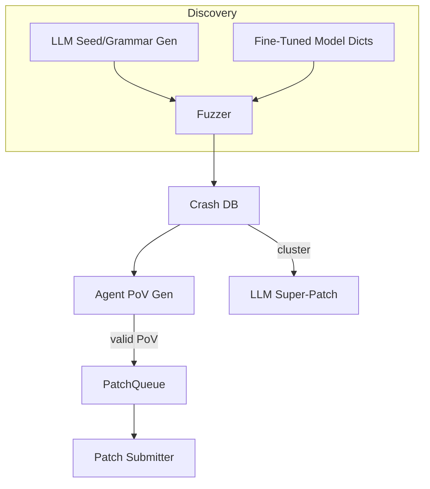

# AI-Assisted Fuzzing & Automated Vulnerability Discovery

{{#include ../banners/hacktricks-training.md}}

## 概述
大型语言模型（LLMs）可以通过生成语义丰富的输入、演变语法、推理崩溃数据，甚至提出多漏洞补丁，来极大增强传统的漏洞研究流程。 本页面收集了在DARPA的AI网络挑战赛（AIxCC）决赛和其他公开研究中观察到的最有效模式。

以下内容不是对某个特定竞赛系统的描述，而是对技术的抽象，以便您可以在自己的工作流程中重现它们。

---

## 1. LLM生成的种子输入

传统的覆盖引导模糊测试工具（AFL++、libFuzzer、Honggfuzz…）从一个小的种子语料库开始，盲目地变异字节。当目标输入格式复杂（SQL、URLs、自定义二进制协议）时，随机变异通常会在到达有趣的分支之前破坏语法。

LLMs可以通过发出*种子生成器*来解决这个引导问题——短脚本输出**语法正确但与安全相关的输入**。例如：
```prompt
SYSTEM: You are a helpful security engineer.
USER:
Write a Python3 program that prints 200 unique SQL injection strings targeting common anti-pattern mistakes (missing quotes, numeric context, stacked queries).  Ensure length ≤ 256 bytes / string so they survive common length limits.
```

```python
# gen_sqli_seeds.py (truncated)
PAYLOADS = [
"1 OR 1=1 -- ",
"' UNION SELECT NULL,NULL--",
"0; DROP TABLE users;--",
...
]
for p in PAYLOADS:
print(p)
```
一次运行并将输出直接输入到模糊测试器的初始语料库中：
```bash
python3 gen_sqli_seeds.py > seeds.txt
afl-fuzz -i seeds.txt -o findings/ -- ./target @@
```
好处：
1. 语义有效性 → 早期更深入的覆盖。
2. 可再生成：调整提示以专注于 XSS、路径遍历、二进制块等。
3. 便宜（< 1 ¢ 使用 GPT-3.5）。

### 提示
* 指示模型 *多样化* 有效载荷长度和编码（UTF-8、URL 编码、UTF-16-LE），以绕过表面过滤器。
* 请求一个 *单一自包含的脚本* – 避免 JSON 格式问题。

---

## 2. 语法演化模糊测试

一种更强大的变体是让 LLM **演化语法** 而不是具体种子。工作流程（“语法家”模式）是：

1. 通过提示生成初始 ANTLR/Peach/LibFuzzer 语法。
2. 模糊测试 N 分钟并收集覆盖率指标（命中边缘/块）。
3. 总结未覆盖的程序区域，并将总结反馈给模型：
```prompt
之前的语法触发了程序边缘的 12%。 未到达的函数：parse_auth, handle_upload。 添加/修改规则以覆盖这些。
```
4. 合并新规则，重新模糊测试，重复。

伪代码框架：
```python
for epoch in range(MAX_EPOCHS):
grammar = llm.refine(grammar, feedback=coverage_stats)
save(grammar, f"grammar_{epoch}.txt")
coverage_stats = run_fuzzer(grammar)
```
关键点：
* 保持一个 *预算* – 每次细化使用令牌。
* 使用 `diff` + `patch` 指令使模型编辑而不是重写。
* 当 Δcoverage < ε 时停止。

---

## 3. 基于代理的 PoV（漏洞证明）生成

在发现崩溃后，您仍然需要一个 **漏洞证明（PoV）**，以确定性地触发它。

一种可扩展的方法是生成 *数千个* 轻量级代理（<process/thread/container/prisoner>），每个代理运行不同的 LLM（GPT-4、Claude、Mixtral）或温度设置。

管道：
1. 静态/动态分析生成 *bug 候选*（包含崩溃 PC、输入切片、清理器消息的结构）。
2. 协调者将候选分配给代理。
3. 代理推理步骤：
a. 使用 `gdb` + 输入在本地重现 bug。
b. 提出最小的利用负载。
c. 在沙箱中验证利用。如果成功 → 提交。
4. 失败的尝试被 **重新排队作为新的种子** 进行覆盖模糊测试（反馈循环）。

优势：
* 并行化隐藏单一代理的不可靠性。
* 根据观察到的成功率自动调整温度/模型大小。

---

## 4. 使用微调代码模型的定向模糊测试

在标记有漏洞模式（整数溢出、缓冲区复制、格式字符串）的 C/C++ 源代码上微调一个开放权重模型（例如 Llama-7B）。然后：

1. 运行静态分析以获取函数列表 + AST。
2. 提示模型：*“给出可能破坏函数 X 中内存安全的变异字典条目”*。
3. 将这些令牌插入自定义 `AFL_CUSTOM_MUTATOR`。

`sprintf` 包装器的示例输出：
```
{"pattern":"%99999999s"}
{"pattern":"AAAAAAAA....<1024>....%n"}
```
根据经验，这在真实目标上将崩溃时间缩短了超过2倍。

---

## 5. AI引导的修补策略

### 5.1 超级补丁
要求模型对崩溃签名进行*聚类*，并提出一个**单一补丁**，以消除共同的根本原因。 提交一次，修复多个漏洞 → 在每个错误补丁都要扣分的环境中，减少准确性惩罚。

提示大纲：
```
Here are 10 stack traces + file snippets.  Identify the shared mistake and generate a unified diff fixing all occurrences.
```
### 5.2 推测补丁比率
实现一个队列，其中确认的 PoV 验证补丁和 *推测* 补丁（无 PoV）以 1:​N 的比例交错，N 根据评分规则进行调整（例如 2 个推测 : 1 个确认）。成本模型监控罚分与积分，并自我调整 N。

---

## 整合所有内容
一个端到端的 CRS（网络推理系统）可以像这样连接组件：

---

## 参考文献
* [Trail of Bits – AIxCC 决赛：比赛记录](https://blog.trailofbits.com/2025/08/07/aixcc-finals-tale-of-the-tape/)
* [CTF Radiooo AIxCC 决赛选手访谈](https://www.youtube.com/@ctfradiooo)
{{#include ../banners/hacktricks-training.md}}
