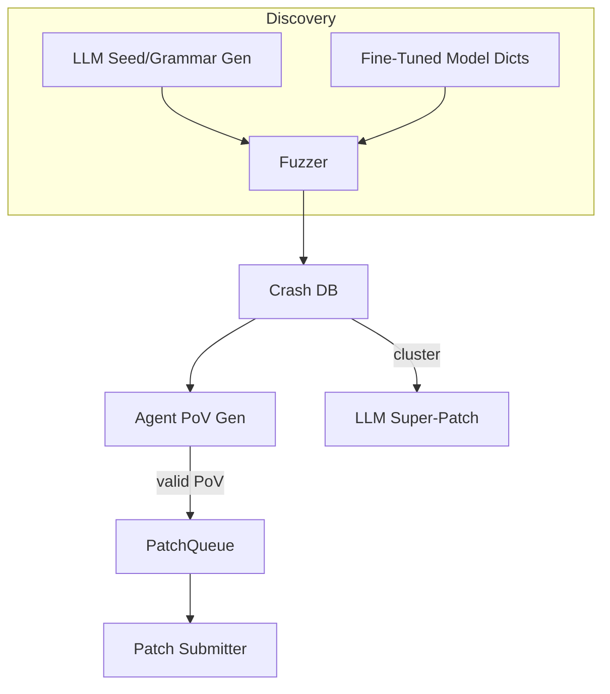

# AI-Assisted Fuzzing & Automated Vulnerability Discovery

{{#include ../banners/hacktricks-training.md}}

## Overview
Large-language models (LLMs) zinaweza kuimarisha mchakato wa utafiti wa udhaifu wa jadi kwa kuzalisha ingizo lenye maana nyingi, kuendeleza sarufi, kufikiri juu ya data za ajali, na hata kupendekeza patches za makosa mengi. Ukurasa huu unakusanya mifano bora zaidi iliyoshuhudiwa wakati wa fainali za AI Cyber Challenge (AIxCC) za DARPA na utafiti mwingine wa umma.

Kilichofuata si maelezo ya mfumo mmoja maalum wa mashindano, bali ni muhtasari wa mbinu ili uweze kuzirekebisha katika mchakato wako mwenyewe.

---

## 1. LLM-Generated Seed Inputs

Fuzzers za jadi zinazotegemea ufuatiliaji (AFL++, libFuzzer, Honggfuzz…) huanza na mkusanyiko mdogo wa mbegu na kubadilisha bytes bila malengo. Wakati muundo wa ingizo la lengo ni mgumu (SQL, URLs, protokali za binary za kawaida) mabadiliko ya nasibu mara nyingi yanaharibu sarufi kabla ya matawi ya kuvutia kufikiwa.

LLMs zinaweza kutatua tatizo hili la kuanzisha kwa kutoa *seed generators* – scripts fupi zinazotoa **ingizo sahihi kisheria lakini muhimu kwa usalama**. Kwa mfano:
```prompt
SYSTEM: You are a helpful security engineer.
USER:
Write a Python3 program that prints 200 unique SQL injection strings targeting common anti-pattern mistakes (missing quotes, numeric context, stacked queries).  Ensure length ≤ 256 bytes / string so they survive common length limits.
```

```python
# gen_sqli_seeds.py (truncated)
PAYLOADS = [
"1 OR 1=1 -- ",
"' UNION SELECT NULL,NULL--",
"0; DROP TABLE users;--",
...
]
for p in PAYLOADS:
print(p)
```
Kimbia mara moja na upeleke matokeo moja kwa moja kwenye corpus ya awali ya fuzzer:
```bash
python3 gen_sqli_seeds.py > seeds.txt
afl-fuzz -i seeds.txt -o findings/ -- ./target @@
```
Benefits:
1. Uhalali wa semantiki → kufunika kwa kina mapema.
2. Inaweza kurejelewa: badilisha prompt ili kuzingatia XSS, upitishaji wa njia, blobs za binary, nk.
3. Nafuu (< 1 ¢ na GPT-3.5).

### Tips
* Elekeza mfano *kuongeza* urefu wa payload na uandishi (UTF-8, URL-encoded, UTF-16-LE) ili kupita vichujio vya uso.
* Omba *script moja iliyo na kila kitu* – inazuia matatizo ya muundo wa JSON.

---

## 2. Grammar-Evolution Fuzzing

Tofauti yenye nguvu zaidi ni kuruhusu LLM **kuendeleza sarufi** badala ya mbegu halisi. Mchakato (“Grammar Guy” pattern) ni:

1. Tengeneza sarufi ya awali ya ANTLR/Peach/LibFuzzer kupitia prompt.
2. Fuzz kwa dakika N na kukusanya metriki za kufunika (mipaka / vizuizi vilivyogongwa).
3. Fupisha maeneo ya programu ambayo hayakufunikwa na urudishe muhtasari huo kwenye mfano:
```prompt
Sarufi ya awali ilichochea 12 % ya mipaka ya programu.  Kazi ambazo hazikufikiwa: parse_auth, handle_upload.  Ongeza / badilisha sheria ili kufunika hizi.
```
4. Changanya sheria mpya, re-fuzz, rudia.

Pseudo-code skeleton:
```python
for epoch in range(MAX_EPOCHS):
grammar = llm.refine(grammar, feedback=coverage_stats)
save(grammar, f"grammar_{epoch}.txt")
coverage_stats = run_fuzzer(grammar)
```
Key points:
* Hifadhi *bajeti* – kila uboreshaji hutumia tokens.
* Tumia `diff` + `patch` maelekezo ili mfano uhariri badala ya kuandika upya.
* Simama wakati Δcoverage < ε.

---

## 3. Uzalishaji wa PoV (Exploit) Kulingana na Wakala

Baada ya kugundua ajali, bado unahitaji **uthibitisho wa udhaifu (PoV)** ambao unachochea kwa uhakika.

Njia inayoweza kupanuka ni kuzalisha *mawakala* elfu nyingi wa mwanga (<process/thread/container/prisoner>), kila mmoja akifanya kazi na LLM tofauti (GPT-4, Claude, Mixtral) au mipangilio ya joto tofauti.

Pipeline:
1. Uchambuzi wa statiki/dinamik unazalisha *wagombea wa hitilafu* (struct yenye PC ya ajali, slice ya ingizo, ujumbe wa sanitizer).
2. Orchestrator inasambaza wagombea kwa mawakala.
3. Hatua za mantiki za wakala:
a. Rudia hitilafu kwa ndani na `gdb` + ingizo.
b. Pendekeza mzigo wa exploit wa chini.
c. Thibitisha exploit katika sandbox. Ikiwa ni mafanikio → wasilisha.
4. Jaribio lililoshindwa lina **re-queued kama mbegu mpya** za fuzzing ya coverage (mzunguko wa mrejesho).

Faida:
* Usambazaji wa kazi unaficha kutokuwa na uhakika kwa wakala mmoja.
* Auto-tuning ya joto / ukubwa wa mfano kulingana na kiwango cha mafanikio kilichoshuhudiwa.

---

## 4. Fuzzing Iliyoelekezwa na Mifano ya Kanuni Iliyobadilishwa

Badilisha mfano wa uzito wa wazi (mfano, Llama-7B) kwenye chanzo cha C/C++ kilichotambulishwa na mifumo ya udhaifu (overflow ya nambari, nakala ya buffer, mfuatano wa format). Kisha:

1. Endesha uchambuzi wa statiki kupata orodha ya kazi + AST.
2. Uliza mfano: *“Toa entries za kamusi ya mabadiliko ambazo zinaweza kuvunja usalama wa kumbukumbu katika kazi X”*.
3. Ingiza tokens hizo katika `AFL_CUSTOM_MUTATOR` maalum.

Mfano wa matokeo kwa wrapper ya `sprintf`:
```
{"pattern":"%99999999s"}
{"pattern":"AAAAAAAA....<1024>....%n"}
```
Kivitendo, hii inapunguza muda wa kuanguka kwa >2× kwenye malengo halisi.

---

## 5. Mikakati ya Kurekebisha Inayoongozwa na AI

### 5.1 Super Patches
Omba mfano *kuunganisha* saini za kuanguka na kupendekeza **kurekebisha moja** ambayo inatoa sababu ya kawaida. Wasilisha mara moja, fanya marekebisho kadhaa → adhabu chache za usahihi katika mazingira ambapo kila kurekebisha kibaya kunagharimu alama.

Mwelekeo wa ombi:
```
Here are 10 stack traces + file snippets.  Identify the shared mistake and generate a unified diff fixing all occurrences.
```
### 5.2 Uwiano wa Kurekebisha wa Kiwango
Tekeleza foleni ambapo kurekebisha ambazo zimehakikishwa na PoV na *kurekebisha* (hakuna PoV) zinaingiliana kwa uwiano wa 1:​N uliosawazishwa kwa sheria za alama (mfano 2 speculative : 1 confirmed). Mfano wa gharama unafuatilia adhabu dhidi ya alama na kujirekebisha N.

---

## Kuunganisha Yote Pamoja
Mfumo wa CRS (Cyber Reasoning System) wa mwisho hadi mwisho unaweza kuunganisha vipengele kama ifuatavyo:

---

## Marejeo
* [Trail of Bits – AIxCC fainali: Hadithi ya tape](https://blog.trailofbits.com/2025/08/07/aixcc-finals-tale-of-the-tape/)
* [CTF Radiooo mahojiano ya washiriki wa AIxCC](https://www.youtube.com/@ctfradiooo)
{{#include ../banners/hacktricks-training.md}}
