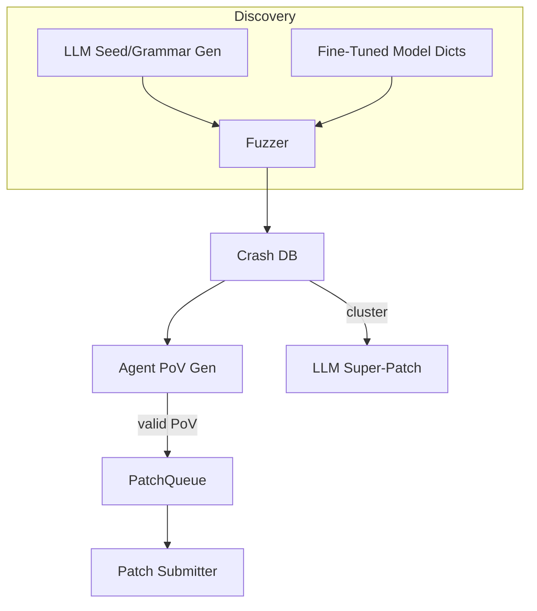

# AI-Assisted Fuzzing & Automated Vulnerability Discovery

{{#include ../banners/hacktricks-training.md}}

## Overview
Modele językowe (LLM) mogą znacznie zwiększyć efektywność tradycyjnych procesów badania podatności, generując semantycznie bogate dane wejściowe, rozwijając gramatyki, analizując dane o awariach, a nawet proponując poprawki wielobugowe. Ta strona zbiera najskuteczniejsze wzorce zaobserwowane podczas finałów AI Cyber Challenge (AIxCC) organizowanych przez DARPA oraz innych publicznych badań.

To, co następuje, nie jest opisem jednego konkretnego systemu konkursowego, lecz abstrakcją technik, abyś mógł je odtworzyć w swoich własnych procesach.

---

## 1. LLM-Generated Seed Inputs

Tradycyjne fuzzery oparte na pokryciu (AFL++, libFuzzer, Honggfuzz…) zaczynają od małego zbioru nasion i mutują bajty w sposób losowy. Gdy format danych wejściowych jest złożony (SQL, URL, niestandardowe protokoły binarne), losowe mutacje zazwyczaj łamią składnię, zanim zostaną osiągnięte interesujące gałęzie.

LLM mogą rozwiązać ten problem początkowy, emitując *generatory nasion* – krótkie skrypty, które generują **poprawne składniowo, ale istotne z punktu widzenia bezpieczeństwa dane wejściowe**. Na przykład:
```prompt
SYSTEM: You are a helpful security engineer.
USER:
Write a Python3 program that prints 200 unique SQL injection strings targeting common anti-pattern mistakes (missing quotes, numeric context, stacked queries).  Ensure length ≤ 256 bytes / string so they survive common length limits.
```

```python
# gen_sqli_seeds.py (truncated)
PAYLOADS = [
"1 OR 1=1 -- ",
"' UNION SELECT NULL,NULL--",
"0; DROP TABLE users;--",
...
]
for p in PAYLOADS:
print(p)
```
Uruchom raz i wprowadź wynik bezpośrednio do początkowego korpusu fuzzera:
```bash
python3 gen_sqli_seeds.py > seeds.txt
afl-fuzz -i seeds.txt -o findings/ -- ./target @@
```
Korzyści:
1. Ważność semantyczna → głębsze pokrycie na wczesnym etapie.
2. Możliwość regeneracji: dostosuj prompt, aby skupić się na XSS, przejściu ścieżek, binarnych blobach itp.
3. Tanie (< 1 ¢ z GPT-3.5).

### Wskazówki
* Poleć modelowi, aby *dywersyfikował* długość i kodowanie ładunków (UTF-8, URL-encoded, UTF-16-LE), aby obejść powierzchowne filtry.
* Poproś o *pojedynczy samodzielny skrypt* – unika problemów z formatowaniem JSON.

---

## 2. Fuzzing z ewolucją gramatyki

Bardziej zaawansowaną odmianą jest pozwolenie LLM na **ewolucję gramatyki** zamiast konkretnych nasion. Przepływ pracy (wzorzec „Grammar Guy”) to:

1. Wygeneruj początkową gramatykę ANTLR/Peach/LibFuzzer za pomocą promptu.
2. Fuzzuj przez N minut i zbierz metryki pokrycia (krawędzie / bloki trafione).
3. Podsumuj nieodkryte obszary programu i przekaż podsumowanie z powrotem do modelu:
```prompt
Poprzednia gramatyka wyzwoliła 12 % krawędzi programu. Funkcje, które nie zostały osiągnięte: parse_auth, handle_upload. Dodaj / zmodyfikuj zasady, aby pokryć te.
```
4. Scal nowe zasady, ponownie fuzzuj, powtarzaj.

Szkielet pseudo-kodu:
```python
for epoch in range(MAX_EPOCHS):
grammar = llm.refine(grammar, feedback=coverage_stats)
save(grammar, f"grammar_{epoch}.txt")
coverage_stats = run_fuzzer(grammar)
```
Kluczowe punkty:
* Utrzymuj *budżet* – każde udoskonalenie wykorzystuje tokeny.
* Użyj instrukcji `diff` + `patch`, aby model edytował, a nie przepisywał.
* Zatrzymaj się, gdy Δcoverage < ε.

---

## 3. Generowanie PoV (Eksploatacja) oparte na agentach

Po znalezieniu awarii nadal potrzebujesz **dowodu na podatność (PoV)**, który deterministycznie ją wyzwala.

Skalowalne podejście polega na uruchomieniu *tysięcy* lekkich agentów (<process/thread/container/prisoner>), z których każdy działa na innym LLM (GPT-4, Claude, Mixtral) lub ustawieniu temperatury.

Pipeline:
1. Analiza statyczna/dynamiczna produkuje *kandydatów na błędy* (struktura z PC awarii, fragmentem wejściowym, komunikatem sanitarno).
2. Orkiestrator rozdziela kandydatów do agentów.
3. Kroki rozumowania agenta:
a. Powtórz błąd lokalnie za pomocą `gdb` + wejście.
b. Sugeruj minimalny ładunek eksploatacyjny.
c. Waliduj eksploatację w piaskownicy. Jeśli sukces → zgłoś.
4. Nieudane próby są **ponownie kolejkowane jako nowe ziarna** do fuzzingu pokrycia (pętla sprzężenia zwrotnego).

Zalety:
* Równoległość ukrywa niestabilność pojedynczego agenta.
* Automatyczne dostosowywanie temperatury / rozmiaru modelu na podstawie zaobserwowanej stopy sukcesu.

---

## 4. Ukierunkowany Fuzzing z Dostosowanymi Modelami Kodów

Dostosuj model o otwartych wagach (np. Llama-7B) na źródłach C/C++ oznaczonych wzorcami podatności (przepełnienie całkowite, kopiowanie bufora, formatowanie ciągu). Następnie:

1. Uruchom analizę statyczną, aby uzyskać listę funkcji + AST.
2. Zadaj modelowi pytanie: *„Podaj wpisy słownika mutacji, które prawdopodobnie złamią bezpieczeństwo pamięci w funkcji X”*.
3. Wstaw te tokeny do niestandardowego `AFL_CUSTOM_MUTATOR`.

Przykładowy wynik dla opakowania `sprintf`:
```
{"pattern":"%99999999s"}
{"pattern":"AAAAAAAA....<1024>....%n"}
```
Empirycznie skraca to czas do awarii o >2× na rzeczywistych celach.

---

## 5. AI-Guided Patching Strategies

### 5.1 Super Patches
Poproś model o *grupowanie* sygnatur awarii i zaproponowanie **jednej łatki**, która usuwa wspólną przyczynę. Zgłoś raz, napraw kilka błędów → mniej kar za dokładność w środowiskach, gdzie każda błędna łatka kosztuje punkty.

Zarys podpowiedzi:
```
Here are 10 stack traces + file snippets.  Identify the shared mistake and generate a unified diff fixing all occurrences.
```
### 5.2 Współczynnik spekulacyjnych poprawek
Zaimplementuj kolejkę, w której potwierdzone poprawki zweryfikowane przez PoV i *spekulacyjne* poprawki (bez PoV) są przeplatane w stosunku 1:​N dostosowanym do zasad punktacji (np. 2 spekulacyjne : 1 potwierdzona). Model kosztów monitoruje kary w porównaniu do punktów i samodzielnie dostosowuje N.

---

## Złożenie wszystkiego w całość
System CRS (Cyber Reasoning System) end-to-end może połączyć komponenty w ten sposób:

---

## Odniesienia
* [Trail of Bits – AIxCC finały: Historia taśmy](https://blog.trailofbits.com/2025/08/07/aixcc-finals-tale-of-the-tape/)
* [CTF Radiooo wywiady z finalistami AIxCC](https://www.youtube.com/@ctfradiooo)
{{#include ../banners/hacktricks-training.md}}
