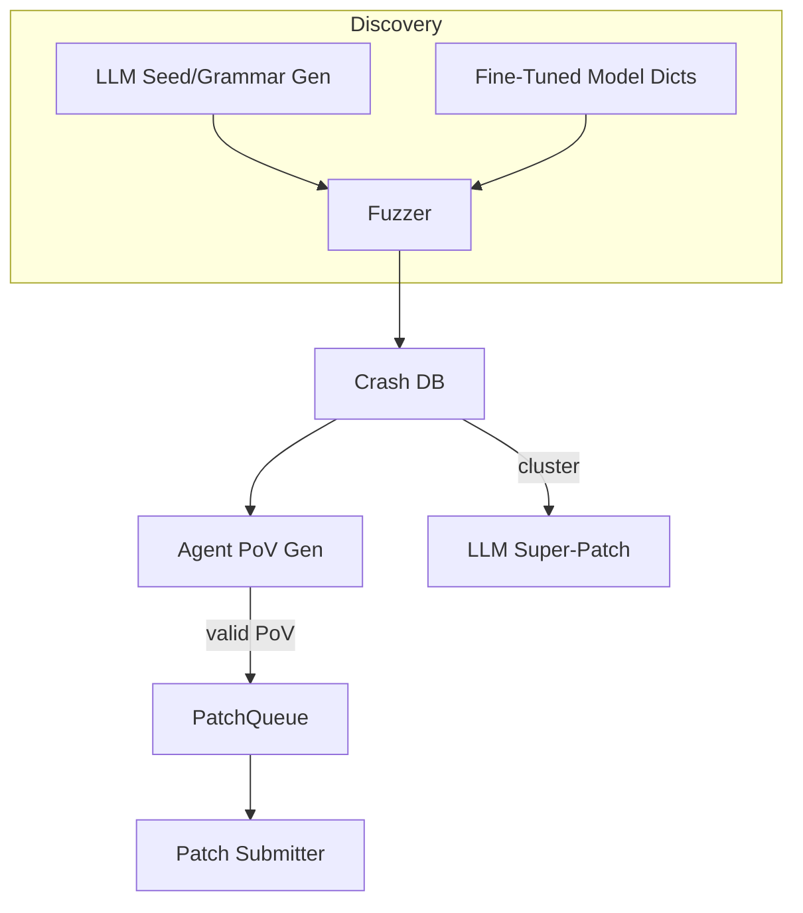

# AI-Assisted Fuzzing & Automated Vulnerability Discovery

{{#include ../banners/hacktricks-training.md}}

## Panoramica
I modelli di linguaggio di grandi dimensioni (LLM) possono potenziare i tradizionali pipeline di ricerca delle vulnerabilità generando input semanticamente ricchi, evolvendo grammatiche, ragionando sui dati di crash e persino proponendo patch multi-bug. Questa pagina raccoglie i modelli più efficaci osservati durante le finali della sfida AI Cyber Challenge (AIxCC) della DARPA e altre ricerche pubbliche.

Ciò che segue non è una descrizione di un sistema di competizione specifico, ma un'astrazione delle tecniche in modo che tu possa riprodurle nei tuoi flussi di lavoro.

---

## 1. Input Seed Generati da LLM

I fuzzers tradizionali guidati dalla copertura (AFL++, libFuzzer, Honggfuzz…) iniziano con un piccolo corpus di semi e mutano i byte alla cieca. Quando il formato di input target è complesso (SQL, URL, protocolli binari personalizzati), le mutazioni casuali di solito rompono la sintassi prima che si raggiungano rami interessanti.

Gli LLM possono risolvere questo problema di avvio emettendo *generatori di semi* – brevi script che producono **input sintatticamente corretti ma rilevanti per la sicurezza**. Ad esempio:
```prompt
SYSTEM: You are a helpful security engineer.
USER:
Write a Python3 program that prints 200 unique SQL injection strings targeting common anti-pattern mistakes (missing quotes, numeric context, stacked queries).  Ensure length ≤ 256 bytes / string so they survive common length limits.
```

```python
# gen_sqli_seeds.py (truncated)
PAYLOADS = [
"1 OR 1=1 -- ",
"' UNION SELECT NULL,NULL--",
"0; DROP TABLE users;--",
...
]
for p in PAYLOADS:
print(p)
```
Esegui una volta e alimenta l'output direttamente nel corpus iniziale del fuzzer:
```bash
python3 gen_sqli_seeds.py > seeds.txt
afl-fuzz -i seeds.txt -o findings/ -- ./target @@
```
Benefici:
1. Validità semantica → copertura più profonda all'inizio.
2. Rigenerabile: modifica il prompt per concentrarti su XSS, traversamento di percorso, blob binari, ecc.
3. Economico (< 1 ¢ con GPT-3.5).

### Suggerimenti
* Istruisci il modello a *diversificare* la lunghezza e la codifica del payload (UTF-8, URL-encoded, UTF-16-LE) per bypassare filtri superficiali.
* Richiedi un *singolo script autonomo* – evita problemi di formattazione JSON.

---

## 2. Fuzzing dell'Evoluzione della Grammatica

Una variante più potente è lasciare che il LLM **evolva una grammatica** invece di semi concreti. Il flusso di lavoro (“Grammar Guy” pattern) è:

1. Genera una grammatica ANTLR/Peach/LibFuzzer iniziale tramite prompt.
2. Fuzz per N minuti e raccogli metriche di copertura (edge / blocchi colpiti).
3. Riassumi le aree del programma non coperte e reinserisci il riassunto nel modello:
```prompt
La grammatica precedente ha attivato il 12 % degli edge del programma. Funzioni non raggiunte: parse_auth, handle_upload. Aggiungi / modifica regole per coprire questi.
```
4. Unisci le nuove regole, ri-fuzz, ripeti.

Scheletro di pseudo-codice:
```python
for epoch in range(MAX_EPOCHS):
grammar = llm.refine(grammar, feedback=coverage_stats)
save(grammar, f"grammar_{epoch}.txt")
coverage_stats = run_fuzzer(grammar)
```
Punti chiave:
* Mantieni un *budget* – ogni affinamento utilizza token.
* Usa istruzioni `diff` + `patch` in modo che il modello modifichi piuttosto che riscrivere.
* Fermati quando Δcoverage < ε.

---

## 3. Generazione di PoV (Exploit) Basata su Agenti

Dopo aver trovato un crash, hai ancora bisogno di una **proof-of-vulnerability (PoV)** che lo attivi in modo deterministico.

Un approccio scalabile è generare *migliaia* di agenti leggeri (<process/thread/container/prisoner>), ciascuno in esecuzione con un diverso LLM (GPT-4, Claude, Mixtral) o impostazione di temperatura.

Pipeline:
1. L'analisi statica/dinamica produce *candidati bug* (struttura con crash PC, input slice, messaggio del sanitizzatore).
2. L'orchestratore distribuisce i candidati agli agenti.
3. Passaggi di ragionamento dell'agente:
a. Riproduci il bug localmente con `gdb` + input.
b. Suggerisci un payload di exploit minimo.
c. Valida l'exploit in sandbox. Se ha successo → invia.
4. I tentativi falliti vengono **ri-inseriti come nuovi semi** per il fuzzing di copertura (feedback loop).

Vantaggi:
* La parallelizzazione nasconde l'affidabilità di un singolo agente.
* Auto-tuning della temperatura / dimensione del modello basato sul tasso di successo osservato.

---

## 4. Fuzzing Diretto con Modelli di Codice Affinati

Affina un modello a peso aperto (ad es. Llama-7B) su sorgente C/C++ etichettato con schemi di vulnerabilità (overflow intero, copia di buffer, stringa di formato). Poi:

1. Esegui un'analisi statica per ottenere l'elenco delle funzioni + AST.
2. Invia un prompt al modello: *“Fornisci voci del dizionario di mutazione che probabilmente romperanno la sicurezza della memoria nella funzione X”*.
3. Inserisci quei token in un `AFL_CUSTOM_MUTATOR` personalizzato.

Esempio di output per un wrapper `sprintf`:
```
{"pattern":"%99999999s"}
{"pattern":"AAAAAAAA....<1024>....%n"}
```
Empiricamente, questo riduce il tempo fino al crash di oltre 2× su obiettivi reali.

---

## 5. Strategie di Patching Guidate dall'AI

### 5.1 Super Patches
Chiedi al modello di *raggruppare* le firme di crash e proporre una **singola patch** che rimuova la causa radice comune. Invia una volta, risolvi diversi bug → meno penalità di accuratezza in ambienti in cui ogni patch errata costa punti.

Schema del prompt:
```
Here are 10 stack traces + file snippets.  Identify the shared mistake and generate a unified diff fixing all occurrences.
```
### 5.2 Rapporto di Patch Speculativi
Implementa una coda in cui le patch convalidate da PoV confermate e le patch *speculative* (senza PoV) sono alternate in un rapporto 1:​N regolato dalle regole di punteggio (ad es. 2 speculative : 1 confermata). Un modello di costo monitora le penalità rispetto ai punti e si auto-regola su N.

---

## Mettere Tutto Insieme
Un CRS (Cyber Reasoning System) end-to-end può collegare i componenti in questo modo:

---

## Riferimenti
* [Trail of Bits – AIxCC finals: Tale of the tape](https://blog.trailofbits.com/2025/08/07/aixcc-finals-tale-of-the-tape/)
* [CTF Radiooo AIxCC finalist interviews](https://www.youtube.com/@ctfradiooo)
{{#include ../banners/hacktricks-training.md}}
