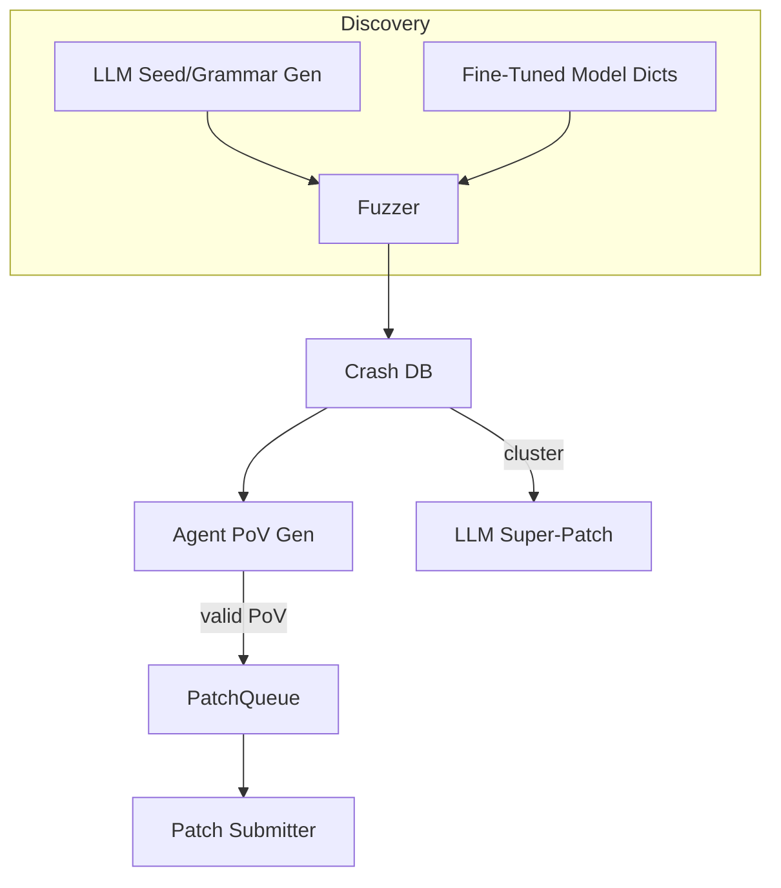

# AI-Assisted Fuzzing & Automated Vulnerability Discovery

{{#include ../banners/hacktricks-training.md}}

## 개요
대형 언어 모델(LLM)은 의미적으로 풍부한 입력을 생성하고, 문법을 발전시키며, 충돌 데이터를 추론하고, 심지어 다중 버그 패치를 제안함으로써 전통적인 취약점 연구 파이프라인을 강화할 수 있습니다. 이 페이지는 DARPA의 AI 사이버 챌린지(AIxCC) 결승 및 기타 공개 연구에서 관찰된 가장 효과적인 패턴을 수집합니다.

다음 내용은 특정 경쟁 시스템에 대한 설명이 아니라, 여러분이 자신의 워크플로우에서 재현할 수 있도록 기술의 추상화입니다.

---

## 1. LLM-생성 시드 입력

전통적인 커버리지 기반 퍼저(AFL++, libFuzzer, Honggfuzz…)는 작은 시드 집합으로 시작하여 바이트를 맹목적으로 변형합니다. 대상 입력 형식이 복잡할 때(SQL, URL, 사용자 정의 이진 프로토콜) 무작위 변형은 종종 흥미로운 분기가 도달하기 전에 구문을 깨뜨립니다.

LLM은 *시드 생성기*를 방출하여 이 부트스트랩 문제를 해결할 수 있습니다. – **구문적으로 올바르지만 보안 관련 입력**을 출력하는 짧은 스크립트입니다. 예를 들어:
```prompt
SYSTEM: You are a helpful security engineer.
USER:
Write a Python3 program that prints 200 unique SQL injection strings targeting common anti-pattern mistakes (missing quotes, numeric context, stacked queries).  Ensure length ≤ 256 bytes / string so they survive common length limits.
```

```python
# gen_sqli_seeds.py (truncated)
PAYLOADS = [
"1 OR 1=1 -- ",
"' UNION SELECT NULL,NULL--",
"0; DROP TABLE users;--",
...
]
for p in PAYLOADS:
print(p)
```
한 번 실행하고 출력을 퍼저의 초기 코퍼스에 직접 공급합니다:
```bash
python3 gen_sqli_seeds.py > seeds.txt
afl-fuzz -i seeds.txt -o findings/ -- ./target @@
```
이점:
1. 의미적 유효성 → 초기 더 깊은 커버리지.
2. 재생성 가능: 프롬프트를 조정하여 XSS, 경로 탐색, 이진 블롭 등에 집중.
3. 저렴함 (< 1 ¢ with GPT-3.5).

### 팁
* 모델에게 페이로드 길이와 인코딩 (UTF-8, URL-encoded, UTF-16-LE)을 *다양화*하도록 지시하여 표면적인 필터를 우회하도록 하세요.
* *단일 자급자족 스크립트*를 요청하세요 – JSON 형식 문제를 피할 수 있습니다.

---

## 2. 문법 진화 퍼징

더 강력한 변형은 LLM이 구체적인 시드 대신 **문법을 진화**하도록 하는 것입니다. 워크플로우 (“Grammar Guy” 패턴)는 다음과 같습니다:

1. 프롬프트를 통해 초기 ANTLR/Peach/LibFuzzer 문법을 생성합니다.
2. N 분 동안 퍼징하고 커버리지 메트릭 (히트된 엣지 / 블록)을 수집합니다.
3. 커버되지 않은 프로그램 영역을 요약하고 요약을 모델에 피드백합니다:
```prompt
이전 문법은 프로그램 엣지의 12 %를 트리거했습니다. 도달하지 않은 함수: parse_auth, handle_upload. 이를 커버하기 위해 규칙을 추가/수정하세요.
```
4. 새로운 규칙을 병합하고, 다시 퍼징하고, 반복합니다.

의사 코드 스켈레톤:
```python
for epoch in range(MAX_EPOCHS):
grammar = llm.refine(grammar, feedback=coverage_stats)
save(grammar, f"grammar_{epoch}.txt")
coverage_stats = run_fuzzer(grammar)
```
주요 사항:
* *예산*을 유지하세요 – 각 수정은 토큰을 사용합니다.
* 모델이 다시 쓰기보다는 편집하도록 `diff` + `patch` 지침을 사용하세요.
* Δcoverage < ε일 때 중지하세요.

---

## 3. 에이전트 기반 PoV (익스플로잇) 생성

충돌이 발견된 후에는 이를 결정적으로 유발하는 **취약점 증명 (PoV)**이 필요합니다.

확장 가능한 접근 방식은 *수천* 개의 경량 에이전트 (<process/thread/container/prisoner>)를 생성하여 각각 다른 LLM (GPT-4, Claude, Mixtral) 또는 온도 설정을 실행하는 것입니다.

파이프라인:
1. 정적/동적 분석이 *버그 후보* (충돌 PC, 입력 슬라이스, 샌타이저 메시지를 포함한 구조체)를 생성합니다.
2. 오케스트레이터가 후보를 에이전트에 배포합니다.
3. 에이전트 추론 단계:
a. `gdb` + 입력으로 로컬에서 버그를 재현합니다.
b. 최소한의 익스플로잇 페이로드를 제안합니다.
c. 샌드박스에서 익스플로잇을 검증합니다. 성공 시 → 제출합니다.
4. 실패한 시도는 **커버리지 퍼징을 위한 새로운 시드로 재큐**됩니다 (피드백 루프).

장점:
* 병렬화는 단일 에이전트의 신뢰성 부족을 숨깁니다.
* 관찰된 성공률에 따라 온도/모델 크기를 자동 조정합니다.

---

## 4. 미세 조정된 코드 모델을 통한 지향 퍼징

취약점 패턴 (정수 오버플로우, 버퍼 복사, 포맷 문자열)로 레이블이 지정된 C/C++ 소스에서 오픈 웨이트 모델 (예: Llama-7B)을 미세 조정합니다. 그런 다음:

1. 정적 분석을 실행하여 함수 목록 + AST를 가져옵니다.
2. 모델에 프롬프트: *“함수 X에서 메모리 안전성을 깨뜨릴 가능성이 있는 변이 사전 항목을 제공하세요”*.
3. 이러한 토큰을 사용자 정의 `AFL_CUSTOM_MUTATOR`에 삽입합니다.

`sprintf` 래퍼에 대한 예시 출력:
```
{"pattern":"%99999999s"}
{"pattern":"AAAAAAAA....<1024>....%n"}
```
경험적으로 이는 실제 타겟에서 충돌 시간 단축을 2배 이상 증가시킵니다.

---

## 5. AI-Guided Patching Strategies

### 5.1 Super Patches
모델에게 충돌 서명을 *클러스터링* 하도록 요청하고 공통 근본 원인을 제거하는 **단일 패치**를 제안합니다. 한 번 제출하면 여러 버그를 수정할 수 있습니다 → 잘못된 패치가 점수를 잃게 하는 환경에서 정확도 패널티가 줄어듭니다.

프롬프트 개요:
```
Here are 10 stack traces + file snippets.  Identify the shared mistake and generate a unified diff fixing all occurrences.
```
### 5.2 추측 패치 비율
확인된 PoV 검증 패치와 *추측* 패치(포인트 없음)가 점수 규칙에 맞춰 1:​N 비율로 교차되도록 큐를 구현합니다(예: 2 추측 : 1 확인). 비용 모델은 패널티와 포인트를 모니터링하고 N을 자동으로 조정합니다.

---

## 모든 것을 통합하기
엔드 투 엔드 CRS(사이버 추론 시스템)는 다음과 같이 구성 요소를 연결할 수 있습니다:

---

## References
* [Trail of Bits – AIxCC finals: Tale of the tape](https://blog.trailofbits.com/2025/08/07/aixcc-finals-tale-of-the-tape/)
* [CTF Radiooo AIxCC finalist interviews](https://www.youtube.com/@ctfradiooo)
{{#include ../banners/hacktricks-training.md}}
