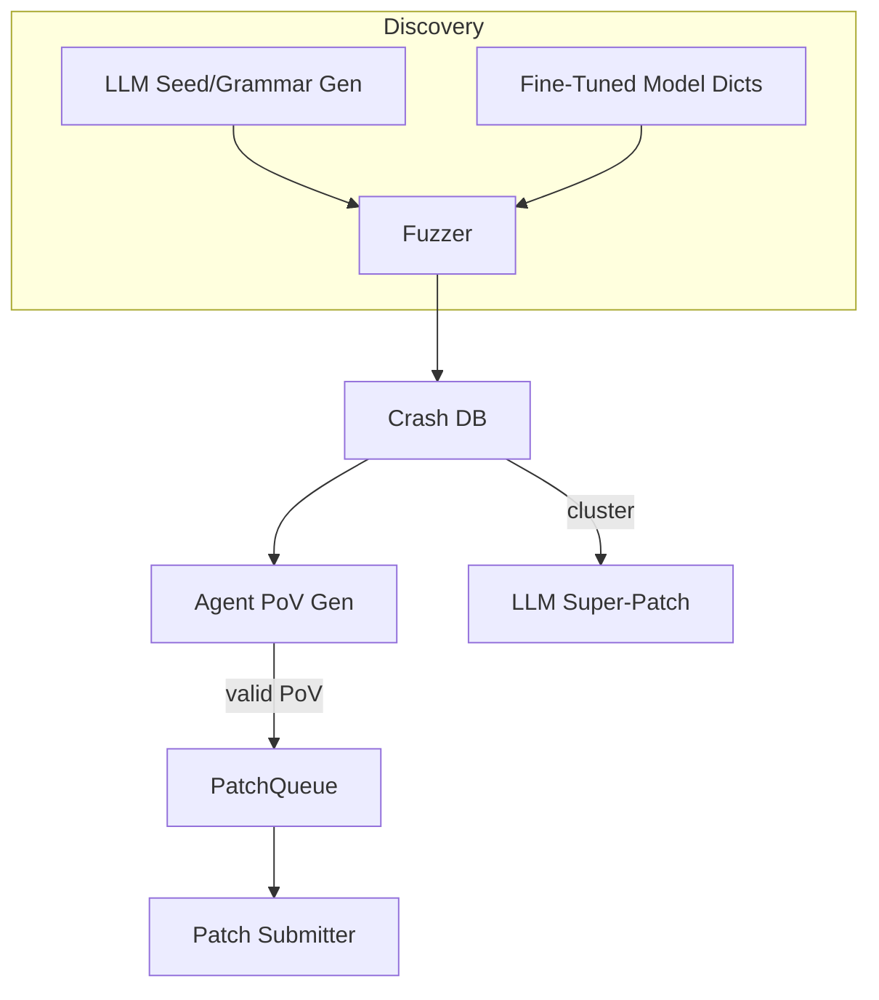

# AI-Assisted Fuzzing & Automated Vulnerability Discovery

{{#include ../banners/hacktricks-training.md}}

## Overview
बड़े-भाषा मॉडल (LLMs) पारंपरिक सुरक्षा-शोध पाइपलाइनों को सेमांटिक रूप से समृद्ध इनपुट उत्पन्न करके, व्याकरणों को विकसित करके, क्रैश डेटा पर तर्क करके, और यहां तक कि मल्टी-बग पैच प्रस्तावित करके सुपर-चार्ज कर सकते हैं। यह पृष्ठ DARPA के AI Cyber Challenge (AIxCC) फाइनल और अन्य सार्वजनिक शोध के दौरान देखे गए सबसे प्रभावी पैटर्न को एकत्र करता है।

जो आगे है वह एक विशिष्ट प्रतियोगिता प्रणाली का वर्णन नहीं है, बल्कि तकनीकों का एक अमूर्त रूप है ताकि आप उन्हें अपने कार्यप्रवाह में पुन: उत्पन्न कर सकें।

---

## 1. LLM-Generated Seed Inputs

पारंपरिक कवरेज-गाइडेड फज़र्स (AFL++, libFuzzer, Honggfuzz…) एक छोटे बीजों के कॉर्पस के साथ शुरू होते हैं और अंधाधुंध बाइट्स को म्यूट करते हैं। जब लक्षित इनपुट प्रारूप जटिल होता है (SQL, URLs, कस्टम बाइनरी प्रोटोकॉल) तो यादृच्छिक म्यूटेशन आमतौर पर दिलचस्प शाखाओं तक पहुँचने से पहले ही वाक्यविन्यास को तोड़ देते हैं।

LLMs इस बूटस्ट्रैप समस्या को *बीज जनरेटर* उत्पन्न करके हल कर सकते हैं - छोटे स्क्रिप्ट जो **वाक्यविन्यास-सही लेकिन सुरक्षा-संबंधित इनपुट** आउटपुट करते हैं। उदाहरण के लिए:
```prompt
SYSTEM: You are a helpful security engineer.
USER:
Write a Python3 program that prints 200 unique SQL injection strings targeting common anti-pattern mistakes (missing quotes, numeric context, stacked queries).  Ensure length ≤ 256 bytes / string so they survive common length limits.
```

```python
# gen_sqli_seeds.py (truncated)
PAYLOADS = [
"1 OR 1=1 -- ",
"' UNION SELECT NULL,NULL--",
"0; DROP TABLE users;--",
...
]
for p in PAYLOADS:
print(p)
```
एक बार चलाएँ और आउटपुट को सीधे फज़्ज़र के प्रारंभिक कॉर्पस में डालें:
```bash
python3 gen_sqli_seeds.py > seeds.txt
afl-fuzz -i seeds.txt -o findings/ -- ./target @@
```
लाभ:
1. अर्थपूर्ण वैधता → प्रारंभ में गहरी कवरेज।
2. पुनः उत्पन्न करने योग्य: XSS, पथTraversal, बाइनरी ब्लॉब्स आदि पर ध्यान केंद्रित करने के लिए प्रॉम्प्ट को समायोजित करें।
3. सस्ता (< 1 ¢ GPT-3.5 के साथ)।

### सुझाव
* मॉडल को *विविधता* लाने के लिए पेलोड की लंबाई और एन्कोडिंग (UTF-8, URL-encoded, UTF-16-LE) को निर्देशित करें ताकि सतही फ़िल्टर को बायपास किया जा सके।
* एक *एकल आत्म-निहित स्क्रिप्ट* के लिए पूछें - JSON फ़ॉर्मेटिंग की समस्याओं से बचता है।

---

## 2. व्याकरण-उत्कर्ष फज़िंग

एक अधिक शक्तिशाली रूपांतर यह है कि LLM को **व्याकरण विकसित करने** दिया जाए बजाय ठोस बीजों के। कार्यप्रवाह (“व्याकरण व्यक्ति” पैटर्न) है:

1. प्रॉम्प्ट के माध्यम से प्रारंभिक ANTLR/Peach/LibFuzzer व्याकरण उत्पन्न करें।
2. N मिनट के लिए फज़ करें और कवरेज मैट्रिक्स (किनारे / ब्लॉक हिट) एकत्र करें।
3. अनकवर्ड प्रोग्राम क्षेत्रों का सारांश बनाएं और सारांश को मॉडल में वापस फीड करें:
```prompt
पिछले व्याकरण ने प्रोग्राम के 12% किनारों को ट्रिगर किया। पहुंची नहीं गईं फ़ंक्शन: parse_auth, handle_upload। इनको कवर करने के लिए नियम जोड़ें / संशोधित करें।
```
4. नए नियमों को मर्ज करें, फिर से फज़ करें, दोहराएं।

Pseudo-code skeleton:
```python
for epoch in range(MAX_EPOCHS):
grammar = llm.refine(grammar, feedback=coverage_stats)
save(grammar, f"grammar_{epoch}.txt")
coverage_stats = run_fuzzer(grammar)
```
मुख्य बिंदु:
* एक *बजट* बनाए रखें - प्रत्येक सुधार में टोकन का उपयोग होता है।
* मॉडल को संपादित करने के लिए `diff` + `patch` निर्देशों का उपयोग करें, न कि फिर से लिखने के लिए।
* जब Δcoverage < ε हो जाए तो रुकें।

---

## 3. एजेंट-आधारित PoV (एक्सप्लॉइट) जनरेशन

एक क्रैश मिलने के बाद, आपको अभी भी एक **प्रूफ-ऑफ-वल्नरबिलिटी (PoV)** की आवश्यकता है जो इसे निश्चित रूप से ट्रिगर करता है।

एक स्केलेबल दृष्टिकोण यह है कि *हजारों* हल्के एजेंट (<process/thread/container/prisoner>) उत्पन्न करें, प्रत्येक एक अलग LLM (GPT-4, Claude, Mixtral) या तापमान सेटिंग चला रहा है।

पाइपलाइन:
1. स्थैतिक/गतिशील विश्लेषण *बग उम्मीदवारों* (क्रैश PC, इनपुट स्लाइस, सैनिटाइज़र संदेश के साथ संरचना) का उत्पादन करता है।
2. ऑर्केस्ट्रेटर उम्मीदवारों को एजेंटों में वितरित करता है।
3. एजेंट तर्क कदम:
a. `gdb` + इनपुट के साथ स्थानीय रूप से बग को पुन: उत्पन्न करें।
b. न्यूनतम एक्सप्लॉइट पेलोड का सुझाव दें।
c. सैंडबॉक्स में एक्सप्लॉइट को मान्य करें। यदि सफल → सबमिट करें।
4. असफल प्रयासों को **कवरेज फज़िंग के लिए नए बीज के रूप में फिर से कतारबद्ध किया जाता है** (फीडबैक लूप)।

फायदे:
* समानांतरता एकल-एजेंट की अस्थिरता को छिपाती है।
* देखी गई सफलता दर के आधार पर तापमान / मॉडल आकार का स्वचालित ट्यूनिंग।

---

## 4. फाइन-ट्यून किए गए कोड मॉडलों के साथ निर्देशित फज़िंग

एक ओपन-वेट मॉडल (जैसे Llama-7B) को C/C++ स्रोत पर वल्नरबिलिटी पैटर्न (पूर्णांक ओवरफ्लो, बफर कॉपी, फॉर्मेट स्ट्रिंग) के साथ लेबल करके फाइन-ट्यून करें। फिर:

1. कार्य सूची + AST प्राप्त करने के लिए स्थैतिक विश्लेषण चलाएं।
2. मॉडल को प्रॉम्प्ट करें: *“म्यूटेशन डिक्शनरी प्रविष्टियाँ दें जो फ़ंक्शन X में मेमोरी सुरक्षा को तोड़ने की संभावना रखते हैं”*।
3. उन टोकनों को एक कस्टम `AFL_CUSTOM_MUTATOR` में डालें।

एक `sprintf` रैपर के लिए उदाहरण आउटपुट:
```
{"pattern":"%99999999s"}
{"pattern":"AAAAAAAA....<1024>....%n"}
```
व्यवहारिक रूप से, यह वास्तविक लक्ष्यों पर समय-से-क्रैश को >2× कम करता है।

---

## 5. AI-निर्देशित पैचिंग रणनीतियाँ

### 5.1 सुपर पैच
मॉडल से *क्लस्टर* क्रैश सिग्नेचर पूछें और एक **एकल पैच** प्रस्तावित करें जो सामान्य मूल कारण को हटा देता है। एक बार सबमिट करें, कई बग ठीक करें → उन वातावरणों में कम सटीकता दंड जहाँ प्रत्येक गलत पैच अंक खर्च करता है।

प्रॉम्प्ट रूपरेखा:
```
Here are 10 stack traces + file snippets.  Identify the shared mistake and generate a unified diff fixing all occurrences.
```
### 5.2 अनुमानित पैच अनुपात
एक कतार लागू करें जहां पुष्टि किए गए PoV-मान्य पैच और *अनुमानित* पैच (कोई PoV नहीं) 1:​N अनुपात में इंटरलीव्ड होते हैं, जो स्कोरिंग नियमों के अनुसार समायोजित होता है (जैसे 2 अनुमानित : 1 पुष्टि की गई)। एक लागत मॉडल दंड बनाम अंकों की निगरानी करता है और N को स्व-संयोजित करता है।

---

## इसे सब एक साथ रखना
एक एंड-टू-एंड CRS (Cyber Reasoning System) घटकों को इस तरह से कनेक्ट कर सकता है:

---

## References
* [Trail of Bits – AIxCC finals: Tale of the tape](https://blog.trailofbits.com/2025/08/07/aixcc-finals-tale-of-the-tape/)
* [CTF Radiooo AIxCC finalist interviews](https://www.youtube.com/@ctfradiooo)
{{#include ../banners/hacktricks-training.md}}
