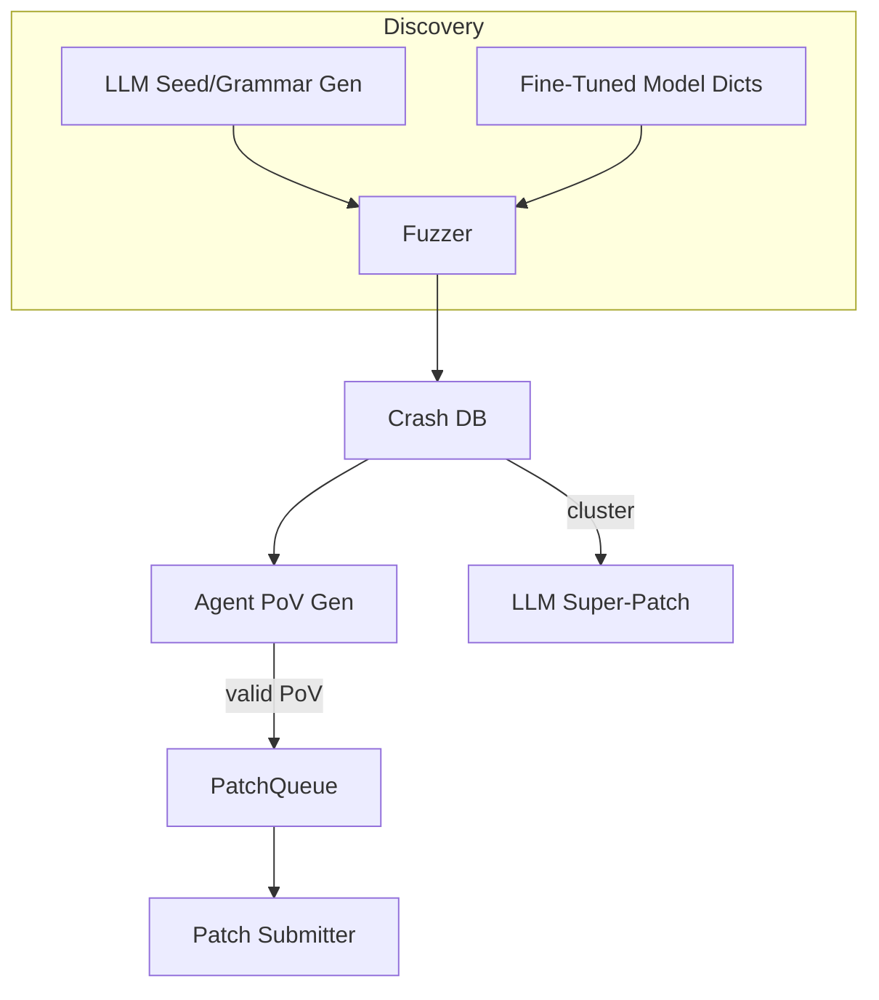

# AI-Assisted Fuzzing & Automated Vulnerability Discovery

{{#include ../banners/hacktricks-training.md}}

## Огляд
Великі мовні моделі (LLMs) можуть значно покращити традиційні процеси дослідження вразливостей, генеруючи семантично багаті вхідні дані, еволюціонуючи граматики, аналізуючи дані про збої та навіть пропонуючи патчі для кількох вразливостей. Ця сторінка збирає найефективніші патерни, спостережені під час фіналу AI Cyber Challenge (AIxCC) DARPA та інших публічних досліджень.

Те, що слідує, не є описом однієї конкретної системи конкурсу, а є абстракцією технік, щоб ви могли відтворити їх у своїх власних робочих процесах.

---

## 1. Вхідні дані, згенеровані LLM

Традиційні фуззери з керуванням покриттям (AFL++, libFuzzer, Honggfuzz…) починають з невеликого корпусу насіння та сліпо мутують байти. Коли цільовий формат вхідних даних є складним (SQL, URL, власні бінарні протоколи), випадкові мутації зазвичай порушують синтаксис, перш ніж досягаються цікаві гілки.

LLMs можуть вирішити цю проблему початкового завантаження, випускаючи *генератори насіння* – короткі скрипти, які виводять **синтаксично правильні, але релевантні до безпеки вхідні дані**. Наприклад:
```prompt
SYSTEM: You are a helpful security engineer.
USER:
Write a Python3 program that prints 200 unique SQL injection strings targeting common anti-pattern mistakes (missing quotes, numeric context, stacked queries).  Ensure length ≤ 256 bytes / string so they survive common length limits.
```

```python
# gen_sqli_seeds.py (truncated)
PAYLOADS = [
"1 OR 1=1 -- ",
"' UNION SELECT NULL,NULL--",
"0; DROP TABLE users;--",
...
]
for p in PAYLOADS:
print(p)
```
Запустіть один раз і безпосередньо передайте вихідні дані в початковий корпус фуззера:
```bash
python3 gen_sqli_seeds.py > seeds.txt
afl-fuzz -i seeds.txt -o findings/ -- ./target @@
```
Переваги:
1. Семантична дійсність → глибше охоплення на ранніх етапах.
2. Можливість повторного генерування: налаштуйте запит, щоб зосередитися на XSS, обході шляхів, бінарних об'єктах тощо.
3. Дешево (< 1 ¢ з GPT-3.5).

### Поради
* Наказуйте моделі *урізноманітнити* довжину та кодування корисного навантаження (UTF-8, URL-кодоване, UTF-16-LE), щоб обійти поверхневі фільтри.
* Запитайте *один самодостатній скрипт* – уникнете проблем з форматуванням JSON.

---

## 2. Фаззинг з еволюцією граматики

Більш потужний варіант полягає в тому, щоб дозволити LLM **еволюціонувати граматику** замість конкретних насіння. Робочий процес (“Grammar Guy” патерн) такий:

1. Згенеруйте початкову граматику ANTLR/Peach/LibFuzzer за допомогою запиту.
2. Фаззинг протягом N хвилин і збір метрик охоплення (краї / блоки, які були досягнуті).
3. Підсумуйте непокриті області програми та передайте підсумок назад у модель:
```prompt
Попередня граматика активувала 12 % країв програми. Функції, які не були досягнуті: parse_auth, handle_upload. Додайте / змініть правила, щоб охопити ці.
```
4. Об'єднайте нові правила, повторно фаззинг, повторіть.

Псевдокод скелет:
```python
for epoch in range(MAX_EPOCHS):
grammar = llm.refine(grammar, feedback=coverage_stats)
save(grammar, f"grammar_{epoch}.txt")
coverage_stats = run_fuzzer(grammar)
```
Ключові моменти:
* Тримайте *бюджет* – кожне вдосконалення використовує токени.
* Використовуйте `diff` + `patch` інструкції, щоб модель редагувала, а не переписувала.
* Зупиніться, коли Δcoverage < ε.

---

## 3. Генерація PoV (експлуатації) на основі агентів

Після виявлення збою вам все ще потрібен **доказ вразливості (PoV)**, який детерміновано його викликає.

Масштабований підхід полягає в запуску *тисяч* легковагих агентів (<process/thread/container/prisoner>), кожен з яких працює з різною LLM (GPT-4, Claude, Mixtral) або налаштуванням температури.

Конвеєр:
1. Статичний/динамічний аналіз генерує *кандидатів на помилки* (структура з PC збою, зрізом вводу, повідомленням санітайзера).
2. Оркестратор розподіляє кандидатів між агентами.
3. Кроки міркування агента:
a. Відтворити помилку локально з `gdb` + ввід.
b. Запропонувати мінімальний експлуатаційний вантаж.
c. Перевірити експлуатацію в пісочниці. Якщо успішно → подати.
4. Невдалі спроби **перенаправляються як нові насіння** для покриття фуззингу (зворотний зв'язок).

Переваги:
* Паралелізація приховує ненадійність одного агента.
* Автоматичне налаштування температури / розміру моделі на основі спостережуваної частоти успіху.

---

## 4. Направлений фуззинг з тонко налаштованими кодовими моделями

Тонко налаштуйте модель з відкритими вагами (наприклад, Llama-7B) на вихідному коді C/C++, позначеному вразливими патернами (переповнення цілого числа, копіювання буфера, форматування рядка). Потім:

1. Запустіть статичний аналіз, щоб отримати список функцій + AST.
2. Запросіть модель: *“Надайте записи словника мутацій, які, ймовірно, зламають безпеку пам'яті у функції X”*.
3. Вставте ці токени в кастомний `AFL_CUSTOM_MUTATOR`.

Приклад виходу для обгортки `sprintf`:
```
{"pattern":"%99999999s"}
{"pattern":"AAAAAAAA....<1024>....%n"}
```
Емпірично це зменшує час до збою більше ніж у 2 рази на реальних цілях.

---

## 5. AI-Guided Patching Strategies

### 5.1 Super Patches
Запитайте модель, щоб вона *кластеризувала* підписи збою та запропонувала **один патч**, який усуває загальну кореневу причину. Подайте один раз, виправте кілька помилок → менше штрафів за точність в середовищах, де кожен неправильний патч коштує бали.

Схема запиту:
```
Here are 10 stack traces + file snippets.  Identify the shared mistake and generate a unified diff fixing all occurrences.
```
### 5.2 Спекулятивне співвідношення патчів
Реалізуйте чергу, в якій підтверджені патчі, перевірені за допомогою PoV, та *спекулятивні* патчі (без PoV) чергуються в співвідношенні 1:​N, налаштованому відповідно до правил оцінювання (наприклад, 2 спекулятивні : 1 підтверджений). Модель витрат контролює штрафи проти балів і самостійно коригує N.

---

## Зведення всього разом
Система CRS (Кібернетична система розуміння) може з'єднати компоненти таким чином:

---

## Посилання
* [Trail of Bits – AIxCC фінали: Історія змагання](https://blog.trailofbits.com/2025/08/07/aixcc-finals-tale-of-the-tape/)
* [CTF Radiooo інтерв'ю з фіналістами AIxCC](https://www.youtube.com/@ctfradiooo)
{{#include ../banners/hacktricks-training.md}}
