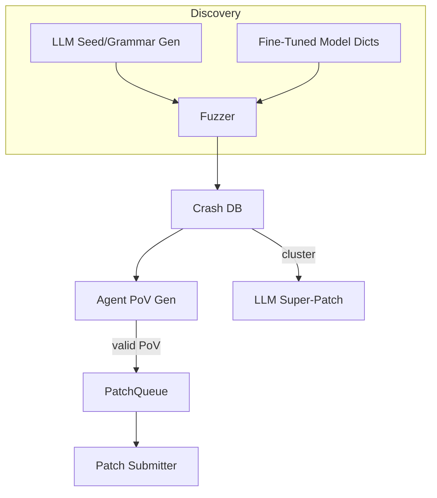

# AI-Assisted Fuzzing & Automated Vulnerability Discovery

{{#include ../banners/hacktricks-training.md}}

## Übersicht
Große Sprachmodelle (LLMs) können traditionelle Schwachstellenforschungs-Pipelines durch die Generierung semantisch reicher Eingaben, die Entwicklung von Grammatiken, das Nachdenken über Absturzdaten und sogar das Vorschlagen von Multi-Bug-Patches erheblich verbessern. Diese Seite sammelt die effektivsten Muster, die während der AI Cyber Challenge (AIxCC) Finals von DARPA und anderer öffentlicher Forschung beobachtet wurden.

Was folgt, ist keine Beschreibung eines spezifischen Wettbewerbssystems, sondern eine Abstraktion der Techniken, damit Sie diese in Ihren eigenen Workflows reproduzieren können.

---

## 1. LLM-generierte Seed-Eingaben

Traditionelle coverage-gesteuerte Fuzzer (AFL++, libFuzzer, Honggfuzz…) beginnen mit einem kleinen Korpus von Seeds und mutieren Bytes blind. Wenn das Ziel-Eingabeformat komplex ist (SQL, URLs, benutzerdefinierte binäre Protokolle), brechen zufällige Mutationen normalerweise die Syntax, bevor interessante Verzweigungen erreicht werden.

LLMs können dieses Bootstrap-Problem lösen, indem sie *Seed-Generatoren* ausgeben – kurze Skripte, die **syntaxkorrekte, aber sicherheitsrelevante Eingaben** erzeugen. Zum Beispiel:
```prompt
SYSTEM: You are a helpful security engineer.
USER:
Write a Python3 program that prints 200 unique SQL injection strings targeting common anti-pattern mistakes (missing quotes, numeric context, stacked queries).  Ensure length ≤ 256 bytes / string so they survive common length limits.
```

```python
# gen_sqli_seeds.py (truncated)
PAYLOADS = [
"1 OR 1=1 -- ",
"' UNION SELECT NULL,NULL--",
"0; DROP TABLE users;--",
...
]
for p in PAYLOADS:
print(p)
```
Führen Sie es einmal aus und speisen Sie die Ausgabe direkt in das anfängliche Corpus des Fuzzers ein:
```bash
python3 gen_sqli_seeds.py > seeds.txt
afl-fuzz -i seeds.txt -o findings/ -- ./target @@
```
Benefits:
1. Semantische Gültigkeit → tiefere Abdeckung frühzeitig.
2. Wiederherstellbar: passe den Prompt an, um sich auf XSS, Pfadüberquerung, binäre Blobs usw. zu konzentrieren.
3. Günstig (< 1 ¢ mit GPT-3.5).

### Tipps
* Weisen Sie das Modell an, die *Länge und Kodierung* der Payloads (UTF-8, URL-kodiert, UTF-16-LE) zu *diversifizieren*, um oberflächliche Filter zu umgehen.
* Fordern Sie ein *einzelnes, eigenständiges Skript* an – vermeidet JSON-Formatierungsprobleme.

---

## 2. Grammatik-Evolution Fuzzing

Eine leistungsfähigere Variante besteht darin, das LLM eine **Grammatik zu entwickeln** anstelle von konkreten Seeds. Der Workflow („Grammar Guy“-Muster) ist:

1. Generiere eine initiale ANTLR/Peach/LibFuzzer-Grammatik über den Prompt.
2. Fuzz für N Minuten und sammle Abdeckungsmetriken (getroffene Kanten / Blöcke).
3. Fasse nicht abgedeckte Programmgebiete zusammen und speise die Zusammenfassung zurück in das Modell:
```prompt
Die vorherige Grammatik hat 12 % der Programmkanten ausgelöst. Nicht erreichte Funktionen: parse_auth, handle_upload. Füge Regeln hinzu / ändere sie, um diese abzudecken.
```
4. Füge die neuen Regeln zusammen, führe erneut Fuzzing durch, wiederhole. 

Pseudo-Code-Skelett:
```python
for epoch in range(MAX_EPOCHS):
grammar = llm.refine(grammar, feedback=coverage_stats)
save(grammar, f"grammar_{epoch}.txt")
coverage_stats = run_fuzzer(grammar)
```
Wichtige Punkte:
* Halte ein *Budget* – jede Verfeinerung verwendet Tokens.
* Verwende `diff` + `patch` Anweisungen, damit das Modell bearbeitet und nicht neu schreibt.
* Stoppe, wenn Δcoverage < ε.

---

## 3. Agentenbasierte PoV (Exploit) Generierung

Nachdem ein Absturz gefunden wurde, benötigst du immer noch einen **Proof-of-Vulnerability (PoV)**, der ihn deterministisch auslöst.

Ein skalierbarer Ansatz ist es, *tausende* von leichten Agenten (<process/thread/container/prisoner>) zu starten, die jeweils ein anderes LLM (GPT-4, Claude, Mixtral) oder Temperatureinstellung ausführen.

Pipeline:
1. Statische/dynamische Analyse produziert *Fehlerkandidaten* (Struktur mit Absturz-PC, Eingabeslice, Sanitizer-Nachricht).
2. Orchestrator verteilt Kandidaten an Agenten.
3. Agenten-Überlegungs-Schritte:
a. Reproduziere den Fehler lokal mit `gdb` + Eingabe.
b. Schlage minimale Exploit-Nutzlast vor.
c. Validiere den Exploit in einer Sandbox. Wenn erfolgreich → einreichen.
4. Fehlgeschlagene Versuche werden **als neue Seeds für Coverage-Fuzzing erneut eingereiht** (Feedback-Schleife).

Vorteile:
* Parallelisierung verbirgt die Unzuverlässigkeit einzelner Agenten.
* Automatische Anpassung von Temperatur / Modellgröße basierend auf der beobachteten Erfolgsquote.

---

## 4. Gezieltes Fuzzing mit feinabgestimmten Code-Modellen

Feinabstimmung eines offenen Modells (z.B. Llama-7B) auf C/C++-Quellcode, der mit Schwachstellenmustern (Integerüberlauf, Pufferkopie, Formatzeichenfolge) gekennzeichnet ist. Dann:

1. Führe eine statische Analyse durch, um die Funktionsliste + AST zu erhalten.
2. Fordere das Modell auf: *„Gib Mutationswörterbucheinträge an, die wahrscheinlich die Speichersicherheit in Funktion X brechen“*.
3. Füge diese Tokens in einen benutzerdefinierten `AFL_CUSTOM_MUTATOR` ein.

Beispielausgabe für einen `sprintf` Wrapper:
```
{"pattern":"%99999999s"}
{"pattern":"AAAAAAAA....<1024>....%n"}
```
Empirisch verkürzt dies die Zeit bis zum Absturz um >2× bei realen Zielen.

---

## 5. KI-gestützte Patch-Strategien

### 5.1 Super-Patches
Fordern Sie das Modell auf, Absturzsignaturen zu *clustern* und einen **einzelnen Patch** vorzuschlagen, der die gemeinsame Grundursache entfernt. Einmal einreichen, mehrere Fehler beheben → weniger Genauigkeitsstrafen in Umgebungen, in denen jeder falsche Patch Punkte kostet.

Prompt-Umriss:
```
Here are 10 stack traces + file snippets.  Identify the shared mistake and generate a unified diff fixing all occurrences.
```
### 5.2 Spekulatives Patch-Verhältnis
Implementieren Sie eine Warteschlange, in der bestätigte PoV-validierte Patches und *spekulative* Patches (kein PoV) im Verhältnis 1:​N angeordnet sind, das an die Bewertungsregeln angepasst ist (z. B. 2 spekulative : 1 bestätigter). Ein Kostenmodell überwacht Strafen im Vergleich zu Punkten und passt N automatisch an.

---

## Alles Zusammenfügen
Ein End-to-End CRS (Cyber Reasoning System) kann die Komponenten wie folgt verbinden:

---

## Referenzen
* [Trail of Bits – AIxCC-Finale: Die Bilanz](https://blog.trailofbits.com/2025/08/07/aixcc-finals-tale-of-the-tape/)
* [CTF Radiooo AIxCC Finalisteninterviews](https://www.youtube.com/@ctfradiooo)
{{#include ../banners/hacktricks-training.md}}
