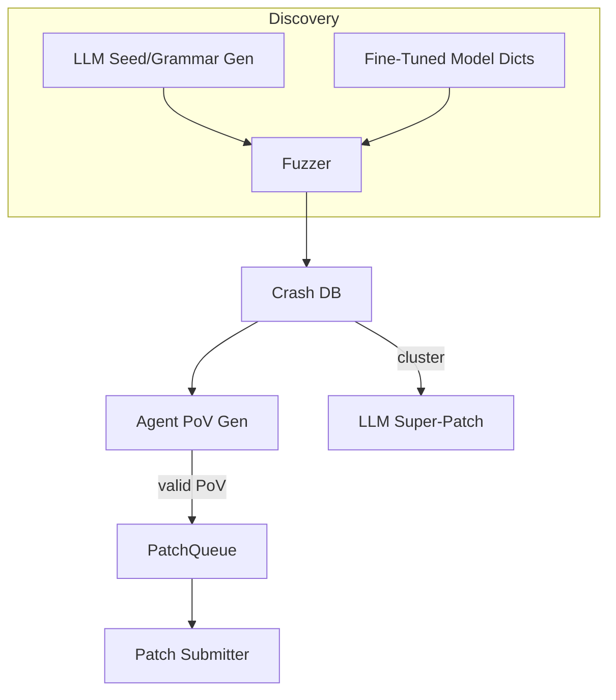

# AI-Assisted Fuzzing & Automated Vulnerability Discovery

{{#include ../banners/hacktricks-training.md}}

## Pregled
Veliki jezički modeli (LLM) mogu značajno poboljšati tradicionalne procese istraživanja ranjivosti generisanjem semantički bogatih ulaza, razvijanjem gramatika, razmišljanjem o podacima o padovima, pa čak i predlaganjem zakrpa za više grešaka. Ova stranica prikuplja najučinkovitije obrasce zabeležene tokom DARPA-ine AI Cyber Challenge (AIxCC) finala i drugih javnih istraživanja.

Ono što sledi nije opis jednog specifičnog takmičenja, već apstrakcija tehnika kako biste ih mogli reprodukovati u svojim radnim tokovima.

---

## 1. LLM-Generisani Početni Ulazi

Tradicionalni fuzzers vođeni pokrivenošću (AFL++, libFuzzer, Honggfuzz…) počinju sa malim korpusom semena i slepo mutiraju bajtove. Kada je ciljni format ulaza složen (SQL, URL-ovi, prilagođeni binarni protokoli), nasumične mutacije obično kvare sintaksu pre nego što se dođe do zanimljivih grana.

LLM-ovi mogu rešiti ovaj problem pokretanja emitovanjem *generatora semena* – kratkih skripti koje proizvode **sintaktički ispravne, ali bezbednosno relevantne ulaze**. Na primer:
```prompt
SYSTEM: You are a helpful security engineer.
USER:
Write a Python3 program that prints 200 unique SQL injection strings targeting common anti-pattern mistakes (missing quotes, numeric context, stacked queries).  Ensure length ≤ 256 bytes / string so they survive common length limits.
```

```python
# gen_sqli_seeds.py (truncated)
PAYLOADS = [
"1 OR 1=1 -- ",
"' UNION SELECT NULL,NULL--",
"0; DROP TABLE users;--",
...
]
for p in PAYLOADS:
print(p)
```
Pokrenite jednom i direktno unesite izlaz u početni korpus fuzera:
```bash
python3 gen_sqli_seeds.py > seeds.txt
afl-fuzz -i seeds.txt -o findings/ -- ./target @@
```
Benefits:
1. Semantička validnost → dublje pokrivanje rano.
2. Ponovno generisanje: prilagodite prompt da se fokusira na XSS, prolazak kroz putanju, binarne blobove, itd.
3. Jeftino (< 1 ¢ sa GPT-3.5).

### Tips
* Uputite model da *diverzifikuje* dužinu i kodiranje payload-a (UTF-8, URL-encoded, UTF-16-LE) kako bi zaobišao površinske filtre.
* Zatražite *jedan samostalni skript* – izbegava probleme sa JSON formatiranjem.

---

## 2. Fuzzing sa evolucijom gramatike

Moćnija varijanta je da se LLM **evoluira gramatiku** umesto konkretnih semena. Tok rada (“Grammar Guy” obrazac) je:

1. Generišite inicijalnu ANTLR/Peach/LibFuzzer gramatiku putem prompta.
2. Fuzzujte N minuta i prikupite metrike pokrivenosti (ivice / blokovi pogođeni).
3. Sažmite neotkrivene oblasti programa i vratite sažetak u model:
```prompt
Prethodna gramatika je aktivirala 12 % ivica programa. Funkcije koje nisu dostignute: parse_auth, handle_upload. Dodajte / izmenite pravila da pokrijete ovo.
```
4. Spojite nova pravila, ponovo fuzzujte, ponavljajte.

Pseudo-kod kostur:
```python
for epoch in range(MAX_EPOCHS):
grammar = llm.refine(grammar, feedback=coverage_stats)
save(grammar, f"grammar_{epoch}.txt")
coverage_stats = run_fuzzer(grammar)
```
Ključne tačke:
* Držite *budžet* – svaka dorada koristi tokene.
* Koristite `diff` + `patch` uputstva tako da model uređuje umesto da prepisuje.
* Prestanite kada Δcoverage < ε.

---

## 3. Generisanje PoV-a (Eksploatacija) zasnovano na agentima

Nakon što se pronađe greška, još uvek vam je potreban **dokaz o ranjivosti (PoV)** koji deterministički izaziva.

Skalabilan pristup je pokretanje *hiljada* lakih agenata (<process/thread/container/prisoner>), svaki pokreće različiti LLM (GPT-4, Claude, Mixtral) ili podešavanje temperature.

Pipeline:
1. Statistička/dinamička analiza proizvodi *kandidate za greške* (struktura sa PC greške, ulaznim delom, porukom sanitizatora).
2. Orkestrator distribuira kandidate agentima.
3. Koraci razmišljanja agenta:
a. Ponovno reprodukovanje greške lokalno sa `gdb` + ulaz.
b. Predložite minimalni eksploatacijski payload.
c. Validirajte eksploataciju u sandbox-u. Ako uspe → pošaljite.
4. Neuspešni pokušaji se **ponovo stavljaju u red kao novi semena** za pokrivenost fuzzing-a (feedback loop).

Prednosti:
* Paralelizacija skriva nepouzdanost pojedinačnih agenata.
* Automatsko podešavanje temperature / veličine modela na osnovu posmatrane stope uspeha.

---

## 4. Usmereno Fuzzing sa Fino Podešenim Kod Modelima

Fino podešavanje modela otvorenih težina (npr. Llama-7B) na C/C++ izvoru označenom sa obrascima ranjivosti (prelivanje celog broja, kopiranje bafera, format string). Zatim:

1. Pokrenite statičku analizu da dobijete listu funkcija + AST.
2. Upitite model: *“Dajte unose rečnika mutacija koji verovatno krše bezbednost memorije u funkciji X”*.
3. Umetnite te tokene u prilagođeni `AFL_CUSTOM_MUTATOR`.

Primer izlaza za `sprintf` omotač:
```
{"pattern":"%99999999s"}
{"pattern":"AAAAAAAA....<1024>....%n"}
```
Empirijski, ovo smanjuje vreme do pada za više od 2× na stvarnim ciljevima.

---

## 5. AI-Guided Patching Strategies

### 5.1 Super Patches
Zatražite od modela da *grupiše* potpise pada i predloži **jedan zakrpu** koja uklanja zajednički uzrok. Pošaljite jednom, ispravite nekoliko grešaka → manje kazni za tačnost u okruženjima gde svaka pogrešna zakrpa košta poene.

Prompt outline:
```
Here are 10 stack traces + file snippets.  Identify the shared mistake and generate a unified diff fixing all occurrences.
```
### 5.2 Spekulativni odnos zakrpa
Implementirati red u kojem su potvrđene zakrpe validirane PoV-om i *spekulativne* zakrpe (bez PoV-a) međusobno isprepletene u odnosu 1:​N podešenom prema pravilima bodovanja (npr. 2 spekulativne : 1 potvrđena). Model troškova prati kazne u odnosu na poene i automatski podešava N.

---

## Spajanje svega
Krajnji CRS (Sistem kibernetičkog rezonovanja) može povezati komponente na sledeći način:

---

## References
* [Trail of Bits – AIxCC finals: Tale of the tape](https://blog.trailofbits.com/2025/08/07/aixcc-finals-tale-of-the-tape/)
* [CTF Radiooo AIxCC finalist interviews](https://www.youtube.com/@ctfradiooo)
{{#include ../banners/hacktricks-training.md}}
