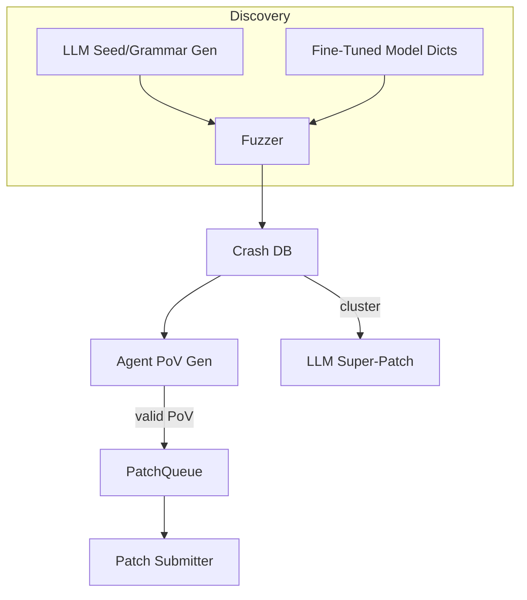

# AI-Assisted Fuzzing & Automated Vulnerability Discovery

{{#include ../banners/hacktricks-training.md}}

## Oorsig
Groot-taalmodelle (LLMs) kan tradisionele kwesbaarheid-navorsingspype superlaai deur semanties ryk insette te genereer, grammatika's te ontwikkel, oor crash-data te redeneer, en selfs multi-fout patches voor te stel. Hierdie bladsy versamel die mees effektiewe patrone wat waargeneem is tydens DARPA se AI Cyber Challenge (AIxCC) eindronde en ander openbare navorsing.

Wat volg is nie 'n beskrywing van een spesifieke kompetisiestelsel nie, maar 'n abstraksie van die tegnieke sodat jy dit in jou eie werksvloei kan herproduseer.

---

## 1. LLM-gegenereerde Saad Insette

Tradisionele dekking-geleide fuzzers (AFL++, libFuzzer, Honggfuzz…) begin met 'n klein korpus van sade en muteer bytes blindelings. Wanneer die teikeninsetformaat kompleks is (SQL, URL's, persoonlike binêre protokolle) breek ewekansige mutasies gewoonlik die sintaksis voordat interessante takke bereik word.

LLMs kan hierdie bootstrap-probleem oplos deur *saadgenerators* uit te saai – kort skrifte wat **sintaksis-korrekte maar sekuriteits-relevante insette** lewer. Byvoorbeeld:
```prompt
SYSTEM: You are a helpful security engineer.
USER:
Write a Python3 program that prints 200 unique SQL injection strings targeting common anti-pattern mistakes (missing quotes, numeric context, stacked queries).  Ensure length ≤ 256 bytes / string so they survive common length limits.
```

```python
# gen_sqli_seeds.py (truncated)
PAYLOADS = [
"1 OR 1=1 -- ",
"' UNION SELECT NULL,NULL--",
"0; DROP TABLE users;--",
...
]
for p in PAYLOADS:
print(p)
```
Voer een keer uit en voer die uitvoer direk in die fuzzer se aanvanklike korpus in:
```bash
python3 gen_sqli_seeds.py > seeds.txt
afl-fuzz -i seeds.txt -o findings/ -- ./target @@
```
Voordele:
1. Semantiese geldigheid → dieper dekking vroeg.
2. Her-genererbaar: pas die prompt aan om op XSS, pad traversering, binêre blobs, ens. te fokus.
3. Goedkoop (< 1 ¢ met GPT-3.5).

### Wenke
* Instrueer die model om *te diversifiseer* payload lengte en kodering (UTF-8, URL-gecodeer, UTF-16-LE) om oppervlakkige filters te omseil.
* Vra vir 'n *enkele self-onderhoudende skrip* – vermy JSON-formatering probleme.

---

## 2. Grammatika-Evolusie Fuzzing

'n Meer kragtige variasie is om die LLM **'n grammatika te laat evolueer** in plaas van konkrete sade. Die werksvloei (“Grammatika Ou” patroon) is:

1. Genereer 'n aanvanklike ANTLR/Peach/LibFuzzer grammatika via prompt.
2. Fuzz vir N minute en versamel dekking metrieke (kante / blokke getref).
3. Som onbedekte programareas op en voer die opsomming terug in die model:
```prompt
Die vorige grammatika het 12 % van die programkante geaktiveer. Funksies wat nie bereik is nie: parse_auth, handle_upload. Voeg / wysig reëls om hierdie te dek.
```
4. Voeg die nuwe reëls saam, her-fuzz, herhaal.

Pseudo-kode skelet:
```python
for epoch in range(MAX_EPOCHS):
grammar = llm.refine(grammar, feedback=coverage_stats)
save(grammar, f"grammar_{epoch}.txt")
coverage_stats = run_fuzzer(grammar)
```
Key points:
* Hou 'n *begroting* – elke verfyning gebruik tokens.
* Gebruik `diff` + `patch` instruksies sodat die model redigeer eerder as om te herskryf.
* Stop wanneer Δcoverage < ε.

---

## 3. Agent-gebaseerde PoV (Exploit) Generasie

Nadat 'n crash gevind is, benodig jy steeds 'n **bewys van kwesbaarheid (PoV)** wat dit deterministies aktiveer.

'n Skaalbare benadering is om *duisende* liggewig agente (<process/thread/container/prisoner>) te genereer, elk wat 'n ander LLM (GPT-4, Claude, Mixtral) of temperatuurinstelling uitvoer.

Pyplyn:
1. Statiese/dinamiese analise produseer *foutkandidatte* (struktuur met crash PC, invoerskyf, sanitiser boodskap).
2. Orkestrator versprei kandidatte na agente.
3. Agent redeneerstappe:
a. Reproduseer fout plaaslik met `gdb` + invoer.
b. Stel minimale exploit payload voor.
c. Valideer exploit in sandbox.  As sukses → dien in.
4. Mislukte pogings word **her-gekwoteer as nuwe sade** vir dekking fuzzing (terugvoer lus).

Voordele:
* Parallelisering verberg enkel-agent onbetroubaarheid.
* Outomatiese afstemming van temperatuur / modelgrootte gebaseer op waargenome sukseskoers.

---

## 4. Gereguleerde Fuzzing met Fyn-afgestemde Kode Modelle

Fyn-afstem 'n oop-gewig model (bv. Llama-7B) op C/C++ bron gemerk met kwesbaarheidspatrone (heelgetal oorgang, buffer kopie, formaat string).  Dan:

1. Voer statiese analise uit om funksielys + AST te verkry.
2. Stimuleer model: *“Gee mutasiediktionêre inskrywings wat waarskynlik geheueveiligheid in funksie X sal breek”*.
3. Voeg daardie tokens in 'n pasgemaakte `AFL_CUSTOM_MUTATOR` in.

Voorbeelduitset vir 'n `sprintf` wrapper:
```
{"pattern":"%99999999s"}
{"pattern":"AAAAAAAA....<1024>....%n"}
```
Empiries verkort dit die tyd tot 'n ineenstorting met >2× op werklike teikens.

---

## 5. AI-Geleide Patching Strategieë

### 5.1 Super Patches
Vra die model om *te groepeer* ineenstorting handtekeninge en 'n **enkele patch** voor te stel wat die algemene oorsaak verwyder. Dien een keer in, herstel verskeie foute → minder akkuraatheidstraffies in omgewings waar elke verkeerde patch punte kos.

Prompt skets:
```
Here are 10 stack traces + file snippets.  Identify the shared mistake and generate a unified diff fixing all occurrences.
```
### 5.2 Spekulatiewe Patchesverhouding
Implementeer 'n wagwoord waar bevestigde PoV-gesertifiseerde patches en *spekulatiewe* patches (geen PoV) op 'n 1:​N verhouding tussenin geplaas word wat aangepas is volgens punte reëls (bv. 2 spekulatiewe : 1 bevestig). 'n Koste-model monitor straf teenoor punte en pas N self aan.

---

## Om Dit Alles Saam Te Sit
'n Eind-tot-eind CRS (Cyber Reasoning System) kan die komponente soos volg verbind:

---

## Verwysings
* [Trail of Bits – AIxCC eindronde: Verhaal van die band](https://blog.trailofbits.com/2025/08/07/aixcc-finals-tale-of-the-tape/)
* [CTF Radiooo AIxCC eindronde onderhoude](https://www.youtube.com/@ctfradiooo)
{{#include ../banners/hacktricks-training.md}}
