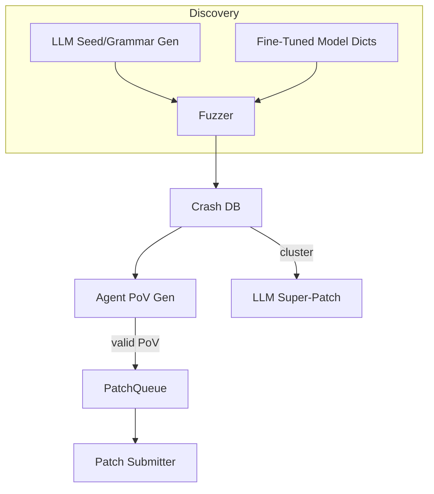

# AI-Assisted Fuzzing & Automated Vulnerability Discovery

{{#include ../banners/hacktricks-training.md}}

## Overview
Los modelos de lenguaje de gran tamaño (LLMs) pueden potenciar los pipelines de investigación de vulnerabilidades tradicionales al generar entradas semánticamente ricas, evolucionar gramáticas, razonar sobre datos de fallos e incluso proponer parches para múltiples errores. Esta página recopila los patrones más efectivos observados durante las finales del Desafío Cibernético de IA de DARPA (AIxCC) y otras investigaciones públicas.

Lo que sigue no es una descripción de un sistema de competencia específico, sino una abstracción de las técnicas para que puedas reproducirlas en tus propios flujos de trabajo.

---

## 1. LLM-Generated Seed Inputs

Los fuzzers tradicionales guiados por cobertura (AFL++, libFuzzer, Honggfuzz…) comienzan con un pequeño corpus de semillas y mutan bytes a ciegas. Cuando el formato de entrada objetivo es complejo (SQL, URLs, protocolos binarios personalizados), las mutaciones aleatorias suelen romper la sintaxis antes de que se alcancen ramas interesantes.

Los LLMs pueden resolver este problema de arranque emitiendo *generadores de semillas* – scripts cortos que producen **entradas sintácticamente correctas pero relevantes para la seguridad**. Por ejemplo:
```prompt
SYSTEM: You are a helpful security engineer.
USER:
Write a Python3 program that prints 200 unique SQL injection strings targeting common anti-pattern mistakes (missing quotes, numeric context, stacked queries).  Ensure length ≤ 256 bytes / string so they survive common length limits.
```

```python
# gen_sqli_seeds.py (truncated)
PAYLOADS = [
"1 OR 1=1 -- ",
"' UNION SELECT NULL,NULL--",
"0; DROP TABLE users;--",
...
]
for p in PAYLOADS:
print(p)
```
Ejecuta una vez y alimenta la salida directamente en el corpus inicial del fuzzer:
```bash
python3 gen_sqli_seeds.py > seeds.txt
afl-fuzz -i seeds.txt -o findings/ -- ./target @@
```
Beneficios:
1. Validez semántica → cobertura más profunda desde el principio.
2. Re-generable: ajusta el prompt para enfocarte en XSS, traversal de rutas, blobs binarios, etc.
3. Barato (< 1 ¢ con GPT-3.5).

### Consejos
* Instruye al modelo para que *diversifique* la longitud y codificación de la carga útil (UTF-8, URL-encoded, UTF-16-LE) para eludir filtros superficiales.
* Pide un *script auto-contenido único* – evita problemas de formato JSON.

---

## 2. Fuzzing de Evolución Gramatical

Una variante más poderosa es permitir que el LLM **evolucione una gramática** en lugar de semillas concretas. El flujo de trabajo (patrón "Grammar Guy") es:

1. Generar una gramática inicial de ANTLR/Peach/LibFuzzer a través de un prompt.
2. Fuzz durante N minutos y recopilar métricas de cobertura (bordes / bloques alcanzados).
3. Resumir áreas del programa no cubiertas y alimentar el resumen de nuevo al modelo:
```prompt
La gramática anterior activó el 12 % de los bordes del programa. Funciones no alcanzadas: parse_auth, handle_upload. Agrega / modifica reglas para cubrir estas.
```
4. Fusionar las nuevas reglas, re-fuzz, repetir.

Esqueleto de pseudo-código:
```python
for epoch in range(MAX_EPOCHS):
grammar = llm.refine(grammar, feedback=coverage_stats)
save(grammar, f"grammar_{epoch}.txt")
coverage_stats = run_fuzzer(grammar)
```
Puntos clave:
* Mantén un *presupuesto* – cada refinamiento utiliza tokens.
* Usa instrucciones `diff` + `patch` para que el modelo edite en lugar de reescribir.
* Detente cuando Δcoverage < ε.

---

## 3. Generación de PoV (Explotación) Basada en Agentes

Después de encontrar un fallo, aún necesitas una **prueba de vulnerabilidad (PoV)** que lo active de manera determinista.

Un enfoque escalable es generar *miles* de agentes ligeros (<process/thread/container/prisoner>), cada uno ejecutando un LLM diferente (GPT-4, Claude, Mixtral) o configuración de temperatura.

Pipeline:
1. El análisis estático/dinámico produce *candidatos a errores* (struct con PC de fallo, fragmento de entrada, mensaje de sanitizador).
2. El orquestador distribuye los candidatos a los agentes.
3. Pasos de razonamiento del agente:
a. Reproducir el error localmente con `gdb` + entrada.
b. Sugerir una carga útil de explotación mínima.
c. Validar la explotación en un sandbox. Si tiene éxito → enviar.
4. Los intentos fallidos son **re-enviados como nuevas semillas** para fuzzing de cobertura (bucle de retroalimentación).

Ventajas:
* La paralelización oculta la falta de fiabilidad de un solo agente.
* Ajuste automático de temperatura / tamaño del modelo basado en la tasa de éxito observada.

---

## 4. Fuzzing Dirigido con Modelos de Código Ajustados

Ajusta un modelo de peso abierto (por ejemplo, Llama-7B) en código fuente C/C++ etiquetado con patrones de vulnerabilidad (desbordamiento de enteros, copia de búfer, cadena de formato). Luego:

1. Ejecuta análisis estático para obtener la lista de funciones + AST.
2. Indica al modelo: *“Dame entradas de diccionario de mutación que probablemente rompan la seguridad de la memoria en la función X”*.
3. Inserta esos tokens en un `AFL_CUSTOM_MUTATOR`.

Ejemplo de salida para un envoltorio de `sprintf`:
```
{"pattern":"%99999999s"}
{"pattern":"AAAAAAAA....<1024>....%n"}
```
Empíricamente, esto reduce el tiempo hasta el fallo en más de 2× en objetivos reales.

---

## 5. Estrategias de Patching Guiadas por IA

### 5.1 Super Patches
Pida al modelo que *agrupen* las firmas de fallo y proponga un **único parche** que elimine la causa raíz común. Envíe una vez, solucione varios errores → menos penalizaciones de precisión en entornos donde cada parche incorrecto cuesta puntos.

Esquema del aviso:
```
Here are 10 stack traces + file snippets.  Identify the shared mistake and generate a unified diff fixing all occurrences.
```
### 5.2 Relación de Parche Especulativo
Implementar una cola donde los parches confirmados validados por PoV y los parches *especulativos* (sin PoV) se entrelazan en una relación de 1:​N ajustada a las reglas de puntuación (por ejemplo, 2 especulativos : 1 confirmado). Un modelo de costos monitorea las penalizaciones frente a los puntos y ajusta automáticamente N.

---

## Juntándolo Todo
Un CRS (Sistema de Razonamiento Cibernético) de extremo a extremo puede conectar los componentes de esta manera:

---

## Referencias
* [Trail of Bits – AIxCC finales: Historia del tape](https://blog.trailofbits.com/2025/08/07/aixcc-finals-tale-of-the-tape/)
* [CTF Radiooo entrevistas a finalistas de AIxCC](https://www.youtube.com/@ctfradiooo)
{{#include ../banners/hacktricks-training.md}}
