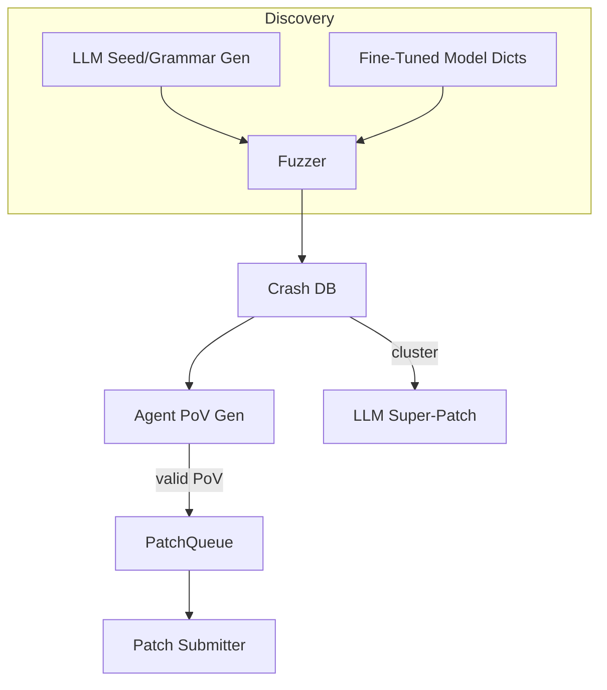

# AI-Assisted Fuzzing & Automated Vulnerability Discovery

{{#include ../banners/hacktricks-training.md}}

## Overview
Les modèles de langage de grande taille (LLMs) peuvent dynamiser les pipelines de recherche de vulnérabilités traditionnels en générant des entrées sémantiquement riches, en faisant évoluer des grammaires, en raisonnant sur les données de crash, et même en proposant des correctifs multi-bugs. Cette page collecte les modèles les plus efficaces observés lors des finales du défi cybernétique de l'IA de la DARPA (AIxCC) et d'autres recherches publiques.

Ce qui suit n'est pas une description d'un système de compétition spécifique, mais une abstraction des techniques afin que vous puissiez les reproduire dans vos propres flux de travail.

---

## 1. LLM-Generated Seed Inputs

Les fuzzers traditionnels guidés par la couverture (AFL++, libFuzzer, Honggfuzz…) commencent avec un petit corpus de graines et mutent les octets à l'aveugle. Lorsque le format d'entrée cible est complexe (SQL, URLs, protocoles binaires personnalisés), les mutations aléatoires cassent généralement la syntaxe avant d'atteindre des branches intéressantes.

Les LLMs peuvent résoudre ce problème de démarrage en émettant des *générateurs de graines* – de courts scripts qui produisent des **entrées syntaxiquement correctes mais pertinentes pour la sécurité**. Par exemple :
```prompt
SYSTEM: You are a helpful security engineer.
USER:
Write a Python3 program that prints 200 unique SQL injection strings targeting common anti-pattern mistakes (missing quotes, numeric context, stacked queries).  Ensure length ≤ 256 bytes / string so they survive common length limits.
```

```python
# gen_sqli_seeds.py (truncated)
PAYLOADS = [
"1 OR 1=1 -- ",
"' UNION SELECT NULL,NULL--",
"0; DROP TABLE users;--",
...
]
for p in PAYLOADS:
print(p)
```
Exécutez une fois et alimentez la sortie directement dans le corpus initial du fuzzer :
```bash
python3 gen_sqli_seeds.py > seeds.txt
afl-fuzz -i seeds.txt -o findings/ -- ./target @@
```
Avantages :
1. Validité sémantique → couverture plus profonde tôt.
2. Régénérable : ajustez l'invite pour se concentrer sur XSS, traversée de chemin, blobs binaires, etc.
3. Peu coûteux (< 1 ¢ avec GPT-3.5).

### Conseils
* Instruisez le modèle pour *diversifier* la longueur et l'encodage des charges utiles (UTF-8, URL-encoded, UTF-16-LE) pour contourner les filtres superficiels.
* Demandez un *script autonome unique* – évite les problèmes de formatage JSON.

---

## 2. Fuzzing par Évolution de Grammaire

Une variante plus puissante consiste à laisser le LLM **faire évoluer une grammaire** au lieu de graines concrètes. Le flux de travail (modèle "Grammar Guy") est :

1. Générer une grammaire ANTLR/Peach/LibFuzzer initiale via une invite.
2. Fuzzer pendant N minutes et collecter des métriques de couverture (bords / blocs touchés).
3. Résumer les zones du programme non couvertes et renvoyer le résumé dans le modèle :
```prompt
La grammaire précédente a déclenché 12 % des bords du programme. Fonctions non atteintes : parse_auth, handle_upload. Ajoutez / modifiez des règles pour couvrir ces points.
```
4. Fusionner les nouvelles règles, re-fuzzer, répéter.

Squelette de pseudo-code :
```python
for epoch in range(MAX_EPOCHS):
grammar = llm.refine(grammar, feedback=coverage_stats)
save(grammar, f"grammar_{epoch}.txt")
coverage_stats = run_fuzzer(grammar)
```
Points clés :
* Gardez un *budget* – chaque raffinement utilise des tokens.
* Utilisez des instructions `diff` + `patch` pour que le modèle édite plutôt que réécrive.
* Arrêtez-vous lorsque Δcoverage < ε.

---

## 3. Génération de PoV (Exploit) basée sur des agents

Après qu'un crash soit trouvé, vous avez toujours besoin d'une **preuve de vulnérabilité (PoV)** qui le déclenche de manière déterministe.

Une approche évolutive consiste à créer *des milliers* d'agents légers (<process/thread/container/prisonnier>), chacun exécutant un LLM différent (GPT-4, Claude, Mixtral) ou un réglage de température différent.

Pipeline :
1. L'analyse statique/dynamique produit des *candidats de bogue* (struct avec PC de crash, tranche d'entrée, msg de désinfection).
2. L'orchestrateur distribue les candidats aux agents.
3. Étapes de raisonnement de l'agent :
a. Reproduire le bogue localement avec `gdb` + entrée.
b. Suggérer une charge utile d'exploit minimale.
c. Valider l'exploit dans un bac à sable. Si succès → soumettre.
4. Les tentatives échouées sont **remises en file d'attente comme nouvelles graines** pour le fuzzing de couverture (boucle de rétroaction).

Avantages :
* La parallélisation cache l'instabilité d'un agent unique.
* Auto-ajustement de la température / taille du modèle basé sur le taux de succès observé.

---

## 4. Fuzzing dirigé avec des modèles de code finement ajustés

Affinez un modèle à poids ouvert (par exemple, Llama-7B) sur du code source C/C++ étiqueté avec des motifs de vulnérabilité (débordement d'entier, copie de tampon, chaîne de format). Ensuite :

1. Exécutez une analyse statique pour obtenir la liste des fonctions + AST.
2. Invitez le modèle : *“Donnez des entrées de dictionnaire de mutation susceptibles de compromettre la sécurité de la mémoire dans la fonction X”*.
3. Insérez ces tokens dans un `AFL_CUSTOM_MUTATOR`.

Exemple de sortie pour un wrapper `sprintf` :
```
{"pattern":"%99999999s"}
{"pattern":"AAAAAAAA....<1024>....%n"}
```
Empiriquement, cela réduit le temps jusqu'à l'écrasement de plus de 2× sur des cibles réelles.

---

## 5. Stratégies de Patching Guidées par l'IA

### 5.1 Super Patches
Demandez au modèle de *regrouper* les signatures de crash et de proposer un **patch unique** qui élimine la cause racine commune. Soumettez une fois, corrigez plusieurs bugs → moins de pénalités de précision dans les environnements où chaque mauvais patch coûte des points.

Plan de l'invite :
```
Here are 10 stack traces + file snippets.  Identify the shared mistake and generate a unified diff fixing all occurrences.
```
### 5.2 Ratio de Patch Spéculatif
Implémentez une file d'attente où les patches validés par PoV confirmés et les patches *spéculatifs* (sans PoV) sont entrelacés dans un ratio de 1:​N ajusté aux règles de scoring (par exemple, 2 spéculatifs : 1 confirmé). Un modèle de coût surveille les pénalités par rapport aux points et ajuste automatiquement N.

---

## Mettre le Tout Ensemble
Un CRS (Système de Raisonnement Cybernétique) de bout en bout peut câbler les composants comme ceci :

---

## Références
* [Trail of Bits – AIxCC finals: Tale of the tape](https://blog.trailofbits.com/2025/08/07/aixcc-finals-tale-of-the-tape/)
* [CTF Radiooo AIxCC finalist interviews](https://www.youtube.com/@ctfradiooo)
{{#include ../banners/hacktricks-training.md}}
