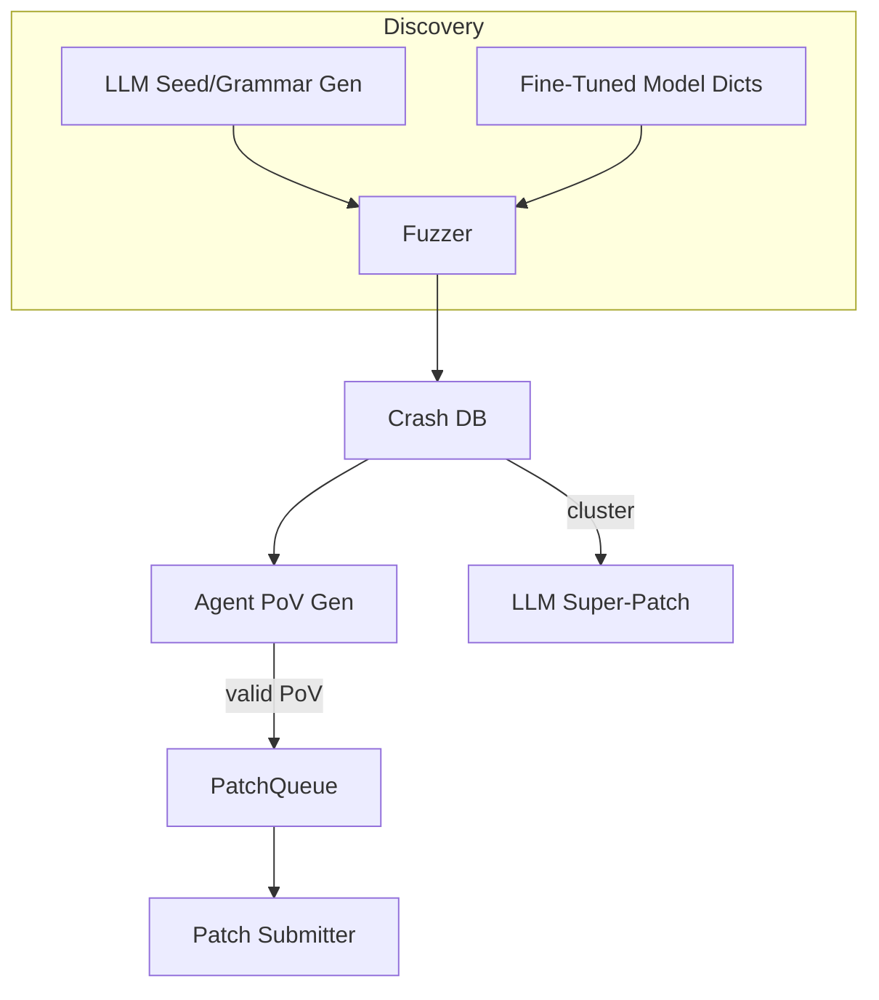

# AI-Assisted Fuzzing & Automated Vulnerability Discovery

{{#include ../banners/hacktricks-training.md}}

## Genel Bakış
Büyük dil modelleri (LLM'ler), anlamsal olarak zengin girdiler üreterek, gramerleri geliştirerek, çökme verileri üzerinde akıl yürüterek ve hatta çoklu hata yamanları önererek geleneksel zafiyet araştırma süreçlerini güçlendirebilir. Bu sayfa, DARPA'nın AI Cyber Challenge (AIxCC) finalleri ve diğer kamu araştırmaları sırasında gözlemlenen en etkili desenleri toplar.

Aşağıda, belirli bir yarışma sisteminin tanımı değil, bu tekniklerin kendi iş akışlarınızda yeniden üretilebilmesi için bir soyutlama bulunmaktadır.

---

## 1. LLM-Üretilmiş Tohum Girdileri

Geleneksel kapsama odaklı fuzzing araçları (AFL++, libFuzzer, Honggfuzz…) küçük bir tohum corpus'u ile başlar ve baytları kör bir şekilde değiştirir. Hedef girdi formatı karmaşık olduğunda (SQL, URL'ler, özel ikili protokoller) rastgele değişiklikler genellikle ilginç dallara ulaşmadan önce sözdizimini bozar.

LLM'ler, **sözdizimsel olarak doğru ancak güvenlikle ilgili girdiler** üreten *tohum üreticileri* yayarak bu başlangıç sorununu çözebilir. Örneğin:
```prompt
SYSTEM: You are a helpful security engineer.
USER:
Write a Python3 program that prints 200 unique SQL injection strings targeting common anti-pattern mistakes (missing quotes, numeric context, stacked queries).  Ensure length ≤ 256 bytes / string so they survive common length limits.
```

```python
# gen_sqli_seeds.py (truncated)
PAYLOADS = [
"1 OR 1=1 -- ",
"' UNION SELECT NULL,NULL--",
"0; DROP TABLE users;--",
...
]
for p in PAYLOADS:
print(p)
```
Bir kez çalıştırın ve çıktıyı doğrudan fuzzer'ın başlangıç korpusuna besleyin:
```bash
python3 gen_sqli_seeds.py > seeds.txt
afl-fuzz -i seeds.txt -o findings/ -- ./target @@
```
Faydalar:
1. Anlamsal geçerlilik → daha derin kapsama erken.
2. Yeniden üretilebilir: istemi XSS, yol geçişi, ikili bloblar vb. üzerine odaklanacak şekilde ayarlayın.
3. Ucuz (< 1 ¢ GPT-3.5 ile).

### İpuçları
* Modeli *çeşitlendirmesi* için yönlendirin, yük uzunluğunu ve kodlamayı (UTF-8, URL-encoded, UTF-16-LE) yüzeysel filtreleri aşmak için değiştirin.
* *Tek bir bağımsız script* isteyin – JSON formatlama sorunlarını önler.

---

## 2. Dilbilgisi-Evrim Fuzzing

Daha güçlü bir varyant, LLM'nin **bir dilbilgisi evrim geçirmesine** izin vermektir, somut tohumlar yerine. İş akışı (“Dilbilgisi Adamı” modeli) şudur:

1. İstem aracılığıyla başlangıç ANTLR/Peach/LibFuzzer dilbilgisi oluşturun.
2. N dakika fuzzing yapın ve kapsama metriklerini toplayın (kenarlar / bloklar).
3. Kapsanmayan program alanlarını özetleyin ve özeti modele geri besleyin:
```prompt
Önceki dilbilgisi program kenarlarının %12'sini tetikledi. Ulaşılamayan fonksiyonlar: parse_auth, handle_upload. Bunları kapsamak için kuralları ekleyin / değiştirin.
```
4. Yeni kuralları birleştirin, yeniden fuzzing yapın, tekrarlayın.

Pseudo-kod iskeleti:
```python
for epoch in range(MAX_EPOCHS):
grammar = llm.refine(grammar, feedback=coverage_stats)
save(grammar, f"grammar_{epoch}.txt")
coverage_stats = run_fuzzer(grammar)
```
Anahtar noktalar:
* Bir *bütçe* tutun – her iyileştirme token kullanır.
* Modelin yeniden yazmak yerine düzenlemesi için `diff` + `patch` talimatlarını kullanın.
* Δcoverage < ε olduğunda durun.

---

## 3. Ajan Tabanlı PoV (Sömürü) Üretimi

Bir çöküş bulunduğunda, onu deterministik olarak tetikleyen bir **zafiyet kanıtı (PoV)** gereklidir.

Ölçeklenebilir bir yaklaşım, her biri farklı bir LLM (GPT-4, Claude, Mixtral) veya sıcaklık ayarı çalıştıran *binlerce* hafif ajan (<process/thread/container/prisoner>) başlatmaktır.

Pipeline:
1. Statik/dinamik analiz *hata adayları* üretir (çöküş PC'si, girdi dilimi, temizleyici mesajı ile yapı).
2. Orkestratör adayları ajana dağıtır.
3. Ajan akıl yürütme adımları:
a. `gdb` + girdi ile hatayı yerel olarak yeniden üretin.
b. Minimal sömürü yükü önerin.
c. Sandboxed'de sömürüyü doğrulayın. Başarı → gönderin.
4. Başarısız denemeler, kapsama fuzzing için **yeni tohumlar olarak yeniden sıraya alınır** (geri bildirim döngüsü).

Avantajlar:
* Paralelleştirme, tek ajanın güvenilmezliğini gizler.
* Gözlemlenen başarı oranına dayalı olarak sıcaklık/model boyutunun otomatik ayarı.

---

## 4. İnce Ayarlanmış Kod Modelleri ile Yönlendirilmiş Fuzzing

Bir açık ağırlık modelini (örneğin, Llama-7B) zafiyet desenleri (tam sayı taşması, tampon kopyalama, format dizesi) ile etiketlenmiş C/C++ kaynak kodu üzerinde ince ayar yapın. Sonra:

1. Fonksiyon listesi + AST almak için statik analizi çalıştırın.
2. Modeli yönlendirin: *“Fonksiyon X'de bellek güvenliğini bozma olasılığı yüksek olan mutasyon sözlüğü girişlerini ver”*.
3. Bu token'ları özel bir `AFL_CUSTOM_MUTATOR` içine yerleştirin.

Bir `sprintf` sarmalayıcı için örnek çıktı:
```
{"pattern":"%99999999s"}
{"pattern":"AAAAAAAA....<1024>....%n"}
```
Deneysel olarak, bu gerçek hedeflerde çökme süresini >2× oranında kısaltır.

---

## 5. AI-Guided Patching Strategies

### 5.1 Super Patches
Modelden çökme imzalarını *kümelemeyi* ve ortak kök nedeni ortadan kaldıran **tek bir yamanın** önerilmesini isteyin. Bir kez gönderin, birkaç hatayı düzeltin → her yanlış yamanın puan kaybettirdiği ortamlarda daha az doğruluk cezası. 

Prompt outline:
```
Here are 10 stack traces + file snippets.  Identify the shared mistake and generate a unified diff fixing all occurrences.
```
### 5.2 Spekülatif Yaman Oranı
Onaylanmış PoV doğrulamalı yamalar ve *spekülatif* yamaların (PoV yok) 1:​N oranında, puanlama kurallarına göre ayarlanmış bir kuyrukta birleştirildiği bir sistem uygulayın (örneğin, 2 spekülatif : 1 onaylı). Bir maliyet modeli, ceza ve puanları izler ve N'yi otomatik olarak ayarlar.

---

## Hepsini Bir Araya Getirmek
Bir uçtan uca CRS (Siber Akıl Yürütme Sistemi) bileşenleri şu şekilde bağlayabilir:

---

## Referanslar
* [Trail of Bits – AIxCC finalleri: Kayıtların Hikayesi](https://blog.trailofbits.com/2025/08/07/aixcc-finals-tale-of-the-tape/)
* [CTF Radiooo AIxCC finalist röportajları](https://www.youtube.com/@ctfradiooo)
{{#include ../banners/hacktricks-training.md}}
