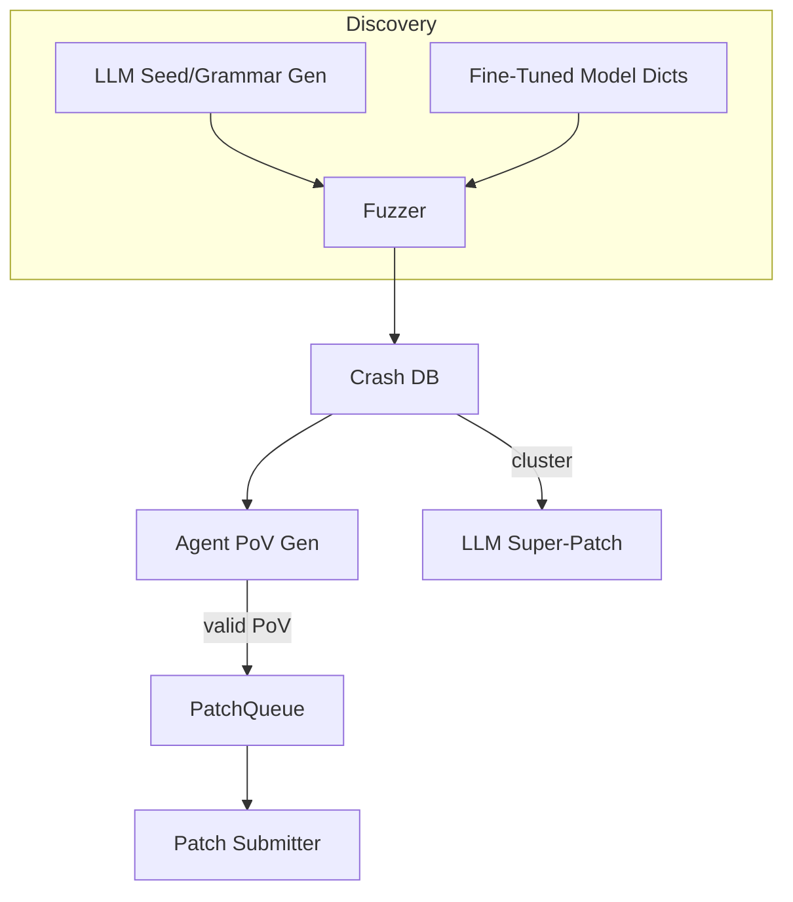

# AI-Assisted Fuzzing & Automated Vulnerability Discovery

{{#include ../banners/hacktricks-training.md}}

## 概要
大規模言語モデル（LLM）は、意味的に豊かな入力を生成し、文法を進化させ、クラッシュデータを推論し、さらには複数のバグ修正を提案することで、従来の脆弱性研究パイプラインを強化できます。このページでは、DARPAのAIサイバー挑戦（AIxCC）ファイナルやその他の公的研究で観察された最も効果的なパターンを集めています。

以下は、特定の競技システムの説明ではなく、これらの技術を自分のワークフローで再現できるように抽象化したものです。

---

## 1. LLM生成のシード入力

従来のカバレッジガイド付きファジングツール（AFL++、libFuzzer、Honggfuzz…）は、小さなシードのコーパスから始まり、バイトを盲目的に変異させます。ターゲット入力形式が複雑（SQL、URL、カスタムバイナリプロトコル）な場合、ランダムな変異は通常、興味深い分岐に到達する前に構文を壊してしまいます。

LLMは、**構文的に正しいがセキュリティに関連する入力**を出力する短いスクリプトである*シードジェネレーター*を発生させることで、このブートストラップ問題を解決できます。例えば：
```prompt
SYSTEM: You are a helpful security engineer.
USER:
Write a Python3 program that prints 200 unique SQL injection strings targeting common anti-pattern mistakes (missing quotes, numeric context, stacked queries).  Ensure length ≤ 256 bytes / string so they survive common length limits.
```

```python
# gen_sqli_seeds.py (truncated)
PAYLOADS = [
"1 OR 1=1 -- ",
"' UNION SELECT NULL,NULL--",
"0; DROP TABLE users;--",
...
]
for p in PAYLOADS:
print(p)
```
一度実行し、出力を直接ファズァの初期コーパスにフィードします:
```bash
python3 gen_sqli_seeds.py > seeds.txt
afl-fuzz -i seeds.txt -o findings/ -- ./target @@
```
Benefits:
1. セマンティックの妥当性 → 早期により深いカバレッジ。
2. 再生成可能: プロンプトを調整してXSS、パス・トラバーサル、バイナリ・ブロブなどに焦点を当てる。
3. 安価 (< 1 ¢ with GPT-3.5)。

### Tips
* モデルにペイロードの長さとエンコーディング（UTF-8、URLエンコード、UTF-16-LE）を*多様化*するよう指示して、表面的なフィルターを回避する。
* *単一の自己完結型スクリプト*を要求する – JSONフォーマットの問題を避ける。

---

## 2. 文法進化ファジング

より強力なバリアントは、具体的なシードの代わりにLLMに**文法を進化させる**ことです。 ワークフロー（「Grammar Guy」パターン）は次のとおりです：

1. プロンプトを介して初期のANTLR/Peach/LibFuzzer文法を生成する。
2. N分間ファジングを行い、カバレッジメトリクス（ヒットしたエッジ/ブロック）を収集する。
3. 未カバーのプログラム領域を要約し、その要約をモデルにフィードバックする：
```prompt
前の文法はプログラムのエッジの12%をトリガーしました。 到達していない関数: parse_auth, handle_upload。 これらをカバーするためにルールを追加/修正してください。
```
4. 新しいルールをマージし、再ファジングし、繰り返す。

擬似コードのスケルトン：
```python
for epoch in range(MAX_EPOCHS):
grammar = llm.refine(grammar, feedback=coverage_stats)
save(grammar, f"grammar_{epoch}.txt")
coverage_stats = run_fuzzer(grammar)
```
重要なポイント:
* *予算*を維持する – 各リファインメントはトークンを使用します。
* モデルが書き直すのではなく編集するように、`diff` + `patch` 指示を使用します。
* Δカバレッジ < ε の場合は停止します。

---

## 3. エージェントベースのPoV（エクスプロイト）生成

クラッシュが見つかった後、決定論的にそれを引き起こす**脆弱性の証明（PoV）**が必要です。

スケーラブルなアプローチは、*数千*の軽量エージェント（<process/thread/container/prisoner>）を生成し、それぞれが異なるLLM（GPT-4、Claude、Mixtral）または温度設定を実行することです。

パイプライン:
1. 静的/動的分析が*バグ候補*（クラッシュPC、入力スライス、サニタイザーメッセージを含む構造体）を生成します。
2. オーケストレーターが候補をエージェントに配布します。
3. エージェントの推論ステップ:
a. `gdb` + 入力を使用してローカルでバグを再現します。
b. 最小限のエクスプロイトペイロードを提案します。
c. サンドボックスでエクスプロイトを検証します。成功した場合 → 提出します。
4. 失敗した試みは**カバレッジファジングの新しいシードとして再キュー**されます（フィードバックループ）。

利点:
* 並列化は単一エージェントの信頼性の低さを隠します。
* 観察された成功率に基づいて温度/モデルサイズの自動調整。

---

## 4. 微調整されたコードモデルによる指向ファジング

脆弱性パターン（整数オーバーフロー、バッファコピー、フォーマット文字列）でラベル付けされたC/C++ソース上でオープンウェイトモデル（例: Llama-7B）を微調整します。その後:

1. 静的分析を実行して関数リスト + ASTを取得します。
2. モデルにプロンプト: *“関数Xでメモリ安全性を破る可能性のある変異辞書エントリを提供してください”*。
3. それらのトークンをカスタム`AFL_CUSTOM_MUTATOR`に挿入します。

`sprintf`ラッパーの例出力:
```
{"pattern":"%99999999s"}
{"pattern":"AAAAAAAA....<1024>....%n"}
```
経験的に、これは実際のターゲットでのクラッシュまでの時間を>2倍短縮します。

---

## 5. AI-Guided Patching Strategies

### 5.1 Super Patches
モデルにクラッシュシグネチャを*クラスタリング*させ、共通の根本原因を取り除く**単一のパッチ**を提案させます。 一度提出し、複数のバグを修正 → 各誤ったパッチがポイントを失う環境での精度ペナルティを減らします。

プロンプトの概要:
```
Here are 10 stack traces + file snippets.  Identify the shared mistake and generate a unified diff fixing all occurrences.
```
### 5.2 推測パッチ比率
確認済みのPoV検証パッチと*推測的*パッチ（PoVなし）を、スコアリングルールに調整された1:​N比率で交互に配置するキューを実装します（例：2つの推測的パッチ : 1つの確認済みパッチ）。コストモデルはペナルティとポイントを監視し、Nを自己調整します。

---

## すべてをまとめる
エンドツーエンドのCRS（サイバー推論システム）は、コンポーネントを次のように接続することができます：

---

## 参考文献
* [Trail of Bits – AIxCCファイナル: テープの物語](https://blog.trailofbits.com/2025/08/07/aixcc-finals-tale-of-the-tape/)
* [CTF Radiooo AIxCCファイナリストインタビュー](https://www.youtube.com/@ctfradiooo)
{{#include ../banners/hacktricks-training.md}}
