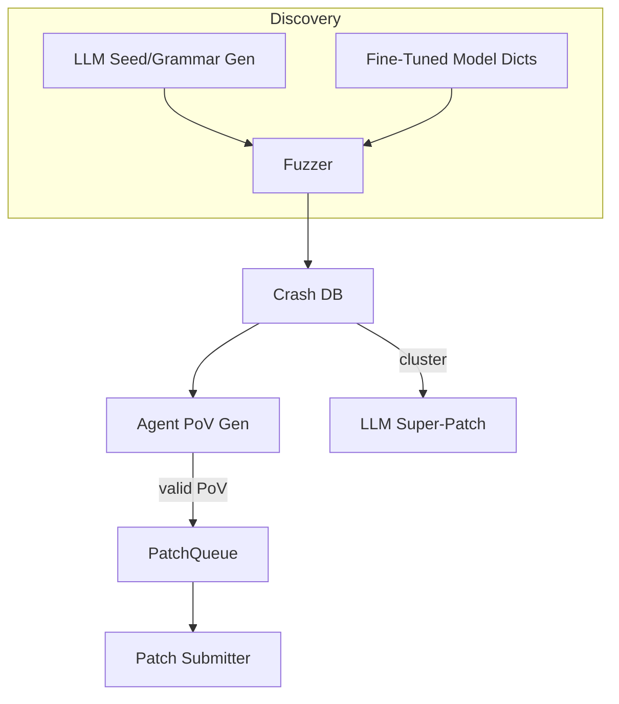

# AI-Assisted Fuzzing & Automated Vulnerability Discovery

{{#include ../banners/hacktricks-training.md}}

## Overview
Τα μεγάλα γλωσσικά μοντέλα (LLMs) μπορούν να ενισχύσουν τις παραδοσιακές διαδικασίες έρευνας ευπαθειών δημιουργώντας σημασιολογικά πλούσιες εισόδους, εξελίσσοντας γραμματικές, λογίζοντας πάνω σε δεδομένα κρασάρισματος και ακόμη προτείνοντας διορθώσεις πολλαπλών σφαλμάτων. Αυτή η σελίδα συγκεντρώνει τα πιο αποτελεσματικά μοτίβα που παρατηρήθηκαν κατά τη διάρκεια του τελικού του AI Cyber Challenge (AIxCC) της DARPA και άλλων δημόσιων ερευνών.

Αυτό που ακολουθεί δεν είναι μια περιγραφή ενός συγκεκριμένου συστήματος διαγωνισμού, αλλά μια αφαίρεση των τεχνικών ώστε να μπορείτε να τις αναπαράγετε στις δικές σας ροές εργασίας.

---

## 1. LLM-Generated Seed Inputs

Οι παραδοσιακοί fuzzers με καθοδήγηση κάλυψης (AFL++, libFuzzer, Honggfuzz…) ξεκινούν με ένα μικρό σώμα σπόρων και μεταλλάσσουν τα bytes τυφλά. Όταν η στοχευμένη μορφή εισόδου είναι περίπλοκη (SQL, URLs, προσαρμοσμένα δυαδικά πρωτόκολλα), οι τυχαίες μεταλλάξεις συνήθως σπάνε τη σύνταξη πριν φτάσουν σε ενδιαφέροντα κλαδιά.

Τα LLMs μπορούν να λύσουν αυτό το πρόβλημα εκκίνησης εκδίδοντας *seed generators* – σύντομες σκριπτάκια που παράγουν **σύνταξη-σωστές αλλά σχετικές με την ασφάλεια εισόδους**. Για παράδειγμα:
```prompt
SYSTEM: You are a helpful security engineer.
USER:
Write a Python3 program that prints 200 unique SQL injection strings targeting common anti-pattern mistakes (missing quotes, numeric context, stacked queries).  Ensure length ≤ 256 bytes / string so they survive common length limits.
```

```python
# gen_sqli_seeds.py (truncated)
PAYLOADS = [
"1 OR 1=1 -- ",
"' UNION SELECT NULL,NULL--",
"0; DROP TABLE users;--",
...
]
for p in PAYLOADS:
print(p)
```
Εκτελέστε το μία φορά και τροφοδοτήστε την έξοδο απευθείας στο αρχικό σώμα του fuzzer:
```bash
python3 gen_sqli_seeds.py > seeds.txt
afl-fuzz -i seeds.txt -o findings/ -- ./target @@
```
Οφέλη:
1. Σημασιολογική εγκυρότητα → βαθύτερη κάλυψη νωρίς.
2. Αναγεννήσιμο: προσαρμόστε την προτροπή για να εστιάσετε σε XSS, διαδρομή πλοήγησης, δυαδικά blobs, κ.λπ.
3. Φθηνό (< 1 ¢ με GPT-3.5).

### Συμβουλές
* Δώστε οδηγίες στο μοντέλο να *ποικίλει* το μήκος και την κωδικοποίηση του payload (UTF-8, URL-encoded, UTF-16-LE) για να παρακάμψει επιφανειακά φίλτρα.
* Ζητήστε ένα *μοναδικό αυτοτελές σενάριο* – αποφεύγει προβλήματα μορφοποίησης JSON.

---

## 2. Fuzzing Γραμματικής-Εξέλιξης

Μια πιο ισχυρή παραλλαγή είναι να επιτρέψετε στο LLM **να εξελίξει μια γραμματική** αντί για συγκεκριμένους σπόρους. Η ροή εργασίας (“Grammar Guy” pattern) είναι:

1. Δημιουργήστε μια αρχική γραμματική ANTLR/Peach/LibFuzzer μέσω προτροπής.
2. Fuzz για N λεπτά και συλλέξτε μετρήσεις κάλυψης (άκρες / μπλοκ που χτυπήθηκαν).
3. Συνοψίστε τις περιοχές του προγράμματος που δεν καλύφθηκαν και τροφοδοτήστε τη σύνοψη πίσω στο μοντέλο:
```prompt
Η προηγούμενη γραμματική ενεργοποίησε το 12 % των άκρων του προγράμματος. Λειτουργίες που δεν επιτεύχθηκαν: parse_auth, handle_upload. Προσθέστε / τροποποιήστε κανόνες για να καλύψετε αυτά.
```
4. Συγχωνεύστε τους νέους κανόνες, ξανα-fuzz, επαναλάβετε.

Ψευδοκώδικας σκελετού:
```python
for epoch in range(MAX_EPOCHS):
grammar = llm.refine(grammar, feedback=coverage_stats)
save(grammar, f"grammar_{epoch}.txt")
coverage_stats = run_fuzzer(grammar)
```
Key points:
* Διατηρήστε έναν *προϋπολογισμό* – κάθε βελτίωση χρησιμοποιεί tokens.
* Χρησιμοποιήστε `diff` + `patch` οδηγίες ώστε το μοντέλο να επεξεργάζεται αντί να ξαναγράφει.
* Σταματήστε όταν Δκάλυψη < ε.

---

## 3. Δημιουργία PoV (Εκμετάλλευση) με Βάση Πράκτορες

Αφού βρείτε μια κατάρρευση, χρειάζεστε ακόμα μια **απόδειξη ευπάθειας (PoV)** που να την ενεργοποιεί με καθοριστικό τρόπο.

Μια κλιμακούμενη προσέγγιση είναι να δημιουργήσετε *χιλιάδες* ελαφρούς πράκτορες (<process/thread/container/prisoner>), καθένας τρέχοντας διαφορετικό LLM (GPT-4, Claude, Mixtral) ή ρύθμιση θερμοκρασίας.

Pipeline:
1. Στατική/δυναμική ανάλυση παράγει *υποψήφιους σφαλμάτων* (struct με PC κατάρρευσης, κομμάτι εισόδου, μήνυμα απολύμανσης).
2. Οργανωτής διανέμει τους υποψήφιους στους πράκτορες.
3. Βήματα λογικής πράκτορα:
a. Αναπαραγωγή σφάλματος τοπικά με `gdb` + είσοδο.
b. Προτάστε ελάχιστο payload εκμετάλλευσης.
c. Επικυρώστε την εκμετάλλευση σε sandbox. Αν είναι επιτυχής → υποβάλετε.
4. Αποτυχημένες προσπάθειες **ξανα-ουράρονται ως νέοι σπόροι** για κάλυψη fuzzing (κύκλος ανατροφοδότησης).

Πλεονεκτήματα:
* Η παράλληλη εκτέλεση κρύβει την αναξιοπιστία του μεμονωμένου πράκτορα.
* Αυτόματη ρύθμιση της θερμοκρασίας / μεγέθους μοντέλου με βάση το παρατηρούμενο ποσοστό επιτυχίας.

---

## 4. Κατευθυνόμενο Fuzzing με Λεπτομερώς Ρυθμισμένα Μοντέλα Κώδικα

Λεπτομερώς ρυθμίστε ένα μοντέλο ανοιχτού βάρους (π.χ. Llama-7B) σε πηγαίο κώδικα C/C++ με ετικέτες που περιέχουν μοτίβα ευπάθειας (υπερχείλιση ακέραιου, αντιγραφή buffer, μορφοποιημένη συμβολοσειρά). Στη συνέχεια:

1. Εκτελέστε στατική ανάλυση για να αποκτήσετε λίστα συναρτήσεων + AST.
2. Προτροπή μοντέλου: *“Δώστε καταχωρήσεις λεξικού μεταλλάξεων που είναι πιθανό να σπάσουν την ασφάλεια μνήμης στη συνάρτηση X”*.
3. Εισάγετε αυτούς τους tokens σε ένα προσαρμοσμένο `AFL_CUSTOM_MUTATOR`.

Παράδειγμα εξόδου για έναν περιτύλιγμα `sprintf`:
```
{"pattern":"%99999999s"}
{"pattern":"AAAAAAAA....<1024>....%n"}
```
Εμπειρικά, αυτό μειώνει τον χρόνο μέχρι την κατάρρευση κατά >2× σε πραγματικούς στόχους.

---

## 5. Στρατηγικές Διόρθωσης με Καθοδήγηση AI

### 5.1 Σούπερ Διορθώσεις
Ζητήστε από το μοντέλο να *ομαδοποιήσει* τις υπογραφές κατάρρευσης και να προτείνει μια **μοναδική διόρθωση** που αφαιρεί την κοινή ρίζα αιτίας. Υποβάλετε μία φορά, διορθώστε αρκετά σφάλματα → λιγότερες ποινές ακρίβειας σε περιβάλλοντα όπου κάθε λάθος διόρθωση κοστίζει πόντους.

Σκίτσο προτροπής:
```
Here are 10 stack traces + file snippets.  Identify the shared mistake and generate a unified diff fixing all occurrences.
```
### 5.2 Αναλογία Υποθετικών Επιδιορθώσεων
Εφαρμόστε μια ουρά όπου οι επιβεβαιωμένες επιδιορθώσεις που έχουν επικυρωθεί με PoV και οι *υποθετικές* επιδιορθώσεις (χωρίς PoV) εναλλάσσονται σε αναλογία 1:​N προσαρμοσμένη στους κανόνες βαθμολόγησης (π.χ. 2 υποθετικές : 1 επιβεβαιωμένη). Ένα μοντέλο κόστους παρακολουθεί τις ποινές σε σχέση με τους πόντους και αυτορυθμίζεται το N.

---

## Συγκεντρώνοντας Όλα Μαζί
Ένα end-to-end CRS (Cyber Reasoning System) μπορεί να συνδέσει τα στοιχεία όπως αυτό:

---

## Αναφορές
* [Trail of Bits – AIxCC τελικοί: Ιστορία της ταινίας](https://blog.trailofbits.com/2025/08/07/aixcc-finals-tale-of-the-tape/)
* [CTF Radiooo συνεντεύξεις φιναλίστ AIxCC](https://www.youtube.com/@ctfradiooo)
{{#include ../banners/hacktricks-training.md}}
