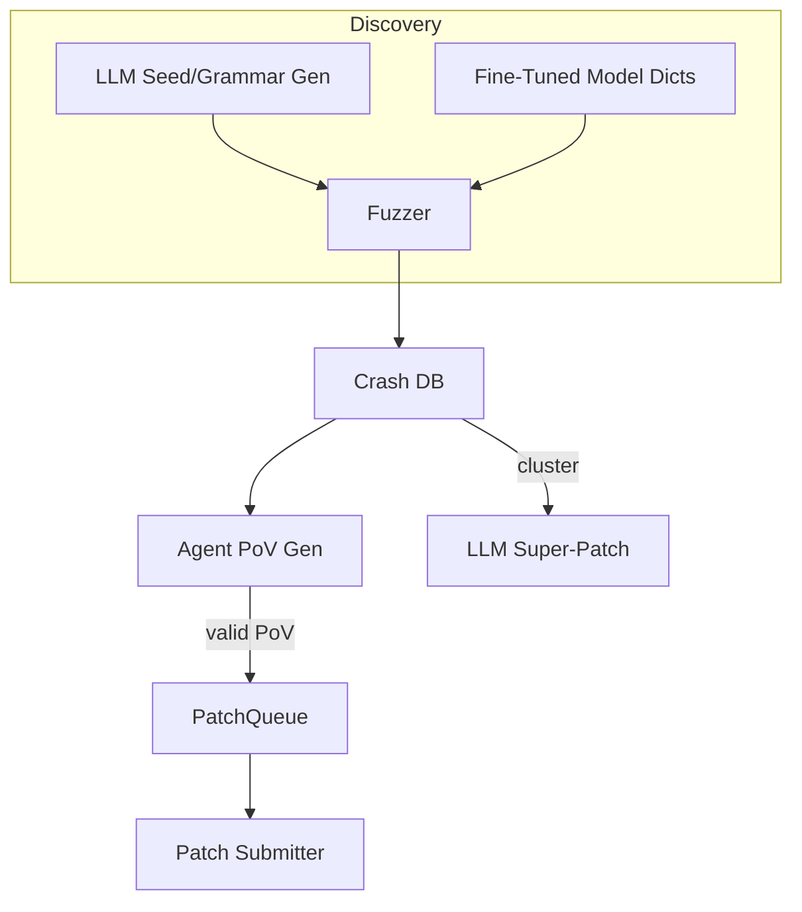

# AI-Assisted Fuzzing & Automated Vulnerability Discovery

{{#include ../banners/hacktricks-training.md}}

## Overview
Large-language models (LLM) mogą znacznie zwiększyć skuteczność tradycyjnych pipeline'ów vulnerability research, generując semantycznie bogate dane wejściowe, rozwijając gramatyki, analizując dane o crashach, a nawet proponując multi-bug patches. Ta strona przedstawia najbardziej efektywne wzorce zaobserwowane podczas finałów DARPA’s AI Cyber Challenge (AIxCC) oraz w innych publicznych badaniach.

Poniższy opis nie dotyczy konkretnego systemu używanego w jednym konkursie, lecz stanowi abstrakcję technik, dzięki której można odtworzyć je we własnych workflow.

---

## 1. LLM-Generated Seed Inputs

Tradycyjne coverage-guided fuzzers (AFL++, libFuzzer, Honggfuzz…) rozpoczynają pracę od niewielkiego corpus seeds i ślepo mutują bajty. Gdy format danych wejściowych celu jest złożony (SQL, URLs, custom binary protocols), losowe mutacje zwykle niszczą składnię, zanim zostaną osiągnięte interesujące branche.

LLM mogą rozwiązać ten problem inicjalizacji, generując *seed generators* – krótkie skrypty, które zwracają **syntax-correct but security-relevant inputs**. Na przykład:
```prompt
SYSTEM: You are a helpful security engineer.
USER:
Write a Python3 program that prints 200 unique SQL injection strings targeting common anti-pattern mistakes (missing quotes, numeric context, stacked queries).  Ensure length ≤ 256 bytes / string so they survive common length limits.
```

```python
# gen_sqli_seeds.py (truncated)
PAYLOADS = [
"1 OR 1=1 -- ",
"' UNION SELECT NULL,NULL--",
"0; DROP TABLE users;--",
...
]
for p in PAYLOADS:
print(p)
```
Uruchom raz i przekaż dane wyjściowe bezpośrednio do początkowego korpusu fuzzera:
```bash
python3 gen_sqli_seeds.py > seeds.txt
afl-fuzz -i seeds.txt -o findings/ -- ./target @@
```
Korzyści:
1. Poprawność semantyczna → głębsze pokrycie na wczesnym etapie.
2. Możliwość ponownego generowania: dostosuj prompt, aby skupić się na XSS, path traversal, binary blobs itp.
3. Niski koszt (< 1 ¢ z GPT-3.5).

### Wskazówki
* Poleć modelowi *zróżnicowanie* długości i kodowania payloadów (UTF-8, URL-encoded, UTF-16-LE), aby ominąć powierzchowne filtry.
* Poproś o *pojedynczy, samodzielny skrypt* – pozwala uniknąć problemów z formatowaniem JSON.

---

## 2. Grammar-Evolution Fuzzing

Bardziej zaawansowany wariant polega na tym, aby pozwolić LLM-owi **ewoluować gramatykę**, zamiast tworzyć konkretne seeds. Workflow (wzorzec „Grammar Guy”) wygląda następująco:

1. Wygeneruj początkową gramatykę ANTLR/Peach/LibFuzzer za pomocą promptu.
2. Przeprowadzaj fuzzing przez N minut i zbieraj metryki coverage (trafione edges / blocks).
3. Podsumuj niepokryte obszary programu i przekaż podsumowanie z powrotem do modelu:
```prompt
The previous grammar triggered 12 % of the program edges.  Functions not reached: parse_auth, handle_upload.  Add / modify rules to cover these.
```
4. Połącz nowe reguły, ponownie uruchom fuzzing i powtarzaj.

Szkielet pseudokodu:
```python
for epoch in range(MAX_EPOCHS):
grammar = llm.refine(grammar, feedback=coverage_stats)
save(grammar, f"grammar_{epoch}.txt")
coverage_stats = run_fuzzer(grammar)
```
Najważniejsze punkty:
* Zachowaj *budżet* – każde udoskonalenie zużywa tokeny.
* Używaj instrukcji `diff` + `patch`, aby model edytował kod zamiast go przepisywać.
* Zatrzymaj się, gdy Δcoverage < ε.

---

## 3. Generowanie PoV (Exploit) oparte na agentach

Po znalezieniu crasha nadal potrzebujesz **proof-of-vulnerability (PoV)**, który deterministycznie go wywołuje.

Skalowalne podejście polega na uruchomieniu *tysięcy* lekkich agentów (<process/thread/container/prisoner>), z których każdy korzysta z innego LLM (GPT-4, Claude, Mixtral) lub innego ustawienia temperatury.

Pipeline:
1. Analiza statyczna/dynamiczna generuje *kandydatów błędów* (struct z adresem crash PC, wycinkiem inputu i komunikatem sanitizera).
2. Orchestrator rozdziela kandydatów między agentów.
3. Kroki rozumowania agenta:
a. Odtwórz błąd lokalnie za pomocą `gdb` + inputu.
b. Zaproponuj minimalny exploit payload.
c. Zweryfikuj exploit w sandboxie.  Jeśli się powiedzie → prześlij.
4. Nieudane próby są **ponownie kolejkowane jako nowe seedy** do coverage fuzzingu (pętla feedbacku).

Zalety:
* Równoległość ukrywa zawodność pojedynczego agenta.
* Automatyczne dostrajanie temperatury / rozmiaru modelu na podstawie obserwowanego wskaźnika sukcesu.

---

## 4. Directed Fuzzing z dostrojonymi modelami kodu

Dostrój model open-weight (np. Llama-7B) na kodzie źródłowym C/C++ oznaczonym wzorcami podatności (integer overflow, buffer copy, format string).  Następnie:

1. Uruchom analizę statyczną, aby uzyskać listę funkcji + AST.
2. Wyślij do modelu prompt: *„Podaj wpisy słownika mutacji, które prawdopodobnie naruszą memory safety w funkcji X”*.
3. Wstaw te tokeny do niestandardowego `AFL_CUSTOM_MUTATOR`.

Przykładowy output dla wrappera `sprintf`:
```
{"pattern":"%99999999s"}
{"pattern":"AAAAAAAA....<1024>....%n"}
```
Empirycznie skraca to time-to-crash ponad 2-krotnie na rzeczywistych celach.

---

## 5. Strategie patchowania wspomaganego przez AI

### 5.1 Super Patches
Poproś model o *klastrowanie* sygnatur crashy i zaproponowanie **pojedynczego patcha**, który usuwa wspólną przyczynę źródłową. Prześlij go raz, napraw kilka bugów → mniej kar za accuracy w środowiskach, w których każdy błędny patch kosztuje punkty.

Zarys promptu:
```
Here are 10 stack traces + file snippets.  Identify the shared mistake and generate a unified diff fixing all occurrences.
```
### 5.2 Współczynnik Speculative Patch
Zaimplementuj kolejkę, w której potwierdzone patche zwalidowane za pomocą PoV oraz *speculative* patche (bez PoV) są przeplatane w proporcji 1:​N dostosowanej do zasad scoringu (np. 2 speculative : 1 confirmed). Model kosztów monitoruje kary względem punktów i automatycznie dostosowuje N.

---

## 6. Deterministic File-by-File AI Code Review

Częstym trybem niepowodzenia w AI-assisted review jest poproszenie jednego agenta o przeanalizowanie całego repozytorium i nadzieja, że wybierze właściwe pliki oraz odpowiednie terminy grep. Bardziej niezawodny wzorzec to **wymuszenie pokrycia repozytorium**:

1. Wylicz pliki źródłowe.
2. Wysyłaj **po jednym pliku naraz** wraz z minimalnym kontekstem (entrypoint, importy, pobliskie routes/callers).
3. Wymagaj **ustrukturyzowanego raportu** dla każdego pliku: sources, sink, brakująca walidacja, warunki wstępne exploita oraz confidence.
4. Usuwaj duplikaty raportów według wzorca **source→sink** i ręcznie weryfikuj te o wysokim ryzyku.

To podejście zużywa dużo tokenów i generuje szum, ale jest bardzo skuteczne w wykrywaniu **prostych błędów source/sink o dużym wpływie**, które często umykają podczas szerokich agentic review.

### Wzorce triage, które warto priorytetyzować

- **Dynamiczne dołączanie/dispatch w PHP**: kontrolowane przez attackera nazwy route/controller/module przepływające do `require_once()`, `include()` lub `include_once()` bez ścisłego allowlistingu i path canonicalisation.
- **Shell execution w workflows administratora/konta**: usernames, domeny, konta FTP lub inne identyfikatory trafiające do `exec()`, `system()`, `shell_exec()`, `passthru()`, `proc_open()` lub `popen()`.
- **Structured input fan-in**: ten sam parametr akceptowany z `$_GET`, `$_POST`, JSON, XML lub framework body parsers, a następnie ponownie używany w filesystem albo OS-command sinks.

### Dwie praktyczne klasy błędów, które ta metoda dobrze wykrywa

- **PHP controller-dispatch LFI/RCE**: jeśli kontrolowana przez request nazwa controllera jest łączona z `require_once()` bez allowlisty/path normalisation, sekwencje traversal, takie jak `../`, mogą sprawić, że PHP dołączy niezamierzony lokalny plik `.php`. Jeśli attacker może wskazać umieszczony przez siebie lub w inny sposób użyteczny plik PHP, LFI przechodzi w code execution. Zobacz [File Inclusion / Path Traversal](../pentesting-web/file-inclusion/README.md).
- **Authenticated command injection w panelach hostingowych/admin**: jeśli pola zarządzania kontem, takie jak usernames, są osadzane w shell commands, uwierzytelniony user o niskich uprawnieniach może zmienić zwykłą akcję create/delete w RCE. Skutek jest poważniejszy, gdy panel wykonuje command jako bardziej uprzywilejowane service account. Zobacz [Command Injection](../pentesting-web/command-injection.md).

### Praktyczne uwagi dotyczące review

- Używaj LLM najpierw jako **source/sink reviewer**, a nie generatora exploitów.
- Poproś go o wyraźne wskazanie **pola kontrolowanego przez attackera**, **luki w normalisation/validation** oraz **niebezpiecznego sink**.
- W przypadku dużych repozytoriów deterministic per-file review jest często bardziej niezawodny niż pojedynczy autonomous agent run, nawet jeśli ten drugi korzysta z silniejszego modelu.
- Oczekuj słabszych wyników w przypadku **Broken Access Control** i innych błędów business logic, w których exploitability zależy od założeń obejmujących wiele plików, semantyki ról lub threat models specyficznych dla produktu.

---

## Putting It All Together
End-to-end CRS (Cyber Reasoning System) może połączyć komponenty w następujący sposób:

```mermaid
graph TD
subgraph Discovery
A[LLM Seed/Grammar Gen] --> B[Fuzzer]
C[Fine-Tuned Model Dicts] --> B
end
B --> D[Crash DB]
D --> E[Agent PoV Gen]
E -->|valid PoV| PatchQueue
D -->|cluster| F[LLM Super-Patch]
PatchQueue --> G[Patch Submitter]
```
---

## Referencje
* [Project Black - Lokalna AI do cyberbezpieczeństwa: znajdowanie LFI w phpIPAM i uwierzytelnionego RCE w myVesta](https://projectblack.io/blog/local-ai-for-cyber-security)
* [Strix](https://github.com/usestrix/strix)
* [Umiejętność security-review społeczności GitHub Copilot](https://github.com/github/awesome-copilot/blob/main/skills/security-review/SKILL.md)
* [Trail of Bits – finały AIxCC: historia rywalizacji](https://blog.trailofbits.com/2025/08/07/aixcc-finals-tale-of-the-tape/)
* [Wywiady z finalistami CTF Radiooo AIxCC](https://www.youtube.com/@ctfradiooo)
{{#include ../banners/hacktricks-training.md}}
