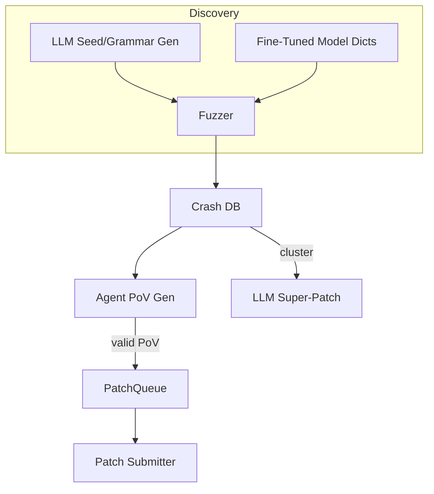

# Fuzzing Inayosaidiwa na AI na Ugunduzi wa Kiotomatiki wa Vulnerability

{{#include ../banners/hacktricks-training.md}}

## Muhtasari
Large-language models (LLMs) zinaweza kuongeza kwa kiasi kikubwa ufanisi wa pipeline za jadi za utafiti wa vulnerability kwa kuzalisha inputs zenye maana ya kisemantiki, kuboresha grammars, kufanya reasoning kuhusu data ya crashes, na hata kupendekeza patches zinazoshughulikia bugs nyingi. Ukurasa huu unakusanya mifumo bora zaidi iliyobainika wakati wa fainali za DARPA’s AI Cyber Challenge (AIxCC) na tafiti nyingine za umma.

Yafuatayo si maelezo ya mfumo mmoja mahususi wa mashindano, bali ni muhtasari wa techniques ili uweze kuzitumia tena katika workflows zako mwenyewe.

---

## 1. LLM-Generated Seed Inputs

Traditional coverage–guided fuzzers (AFL++, libFuzzer, Honggfuzz…) huanza na corpus ndogo ya seeds na kubadilisha bytes bila kuzingatia maana. Input format inapokuwa changamano (SQL, URLs, custom binary protocols), mutations za nasibu kwa kawaida huharibu syntax kabla ya kufikiwa kwa branches zinazovutia.

LLMs zinaweza kutatua tatizo hili la kuanzisha mchakato kwa kutoa *seed generators* – scripts fupi zinazotoa **inputs zenye syntax sahihi lakini zinazohusiana na usalama**. Kwa mfano:
```prompt
SYSTEM: You are a helpful security engineer.
USER:
Write a Python3 program that prints 200 unique SQL injection strings targeting common anti-pattern mistakes (missing quotes, numeric context, stacked queries).  Ensure length ≤ 256 bytes / string so they survive common length limits.
```

```python
# gen_sqli_seeds.py (truncated)
PAYLOADS = [
"1 OR 1=1 -- ",
"' UNION SELECT NULL,NULL--",
"0; DROP TABLE users;--",
...
]
for p in PAYLOADS:
print(p)
```
Endesha mara moja na uingize output moja kwa moja kwenye initial corpus ya fuzzer:
```bash
python3 gen_sqli_seeds.py > seeds.txt
afl-fuzz -i seeds.txt -o findings/ -- ./target @@
```
Faida:
1. Uhalali wa kisemantiki → coverage ya kina mapema.
2. Inaweza kuzalishwa tena: rekebisha prompt ili kulenga XSS, path traversal, binary blobs, n.k.
3. Gharama ndogo (< 1 ¢ kwa GPT-3.5).

### Vidokezo
* Elekeza model *itofautishe* urefu na encoding ya payload (UTF-8, URL-encoded, UTF-16-LE) ili kupita filters za juu juu.
* Omba *script moja inayojitosheleza* – huepuka hitilafu za formatting ya JSON.

---

## 2. Grammar-Evolution Fuzzing

Toleo lenye nguvu zaidi ni kuifanya LLM **ibadilishe grammar** badala ya seeds halisi. Workflow (“Grammar Guy” pattern) ni:

1. Generate grammar ya awali ya ANTLR/Peach/LibFuzzer kupitia prompt.
2. Fuzz kwa dakika N na kukusanya coverage metrics (edges / blocks hit).
3. Fupisha maeneo ya program ambayo hayajafikiwa na urudishe muhtasari huo kwenye model:
```prompt
The previous grammar triggered 12 % of the program edges.  Functions not reached: parse_auth, handle_upload.  Add / modify rules to cover these.
```
4. Unganisha rules mpya, fanya re-fuzz, kisha urudie.

Muundo wa pseudo-code:
```python
for epoch in range(MAX_EPOCHS):
grammar = llm.refine(grammar, feedback=coverage_stats)
save(grammar, f"grammar_{epoch}.txt")
coverage_stats = run_fuzzer(grammar)
```
Mambo muhimu:
* Weka *budget* – kila refinement hutumia tokens.
* Tumia maelekezo ya `diff` + `patch` ili model ihariri badala ya kuandika upya.
* Simama wakati Δcoverage < ε.

---

## 3. Uzalishaji wa PoV (Exploit) kwa Kutumia Agents

Baada ya crash kupatikana, bado unahitaji **proof-of-vulnerability (PoV)** inayoi-trigger kwa njia ya deterministic.

Mbinu inayoweza ku-scale ni kuanzisha *maelfu* ya agents wepesi (<process/thread/container/prisoner>), kila mmoja akiendesha LLM tofauti (GPT-4, Claude, Mixtral) au setting tofauti ya temperature.

Pipeline:
1. Static/dynamic analysis huzalisha *bug candidates* (struct iliyo na crash PC, input slice, sanitizer msg).
2. Orchestrator husambaza candidates kwa agents.
3. Hatua za reasoning za agent:
a. Reproduce bug locally kwa `gdb` + input.
b. Pendekeza exploit payload ndogo zaidi.
c. Validate exploit kwenye sandbox. Ikiwa imefanikiwa → submit.
4. Majaribio yaliyoshindikana huwekwa tena kwenye queue kama **seeds mpya** kwa coverage fuzzing (feedback loop).

Faida:
* Parallelisation huficha kutotegemeka kwa agent mmoja.
* Auto-tuning ya temp / model size kulingana na success-rate iliyobainika.

---

## 4. Directed Fuzzing kwa Code Models Zilizofine-Tune

Fine-tune model yenye open-weight (kwa mfano Llama-7B) kwa kutumia source ya C/C++ iliyowekewa labels za vulnerability patterns (integer overflow, buffer copy, format string). Kisha:

1. Endesha static analysis ili kupata function list + AST.
2. Ipe model prompt: *“Give mutation dictionary entries that are likely to break memory safety in function X”*.
3. Ingiza tokens hizo kwenye `AFL_CUSTOM_MUTATOR`.

Mfano wa output kwa `sprintf` wrapper:
```
{"pattern":"%99999999s"}
{"pattern":"AAAAAAAA....<1024>....%n"}
```
Kwa majaribio, hii hupunguza time-to-crash kwa zaidi ya 2× kwenye targets halisi.

---

## 5. Mikakati ya Patching Inayoongozwa na AI

### 5.1 Super Patches
Uliza model *cluster* crash signatures na kupendekeza **patch moja** inayoondoa common root cause.  Submit mara moja, rekebisha bugs kadhaa → penalties chache za accuracy katika environments ambako kila patch isiyo sahihi hugharimu pointi.

Muhtasari wa prompt:
```
Here are 10 stack traces + file snippets.  Identify the shared mistake and generate a unified diff fixing all occurrences.
```
### 5.2 Uwiano wa Speculative Patch
Tekeleza queue ambamo patches zilizothibitishwa na PoV na *speculative* patches (zisizo na PoV) zinaingizwa kwa uwiano wa 1:​N unaolingana na scoring rules (kwa mfano, speculative 2 : confirmed 1). Cost model hufuatilia penalties dhidi ya points na kujirekebisha N.

---

## 6. Ukaguzi wa Code wa AI wa Deterministic, Faili kwa Faili

Failure mode ya mara kwa mara katika review inayosaidiwa na AI ni kumwomba agent mmoja akague repository nzima na kutumaini achague files na maneno sahihi ya grep. Pattern inayotegemeka zaidi ni **kulazimisha repository coverage**:

1. Orodhesha source files.
2. Tuma **file moja kwa wakati mmoja** pamoja na context ndogo (entrypoint, imports, routes/callers zilizo karibu).
3. Dai **structured report** kwa kila file: sources, sink, missing validation, exploit preconditions, na confidence.
4. Ondoa reports zinazorudiwa kulingana na **source→sink pattern** na uthibitishe mwenyewe zile zilizo na risk kubwa.

Hii hutumia tokens nyingi na hutoa kelele, lakini inafaa sana katika kubaini **bugs rahisi zenye impact kubwa za source/sink** ambazo reviews pana za agentic mara nyingi hukosa.

### Mifumo ya Triage inayofaa kupewa kipaumbele

- **Dynamic PHP include/dispatch**: route/controller/module names zinazodhibitiwa na attacker zikifikia `require_once()`, `include()`, au `include_once()` bila strict allowlisting na path canonicalisation.
- **Shell execution katika admin/account workflows**: usernames, domains, FTP accounts, au identifiers nyingine zikifikia `exec()`, `system()`, `shell_exec()`, `passthru()`, `proc_open()`, au `popen()`.
- **Structured input fan-in**: parameter ileile ikikubaliwa kutoka `$_GET`, `$_POST`, JSON, XML, au framework body parsers na baadaye kutumika tena katika filesystem au OS-command sinks.

### Bug classes mbili za vitendo ambazo method hii huzipata vizuri

- **PHP controller-dispatch LFI/RCE**: ikiwa controller name inayodhibitiwa na request itaunganishwa kwenye `require_once()` bila allowlist/path normalisation, traversal sequences kama `../` zinaweza kufanya PHP i-include local `.php` file isiyokusudiwa. Ikiwa attacker anaweza kuelekeza include kwenye PHP file iliyopandwa au yenye manufaa kwa njia nyingine, LFI hugeuka kuwa code execution. Tazama [File Inclusion / Path Traversal](../pentesting-web/file-inclusion/README.md).
- **Authenticated command injection katika hosting/admin panels**: ikiwa account-management fields kama usernames zitawekwa ndani ya shell commands, authenticated user mwenye low privilege anaweza kubadilisha create/delete action ya kawaida kuwa RCE. Impact huongezeka panel inapotekeleza command kama service account yenye privileges zaidi. Tazama [Command Injection](../pentesting-web/command-injection.md).

### Maelezo ya vitendo ya review

- Tumia LLM kama **source/sink reviewer kwanza**, si kama exploit generator.
- Iombe itaje wazi **attacker-controlled field**, **normalization/validation gap**, na **dangerous sink**.
- Kwa repos kubwa, review ya deterministic per-file mara nyingi huwa ya kutegemewa zaidi kuliko single autonomous agent run, hata pale ya mwisho inapotumia model yenye nguvu zaidi.
- Tarajia results dhaifu zaidi kwenye **Broken Access Control** na business-logic bugs nyingine ambapo exploitability inategemea assumptions za cross-file, role semantics, au threat models maalum za product.

---

## Kuweka Yote Pamoja
CRS (Cyber Reasoning System) ya end-to-end inaweza kuunganisha components kama hivi:

```mermaid
graph TD
subgraph Discovery
A[LLM Seed/Grammar Gen] --> B[Fuzzer]
C[Fine-Tuned Model Dicts] --> B
end
B --> D[Crash DB]
D --> E[Agent PoV Gen]
E -->|valid PoV| PatchQueue
D -->|cluster| F[LLM Super-Patch]
PatchQueue --> G[Patch Submitter]
```
---

## Marejeleo
* [Project Black - Local AI for Cyber Security: Finding phpIPAM LFI and myVesta Authenticated RCE](https://projectblack.io/blog/local-ai-for-cyber-security)
* [Strix](https://github.com/usestrix/strix)
* [GitHub Copilot community security-review skill](https://github.com/github/awesome-copilot/blob/main/skills/security-review/SKILL.md)
* [Trail of Bits – AIxCC finals: Tale of the tape](https://blog.trailofbits.com/2025/08/07/aixcc-finals-tale-of-the-tape/)
* [CTF Radiooo AIxCC finalist interviews](https://www.youtube.com/@ctfradiooo)
{{#include ../banners/hacktricks-training.md}}
