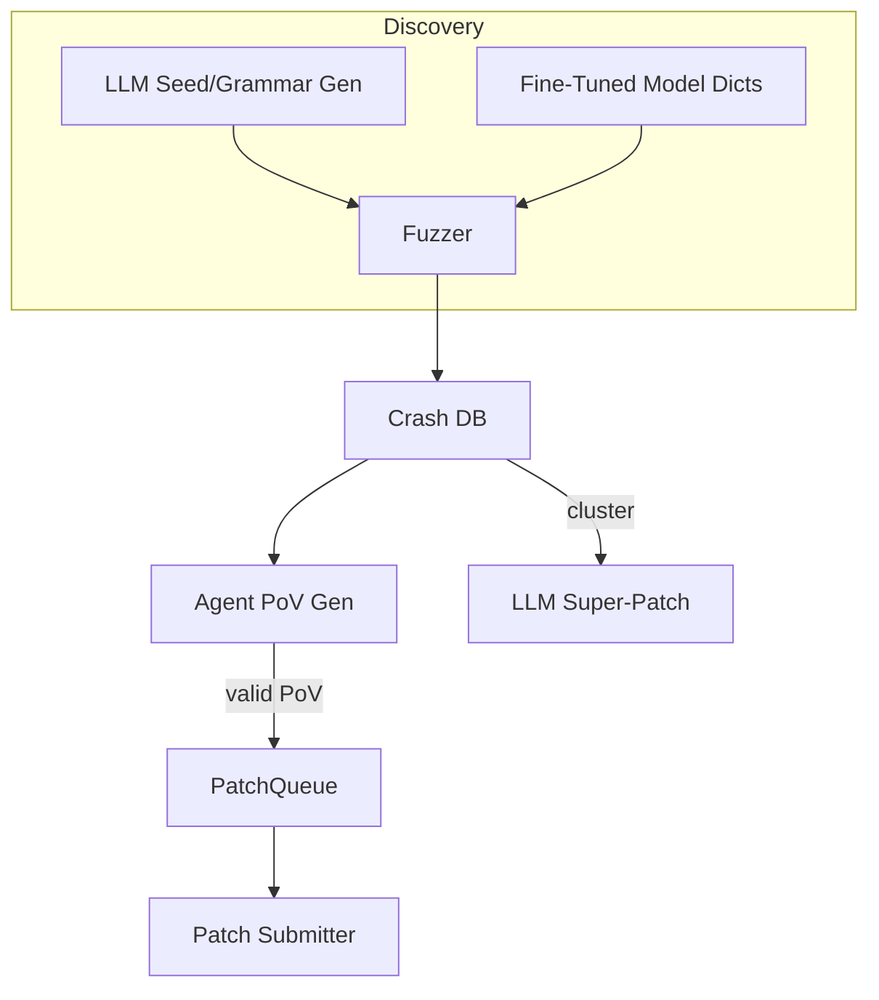

# AI-Assisted Fuzzing e Automated Vulnerability Discovery

{{#include ../banners/hacktricks-training.md}}

## Panoramica
I Large Language Models (LLM) possono potenziare notevolmente le tradizionali pipeline di vulnerability research generando input semanticamente ricchi, facendo evolvere le grammar, analizzando i crash data e proponendo persino patch per bug multipli. Questa pagina raccoglie i pattern più efficaci osservati durante le finali della DARPA AI Cyber Challenge (AIxCC) e in altre ricerche pubbliche.

Quanto segue non descrive il sistema di una specifica competizione, ma costituisce un'astrazione delle tecniche, così da poterle riprodurre nei propri workflow.

---

## 1. Seed Inputs generati dagli LLM

I traditional coverage-guided fuzzer (AFL++, libFuzzer, Honggfuzz…) iniziano con un piccolo corpus di seed e mutano ciecamente i byte. Quando il formato dell'input target è complesso (SQL, URL, custom binary protocols), le mutazioni casuali solitamente compromettono la sintassi prima che vengano raggiunti i branch interessanti.

Gli LLM possono risolvere questo problema di bootstrap generando *seed generator*: brevi script che producono **input sintatticamente corretti ma rilevanti per la sicurezza**. Ad esempio:
```prompt
SYSTEM: You are a helpful security engineer.
USER:
Write a Python3 program that prints 200 unique SQL injection strings targeting common anti-pattern mistakes (missing quotes, numeric context, stacked queries).  Ensure length ≤ 256 bytes / string so they survive common length limits.
```

```python
# gen_sqli_seeds.py (truncated)
PAYLOADS = [
"1 OR 1=1 -- ",
"' UNION SELECT NULL,NULL--",
"0; DROP TABLE users;--",
...
]
for p in PAYLOADS:
print(p)
```
Eseguilo una volta e passa direttamente l'output al corpus iniziale del fuzzer:
```bash
python3 gen_sqli_seeds.py > seeds.txt
afl-fuzz -i seeds.txt -o findings/ -- ./target @@
```
Vantaggi:
1. Validità semantica → coverage più approfondita fin dalle prime fasi.
2. Rigenerabile: modifica il prompt per concentrarti su XSS, path traversal, binary blob, ecc.
3. Economico (< 1 ¢ con GPT-3.5).

### Suggerimenti
* Istruisci il modello a *diversificare* la lunghezza e l'encoding dei payload (UTF-8, URL-encoded, UTF-16-LE) per bypassare i filtri superficiali.
* Chiedi un *singolo script autonomo*: evita problemi di formattazione JSON.

---

## 2. Grammar-Evolution Fuzzing

Una variante più potente consiste nel lasciare che l'LLM **evolva una grammatica** invece di seed concreti. Il workflow (pattern “Grammar Guy”) è:

1. Genera una grammatica ANTLR/Peach/LibFuzzer iniziale tramite prompt.
2. Esegui il fuzzing per N minuti e raccogli le metriche di coverage (edge / blocchi raggiunti).
3. Riassumi le aree del programma non coperte e reinvia il riepilogo al modello:
```prompt
La grammatica precedente ha attivato il 12% degli edge del programma. Funzioni non raggiunte: parse_auth, handle_upload. Aggiungi/modifica le regole per coprirle.
```
4. Unisci le nuove regole, esegui nuovamente il fuzzing e ripeti.

Struttura di pseudo-codice:
```python
for epoch in range(MAX_EPOCHS):
grammar = llm.refine(grammar, feedback=coverage_stats)
save(grammar, f"grammar_{epoch}.txt")
coverage_stats = run_fuzzer(grammar)
```
Punti chiave:
* Mantieni un *budget* – ogni refinement utilizza token.
* Usa istruzioni `diff` + `patch` in modo che il modello modifichi invece di riscrivere.
* Interrompi quando Δcoverage < ε.

---

## 3. Generazione di PoV (Exploit) basata su agenti

Dopo aver trovato un crash, serve ancora un **proof-of-vulnerability (PoV)** che lo attivi in modo deterministico.

Un approccio scalabile consiste nell'avviare *migliaia* di agenti leggeri (<process/thread/container/prisoner>), ognuno dei quali esegue un LLM diverso (GPT-4, Claude, Mixtral) o una diversa impostazione della temperatura.

Pipeline:
1. L'analisi statica/dinamica produce *bug candidates* (struct con crash PC, input slice, messaggio del sanitizer).
2. L'orchestrator distribuisce i candidati agli agenti.
3. Passaggi di ragionamento dell'agente:
a. Riprodurre il bug localmente con `gdb` + input.
b. Suggerire un exploit payload minimo.
c. Validare l'exploit nella sandbox.  In caso di successo → inviare.
4. I tentativi falliti vengono **rimessi in coda come nuovi seed** per il coverage fuzzing (feedback loop).

Vantaggi:
* La parallelizzazione nasconde l'inaffidabilità del singolo agente.
* Auto-tuning di temp / model size in base al success-rate osservato.

---

## 4. Directed Fuzzing con Code Models fine-tuned

Esegui il fine-tuning di un modello open-weight (ad es. Llama-7B) su codice sorgente C/C++ contrassegnato con vulnerability patterns (integer overflow, buffer copy, format string). Quindi:

1. Esegui l'analisi statica per ottenere l'elenco delle funzioni + AST.
2. Prompta il modello: *“Fornisci voci del mutation dictionary che probabilmente comprometteranno la memory safety nella funzione X”*.
3. Inserisci quei token in un `AFL_CUSTOM_MUTATOR` personalizzato.

Esempio di output per un wrapper `sprintf`:
```
{"pattern":"%99999999s"}
{"pattern":"AAAAAAAA....<1024>....%n"}
```
Empiricamente, questo riduce il time-to-crash di oltre 2× su target reali.

---

## 5. Strategie di Patching Guidate dall'AI

### 5.1 Super Patches
Chiedi al modello di *clusterizzare* le crash signatures e proporre una **singola patch** che elimini la causa principale comune. Invia una sola volta, correggi diversi bug → meno penalità di accuratezza negli ambienti in cui ogni patch errata costa punti.

Schema del prompt:
```
Here are 10 stack traces + file snippets.  Identify the shared mistake and generate a unified diff fixing all occurrences.
```
### 5.2 Rapporto tra Patch Speculative
Implementare una queue in cui le patch confermate e validate tramite PoV e le patch *speculative* (senza PoV) siano interleaved con un rapporto 1:​N regolato in base alle scoring rules (es. 2 speculative : 1 confirmed). Un cost model monitora le penalty rispetto ai punti e regola automaticamente N.

---

## 6. Code Review AI Deterministico File per File

Una modalità di errore frequente nell'AI-assisted review consiste nel chiedere a un agent di ispezionare un intero repository, sperando che scelga i file e i termini grep corretti. Un pattern più affidabile consiste nel **forzare la copertura del repository**:

1. Enumerare i source file.
2. Inviare **un file alla volta** insieme al contesto minimo (entrypoint, import, route/caller adiacenti).
3. Richiedere un **report strutturato** per ogni file: sources, sink, validazione mancante, precondizioni dell'exploit e confidence.
4. Deduplicare i report in base al **pattern source→sink** e validare manualmente quelli ad alto rischio.

Questo approccio richiede molti token ed è rumoroso, ma è molto efficace nel portare alla luce **bug semplici e ad alto impatto nei source/sink** che le review agentic più ampie spesso non rilevano.

### Pattern di triage da prioritizzare

- **Dynamic PHP include/dispatch**: nomi di route/controller/module controllati dall'attacker che confluiscono in `require_once()`, `include()` o `include_once()` senza una strict allowlisting e una path canonicalisation.
- **Shell execution nei workflow admin/account**: username, domini, account FTP o altri identificatori che raggiungono `exec()`, `system()`, `shell_exec()`, `passthru()`, `proc_open()` o `popen()`.
- **Structured input fan-in**: lo stesso parametro accettato da `$_GET`, `$_POST`, JSON, XML o body parser del framework e successivamente riutilizzato in sink del filesystem o di comandi OS.

### Due classi pratiche di bug che questo metodo rileva bene

- **PHP controller-dispatch LFI/RCE**: se il nome del controller controllato dalla request viene concatenato in `require_once()` senza allowlist/path normalisation, sequenze di traversal come `../` possono indurre PHP a includere un file `.php` locale non previsto. Se l'attacker può indirizzare l'include verso un file PHP impiantato o comunque utile, la LFI diventa code execution. Vedere [File Inclusion / Path Traversal](../pentesting-web/file-inclusion/README.md).
- **Command injection autenticata nei pannelli hosting/admin**: se campi di account management come gli username vengono incorporati in shell command, un utente autenticato con low privilege può trasformare una normale azione di create/delete in RCE. L'impatto aumenta quando il pannello esegue il comando con un service account dotato di privilegi superiori. Vedere [Command Injection](../pentesting-web/command-injection.md).

### Note pratiche sulla review

- Usare l'LLM prima di tutto come **source/sink reviewer**, non come exploit generator.
- Chiedergli di elencare esplicitamente il **campo controllato dall'attacker**, la **lacuna di normalizzazione/validazione** e il **sink pericoloso**.
- Nei repository di grandi dimensioni, la review deterministica file per file è spesso più affidabile di una singola esecuzione con un autonomous agent, anche quando quest'ultimo utilizza un modello più potente.
- Aspettarsi risultati più deboli per i bug di **Broken Access Control** e per altri bug di business logic, la cui exploitability dipende da assunzioni cross-file, semantica dei ruoli o threat model specifici del prodotto.

---

## Mettere tutto insieme
Un CRS (Cyber Reasoning System) end-to-end può collegare i componenti in questo modo:

```mermaid
graph TD
subgraph Discovery
A[LLM Seed/Grammar Gen] --> B[Fuzzer]
C[Fine-Tuned Model Dicts] --> B
end
B --> D[Crash DB]
D --> E[Agent PoV Gen]
E -->|valid PoV| PatchQueue
D -->|cluster| F[LLM Super-Patch]
PatchQueue --> G[Patch Submitter]
```
---

## Riferimenti
* [Project Black - AI locale per la Cyber Security: individuazione di LFI in phpIPAM e RCE autenticata in myVesta](https://projectblack.io/blog/local-ai-for-cyber-security)
* [Strix](https://github.com/usestrix/strix)
* [Skill di security-review della community di GitHub Copilot](https://github.com/github/awesome-copilot/blob/main/skills/security-review/SKILL.md)
* [Trail of Bits – finali AIxCC: cronaca della competizione](https://blog.trailofbits.com/2025/08/07/aixcc-finals-tale-of-the-tape/)
* [Interviste ai finalisti di AIxCC di CTF Radiooo](https://www.youtube.com/@ctfradiooo)
{{#include ../banners/hacktricks-training.md}}
