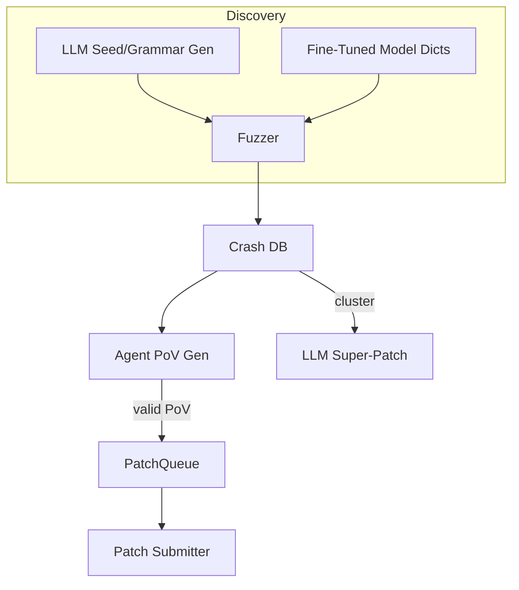

# AI-Assisted Fuzzing i Automated Vulnerability Discovery

{{#include ../banners/hacktricks-training.md}}

## Pregled
Large-language models (LLM-ovi) mogu značajno unaprediti tradicionalne pipeline-ove za istraživanje ranjivosti generisanjem semantički bogatih ulaza, evolucijom grammar-a, analizom crash podataka, pa čak i predlaganjem patch-eva za više bug-ova. Ova stranica objedinjuje najefikasnije obrasce uočene tokom finala DARPA AI Cyber Challenge-a (AIxCC) i drugih javnih istraživanja.

Ono što sledi nije opis jednog konkretnog takmičarskog sistema, već apstrakcija tehnika koje možete reproducirati u sopstvenim workflow-ima.

---

## 1. LLM-Generated Seed Inputs

Tradicionalni coverage-guided fuzzers (AFL++, libFuzzer, Honggfuzz…) počinju sa malim corpus-om seed-ova i slepo mutiraju bajtove. Kada je format ciljnog input-a složen (SQL, URL-ovi, prilagođeni binarni protokoli), nasumične mutacije obično naruše sintaksu pre nego što se dosegnu zanimljive grane.

LLM-ovi mogu rešiti ovaj bootstrap problem generisanjem *seed generator-a* – kratkih skripti koje proizvode **syntax-correct but security-relevant inputs**. Na primer:
```prompt
SYSTEM: You are a helpful security engineer.
USER:
Write a Python3 program that prints 200 unique SQL injection strings targeting common anti-pattern mistakes (missing quotes, numeric context, stacked queries).  Ensure length ≤ 256 bytes / string so they survive common length limits.
```

```python
# gen_sqli_seeds.py (truncated)
PAYLOADS = [
"1 OR 1=1 -- ",
"' UNION SELECT NULL,NULL--",
"0; DROP TABLE users;--",
...
]
for p in PAYLOADS:
print(p)
```
Pokrenite jednom i prosledite izlaz direktno u početni korpus fuzzer-a:
```bash
python3 gen_sqli_seeds.py > seeds.txt
afl-fuzz -i seeds.txt -o findings/ -- ./target @@
```
Benefits:
1. Semantic validity → deeper coverage early.
2. Re-generatable: tweak the prompt to focus on XSS, path traversal, binary blobs, etc.
3. Cheap (< 1 ¢ with GPT-3.5).

### Tips
* Instruct the model to *diversify* payload length and encoding (UTF-8, URL-encoded, UTF-16-LE) to bypass superficial filters.
* Ask for a *single self-contained script* – avoids JSON formatting hiccups.

---

## 2. Grammar-Evolution Fuzzing

Moćnija varijanta je da LLM-u omogućite da **evoluira gramatiku** umesto konkretnih seed-ova. Workflow („Grammar Guy“ pattern) je sledeći:

1. Generate an initial ANTLR/Peach/LibFuzzer grammar via prompt.
2. Fuzz for N minutes and collect coverage metrics (edges / blocks hit).
3. Summarise uncovered program areas and feed the summary back into the model:
```prompt
The previous grammar triggered 12 % of the program edges.  Functions not reached: parse_auth, handle_upload.  Add / modify rules to cover these.
```
4. Merge the new rules, re-fuzz, repeat.

Kostur pseudo-koda:
```python
for epoch in range(MAX_EPOCHS):
grammar = llm.refine(grammar, feedback=coverage_stats)
save(grammar, f"grammar_{epoch}.txt")
coverage_stats = run_fuzzer(grammar)
```
Ključne tačke:
* Održavajte *budžet* – svako poboljšanje koristi tokene.
* Koristite instrukcije `diff` + `patch` kako bi model vršio izmene umesto da ponovo ispisuje sadržaj.
* Zaustavite se kada je Δcoverage < ε.

---

## 3. Generisanje PoV-a (Exploit-a) zasnovano na agentima

Nakon pronalaska crash-a i dalje vam je potreban **proof-of-vulnerability (PoV)** koji ga deterministički izaziva.

Skalabilan pristup je pokretanje *hiljada* laganih agenata (<process/thread/container/prisoner>), pri čemu svaki pokreće drugačiji LLM (GPT-4, Claude, Mixtral) ili drugačije podešavanje temperature.

Pipeline:
1. Statička/dinamička analiza proizvodi *kandidate za bugove* (struct sa crash PC-jem, input slice-om i porukom sanitizera).
2. Orkestrator distribuira kandidate agentima.
3. Koraci rezonovanja agenta:
a. Lokalno reprodukuje bug pomoću `gdb` + input-a.
b. Predlaže minimalni exploit payload.
c. Validira exploit u sandbox-u.  Ako uspe → šalje ga.
4. Neuspešni pokušaji se **ponovo stavljaju u red kao novi seed-ovi** za coverage fuzzing (feedback loop).

Prednosti:
* Paralelizacija prikriva nepouzdanost pojedinačnog agenta.
* Automatsko podešavanje temp / veličine modela na osnovu uočene stope uspešnosti.

---

## 4. Directed Fuzzing sa fino podešenim Code Model-ima

Fino podesite open-weight model (npr. Llama-7B) na C/C++ izvornom kodu označenom obrascima ranjivosti (integer overflow, buffer copy, format string).  Zatim:

1. Pokrenite statičku analizu da biste dobili listu funkcija + AST.
2. Promptujte model: *“Give mutation dictionary entries that are likely to break memory safety in function X”*.
3. Ubacite te tokene u prilagođeni `AFL_CUSTOM_MUTATOR`.

Primer izlaza za `sprintf` wrapper:
```
{"pattern":"%99999999s"}
{"pattern":"AAAAAAAA....<1024>....%n"}
```
Empirijski, ovo smanjuje vreme do rušenja za >2× na stvarnim metama.

---

## 5. Strategije patchovanja uz pomoć AI-ja

### 5.1 Super Patches
Zatražite od modela da *klasterizuje* crash signatures i predloži **jedan patch** koji uklanja zajednički osnovni uzrok. Pošaljite ga jednom i rešite nekoliko bugova → manje penala za netačnost u okruženjima u kojima svaki pogrešan patch donosi gubitak poena.

Okvir prompta:
```
Here are 10 stack traces + file snippets.  Identify the shared mistake and generate a unified diff fixing all occurrences.
```
### 5.2 Odnos spekulativnih zakrpa
Implementirajte red u kojem se potvrđene zakrpe validirane pomoću PoV-a i *spekulativne* zakrpe (bez PoV-a) smenjuju u odnosu 1:​N, podešenom prema pravilima bodovanja (npr. 2 spekulativne : 1 potvrđena). Model troškova prati kazne u odnosu na poene i samostalno prilagođava N.

---

## 6. Deterministički AI pregled koda fajl po fajl

Čest način na koji AI-potpomognuti pregled koda zakaže jeste kada se od jednog agenta zatraži da pregleda čitav repository, uz očekivanje da će izabrati odgovarajuće fajlove i grep termine. Pouzdaniji obrazac je da se **forsira pokrivenost repository-ja**:

1. Nabrojte izvorne fajlove.
2. Šaljite **jedan fajl po poruci** uz minimalni kontekst (entrypoint, importi, obližnje rute/pozivaoci).
3. Zahtevajte **strukturirani izveštaj** za svaki fajl: izvori, sink, nedostajuća validacija, preduslovi za eksploataciju i nivo pouzdanosti.
4. Uklonite duplikate izveštaja prema obrascu **source→sink** i ručno validirajte one sa visokim rizikom.

Ovo zahteva mnogo tokena i proizvodi šum, ali je veoma efikasno za otkrivanje **jednostavnih source/sink bugova sa velikim uticajem** koje široki agentic pregledi često propuštaju.

### Obrasci za trijažu kojima vredi dati prioritet

- **Dinamički PHP include/dispatch**: imena ruta/controller-a/modula pod kontrolom napadača prosleđuju se u `require_once()`, `include()` ili `include_once()` bez striktne allowliste i kanonikalizacije putanje.
- **Izvršavanje shell komandi u admin/account tokovima**: korisnička imena, domeni, FTP account-i ili drugi identifikatori dolaze do `exec()`, `system()`, `shell_exec()`, `passthru()`, `proc_open()` ili `popen()`.
- **Spajanje strukturiranih ulaza**: isti parametar prihvata se iz `$_GET`, `$_POST`, JSON-a, XML-a ili parsera tela zahteva framework-a, a kasnije se ponovo koristi u filesystem ili OS-command sink-ovima.

### Dve praktične klase bugova koje ovaj metod dobro pronalazi

- **PHP controller-dispatch LFI/RCE**: ako se naziv controller-a pod kontrolom zahteva konkatenira u `require_once()` bez allowliste/normalizacije putanje, traversal sekvence poput `../` mogu navesti PHP da uključi nenameravani lokalni `.php` fajl. Ako napadač može da usmeri include na postavljeni ili na drugi način koristan PHP fajl, LFI prelazi u izvršavanje koda. Pogledajte [File Inclusion / Path Traversal](../pentesting-web/file-inclusion/README.md).
- **Authenticated command injection u hosting/admin panelima**: ako se polja za upravljanje account-ima, kao što su korisnička imena, ugrađuju u shell komande, autentifikovani korisnik sa niskim privilegijama može pretvoriti uobičajenu akciju kreiranja/brisanja u RCE. Uticaj se povećava kada panel izvršava komandu kao privilegovaniji service account. Pogledajte [Command Injection](../pentesting-web/command-injection.md).

### Praktične napomene za pregled

- Koristite LLM prvo kao **source/sink reviewera**, a ne kao generatora exploita.
- Zahtevajte da eksplicitno navede **polje pod kontrolom napadača**, **propust u normalizaciji/validaciji** i **opasni sink**.
- Kod velikih repository-ja, deterministički pregled fajl po fajl često je pouzdaniji od jednog autonomnog pokretanja agenta, čak i kada drugo koristi jači model.
- Očekujte slabije rezultate kod **Broken Access Control** i drugih business-logic bugova čija eksploatabilnost zavisi od pretpostavki između fajlova, semantike uloga ili threat modela specifičnog za proizvod.

---

## Sastavljanje svih delova
End-to-end CRS (Cyber Reasoning System) može povezati komponente na sledeći način:

```mermaid
graph TD
subgraph Discovery
A[LLM Seed/Grammar Gen] --> B[Fuzzer]
C[Fine-Tuned Model Dicts] --> B
end
B --> D[Crash DB]
D --> E[Agent PoV Gen]
E -->|valid PoV| PatchQueue
D -->|cluster| F[LLM Super-Patch]
PatchQueue --> G[Patch Submitter]
```
---

## Reference
* [Project Black - Local AI for Cyber Security: Finding phpIPAM LFI and myVesta Authenticated RCE](https://projectblack.io/blog/local-ai-for-cyber-security)
* [Strix](https://github.com/usestrix/strix)
* [GitHub Copilot community security-review skill](https://github.com/github/awesome-copilot/blob/main/skills/security-review/SKILL.md)
* [Trail of Bits – AIxCC finals: Tale of the tape](https://blog.trailofbits.com/2025/08/07/aixcc-finals-tale-of-the-tape/)
* [CTF Radiooo AIxCC finalist interviews](https://www.youtube.com/@ctfradiooo)
{{#include ../banners/hacktricks-training.md}}
