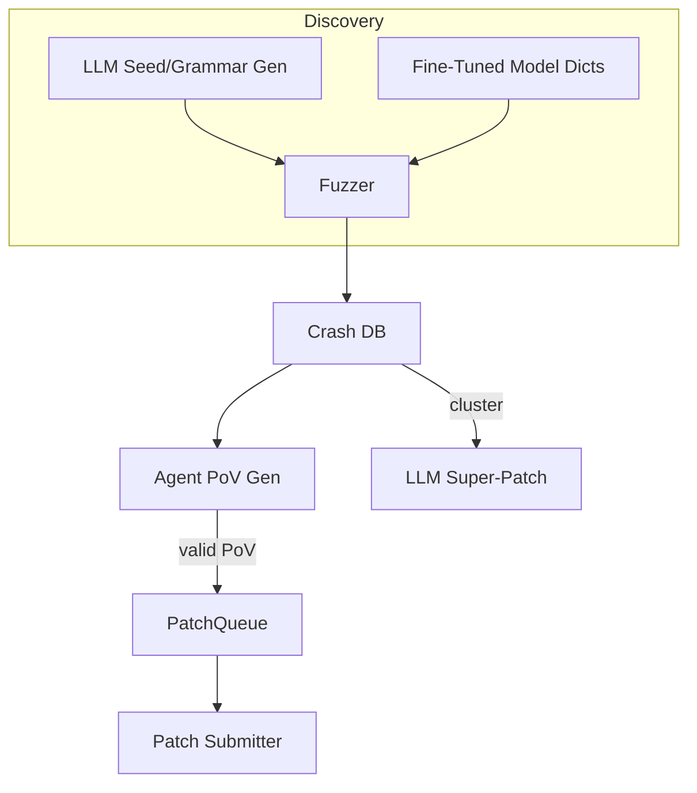

# AI-Assisted Fuzzing & Automated Vulnerability Discovery

{{#include ../banners/hacktricks-training.md}}

## Overview
Large-language models (LLMs) can super-charge traditional vulnerability-research pipelines by generating semantically rich inputs, evolving grammars, reasoning over crash data, and even proposing multi-bug patches.  This page collects the most effective patterns observed during DARPA’s AI Cyber Challenge (AIxCC) finals and other public research.

What follows is not a description of one specific competition system, but an abstraction of the techniques so you can reproduce them in your own workflows.

---

## Autonomous Web-Hacking Agents

The same LLMs that improve fuzzing can also run **long-lived web-hacking workflows**. The useful abstraction is not "ask the model to find bugs", but "wrap the model in a harness that forces evidence collection, persistence, and skeptical validation".

### 1. Observability first

An autonomous agent without logs quickly becomes an expensive false-positive generator. Keep **full session telemetry** for every run:

- shell commands
- HTTP requests and responses
- browser actions
- intermediate conclusions
- final evidence used in the report

The logs are often more valuable than the report because they show **why** the agent stopped, which assumptions it made, and which branches deserve another pass.

### 2. Keep the agent hacking

A single prompt usually stops at the first plausible explanation. In practice, the agent should run in an **iterative loop**:

1. perform recon / analysis
2. score the result
3. create follow-up tasks
4. revisit suspicious branches
5. stop only on an explicit budget or low-signal decision

This is especially useful for web targets where weak signals often hide real issues: reflected parameters, strange redirects, feature flags, hidden API paths, source-map leaks, or partially working authorization bypasses.

### 3. Add an orchestrator

Pure persistence burns tokens on thin targets. Put an **orchestrator** above the worker to:

- kill low-signal targets early
- extend runs on promising attack surfaces
- fan out work into recon / analysis / validation sub-agents
- re-queue interesting artifacts (JS bundles, source maps, leaked configs, suspicious endpoints)

### 4. Use an adversarial validator

A separate agent should try to **disprove** every finding before it is reported:

- alleged XSS → break the source-to-sink chain
- alleged SSRF → prove whether the request actually crossed the trust boundary
- alleged IDOR/BOLA → confirm object ownership really changes with only the identifier mutated
- alleged OAuth issue → replay the exact callback/token exchange and confirm client, redirect, or `postMessage` abuse is real

This reduces "AI slop" and forces the system to keep only evidence-backed bugs.

### 5. Split login from hacking

For post-auth web testing, do **not** waste most of the budget fighting anti-bot login flows. A practical pattern is:

- keep a **local real-browser session broker** (real Chrome profile, normal fingerprint)
- refresh cookies/tokens there
- hand live authenticated sessions to the cloud worker
- keep the worker focused on post-auth attack surface

This is especially relevant for high-value classes such as [IDOR/BOLA](../pentesting-web/idor.md), [account takeover](../pentesting-web/account-takeover.md), [registration weaknesses](../pentesting-web/registration-vulnerabilities.md), and [reset/OTP flows](../pentesting-web/reset-password.md).

### 6. Web-specific artifact mining for agents

Autonomous web agents work best when explicitly instructed to harvest and prioritize:

- JS bundles and **source maps** for hidden routes, mock paths, API keys, role strings, and service filenames
- client-side message handlers for [`postMessage`](../pentesting-web/postmessage-vulnerabilities/README.md) sinks and origin-trust mistakes
- OAuth/OIDC callback handlers and Dynamic Client Registration flows ([OAuth to account takeover](../pentesting-web/oauth-to-account-takeover.md))
- Firebase / Identity Toolkit / Firestore configuration leaks
- unsafe DOM sinks such as `innerHTML`, even on detached nodes, for DOM-XSS review
- Web3 metadata rendered into trusted origins, where XSS can become wallet-signing abuse ([DApps](../pentesting-web/dapps-DecentralizedApplications.md))

### 7. High-signal web heuristics to encode as skills

When you turn the workflow into reusable skills/prompts, explicitly bias the agent toward patterns that repeatedly produce real bugs:

- **Leaked Google / Firebase keys**: test exposed keys against Identity Toolkit-style project configuration endpoints, recover authorized domains, and compare those domains against real portals, self-registration paths, and domain-trust onboarding logic.
- **Customer lookup / recovery APIs**: prioritize endpoints that accept phone numbers, partial names, DOB, email, or account numbers; check whether any field is only syntactically required and can be abused for bulk enumeration.
- **Reset / OTP validators**: diff success and failure responses looking for leaked OTP hashes, secret material, retry metadata, or account identifiers that turn online verification into offline cracking.
- **Detached-node HTML decoders**: flag helpers that assign attacker input to `innerHTML` on temporary elements, because parsing and event-handler execution can happen before the returned value is re-escaped.
- **Source-map mining**: grep `sourcesContent` for mock paths, hidden assets, API route names, service filenames, feature flags, and committed tokens; use the findings to drive the next fuzzing/validation loop.
- **dApp signing hooks**: if XSS lands on a wallet-connected origin, immediately inspect whether the page can tamper with `signTransaction`, `signAndSendTransaction`, or similar signing methods to change the transaction after the UI intent is established.

### 8. Good agent outputs

The best output of an autonomous hacking agent is usually **not** a polished report. It is a queue of:

- reproducible request/response pairs
- validated exploit paths
- high-signal artifacts worth human review
- concrete follow-up prompts for the next agent pass

## 1. LLM-Generated Seed Inputs

Traditional coverage–guided fuzzers (AFL++, libFuzzer, Honggfuzz…) start with a small corpus of seeds and mutate bytes blindly.  When the target input format is complex (SQL, URLs, custom binary protocols) random mutations usually break the syntax before interesting branches are reached.

LLMs can solve this bootstrap problem by emitting *seed generators* – short scripts that output **syntax-correct but security-relevant inputs**.  For example:

```prompt
SYSTEM: You are a helpful security engineer.
USER:
Write a Python3 program that prints 200 unique SQL injection strings targeting common anti-pattern mistakes (missing quotes, numeric context, stacked queries).  Ensure length ≤ 256 bytes / string so they survive common length limits.
```

```python
# gen_sqli_seeds.py (truncated)
PAYLOADS = [
    "1 OR 1=1 -- ",
    "' UNION SELECT NULL,NULL--",
    "0; DROP TABLE users;--",
    ...
]
for p in PAYLOADS:
    print(p)
```

Run once and feed the output directly into the fuzzer’s initial corpus:

```bash
python3 gen_sqli_seeds.py > seeds.txt
afl-fuzz -i seeds.txt -o findings/ -- ./target @@
```

Benefits:
1. Semantic validity → deeper coverage early.
2. Re-generatable: tweak the prompt to focus on XSS, path traversal, binary blobs, etc.
3. Cheap (< 1 ¢ with GPT-3.5).

### Tips
* Instruct the model to *diversify* payload length and encoding (UTF-8, URL-encoded, UTF-16-LE) to bypass superficial filters.
* Ask for a *single self-contained script* – avoids JSON formatting hiccups.

---

## 2. Grammar-Evolution Fuzzing

A more powerful variant is to let the LLM **evolve a grammar** instead of concrete seeds.  The workflow (“Grammar Guy” pattern) is:

1. Generate an initial ANTLR/Peach/LibFuzzer grammar via prompt.
2. Fuzz for N minutes and collect coverage metrics (edges / blocks hit).
3. Summarise uncovered program areas and feed the summary back into the model:
   ```prompt
   The previous grammar triggered 12 % of the program edges.  Functions not reached: parse_auth, handle_upload.  Add / modify rules to cover these.
   ```
4. Merge the new rules, re-fuzz, repeat.

Pseudo-code skeleton:

```python
for epoch in range(MAX_EPOCHS):
    grammar = llm.refine(grammar, feedback=coverage_stats)
    save(grammar, f"grammar_{epoch}.txt")
    coverage_stats = run_fuzzer(grammar)
```

Key points:
* Keep a *budget* – each refinement uses tokens.
* Use `diff` + `patch` instructions so the model edits rather than rewrites.
* Stop when Δcoverage < ε.

---

## 3. Agent-Based PoV (Exploit) Generation

After a crash is found you still need a **proof-of-vulnerability (PoV)** that deterministically triggers it.

A scalable approach is to spawn *thousands* of lightweight agents (<process/thread/container/prisoner>), each running a different LLM (GPT-4, Claude, Mixtral) or temperature setting.

Pipeline:
1. Static/ dynamic analysis produces *bug candidates* (struct with crash PC, input slice, sanitizer msg).
2. Orchestrator distributes candidates to agents.
3. Agent reasoning steps:
   a. Reproduce bug locally with `gdb` + input.
   b. Suggest minimal exploit payload.
   c. Validate exploit in sandbox.  If success → submit.
4. Failed attempts are **re-queued as new seeds** for coverage fuzzing (feedback loop).

Advantages:
* Parallelisation hides single-agent unreliability.
* Auto-tuning of temp / model size based on observed success-rate.

---

## 4. Directed Fuzzing with Fine-Tuned Code Models

Fine-tune an open-weight model (e.g. Llama-7B) on C/C++ source labelled with vulnerability patterns (integer overflow, buffer copy, format string).  Then:

1. Run static analysis to get function list + AST.
2. Prompt model: *“Give mutation dictionary entries that are likely to break memory safety in function X”*.
3. Insert those tokens into a custom `AFL_CUSTOM_MUTATOR`.

Example output for a `sprintf` wrapper:
```
{"pattern":"%99999999s"}
{"pattern":"AAAAAAAA....<1024>....%n"}
```

Empirically this shrinks time-to-crash by >2× on real targets.

---

## 5. AI-Guided Patching Strategies

### 5.1 Super Patches
Ask the model to *cluster* crash signatures and propose a **single patch** that removes the common root cause.  Submit once, fix several bugs → fewer accuracy penalties in environments where each wrong patch costs points.

Prompt outline:
```
Here are 10 stack traces + file snippets.  Identify the shared mistake and generate a unified diff fixing all occurrences.
```

### 5.2 Speculative Patch Ratio
Implement a queue where confirmed PoV-validated patches and *speculative* patches (no PoV) are interleaved at a 1:​N ratio tuned to scoring rules (e.g. 2 speculative : 1 confirmed).  A cost model monitors penalties vs. points and self-adjusts N.

---

## Putting It All Together
An end-to-end CRS (Cyber Reasoning System) may wire the components like this:


```mermaid
graph TD
    subgraph Discovery
        A[LLM Seed/Grammar Gen] --> B[Fuzzer]
        C[Fine-Tuned Model Dicts] --> B
    end
    B --> D[Crash DB]
    D --> E[Agent PoV Gen]
    E -->|valid PoV| PatchQueue
    D -->|cluster| F[LLM Super-Patch]
    PatchQueue --> G[Patch Submitter]
```

---

## References
* [Joseph Thacker & xssdoctor - The Bug Bounty Singularity: Our Hackbot](https://josephthacker.com/hacking/2026/07/01/we-built-a-hackbot.html)
* [Trail of Bits – AIxCC finals: Tale of the tape](https://blog.trailofbits.com/2025/08/07/aixcc-finals-tale-of-the-tape/)
* [CTF Radiooo AIxCC finalist interviews](https://www.youtube.com/@ctfradiooo)
{{#include ../banners/hacktricks-training.md}}
