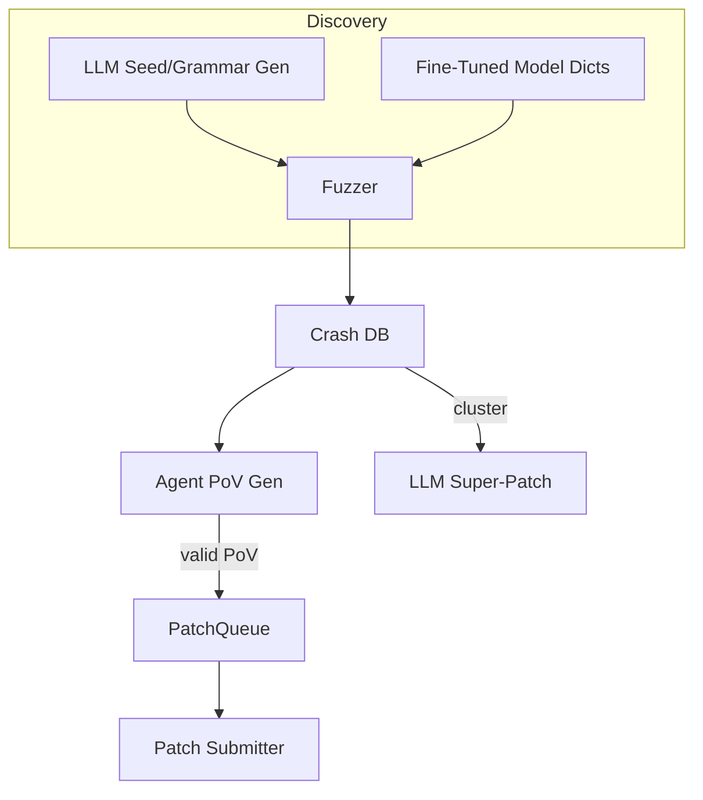

# AI-Assisted Fuzzing & Automated Vulnerability Discovery

{{#include ../banners/hacktricks-training.md}}

## 概述
Large-language models（LLMs）可以通过生成语义丰富的输入、演化 grammar、分析 crash 数据，甚至提出针对多个 bug 的 patch，大幅增强传统的 vulnerability-research 流程。本页面汇总了 DARPA 的 AI Cyber Challenge（AIxCC）决赛及其他公开研究中观察到的最有效模式。

以下内容并非对某个特定竞赛系统的描述，而是对相关技术的抽象，因此你可以将其复现到自己的工作流中。

---

## 1. LLM-Generated Seed Inputs

传统的 coverage-guided fuzzers（AFL++、libFuzzer、Honggfuzz……）从少量 seeds corpus 开始，并盲目地对字节进行 mutation。当目标输入格式较为复杂（SQL、URLs、自定义 binary protocols）时，随机 mutation 通常会在到达有趣的 branches 之前破坏 syntax。

LLMs 可以通过生成 *seed generators*（用于输出 **syntax-correct 但与 security 相关的 inputs** 的短脚本）来解决这一 bootstrap 问题。例如：
```prompt
SYSTEM: You are a helpful security engineer.
USER:
Write a Python3 program that prints 200 unique SQL injection strings targeting common anti-pattern mistakes (missing quotes, numeric context, stacked queries).  Ensure length ≤ 256 bytes / string so they survive common length limits.
```

```python
# gen_sqli_seeds.py (truncated)
PAYLOADS = [
"1 OR 1=1 -- ",
"' UNION SELECT NULL,NULL--",
"0; DROP TABLE users;--",
...
]
for p in PAYLOADS:
print(p)
```
运行一次，并将输出直接馈入 fuzzer 的初始 corpus：
```bash
python3 gen_sqli_seeds.py > seeds.txt
afl-fuzz -i seeds.txt -o findings/ -- ./target @@
```
Benefits:
1. 语义有效性 → 更早实现更深层的覆盖。
2. 可重新生成：调整 prompt，即可专注于 XSS、path traversal、binary blobs 等。
3. 成本低（使用 GPT-3.5 时 < 1 ¢）。

### Tips
* 指示模型对 payload 的长度和编码进行*多样化*（UTF-8、URL-encoded、UTF-16-LE），以绕过表层过滤器。
* 要求生成*单个自包含的 script*，避免 JSON 格式问题。

---

## 2. Grammar-Evolution Fuzzing

一种更强大的变体是让 LLM **演进 grammar**，而不是生成具体的 seeds。其工作流程（“Grammar Guy”模式）如下：

1. 通过 prompt 生成初始的 ANTLR/Peach/LibFuzzer grammar。
2. fuzz N 分钟，并收集覆盖率指标（已命中的 edges / blocks）。
3. 总结尚未覆盖的程序区域，并将摘要反馈给模型：
```prompt
The previous grammar triggered 12 % of the program edges.  Functions not reached: parse_auth, handle_upload.  Add / modify rules to cover these.
```
4. 合并新 rules，重新 fuzz，循环执行。

伪代码框架：
```python
for epoch in range(MAX_EPOCHS):
grammar = llm.refine(grammar, feedback=coverage_stats)
save(grammar, f"grammar_{epoch}.txt")
coverage_stats = run_fuzzer(grammar)
```
要点：
* 保持一个 *budget* —— 每次 refinement 都会消耗 tokens。
* 使用 `diff` + `patch` 指令，让模型进行编辑而不是重写。
* 当 Δcoverage < ε 时停止。

---

## 3. 基于 Agent 的 PoV (Exploit) 生成

找到 crash 后，你仍然需要一个能够确定性触发它的 **proof-of-vulnerability (PoV)**。

一种可扩展的方法是启动 *数千个轻量级 agents (<process/thread/container/prisoner>)*，每个 agent 运行不同的 LLM（GPT-4、Claude、Mixtral）或使用不同的 temperature 设置。

Pipeline：
1. Static/ dynamic analysis 生成 *bug candidates*（包含 crash PC、input slice、sanitizer msg 的 struct）。
2. Orchestrator 将 candidates 分发给 agents。
3. Agent 的 reasoning 步骤：
a. 使用 `gdb` + input 在本地复现 bug。
b. 提出最小 exploit payload。
c. 在 sandbox 中验证 exploit。若成功 → 提交。
4. 失败的尝试会作为新的 seeds **重新排队**，用于 coverage fuzzing（feedback loop）。

优势：
* Parallelisation 可以隐藏单个 agent 的不可靠性。
* 根据观察到的 success-rate 自动调整 temp / model size。

---

## 4. 使用 Fine-Tuned Code Models 进行 Directed Fuzzing

在标注了 vulnerability patterns（integer overflow、buffer copy、format string）的 C/C++ 源代码上，对一个 open-weight model（例如 Llama-7B）进行 fine-tune。然后：

1. 运行 static analysis，获取 function list + AST。
2. Prompt model：*“Give mutation dictionary entries that are likely to break memory safety in function X”*。
3. 将这些 tokens 插入自定义的 `AFL_CUSTOM_MUTATOR`。

对于 `sprintf` wrapper，示例输出：
```
{"pattern":"%99999999s"}
{"pattern":"AAAAAAAA....<1024>....%n"}
```
经验表明，在真实目标上，这能将 time-to-crash 缩短 2 倍以上。

---

## 5. AI-Guided Patching Strategies

### 5.1 Super Patches
要求模型对 crash signatures 进行 *cluster*，并提出一个能够消除共同 root cause 的**单一 patch**。一次提交，修复多个 bug → 在每个错误 patch 都会扣分的环境中，可减少 accuracy penalties。

Prompt outline:
```
Here are 10 stack traces + file snippets.  Identify the shared mistake and generate a unified diff fixing all occurrences.
```
### 5.2 Speculative Patch Ratio
实现一个队列，让已确认且经过 PoV 验证的补丁与 *speculative* 补丁（无 PoV）按经过评分规则调优的 1:​N 比例交错排列（例如 2 个 speculative : 1 个 confirmed）。成本模型会监控 penalty 与 points，并自动调整 N。

---

## 6. Deterministic File-by-File AI Code Review

AI-assisted review 中一种常见的失败模式，是让一个 agent 检查整个 repository，然后希望它自行选择正确的文件和 grep 关键词。更可靠的模式是**强制覆盖 repository**：

1. 枚举 source files。
2. 一次发送**一个文件**，并附带最少的上下文（entrypoint、imports、附近的 routes/callers）。
3. 要求每个文件生成一份**结构化报告**：sources、sink、缺失的 validation、exploit 前置条件和 confidence。
4. 按 **source→sink pattern** 对报告去重，并手动验证高风险项。

这种方式消耗 token 较多且噪声较大，但对于发现 broad agentic review 经常遗漏的**简单且影响较大的 source/sink bugs**非常有效。

### 值得优先处理的 Triage patterns

- **Dynamic PHP include/dispatch**：攻击者控制的 route/controller/module 名称流入 `require_once()`、`include()` 或 `include_once()`，且没有严格的 allowlisting 和 path canonicalisation。
- **Shell execution in admin/account workflows**：usernames、domains、FTP accounts 或其他 identifiers 到达 `exec()`、`system()`、`shell_exec()`、`passthru()`、`proc_open()` 或 `popen()`。
- **Structured input fan-in**：同一个 parameter 可从 `$_GET`、`$_POST`、JSON、XML 或 framework body parsers 接收，之后又被复用于 filesystem 或 OS-command sinks。

### 此方法擅长发现的两类实际 bug

- **PHP controller-dispatch LFI/RCE**：如果 request-controlled controller name 被拼接到 `require_once()` 中，且没有 allowlist/path normalisation，那么 `../` 等 traversal sequences 可能使 PHP include 一个非预期的本地 `.php` 文件。如果攻击者能够将 include 指向一个已植入的或其他有用的 PHP 文件，LFI 就会变成 code execution。参见 [File Inclusion / Path Traversal](../pentesting-web/file-inclusion/README.md)。
- **Authenticated command injection in hosting/admin panels**：如果 usernames 等 account-management fields 被嵌入 shell commands，低权限 authenticated user 可能将正常的 create/delete action 转变为 RCE。当 panel 以权限更高的 service account 执行该 command 时，影响会进一步扩大。参见 [Command Injection](../pentesting-web/command-injection.md)。

### Practical review notes

- 首先将 LLM 用作 **source/sink reviewer**，而不是 exploit generator。
- 要求它明确列出**攻击者控制的 field**、**normalization/validation gap** 以及**危险的 sink**。
- 对于大型 repos，即使单个 autonomous agent run 使用了更强的 model，deterministic per-file review 通常也比它更可靠。
- 对于 **Broken Access Control** 以及其他 business-logic bugs，预期结果会较弱，因为 exploitability 取决于跨文件假设、role semantics 或产品特定的 threat models。

---

## Putting It All Together
一个端到端的 CRS (Cyber Reasoning System) 可以按如下方式连接这些组件：

```mermaid
graph TD
subgraph Discovery
A[LLM Seed/Grammar Gen] --> B[Fuzzer]
C[Fine-Tuned Model Dicts] --> B
end
B --> D[Crash DB]
D --> E[Agent PoV Gen]
E -->|valid PoV| PatchQueue
D -->|cluster| F[LLM Super-Patch]
PatchQueue --> G[Patch Submitter]
```
---

## 参考资料
* [Project Black - 用于 Cyber Security 的本地 AI：发现 phpIPAM LFI 和 myVesta Authenticated RCE](https://projectblack.io/blog/local-ai-for-cyber-security)
* [Strix](https://github.com/usestrix/strix)
* [GitHub Copilot 社区 security-review skill](https://github.com/github/awesome-copilot/blob/main/skills/security-review/SKILL.md)
* [Trail of Bits – AIxCC 决赛：赛况实录](https://blog.trailofbits.com/2025/08/07/aixcc-finals-tale-of-the-tape/)
* [CTF Radiooo AIxCC 决赛入围者访谈](https://www.youtube.com/@ctfradiooo)
{{#include ../banners/hacktricks-training.md}}
