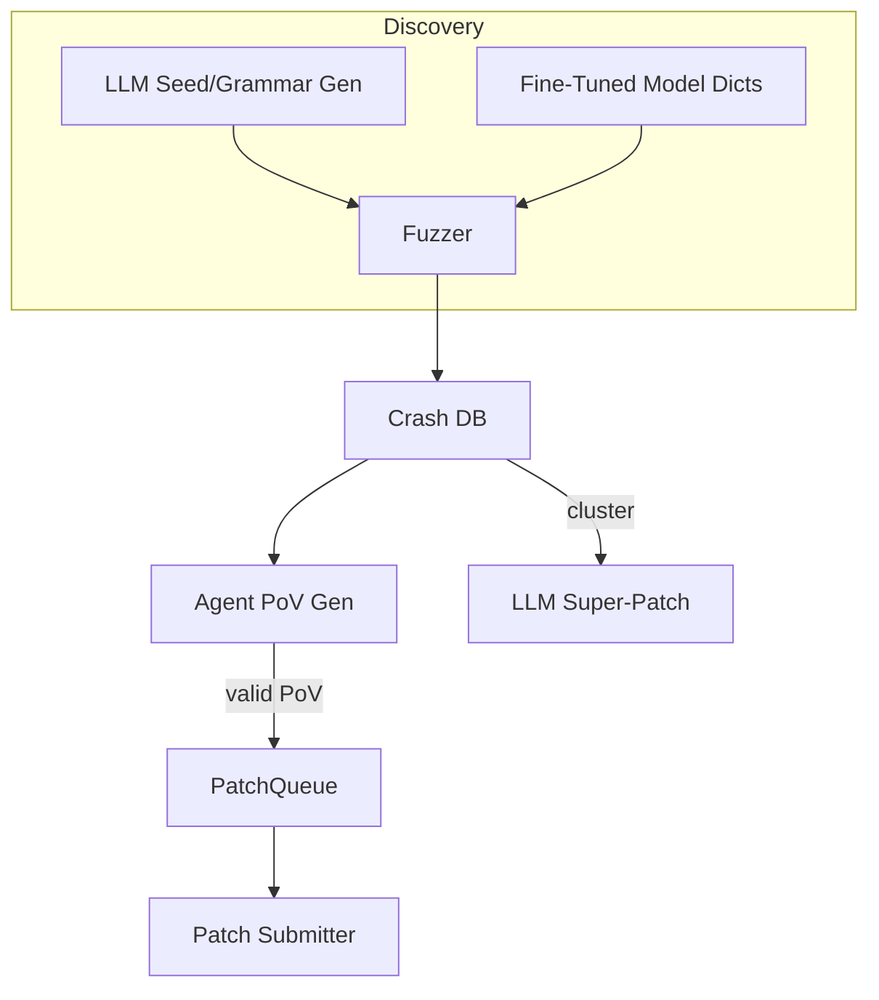

# AI-ondersteunde Fuzzing & Geoutomatiseerde Kwesbaarheidsontdekking

{{#include ../banners/hacktricks-training.md}}

## Oorsig
Groottaalmodelle (LLM's) kan tradisionele kwesbaarheidsnavorsingspyplyne aansienlik versterk deur semanties ryk invoer te genereer, grammatikas te ontwikkel, oor crash-data te redeneer en selfs multi-bug patches voor te stel. Hierdie bladsy versamel die doeltreffendste patrone wat tydens DARPA se AI Cyber Challenge (AIxCC)-finaal en ander openbare navorsing waargeneem is.

Wat volg, is nie 'n beskrywing van een spesifieke kompetisiestelsel nie, maar 'n abstraksie van die tegnieke sodat jy dit in jou eie workflows kan reproduseer.

---

## 1. LLM-gegenereerde Seed Inputs

Tradisionele coverage–guided fuzzers (AFL++, libFuzzer, Honggfuzz…) begin met 'n klein corpus van seeds en muteer grepe blindelings. Wanneer die teikeninvoerformaat kompleks is (SQL, URLs, pasgemaakte binêre protokolle), breek ewekansige mutasies gewoonlik die sintaksis voordat interessante takke bereik word.

LLM's kan hierdie bootstrap-probleem oplos deur *seed generators* te genereer – kort skripte wat **sintaksis-korrekte maar sekuriteitsrelevante invoere** uitvoer. Byvoorbeeld:
```prompt
SYSTEM: You are a helpful security engineer.
USER:
Write a Python3 program that prints 200 unique SQL injection strings targeting common anti-pattern mistakes (missing quotes, numeric context, stacked queries).  Ensure length ≤ 256 bytes / string so they survive common length limits.
```

```python
# gen_sqli_seeds.py (truncated)
PAYLOADS = [
"1 OR 1=1 -- ",
"' UNION SELECT NULL,NULL--",
"0; DROP TABLE users;--",
...
]
for p in PAYLOADS:
print(p)
```
Voer dit een keer uit en voer die uitvoer direk in die fuzzer se aanvanklike corpus in:
```bash
python3 gen_sqli_seeds.py > seeds.txt
afl-fuzz -i seeds.txt -o findings/ -- ./target @@
```
Voordele:
1. Semantiese geldigheid → dieper dekking vroegtydig.
2. Kan weer gegenereer word: pas die prompt aan om op XSS, path traversal, binary blobs, ens. te fokus.
3. Goedkoop (< 1 ¢ met GPT-3.5).

### Wenke
* Gee die model opdrag om die lengte en encoding van payloads te *diversifiseer* (UTF-8, URL-encoded, UTF-16-LE) om oppervlakkige filters te omseil.
* Vra vir ’n *enkele selfstandige script* – dit vermy JSON-formateringsprobleme.

---

## 2. Grammar-Evolution Fuzzing

’n Kragtiger variant is om die LLM ’n **grammar** te laat **evolve** in plaas van konkrete seeds. Die workflow (“Grammar Guy”-patroon) is:

1. Generate ’n aanvanklike ANTLR/Peach/LibFuzzer grammar via prompt.
2. Fuzz vir N minute en versamel coverage-metrics (edges / blocks hit).
3. Som ongedekte programareas op en voer die opsomming terug na die model:
```prompt
The previous grammar triggered 12 % of the program edges.  Functions not reached: parse_auth, handle_upload.  Add / modify rules to cover these.
```
4. Merge die nuwe rules, re-fuzz en herhaal.

Pseudo-code-skelet:
```python
for epoch in range(MAX_EPOCHS):
grammar = llm.refine(grammar, feedback=coverage_stats)
save(grammar, f"grammar_{epoch}.txt")
coverage_stats = run_fuzzer(grammar)
```
Sleutelpunte:
* Hou ’n *budget* – elke verfyning gebruik tokens.
* Gebruik `diff` + `patch`-instruksies sodat die model wysigings maak eerder as om te herskryf.
* Stop wanneer Δcoverage < ε.

---

## 3. Agent-Based PoV (Exploit)-generering

Nadat ’n crash gevind is, benodig jy steeds ’n **proof-of-vulnerability (PoV)** wat dit deterministies aktiveer.

’n Skaalbare benadering is om *duisende* liggewig-agente (<process/thread/container/prisoner>) te begin, waar elkeen ’n ander LLM (GPT-4, Claude, Mixtral) of temperatuurinstelling gebruik.

Pyplyn:
1. Static/dynamic analysis produseer *bug candidates* (struct met crash PC, input slice, sanitizer-boodskap).
2. Die orchestrator versprei candidates na agente.
3. Agent se redenasiestappe:
a. Reproduseer die bug plaaslik met `gdb` + input.
b. Stel ’n minimale exploit payload voor.
c. Valideer die exploit in ’n sandbox. As dit slaag → submit.
4. Mislukte pogings word as nuwe seeds vir coverage fuzzing her-queue (feedback loop).

Voordele:
* Parallelisation verberg die onbetroubaarheid van ’n enkele agent.
* Outomatiese tuning van temp / modelgrootte gebaseer op die waargenome sukseskoers.

---

## 4. Directed Fuzzing met Fine-Tuned Code Models

Fine-tune ’n open-weight model (bv. Llama-7B) op C/C++-broncode wat met vulnerability patterns (integer overflow, buffer copy, format string) gemerk is. Dan:

1. Voer static analysis uit om ’n funksielys + AST te verkry.
2. Prompt die model: *“Give mutation dictionary entries that are likely to break memory safety in function X”*.
3. Voeg daardie tokens in ’n pasgemaakte `AFL_CUSTOM_MUTATOR` in.

Voorbeeldoutput vir ’n `sprintf`-wrapper:
```
{"pattern":"%99999999s"}
{"pattern":"AAAAAAAA....<1024>....%n"}
```
Empiries verkort dit time-to-crash met >2× op werklike teikens.

---

## 5. AI-Guided Patching Strategies

### 5.1 Super Patches
Vra die model om crash signatures te *cluster* en ’n **enkele patch** voor te stel wat die gemeenskaplike hoofoorsaak verwyder. Dien dit een keer in, los verskeie bugs op → minder akkuraatheidsboetes in omgewings waar elke verkeerde patch punte kos.

Prompt outline:
```
Here are 10 stack traces + file snippets.  Identify the shared mistake and generate a unified diff fixing all occurrences.
```
### 5.2 Spekulatiewe Patch-verhouding
Implementeer ’n queue waar bevestigde PoV-gevalideerde patches en *spekulatiewe* patches (geen PoV nie) teen ’n 1:​N-verhouding, aangepas by die scoring-reëls (bv. 2 spekulatiewe : 1 bevestigde), afgewissel word. ’n Kostemodel monitor penalties teenoor punte en pas N self aan.

---

## 6. Deterministiese Lêer-vir-lêer AI Code Review

’n Algemene failure mode in AI-assisted review is om een agent te vra om ’n hele repository te inspekteer en te hoop dat dit die regte lêers en grep-terme kies. ’n Meer betroubare patroon is om **repository-dekking af te dwing**:

1. Lys source-lêers.
2. Stuur **een lêer op ’n slag** plus minimale konteks (entrypoint, imports, nabygeleë routes/callers).
3. Vereis ’n **gestruktureerde report** vir elke lêer: sources, sink, ontbrekende validation, exploit-preconditions en confidence.
4. Deduplicate reports volgens **source→sink-patroon** en valideer die hoërisiko-gevalle handmatig.

Dit gebruik baie tokens en lewer geraas, maar dit is baie effektief om **eenvoudige source/sink-bugs met ’n groot impak** na vore te bring wat breë agentic reviews dikwels mis.

### Triage-patrone wat prioriteit behoort te kry

- **Dynamic PHP include/dispatch**: attacker-controlled route/controller/module-name wat na `require_once()`, `include()` of `include_once()` vloei sonder streng allowlisting en path canonicalisation.
- **Shell execution in admin/account-workflows**: usernames, domains, FTP accounts of ander identifiseerders wat `exec()`, `system()`, `shell_exec()`, `passthru()`, `proc_open()` of `popen()` bereik.
- **Structured input fan-in**: dieselfde parameter wat vanaf `$_GET`, `$_POST`, JSON, XML of framework body parsers aanvaar word en later in filesystem- of OS-command-sinks hergebruik word.

### Twee praktiese bug-klasse wat hierdie metode goed vind

- **PHP controller-dispatch LFI/RCE**: indien ’n request-controlled controller-name sonder ’n allowlist/path-normalisation in `require_once()` aaneengeskakel word, kan traversal sequences soos `../` PHP ’n onbedoelde plaaslike `.php`-lêer laat include. Indien die attacker die include na ’n geplante of andersins bruikbare PHP-lêer kan rig, verander die LFI in code execution. Sien [File Inclusion / Path Traversal](../pentesting-web/file-inclusion/README.md).
- **Authenticated command injection in hosting/admin-panels**: indien account-management-velde soos usernames in shell commands ingebed word, kan ’n low-privileged authenticated user ’n normale create/delete-aksie in RCE verander. Die impak neem toe wanneer die panel die command as ’n meer privileged service account uitvoer. Sien [Command Injection](../pentesting-web/command-injection.md).

### Praktiese review-notas

- Gebruik die LLM eers as ’n **source/sink-reviewer**, nie as ’n exploit-generator nie.
- Vra dit om uitdruklik die **attacker-controlled field**, die **normalization/validation-gap** en die **dangerous sink** te lys.
- Vir groot repos is deterministiese per-file review dikwels meer betroubaar as ’n enkele outonome agent-run, selfs wanneer laasgenoemde ’n sterker model gebruik.
- Verwag swakker resultate met **Broken Access Control** en ander business-logic-bugs waar exploitability afhang van cross-file-aannames, role-semantics of produkspesifieke threat models.

---

## Om Alles Saam Te Voeg
’n End-to-end CRS (Cyber Reasoning System) kan die komponente byvoorbeeld soos volg koppel:

```mermaid
graph TD
subgraph Discovery
A[LLM Seed/Grammar Gen] --> B[Fuzzer]
C[Fine-Tuned Model Dicts] --> B
end
B --> D[Crash DB]
D --> E[Agent PoV Gen]
E -->|valid PoV| PatchQueue
D -->|cluster| F[LLM Super-Patch]
PatchQueue --> G[Patch Submitter]
```
---

## Verwysings
* [Project Black - Plaaslike AI vir Cyber Security: Vind phpIPAM LFI en myVesta Authenticated RCE](https://projectblack.io/blog/local-ai-for-cyber-security)
* [Strix](https://github.com/usestrix/strix)
* [GitHub Copilot community security-review skill](https://github.com/github/awesome-copilot/blob/main/skills/security-review/SKILL.md)
* [Trail of Bits – AIxCC finals: Tale of the tape](https://blog.trailofbits.com/2025/08/07/aixcc-finals-tale-of-the-tape/)
* [CTF Radiooo AIxCC finalist interviews](https://www.youtube.com/@ctfradiooo)
{{#include ../banners/hacktricks-training.md}}
