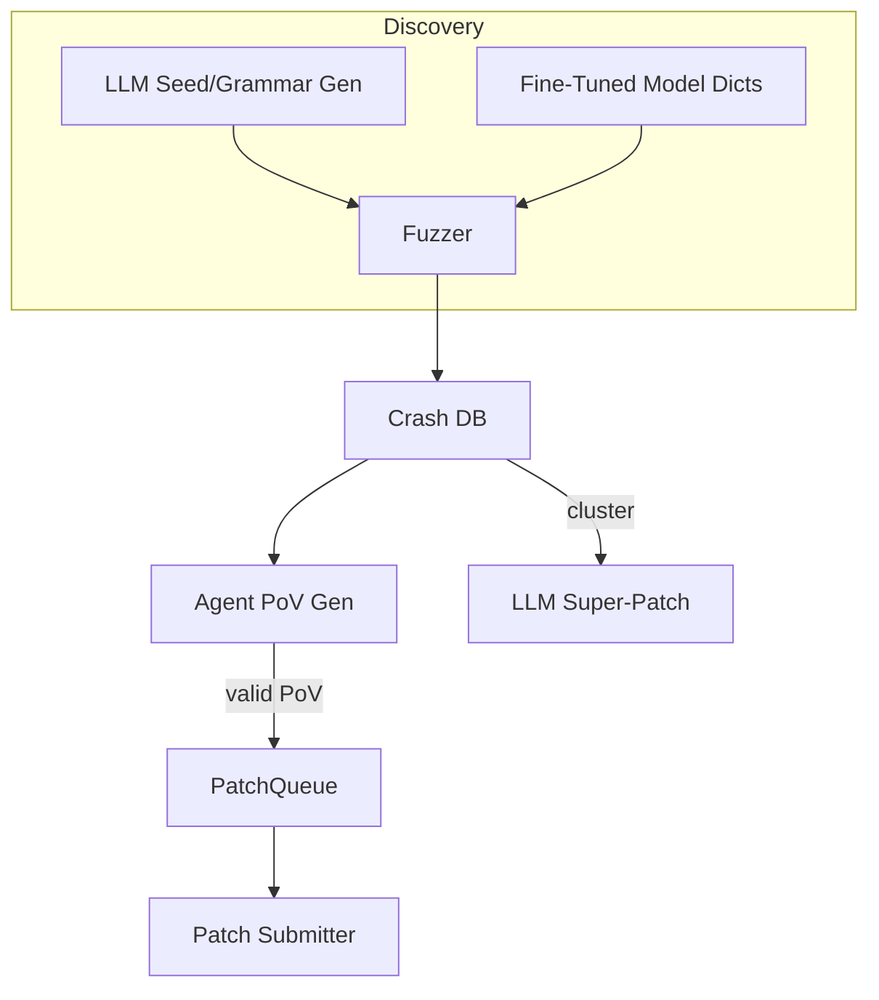

# Fuzzing Asistido por IA y Descubrimiento Automatizado de Vulnerabilidades

{{#include ../banners/hacktricks-training.md}}

## Descripción general
Los modelos de lenguaje de gran escala (LLMs) pueden potenciar enormemente los pipelines tradicionales de investigación de vulnerabilidades al generar entradas con gran riqueza semántica, evolucionar gramáticas, razonar sobre datos de crashes e incluso proponer parches para múltiples bugs. Esta página recopila los patrones más eficaces observados durante las finales del AI Cyber Challenge (AIxCC) de DARPA y en otras investigaciones públicas.

Lo que sigue no es una descripción del sistema de una competición específica, sino una abstracción de las técnicas para que puedas reproducirlas en tus propios workflows.

---

## 1. Entradas seed generadas por LLMs

Los fuzzers tradicionales guiados por cobertura (AFL++, libFuzzer, Honggfuzz…) comienzan con un corpus pequeño de seeds y mutan bytes a ciegas. Cuando el formato de entrada objetivo es complejo (SQL, URLs, protocolos binarios personalizados), las mutaciones aleatorias suelen romper la sintaxis antes de alcanzar ramas interesantes.

Los LLMs pueden resolver este problema de bootstrap generando *seed generators*: scripts cortos que producen **entradas sintácticamente correctas pero relevantes para la seguridad**. Por ejemplo:
```prompt
SYSTEM: You are a helpful security engineer.
USER:
Write a Python3 program that prints 200 unique SQL injection strings targeting common anti-pattern mistakes (missing quotes, numeric context, stacked queries).  Ensure length ≤ 256 bytes / string so they survive common length limits.
```

```python
# gen_sqli_seeds.py (truncated)
PAYLOADS = [
"1 OR 1=1 -- ",
"' UNION SELECT NULL,NULL--",
"0; DROP TABLE users;--",
...
]
for p in PAYLOADS:
print(p)
```
Ejecuta una vez y alimenta la salida directamente al corpus inicial del fuzzer:
```bash
python3 gen_sqli_seeds.py > seeds.txt
afl-fuzz -i seeds.txt -o findings/ -- ./target @@
```
Beneficios:
1. Validez semántica → mayor cobertura desde el principio.
2. Regenerable: ajusta el prompt para centrarse en XSS, path traversal, binary blobs, etc.
3. Económico (< 1 ¢ con GPT-3.5).

### Consejos
* Indica al modelo que *diversifique* la longitud y la codificación de los payloads (UTF-8, codificado en URL, UTF-16-LE) para eludir filtros superficiales.
* Pide un *script único y autocontenido*: evita problemas de formato JSON.

---

## 2. Fuzzing mediante evolución de gramáticas

Una variante más potente consiste en permitir que el LLM **evolucione una gramática** en lugar de seeds concretos. El flujo de trabajo (patrón “Grammar Guy”) es:

1. Generar una gramática inicial de ANTLR/Peach/LibFuzzer mediante un prompt.
2. Ejecutar el fuzzing durante N minutos y recopilar métricas de cobertura (edges / blocks alcanzados).
3. Resumir las áreas del programa no cubiertas y enviar el resumen de vuelta al modelo:
```prompt
The previous grammar triggered 12 % of the program edges.  Functions not reached: parse_auth, handle_upload.  Add / modify rules to cover these.
```
4. Combinar las nuevas reglas, volver a ejecutar el fuzzing y repetir.

Esqueleto de pseudocódigo:
```python
for epoch in range(MAX_EPOCHS):
grammar = llm.refine(grammar, feedback=coverage_stats)
save(grammar, f"grammar_{epoch}.txt")
coverage_stats = run_fuzzer(grammar)
```
Puntos clave:
* Mantén un *presupuesto*: cada refinamiento consume tokens.
* Usa instrucciones `diff` + `patch` para que el modelo edite en lugar de reescribir.
* Detente cuando Δcoverage < ε.

---

## 3. Generación de PoV (Exploit) basada en agentes

Después de encontrar un crash, todavía necesitas un **proof-of-vulnerability (PoV)** que lo desencadene de forma determinista.

Un enfoque escalable consiste en iniciar *miles* de agentes ligeros (<process/thread/container/prisoner>), cada uno ejecutando un LLM diferente (GPT-4, Claude, Mixtral) o una configuración de temperature distinta.

Pipeline:
1. El análisis estático/dinámico produce *bug candidates* (struct con crash PC, input slice, sanitizer msg).
2. El orquestador distribuye los candidatos entre los agentes.
3. Pasos de razonamiento del agente:
a. Reproducir el bug localmente con `gdb` + input.
b. Sugerir un exploit payload mínimo.
c. Validar el exploit en un sandbox. Si tiene éxito → enviarlo.
4. Los intentos fallidos se **vuelven a poner en cola como nuevos seeds** para el coverage fuzzing (feedback loop).

Ventajas:
* La paralelización oculta la falta de fiabilidad de un solo agente.
* Ajuste automático de temp / model size según el success-rate observado.

---

## 4. Directed Fuzzing con Code Models ajustados mediante fine-tuning

Realiza fine-tuning de un modelo open-weight (por ejemplo, Llama-7B) con código fuente C/C++ etiquetado con vulnerability patterns (integer overflow, buffer copy, format string). Después:

1. Ejecuta análisis estático para obtener la lista de funciones + AST.
2. Indica al modelo: *“Give mutation dictionary entries that are likely to break memory safety in function X”*.
3. Inserta esos tokens en un `AFL_CUSTOM_MUTATOR`.

Ejemplo de output para un wrapper de `sprintf`:
```
{"pattern":"%99999999s"}
{"pattern":"AAAAAAAA....<1024>....%n"}
```
Empíricamente, esto reduce el tiempo hasta el crash en más de 2× en objetivos reales.

---

## 5. Estrategias de Patching Guiadas por AI

### 5.1 Super Patches
Pide al modelo que *agrupe* las firmas de crash y proponga un **único patch** que elimine la causa raíz común. Envíalo una vez y corrige varios bugs → menos penalizaciones de precisión en entornos donde cada patch incorrecto resta puntos.

Esquema del prompt:
```
Here are 10 stack traces + file snippets.  Identify the shared mistake and generate a unified diff fixing all occurrences.
```
### 5.2 Speculative Patch Ratio
Implementa una cola en la que los patches confirmados y validados mediante PoV y los patches *speculative* (sin PoV) se intercalen con una proporción de 1:​N ajustada a las reglas de puntuación (p. ej., 2 speculative : 1 confirmado). Un modelo de costes monitoriza las penalizaciones frente a los puntos y ajusta N automáticamente.

---

## 6. Deterministic File-by-File AI Code Review

Un modo frecuente de fallo en la revisión asistida por AI consiste en pedir a un agente que inspeccione todo un repositorio y esperar que seleccione los archivos y términos de grep adecuados. Un patrón más fiable es **forzar la cobertura del repositorio**:

1. Enumera los archivos de código fuente.
2. Envía **un archivo cada vez** junto con el contexto mínimo (entrypoint, imports, rutas y callers cercanos).
3. Exige un **informe estructurado** para cada archivo: sources, sink, validación ausente, precondiciones de explotación y nivel de confianza.
4. Deduplica los informes por **patrón source→sink** y valida manualmente los de mayor riesgo.

Este proceso consume muchos tokens y genera ruido, pero es muy eficaz para detectar **bugs sencillos de alto impacto en sources/sinks** que las revisiones agentic amplias suelen pasar por alto.

### Triage patterns worth prioritising

- **Dynamic PHP include/dispatch**: nombres de route/controller/module controlados por el atacante que llegan a `require_once()`, `include()` o `include_once()` sin una allowlist estricta ni canonicalización de rutas.
- **Shell execution in admin/account workflows**: usernames, domains, cuentas FTP u otros identificadores que llegan a `exec()`, `system()`, `shell_exec()`, `passthru()`, `proc_open()` o `popen()`.
- **Structured input fan-in**: el mismo parámetro aceptado desde `$_GET`, `$_POST`, JSON, XML o parsers de body del framework, y reutilizado posteriormente en sinks del sistema de archivos o de comandos del sistema operativo.

### Two practical bug classes this method finds well

- **PHP controller-dispatch LFI/RCE**: si el nombre del controller controlado por la request se concatena en `require_once()` sin allowlist ni normalización de rutas, secuencias de traversal como `../` pueden hacer que PHP incluya un archivo `.php` local no previsto. Si el atacante puede apuntar el include a un archivo PHP plantado o útil por cualquier otro motivo, el LFI se convierte en ejecución de código. Consulta [File Inclusion / Path Traversal](../pentesting-web/file-inclusion/README.md).
- **Authenticated command injection in hosting/admin panels**: si campos de gestión de cuentas, como los usernames, se incorporan a comandos de shell, un usuario autenticado con pocos privilegios puede convertir una acción normal de creación/eliminación en RCE. El impacto aumenta cuando el panel ejecuta el comando como una service account con más privilegios. Consulta [Command Injection](../pentesting-web/command-injection.md).

### Practical review notes

- Usa el LLM primero como **source/sink reviewer**, no como generador de exploits.
- Pídele que enumere explícitamente el **campo controlado por el atacante**, la **brecha de normalización/validación** y el **sink peligroso**.
- En repositorios grandes, la revisión determinista archivo por archivo suele ser más fiable que una única ejecución de un agente autónomo, incluso cuando esta utiliza un modelo más potente.
- Espera resultados más débiles en **Broken Access Control** y otros bugs de lógica de negocio cuya explotabilidad depende de suposiciones entre archivos, semántica de roles o threat models específicos del producto.

---

## Putting It All Together
Un CRS (Cyber Reasoning System) end-to-end puede conectar los componentes de la siguiente manera:

```mermaid
graph TD
subgraph Discovery
A[LLM Seed/Grammar Gen] --> B[Fuzzer]
C[Fine-Tuned Model Dicts] --> B
end
B --> D[Crash DB]
D --> E[Agent PoV Gen]
E -->|valid PoV| PatchQueue
D -->|cluster| F[LLM Super-Patch]
PatchQueue --> G[Patch Submitter]
```
---

## Referencias
* [Project Black - AI local para Cyber Security: Finding phpIPAM LFI and myVesta Authenticated RCE](https://projectblack.io/blog/local-ai-for-cyber-security)
* [Strix](https://github.com/usestrix/strix)
* [GitHub Copilot community security-review skill](https://github.com/github/awesome-copilot/blob/main/skills/security-review/SKILL.md)
* [Trail of Bits – finales de AIxCC: Tale of the tape](https://blog.trailofbits.com/2025/08/07/aixcc-finals-tale-of-the-tape/)
* [Entrevistas a finalistas de CTF Radiooo AIxCC](https://www.youtube.com/@ctfradiooo)
{{#include ../banners/hacktricks-training.md}}
