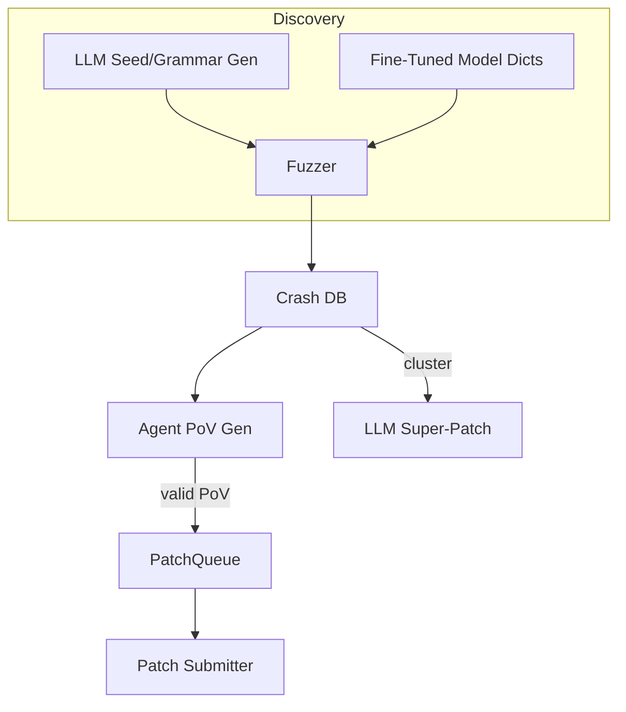

# Fuzzing με υποβοήθηση AI και Αυτοματοποιημένη Ανακάλυψη Ευπαθειών

{{#include ../banners/hacktricks-training.md}}

## Επισκόπηση
Τα μοντέλα μεγάλων γλωσσών (LLMs) μπορούν να ενισχύσουν σημαντικά τα παραδοσιακά pipelines έρευνας ευπαθειών, δημιουργώντας σημασιολογικά εμπλουτισμένα inputs, εξελίσσοντας γραμματικές, αναλύοντας δεδομένα από crashes και προτείνοντας ακόμη και patches για πολλαπλά bugs. Αυτή η σελίδα συγκεντρώνει τα πιο αποτελεσματικά patterns που παρατηρήθηκαν στους τελικούς του DARPA AI Cyber Challenge (AIxCC) και σε άλλες δημόσιες έρευνες.

Ακολουθεί όχι μια περιγραφή ενός συγκεκριμένου συστήματος διαγωνισμού, αλλά μια αφαίρεση των τεχνικών, ώστε να μπορείτε να τις αναπαραγάγετε στα δικά σας workflows.

---

## 1. Seed Inputs που δημιουργούνται από LLM

Οι παραδοσιακοί coverage-guided fuzzers (AFL++, libFuzzer, Honggfuzz…) ξεκινούν με ένα μικρό corpus από seeds και μεταλλάσσουν bytes χωρίς καμία σημασιολογική κατανόηση. Όταν το format του input-στόχου είναι σύνθετο (SQL, URLs, custom binary protocols), οι τυχαίες μεταλλάξεις συνήθως καταστρέφουν τη σύνταξη πριν επιτευχθούν ενδιαφέροντα branches.

Τα LLMs μπορούν να λύσουν αυτό το bootstrap πρόβλημα, παράγοντας *seed generators* – σύντομα scripts που παράγουν **inputs με σωστή σύνταξη αλλά σχετιζόμενα με την ασφάλεια**. Για παράδειγμα:
```prompt
SYSTEM: You are a helpful security engineer.
USER:
Write a Python3 program that prints 200 unique SQL injection strings targeting common anti-pattern mistakes (missing quotes, numeric context, stacked queries).  Ensure length ≤ 256 bytes / string so they survive common length limits.
```

```python
# gen_sqli_seeds.py (truncated)
PAYLOADS = [
"1 OR 1=1 -- ",
"' UNION SELECT NULL,NULL--",
"0; DROP TABLE users;--",
...
]
for p in PAYLOADS:
print(p)
```
Εκτελέστε το μία φορά και τροφοδοτήστε την έξοδο απευθείας στο αρχικό corpus του fuzzer:
```bash
python3 gen_sqli_seeds.py > seeds.txt
afl-fuzz -i seeds.txt -o findings/ -- ./target @@
```
Benefits:
1. Semantic validity → deeper coverage early.
2. Re-generatable: tweak the prompt to focus on XSS, path traversal, binary blobs, etc.
3. Cheap (< 1 ¢ with GPT-3.5).

### Tips
* Instruct the model to *diversify* payload length and encoding (UTF-8, URL-encoded, UTF-16-LE) to bypass superficial filters.
* Ask for a *single self-contained script* – avoids JSON formatting hiccups.

---

## 2. Grammar-Evolution Fuzzing

Μια πιο ισχυρή παραλλαγή είναι να αφήσετε το LLM να **εξελίξει μια grammar** αντί για συγκεκριμένα seeds. Η ροή εργασίας (το μοτίβο “Grammar Guy”) είναι:

1. Δημιουργήστε μια αρχική grammar για ANTLR/Peach/LibFuzzer μέσω prompt.
2. Εκτελέστε fuzzing για N λεπτά και συλλέξτε metrics κάλυψης (edges / blocks που ενεργοποιήθηκαν).
3. Συνοψίστε τις περιοχές του προγράμματος που δεν καλύφθηκαν και τροφοδοτήστε ξανά τη σύνοψη στο model:
```prompt
The previous grammar triggered 12 % of the program edges.  Functions not reached: parse_auth, handle_upload.  Add / modify rules to cover these.
```
4. Συγχωνεύστε τους νέους κανόνες, εκτελέστε ξανά fuzzing και επαναλάβετε.

Σκελετός pseudo-code:
```python
for epoch in range(MAX_EPOCHS):
grammar = llm.refine(grammar, feedback=coverage_stats)
save(grammar, f"grammar_{epoch}.txt")
coverage_stats = run_fuzzer(grammar)
```
Βασικά σημεία:
* Κράτα ένα *budget* – κάθε refinement χρησιμοποιεί tokens.
* Χρησιμοποίησε οδηγίες `diff` + `patch`, ώστε το model να επεξεργάζεται αντί να ξαναγράφει.
* Σταμάτα όταν Δcoverage < ε.

---

## 3. Παραγωγή Agent-Based PoV (Exploit)

Αφού βρεθεί ένα crash, χρειάζεσαι ακόμη ένα **proof-of-vulnerability (PoV)** που το ενεργοποιεί με deterministically.

Μια scalable προσέγγιση είναι να εκκινήσεις *χιλιάδες* lightweight agents (<process/thread/container/prisoner>), καθένας από τους οποίους εκτελεί διαφορετικό LLM (GPT-4, Claude, Mixtral) ή διαφορετική ρύθμιση temperature.

Pipeline:
1. Η static/ dynamic analysis παράγει *bug candidates* (struct με crash PC, input slice, sanitizer msg).
2. Ο orchestrator διανέμει τους candidates στους agents.
3. Βήματα reasoning του agent:
a. Κάνε reproduce το bug τοπικά με `gdb` + input.
b. Πρότεινε minimal exploit payload.
c. Κάνε validate το exploit σε sandbox.  Αν επιτύχει → κάνε submit.
4. Οι αποτυχημένες προσπάθειες μπαίνουν ξανά στην ουρά ως νέα seeds για coverage fuzzing (feedback loop).

Πλεονεκτήματα:
* Η Parallelisation αποκρύπτει την unreliability ενός μεμονωμένου agent.
* Αυτόματο tuning των temp / model size με βάση το παρατηρούμενο success-rate.

---

## 4. Directed Fuzzing με Fine-Tuned Code Models

Κάνε fine-tune ένα open-weight model (π.χ. Llama-7B) σε source C/C++ με labels για vulnerability patterns (integer overflow, buffer copy, format string).  Στη συνέχεια:

1. Εκτέλεσε static analysis για να λάβεις τη λίστα συναρτήσεων + AST.
2. Κάνε prompt στο model: *“Give mutation dictionary entries that are likely to break memory safety in function X”*.
3. Εισήγαγε αυτά τα tokens σε ένα custom `AFL_CUSTOM_MUTATOR`.

Παράδειγμα output για ένα wrapper του `sprintf`:
```
{"pattern":"%99999999s"}
{"pattern":"AAAAAAAA....<1024>....%n"}
```
Εμπειρικά, αυτό μειώνει τον χρόνο μέχρι το crash κατά >2× σε πραγματικούς στόχους.

---

## 5. Στρατηγικές Patching με AI

### 5.1 Super Patches
Ζητήστε από το μοντέλο να *ομαδοποιήσει* τις υπογραφές των crashes και να προτείνει ένα **single patch** που εξαλείφει την κοινή root cause. Κάντε submit μία φορά, διορθώστε several bugs → λιγότερες ποινές ακρίβειας σε περιβάλλοντα όπου κάθε λανθασμένο patch κοστίζει points.

Περίγραμμα prompt:
```
Here are 10 stack traces + file snippets.  Identify the shared mistake and generate a unified diff fixing all occurrences.
```
### 5.2 Αναλογία Speculative Patch
Υλοποιήστε μια queue όπου τα confirmed PoV-validated patches και τα *speculative* patches (χωρίς PoV) παρεμβάλλονται σε αναλογία 1:​N, προσαρμοσμένη στους scoring rules (π.χ. 2 speculative : 1 confirmed). Ένα cost model παρακολουθεί τα penalties σε σχέση με τους πόντους και προσαρμόζει αυτόματα το N.

---

## 6. Deterministic File-by-File AI Code Review

Ένα συχνό failure mode στο AI-assisted review είναι να ζητάτε από έναν agent να επιθεωρήσει ένα ολόκληρο repository και να ελπίζετε ότι θα επιλέξει τα σωστά αρχεία και grep terms. Ένα πιο αξιόπιστο pattern είναι να **επιβάλλετε κάλυψη ολόκληρου του repository**:

1. Enumerate τα source files.
2. Στείλτε **ένα αρχείο τη φορά** μαζί με minimal context (entrypoint, imports, nearby routes/callers).
3. Απαιτήστε ένα **structured report** για κάθε αρχείο: sources, sink, missing validation, exploit preconditions και confidence.
4. Κάντε deduplicate τα reports με βάση το **source→sink pattern** και επικυρώστε χειροκίνητα τα high-risk ευρήματα.

Αυτό απαιτεί πολλά tokens και παράγει θόρυβο, αλλά είναι πολύ αποτελεσματικό στην ανάδειξη **απλών high-impact source/sink bugs** που συχνά διαφεύγουν από broad agentic reviews.

### Triage patterns που αξίζει να έχουν προτεραιότητα

- **Dynamic PHP include/dispatch**: attacker-controlled route/controller/module names που καταλήγουν σε `require_once()`, `include()` ή `include_once()` χωρίς strict allowlisting και path canonicalisation.
- **Shell execution σε admin/account workflows**: usernames, domains, FTP accounts ή άλλα identifiers που καταλήγουν σε `exec()`, `system()`, `shell_exec()`, `passthru()`, `proc_open()` ή `popen()`.
- **Structured input fan-in**: η ίδια παράμετρος γίνεται αποδεκτή από `$_GET`, `$_POST`, JSON, XML ή framework body parsers και αργότερα επαναχρησιμοποιείται σε filesystem ή OS-command sinks.

### Δύο πρακτικές bug classes που εντοπίζει καλά αυτή η μέθοδος

- **PHP controller-dispatch LFI/RCE**: αν ένα request-controlled controller name συνενώνεται σε `require_once()` χωρίς allowlist/path normalisation, sequences traversal όπως `../` μπορούν να κάνουν την PHP να συμπεριλάβει ένα unintended local `.php` file. Αν ο attacker μπορεί να κατευθύνει το include σε ένα planted ή με άλλο τρόπο χρήσιμο PHP file, το LFI μετατρέπεται σε code execution. Δείτε [File Inclusion / Path Traversal](../pentesting-web/file-inclusion/README.md).
- **Authenticated command injection σε hosting/admin panels**: αν account-management fields, όπως usernames, ενσωματώνονται σε shell commands, ένας low-privileged authenticated user μπορεί να μετατρέψει μια κανονική create/delete ενέργεια σε RCE. Το impact αυξάνεται όταν το panel εκτελεί την εντολή ως πιο privileged service account. Δείτε [Command Injection](../pentesting-web/command-injection.md).

### Practical review notes

- Χρησιμοποιήστε το LLM αρχικά ως **source/sink reviewer** και όχι ως exploit generator.
- Ζητήστε του να παραθέσει ρητά το **attacker-controlled field**, το **normalization/validation gap** και το **dangerous sink**.
- Σε μεγάλα repos, το deterministic per-file review είναι συχνά πιο αξιόπιστο από ένα single autonomous agent run, ακόμη και όταν το δεύτερο χρησιμοποιεί ισχυρότερο model.
- Περιμένετε πιο αδύναμα αποτελέσματα σε **Broken Access Control** και άλλα business-logic bugs, όπου η exploitability εξαρτάται από cross-file assumptions, role semantics ή product-specific threat models.

---

## Συνδυάζοντας τα πάντα
Ένα end-to-end CRS (Cyber Reasoning System) μπορεί να συνδέει τα components ως εξής:

```mermaid
graph TD
subgraph Discovery
A[LLM Seed/Grammar Gen] --> B[Fuzzer]
C[Fine-Tuned Model Dicts] --> B
end
B --> D[Crash DB]
D --> E[Agent PoV Gen]
E -->|valid PoV| PatchQueue
D -->|cluster| F[LLM Super-Patch]
PatchQueue --> G[Patch Submitter]
```
---

## Αναφορές
* [Project Black - Τοπικό AI για Cyber Security: Εντοπισμός LFI στο phpIPAM και Authenticated RCE στο myVesta](https://projectblack.io/blog/local-ai-for-cyber-security)
* [Strix](https://github.com/usestrix/strix)
* [GitHub Copilot community skill για security-review](https://github.com/github/awesome-copilot/blob/main/skills/security-review/SKILL.md)
* [Trail of Bits – Οι τελικοί του AIxCC: Η πλήρης εικόνα](https://blog.trailofbits.com/2025/08/07/aixcc-finals-tale-of-the-tape/)
* [Συνεντεύξεις φιναλίστ του CTF Radiooo AIxCC](https://www.youtube.com/@ctfradiooo)
{{#include ../banners/hacktricks-training.md}}
