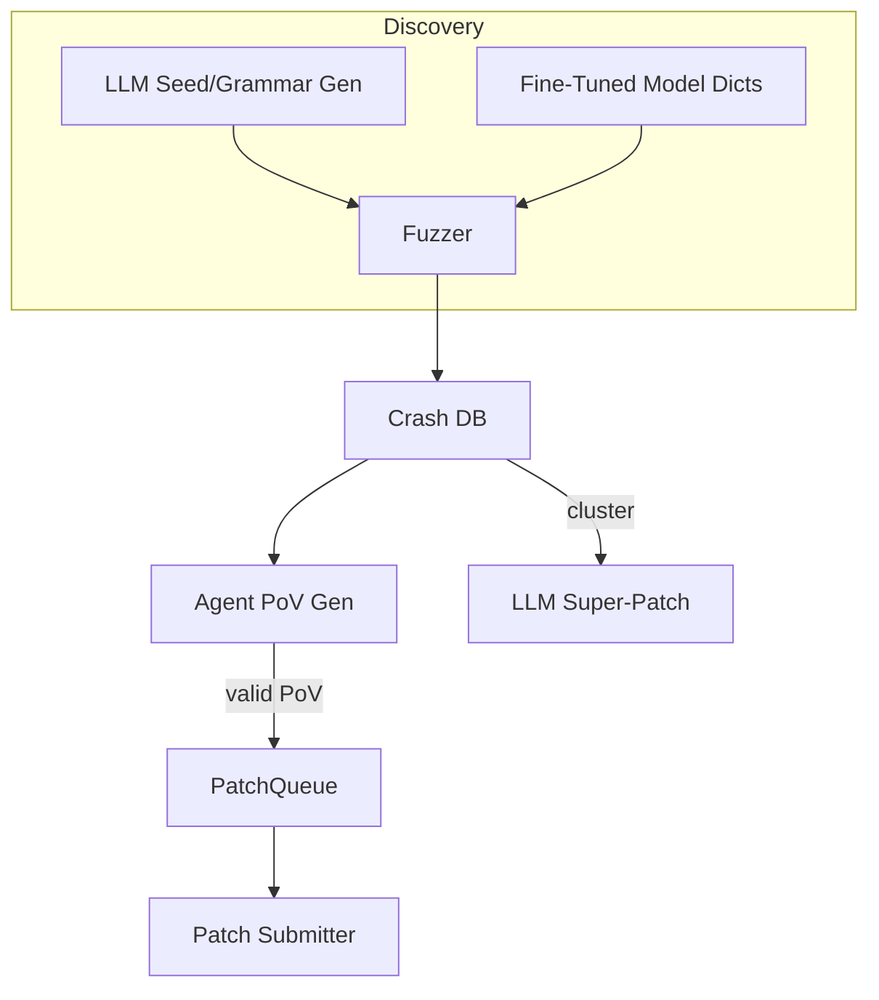

# AI-Assisted Fuzzing & Automated Vulnerability Discovery

{{#include ../banners/hacktricks-training.md}}

## Übersicht
Large-language models (LLMs) können traditionelle Vulnerability-Research-Pipelines deutlich leistungsfähiger machen, indem sie semantisch aussagekräftige Inputs generieren, Grammatiken weiterentwickeln, Crash-Daten analysieren und sogar Patches für mehrere Bugs vorschlagen. Diese Seite sammelt die effektivsten Muster, die während des Finales von DARPA’s AI Cyber Challenge (AIxCC) und anderer öffentlicher Forschungsarbeiten beobachtet wurden.

Im Folgenden wird nicht das System eines bestimmten Wettbewerbs beschrieben, sondern eine Abstraktion der Techniken, damit du sie in deinen eigenen Workflows reproduzieren kannst.

---

## 1. Von LLMs generierte Seed-Inputs

Traditionelle Coverage-guided Fuzzer (AFL++, libFuzzer, Honggfuzz …) beginnen mit einem kleinen Seed-Corpus und mutieren Bytes blind. Wenn das Zielformat komplex ist (SQL, URLs, benutzerdefinierte binäre Protokolle), zerstören zufällige Mutationen normalerweise die Syntax, bevor interessante Branches erreicht werden.

LLMs können dieses Bootstrap-Problem lösen, indem sie *Seed-Generatoren* ausgeben – kurze Scripts, die **syntaktisch korrekte, aber sicherheitsrelevante Inputs** erzeugen. Zum Beispiel:
```prompt
SYSTEM: You are a helpful security engineer.
USER:
Write a Python3 program that prints 200 unique SQL injection strings targeting common anti-pattern mistakes (missing quotes, numeric context, stacked queries).  Ensure length ≤ 256 bytes / string so they survive common length limits.
```

```python
# gen_sqli_seeds.py (truncated)
PAYLOADS = [
"1 OR 1=1 -- ",
"' UNION SELECT NULL,NULL--",
"0; DROP TABLE users;--",
...
]
for p in PAYLOADS:
print(p)
```
Einmal ausführen und die Ausgabe direkt in das initiale Corpus des Fuzzers einspeisen:
```bash
python3 gen_sqli_seeds.py > seeds.txt
afl-fuzz -i seeds.txt -o findings/ -- ./target @@
```
Benefits:
1. Semantische Gültigkeit → frühzeitig tiefere Abdeckung.
2. Erneut generierbar: Passe den Prompt an, um den Fokus auf XSS, Path Traversal, binäre Blobs usw. zu legen.
3. Günstig (< 1 ¢ mit GPT-3.5).

### Tipps
* Weise das Modell an, die Payload-Länge und -Kodierung (UTF-8, URL-encoded, UTF-16-LE) zu *diversifizieren*, um oberflächliche Filter zu umgehen.
* Bitte um ein *einzelnes eigenständiges Script* – dadurch werden Probleme bei der JSON-Formatierung vermieden.

---

## 2. Grammar-Evolution Fuzzing

Eine leistungsfähigere Variante besteht darin, das LLM eine **Grammar** statt konkreter Seeds **weiterentwickeln** zu lassen. Der Workflow (Muster „Grammar Guy“) sieht folgendermaßen aus:

1. Generiere per Prompt eine initiale ANTLR-/Peach-/LibFuzzer-Grammar.
2. Führe N Minuten lang Fuzzing aus und sammle Coverage-Metriken (getroffene Edges / Blocks).
3. Fasse die nicht abgedeckten Programmbereiche zusammen und übergib die Zusammenfassung wieder an das Modell:
```prompt
The previous grammar triggered 12 % of the program edges.  Functions not reached: parse_auth, handle_upload.  Add / modify rules to cover these.
```
4. Führe die neuen Regeln zusammen, starte das Fuzzing erneut und wiederhole den Vorgang.

Pseudo-Code-Grundgerüst:
```python
for epoch in range(MAX_EPOCHS):
grammar = llm.refine(grammar, feedback=coverage_stats)
save(grammar, f"grammar_{epoch}.txt")
coverage_stats = run_fuzzer(grammar)
```
Wichtige Punkte:
* Ein *Budget* einhalten – jede Verfeinerung verwendet Tokens.
* `diff`- + `patch`-Anweisungen verwenden, damit das Modell editiert statt neu zu schreiben.
* Anhalten, wenn Δcoverage < ε.

---

## 3. Agent-Based PoV (Exploit) Generation

Nach dem Auffinden eines Crashes wird weiterhin ein **proof-of-vulnerability (PoV)** benötigt, das ihn deterministisch auslöst.

Ein skalierbarer Ansatz besteht darin, *Tausende* leichtgewichtige Agents (<process/thread/container/prisoner>) zu starten, wobei jeder einen anderen LLM (GPT-4, Claude, Mixtral) oder eine andere Temperature-Einstellung verwendet.

Pipeline:
1. Statische/dynamische Analyse erzeugt *Bug-Kandidaten* (Struct mit Crash-PC, Input-Slice, Sanitizer-Meldung).
2. Der Orchestrator verteilt die Kandidaten an die Agents.
3. Schritte des Agent-Reasonings:
a. Bug lokal mit `gdb` + Input reproduzieren.
b. Minimales Exploit-Payload vorschlagen.
c. Exploit in der Sandbox validieren. Bei Erfolg → einreichen.
4. Fehlgeschlagene Versuche werden als neue Seeds für das Coverage-Fuzzing erneut in die Queue gestellt (Feedback-Loop).

Vorteile:
* Parallelisierung kaschiert die Unzuverlässigkeit einzelner Agents.
* Automatische Anpassung von Temp./Modelgröße basierend auf der beobachteten Erfolgsrate.

---

## 4. Directed Fuzzing with Fine-Tuned Code Models

Ein Open-Weight-Modell (z. B. Llama-7B) auf C/C++-Quellcode feinabstimmen, der mit Vulnerability-Patterns (Integer Overflow, Buffer Copy, Format String) gekennzeichnet ist. Anschließend:

1. Statische Analyse ausführen, um Funktionsliste + AST zu erhalten.
2. Das Modell prompten: *„Gib Mutation-Dictionary-Einträge an, die wahrscheinlich die Memory Safety in Funktion X verletzen“*.
3. Diese Tokens in einen benutzerdefinierten `AFL_CUSTOM_MUTATOR` einfügen.

Beispielausgabe für einen `sprintf`-Wrapper:
```
{"pattern":"%99999999s"}
{"pattern":"AAAAAAAA....<1024>....%n"}
```
Empirisch verkürzt dies die Zeit bis zum Crash bei realen Zielen um mehr als das 2-Fache.

---

## 5. AI-Guided Patching Strategies

### 5.1 Super Patches
Fordere das Modell auf, Crash-Signaturen zu *clustern* und einen **einzigen Patch** vorzuschlagen, der die gemeinsame Ursache beseitigt. Einmal einreichen, mehrere Bugs beheben → weniger Genauigkeitsabzüge in Umgebungen, in denen jeder falsche Patch Punkte kostet.

Prompt outline:
```
Here are 10 stack traces + file snippets.  Identify the shared mistake and generate a unified diff fixing all occurrences.
```
### 5.2 Verhältnis spekulativer Patches
Implementiere eine Queue, in der bestätigte, durch PoV validierte Patches und *spekulative* Patches (ohne PoV) in einem 1:N-Verhältnis vermischt werden, das an die Scoring-Regeln angepasst ist (z. B. 2 spekulative : 1 bestätigter Patch). Ein Kostenmodell überwacht Penalties im Verhältnis zu den Punkten und passt N automatisch an.

---

## 6. Deterministisches AI Code Review Datei für Datei

Ein häufiger Fehler bei AI-gestütztem Review besteht darin, einen Agenten aufzufordern, ein komplettes Repository zu untersuchen, und darauf zu hoffen, dass er die richtigen Dateien und grep-Begriffe auswählt. Ein zuverlässigeres Muster besteht darin, die Abdeckung des Repositorys zu **erzwingen**:

1. Quelldateien enumerieren.
2. **Eine Datei nach der anderen** zusammen mit minimalem Kontext senden (Entrypoint, Imports, nahegelegene Routes/Caller).
3. Für jede Datei einen **strukturierten Report** verlangen: Sources, Sink, fehlende Validierung, Exploit-Voraussetzungen und Confidence.
4. Reports anhand des **Source→Sink-Musters** deduplizieren und die risikoreichsten manuell validieren.

Dies ist tokenintensiv und erzeugt viel Rauschen, aber es ist sehr effektiv darin, **einfache Source/Sink-Bugs mit hoher Auswirkung** aufzudecken, die bei breit angelegten agentischen Reviews häufig übersehen werden.

### Triage-Muster, die priorisiert werden sollten

- **Dynamisches PHP-Include/Dispatch**: Vom Angreifer kontrollierte Route-/Controller-/Modulnamen gelangen ohne strikte Allowlist und Path Canonicalisation in `require_once()`, `include()` oder `include_once()`.
- **Shell-Ausführung in Admin-/Account-Workflows**: Usernames, Domains, FTP-Accounts oder andere Identifier gelangen in `exec()`, `system()`, `shell_exec()`, `passthru()`, `proc_open()` oder `popen()`.
- **Fan-in strukturierter Eingaben**: Derselbe Parameter wird aus `$_GET`, `$_POST`, JSON, XML oder Framework-Body-Parsern akzeptiert und später in Filesystem- oder OS-Command-Sinks wiederverwendet.

### Zwei praktische Bug-Klassen, die diese Methode gut findet

- **PHP-Controller-Dispatch-LFI/RCE**: Wenn ein request-gesteuerter Controller-Name ohne Allowlist/Path-Normalisierung mit `require_once()` verkettet wird, können Traversal-Sequenzen wie `../` dazu führen, dass PHP eine unbeabsichtigte lokale `.php`-Datei einbindet. Wenn der Angreifer das Include auf eine platzierte oder anderweitig nützliche PHP-Datei verweisen lassen kann, wird die LFI zu Code Execution. Siehe [File Inclusion / Path Traversal](../pentesting-web/file-inclusion/README.md).
- **Authentifizierte Command Injection in Hosting-/Admin-Panels**: Wenn Account-Management-Felder wie Usernames in Shell-Commands eingebettet werden, kann ein authentifizierter Benutzer mit niedrigen Privilegien eine normale Create-/Delete-Aktion in RCE umwandeln. Die Auswirkungen steigen, wenn das Panel den Command als privilegierterer Service-Account ausführt. Siehe [Command Injection](../pentesting-web/command-injection.md).

### Praktische Review-Hinweise

- Verwende das LLM zuerst als **Source/Sink-Reviewer**, nicht als Exploit-Generator.
- Fordere es auf, das **vom Angreifer kontrollierte Feld**, die **Lücke bei Normalisierung/Validierung** und den **gefährlichen Sink** ausdrücklich aufzulisten.
- Bei großen Repositories ist ein deterministisches Review pro Datei häufig zuverlässiger als ein einzelner autonomer Agent-Run, selbst wenn letzterer ein stärkeres Modell verwendet.
- Erwarte schwächere Ergebnisse bei **Broken Access Control** und anderen Business-Logic-Bugs, bei denen die Exploitability von Annahmen über mehrere Dateien, Rollensemantik oder produktspezifische Threat Models abhängt.

---

## Alles zusammenführen
Ein End-to-End-CRS (Cyber Reasoning System) kann die Komponenten beispielsweise wie folgt verdrahten:

```mermaid
graph TD
subgraph Discovery
A[LLM Seed/Grammar Gen] --> B[Fuzzer]
C[Fine-Tuned Model Dicts] --> B
end
B --> D[Crash DB]
D --> E[Agent PoV Gen]
E -->|valid PoV| PatchQueue
D -->|cluster| F[LLM Super-Patch]
PatchQueue --> G[Patch Submitter]
```
---

## Referenzen
* [Project Black – Lokale AI für Cyber Security: Finden von phpIPAM LFI und authentifiziertem RCE in myVesta](https://projectblack.io/blog/local-ai-for-cyber-security)
* [Strix](https://github.com/usestrix/strix)
* [GitHub Copilot Community-Security-Review-Skill](https://github.com/github/awesome-copilot/blob/main/skills/security-review/SKILL.md)
* [Trail of Bits – AIxCC-Finals: Tale of the tape](https://blog.trailofbits.com/2025/08/07/aixcc-finals-tale-of-the-tape/)
* [CTF Radiooo AIxCC-Finalisten-Interviews](https://www.youtube.com/@ctfradiooo)
{{#include ../banners/hacktricks-training.md}}
