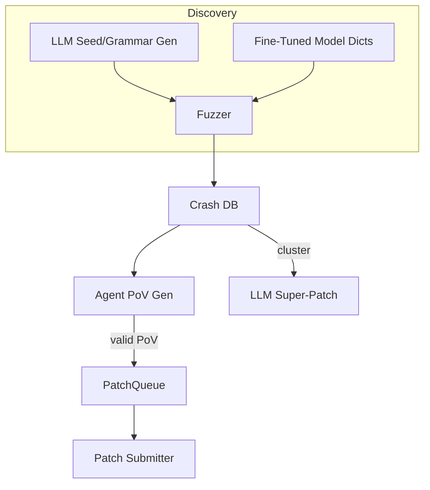

# AI Destekli Fuzzing ve Otomatik Zafiyet Keşfi

{{#include ../banners/hacktricks-training.md}}

## Genel Bakış
Büyük dil modelleri (LLM'ler), semantik açıdan zengin girdiler oluşturarak, grammar'ları geliştirerek, crash verileri üzerinde akıl yürüterek ve hatta birden fazla bug için patch önerileri sunarak geleneksel zafiyet araştırma süreçlerini büyük ölçüde güçlendirebilir. Bu sayfa, DARPA'nın AI Cyber Challenge (AIxCC) finallerinde ve diğer herkese açık araştırmalarda gözlemlenen en etkili yöntemleri bir araya getirir.

Aşağıda belirli bir yarışma sisteminin açıklaması değil, bu teknikleri kendi workflow'larınızda yeniden uygulayabilmeniz için bir soyutlama sunulmaktadır.

---

## 1. LLM Tarafından Üretilen Seed Input'lar

Geleneksel coverage-guided fuzzer'lar (AFL++, libFuzzer, Honggfuzz…) küçük bir seed corpus'u ile başlar ve byte'ları rastgele şekilde mutate eder. Hedef input formatı karmaşık olduğunda (SQL, URL'ler, özel binary protocol'ler), rastgele mutation'lar genellikle ilginç branch'lere ulaşılmadan önce syntax'ı bozar.

LLM'ler, **syntax açısından doğru ancak güvenlik açısından önemli input'lar** üreten kısa script'ler olan *seed generator*'lar oluşturarak bu başlangıç sorununu çözebilir. Örneğin:
```prompt
SYSTEM: You are a helpful security engineer.
USER:
Write a Python3 program that prints 200 unique SQL injection strings targeting common anti-pattern mistakes (missing quotes, numeric context, stacked queries).  Ensure length ≤ 256 bytes / string so they survive common length limits.
```

```python
# gen_sqli_seeds.py (truncated)
PAYLOADS = [
"1 OR 1=1 -- ",
"' UNION SELECT NULL,NULL--",
"0; DROP TABLE users;--",
...
]
for p in PAYLOADS:
print(p)
```
Bir kez çalıştırın ve çıktıyı doğrudan fuzzer’ın başlangıç corpus’una aktarın:
```bash
python3 gen_sqli_seeds.py > seeds.txt
afl-fuzz -i seeds.txt -o findings/ -- ./target @@
```
Faydaları:
1. Semantik geçerlilik → erken aşamada daha derin kapsam.
2. Yeniden üretilebilir: XSS, path traversal, binary blobs vb. konulara odaklanmak için prompt'u değiştirin.
3. Ucuz (< 1 ¢ with GPT-3.5).

### İpuçları
* Yüzeysel filtreleri bypass etmek için modelden payload uzunluğunu ve encoding'i (UTF-8, URL-encoded, UTF-16-LE) *çeşitlendirmesini* isteyin.
* *Tek ve kendi içinde tamamen bağımsız bir script* isteyin – JSON biçimlendirme sorunlarını önler.

---

## 2. Grammar-Evolution Fuzzing

Daha güçlü bir varyant, LLM'nin somut seed'ler yerine bir **grammar'ı geliştirmesine** izin vermektir. İş akışı (“Grammar Guy” pattern) şöyledir:

1. Prompt aracılığıyla başlangıç niteliğinde bir ANTLR/Peach/LibFuzzer grammar'ı oluşturun.
2. N dakika boyunca fuzzing yapın ve coverage metriklerini (edges / blocks hit) toplayın.
3. Ulaşılamayan program alanlarını özetleyin ve özeti modele geri gönderin:
```prompt
The previous grammar triggered 12 % of the program edges.  Functions not reached: parse_auth, handle_upload.  Add / modify rules to cover these.
```
4. Yeni rule'ları birleştirin, yeniden fuzzing yapın ve tekrarlayın.

Pseudo-code skeleton:
```python
for epoch in range(MAX_EPOCHS):
grammar = llm.refine(grammar, feedback=coverage_stats)
save(grammar, f"grammar_{epoch}.txt")
coverage_stats = run_fuzzer(grammar)
```
Temel noktalar:
* Bir *budget* koruyun – her refinement token kullanır.
* Modelin yeniden yazmak yerine düzenleme yapması için `diff` + `patch` talimatlarını kullanın.
* Δcoverage < ε olduğunda durun.

---

## 3. Agent Tabanlı PoV (Exploit) Üretimi

Bir crash bulunduktan sonra, onu deterministik olarak tetikleyen bir **proof-of-vulnerability (PoV)** oluşturmanız gerekir.

Ölçeklenebilir bir yaklaşım, her biri farklı bir LLM (GPT-4, Claude, Mixtral) veya temperature ayarı çalıştıran *binlerce* lightweight agent (<process/thread/container/prisoner>) başlatmaktır.

Pipeline:
1. Static/ dynamic analysis, *bug candidates* üretir (crash PC, input slice ve sanitizer msg içeren struct).
2. Orchestrator, adayları agent'lara dağıtır.
3. Agent reasoning adımları:
a. Bug'ı yerel olarak `gdb` + input ile yeniden üretin.
b. Minimal exploit payload önerin.
c. Exploit'i sandbox'ta doğrulayın.  Başarılıysa → submit edin.
4. Başarısız denemeler, coverage fuzzing için **new seeds** olarak yeniden kuyruğa alınır (feedback loop).

Avantajlar:
* Parallelisation, tek bir agent'ın güvenilmezliğini gizler.
* Gözlemlenen success-rate'e göre temp / model size otomatik olarak ayarlanır.

---

## 4. Fine-Tuned Code Models ile Directed Fuzzing

Bir open-weight model'i (ör. Llama-7B), vulnerability pattern'leri (integer overflow, buffer copy, format string) ile etiketlenmiş C/C++ source üzerinde fine-tune edin. Ardından:

1. Static analysis çalıştırarak function list + AST elde edin.
2. Modele şu prompt'u verin: *“Give mutation dictionary entries that are likely to break memory safety in function X”*
3. Bu token'ları özel bir `AFL_CUSTOM_MUTATOR` içine ekleyin.

Bir `sprintf` wrapper için örnek çıktı:
```
{"pattern":"%99999999s"}
{"pattern":"AAAAAAAA....<1024>....%n"}
```
Empirik olarak bu, gerçek hedeflerde crash'e ulaşma süresini 2×'den fazla kısaltır.

---

## 5. AI-Guided Patchleme Stratejileri

### 5.1 Super Patches
Modelden crash imzalarını *cluster* etmesini ve ortak kök nedeni ortadan kaldıran **tek bir patch** önermesini isteyin. Bir kez gönderin, birden fazla bug'ı düzeltin → her yanlış patch'in puan kaybettirdiği ortamlarda daha az doğruluk cezası.

Prompt taslağı:
```
Here are 10 stack traces + file snippets.  Identify the shared mistake and generate a unified diff fixing all occurrences.
```
### 5.2 Speculative Patch Oranı
Confirmed PoV-validated patch'leri ve *speculative* patch'leri (PoV olmadan) scoring rules'a göre ayarlanmış 1:N oranında (ör. 2 speculative : 1 confirmed) interleave eden bir queue uygulayın. Bir cost model, penalties ile points arasındaki dengeyi izler ve N değerini otomatik olarak ayarlar.

---

## 6. Deterministic File-by-File AI Code Review

AI-assisted review'da sık görülen bir failure mode, tek bir agent'tan tüm repository'yi incelemesini ve doğru dosyaları ve grep terimlerini seçmesini beklemektir. Daha güvenilir bir pattern, **repository coverage'ı zorlamaktır**:

1. Source file'ları enumerate edin.
2. **Her seferinde tek bir dosyayı** minimal context (entrypoint, imports, yakın route'lar/caller'lar) ile gönderin.
3. Her dosya için şu bilgileri içeren **structured report** isteyin: sources, sink, eksik validation, exploit preconditions ve confidence.
4. Report'ları **source→sink pattern** temelinde deduplicate edin ve yüksek riskli olanları manuel olarak validate edin.

Bu yöntem token açısından maliyetli ve gürültülüdür; ancak geniş agentic review'ların sıklıkla gözden kaçırdığı **basit ve yüksek etkili source/sink bug'larını** ortaya çıkarmada oldukça etkilidir.

### Önceliklendirmeye değer triage pattern'leri

- **Dynamic PHP include/dispatch**: attacker-controlled route/controller/module isimlerinin, strict allowlisting ve path canonicalisation olmadan `require_once()`, `include()` veya `include_once()` içine aktarılması.
- **Admin/account workflow'larında shell execution**: username'lerin, domain'lerin, FTP account'larının veya diğer identifier'ların `exec()`, `system()`, `shell_exec()`, `passthru()`, `proc_open()` ya da `popen()` fonksiyonlarına ulaşması.
- **Structured input fan-in**: aynı parameter'ın `$_GET`, `$_POST`, JSON, XML veya framework body parser'larından kabul edilmesi ve daha sonra filesystem veya OS-command sink'lerinde yeniden kullanılması.

### Bu yöntemin iyi şekilde bulduğu iki pratik bug class'ı

- **PHP controller-dispatch LFI/RCE**: request-controlled controller name, allowlist/path normalisation olmadan `require_once()` içine birleştiriliyorsa, `../` gibi traversal sequence'ları PHP'nin istenmeyen bir local `.php` dosyasını include etmesini sağlayabilir. Attacker, include'u önceden yerleştirilmiş veya başka şekilde kullanılabilir bir PHP dosyasına yönlendirebiliyorsa LFI, code execution'a dönüşür. Bkz. [File Inclusion / Path Traversal](../pentesting-web/file-inclusion/README.md).
- **Hosting/admin panel'lerinde authenticated command injection**: username gibi account-management field'ları shell command'lara gömülüyorsa, low-privileged authenticated user normal bir create/delete action'ını RCE'ye dönüştürebilir. Panel command'ı daha privileged bir service account olarak çalıştırıyorsa impact artar. Bkz. [Command Injection](../pentesting-web/command-injection.md).

### Pratik review notları

- LLM'i öncelikle **source/sink reviewer** olarak kullanın, exploit generator olarak değil.
- Ondan **attacker-controlled field**'ı, **normalization/validation gap**'ini ve **dangerous sink**'i açıkça listelemesini isteyin.
- Büyük repo'larda deterministic per-file review, ikincisi daha güçlü bir model kullansa bile, çoğu zaman tek bir autonomous agent run'ından daha güvenilirdir.
- Exploitability'nin cross-file assumptions, role semantics veya product-specific threat model'lerine bağlı olduğu **Broken Access Control** ve diğer business-logic bug'larında daha zayıf sonuçlar bekleyin.

---

## Hepsini Bir Araya Getirmek
Uçtan uca bir CRS (Cyber Reasoning System), component'leri şu şekilde birbirine bağlayabilir:

```mermaid
graph TD
subgraph Discovery
A[LLM Seed/Grammar Gen] --> B[Fuzzer]
C[Fine-Tuned Model Dicts] --> B
end
B --> D[Crash DB]
D --> E[Agent PoV Gen]
E -->|valid PoV| PatchQueue
D -->|cluster| F[LLM Super-Patch]
PatchQueue --> G[Patch Submitter]
```
---

## Referanslar
* [Project Black - Cyber Security için Local AI: phpIPAM LFI ve myVesta Authenticated RCE Bulma](https://projectblack.io/blog/local-ai-for-cyber-security)
* [Strix](https://github.com/usestrix/strix)
* [GitHub Copilot community security-review skill](https://github.com/github/awesome-copilot/blob/main/skills/security-review/SKILL.md)
* [Trail of Bits – AIxCC finals: Tale of the tape](https://blog.trailofbits.com/2025/08/07/aixcc-finals-tale-of-the-tape/)
* [CTF Radiooo AIxCC finalist interviews](https://www.youtube.com/@ctfradiooo)
{{#include ../banners/hacktricks-training.md}}
