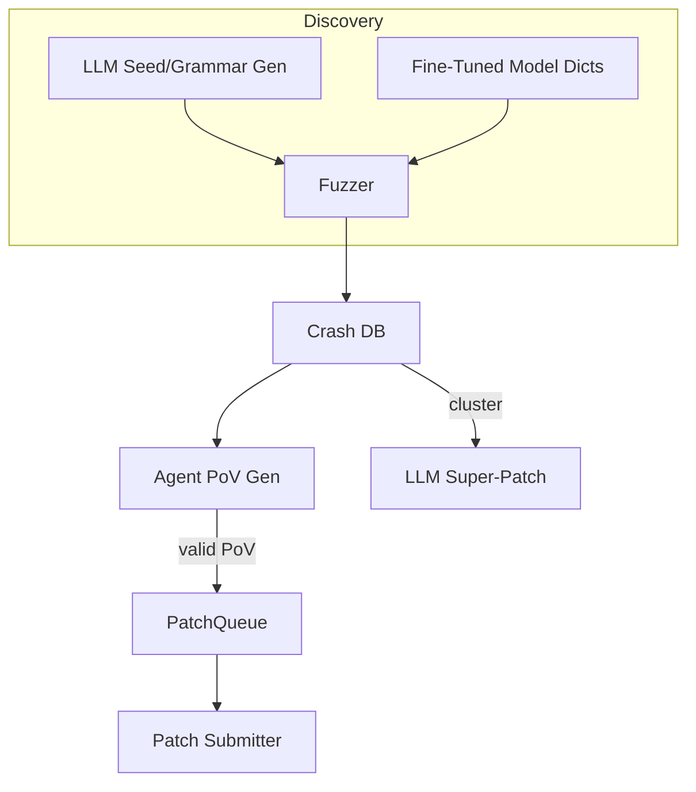

# Fuzzing Assistido por IA e Descoberta Automatizada de Vulnerabilidades

{{#include ../banners/hacktricks-training.md}}

## Visão geral
Os modelos de linguagem de grande escala (LLMs) podem potencializar os pipelines tradicionais de pesquisa de vulnerabilidades ao gerar entradas semanticamente ricas, evoluir gramáticas, raciocinar sobre dados de crashes e até propor patches para múltiplos bugs. Esta página reúne os padrões mais eficazes observados durante as finais do AI Cyber Challenge (AIxCC) da DARPA e em outras pesquisas públicas.

O conteúdo a seguir não descreve o sistema de uma competição específica, mas sim uma abstração das técnicas para que você possa reproduzi-las em seus próprios workflows.

---

## 1. Entradas Seed Geradas por LLM

Fuzzers tradicionais orientados por cobertura (AFL++, libFuzzer, Honggfuzz...) começam com um pequeno corpus de seeds e fazem mutações cegas nos bytes. Quando o formato de entrada do alvo é complexo (SQL, URLs, protocolos binários personalizados), as mutações aleatórias geralmente quebram a sintaxe antes que branches interessantes sejam alcançados.

Os LLMs podem resolver esse problema inicial emitindo *seed generators* – scripts curtos que produzem **entradas sintaticamente corretas, mas relevantes para a segurança**. Por exemplo:
```prompt
SYSTEM: You are a helpful security engineer.
USER:
Write a Python3 program that prints 200 unique SQL injection strings targeting common anti-pattern mistakes (missing quotes, numeric context, stacked queries).  Ensure length ≤ 256 bytes / string so they survive common length limits.
```

```python
# gen_sqli_seeds.py (truncated)
PAYLOADS = [
"1 OR 1=1 -- ",
"' UNION SELECT NULL,NULL--",
"0; DROP TABLE users;--",
...
]
for p in PAYLOADS:
print(p)
```
Execute uma vez e forneça a saída diretamente ao corpus inicial do fuzzer:
```bash
python3 gen_sqli_seeds.py > seeds.txt
afl-fuzz -i seeds.txt -o findings/ -- ./target @@
```
Benefits:
1. Validade semântica → cobertura mais profunda desde cedo.
2. Re-generatable: ajuste o prompt para focar em XSS, path traversal, binary blobs etc.
3. Barato (< 1 ¢ com GPT-3.5).

### Dicas
* Instrua o modelo a *diversificar* o comprimento e a codificação dos payloads (UTF-8, URL-encoded, UTF-16-LE) para contornar filtros superficiais.
* Peça um *script único e autocontido* – isso evita problemas de formatação JSON.

---

## 2. Grammar-Evolution Fuzzing

Uma variante mais poderosa é permitir que o LLM **evolua uma grammar** em vez de seeds concretas. O workflow (padrão “Grammar Guy”) é:

1. Gere uma grammar inicial do ANTLR/Peach/LibFuzzer usando um prompt.
2. Faça fuzzing por N minutos e colete métricas de cobertura (edges / blocks atingidos).
3. Resuma as áreas não cobertas do programa e envie o resumo de volta ao modelo:
```prompt
The previous grammar triggered 12 % of the program edges.  Functions not reached: parse_auth, handle_upload.  Add / modify rules to cover these.
```
4. Mescle as novas regras, faça fuzzing novamente e repita.

Esqueleto de pseudo-code:
```python
for epoch in range(MAX_EPOCHS):
grammar = llm.refine(grammar, feedback=coverage_stats)
save(grammar, f"grammar_{epoch}.txt")
coverage_stats = run_fuzzer(grammar)
```
Pontos principais:
* Mantenha um *orçamento* – cada refinamento usa tokens.
* Use instruções `diff` + `patch` para que o modelo edite em vez de reescrever.
* Pare quando Δcoverage < ε.

---

## 3. Geração de PoV (Exploit) Baseada em Agentes

Depois que um crash é encontrado, você ainda precisa de um **proof-of-vulnerability (PoV)** que o acione de forma determinística.

Uma abordagem escalável é iniciar *milhares* de agentes leves (<process/thread/container/prisoner>), cada um executando um LLM diferente (GPT-4, Claude, Mixtral) ou uma configuração diferente de temperatura.

Pipeline:
1. A análise estática/dinâmica produz *candidatos a bugs* (struct com crash PC, input slice, mensagem do sanitizer).
2. O orquestrador distribui os candidatos aos agentes.
3. Etapas de raciocínio do agente:
a. Reproduzir o bug localmente com `gdb` + input.
b. Sugerir um payload de exploit mínimo.
c. Validar o exploit no sandbox.  Se obtiver sucesso → enviar.
4. As tentativas malsucedidas são **recolocadas na fila como novos seeds** para coverage fuzzing (feedback loop).

Vantagens:
* A paralelização oculta a falta de confiabilidade de um único agente.
* Autoajuste de temp / tamanho do modelo com base na taxa de sucesso observada.

---

## 4. Fuzzing Direcionado com Modelos de Código Fine-Tuned

Faça fine-tune de um modelo open-weight (por exemplo, Llama-7B) usando código-fonte C/C++ rotulado com padrões de vulnerabilidade (integer overflow, buffer copy, format string).  Em seguida:

1. Execute uma análise estática para obter a lista de funções + AST.
2. Solicite ao modelo: *“Forneça entradas de dicionário de mutação com probabilidade de quebrar a memory safety na função X”*.
3. Insira esses tokens em um `AFL_CUSTOM_MUTATOR` personalizado.

Exemplo de saída para um wrapper de `sprintf`:
```
{"pattern":"%99999999s"}
{"pattern":"AAAAAAAA....<1024>....%n"}
```
Empiricamente, isso reduz o tempo até o crash em >2× em alvos reais.

---

## 5. Estratégias de Patching Guiadas por IA

### 5.1 Super Patches
Peça ao modelo para *clusterizar* as assinaturas de crash e propor um **único patch** que remova a causa raiz comum. Envie uma vez e corrija vários bugs → menos penalidades de precisão em ambientes onde cada patch incorreto custa pontos.

Estrutura do prompt:
```
Here are 10 stack traces + file snippets.  Identify the shared mistake and generate a unified diff fixing all occurrences.
```
### 5.2 Razão de Patches Especulativos
Implemente uma fila na qual patches confirmados e validados por PoV e patches *especulativos* (sem PoV) sejam intercalados em uma proporção de 1:​N ajustada às regras de pontuação (por exemplo, 2 especulativos : 1 confirmado). Um modelo de custo monitora as penalidades versus os pontos e ajusta N automaticamente.

---

## 6. Revisão Determinística de Código por Arquivo com IA

Um modo frequente de falha em revisões assistidas por IA é solicitar que um agente inspecione um repositório inteiro e esperar que ele escolha os arquivos e termos de grep corretos. Um padrão mais confiável é **forçar a cobertura do repositório**:

1. Enumere os arquivos de código-fonte.
2. Envie **um arquivo por vez**, além do contexto mínimo (entrypoint, imports, rotas/callers próximos).
3. Exija um **relatório estruturado** para cada arquivo: sources, sink, validação ausente, precondições de exploração e confiança.
4. Elimine relatórios duplicados por **padrão source→sink** e valide manualmente os de alto risco.

Isso consome muitos tokens e gera ruído, mas é muito eficaz para revelar **bugs simples de alto impacto em sources/sinks** que revisões agentic abrangentes frequentemente não encontram.

### Padrões de triagem que vale a pena priorizar

- **Dynamic PHP include/dispatch**: nomes de route/controller/module controlados pelo atacante fluindo para `require_once()`, `include()` ou `include_once()` sem allowlist rigorosa e canonicalisation do caminho.
- **Execução de shell em fluxos de admin/conta**: usernames, domínios, contas FTP ou outros identificadores chegando a `exec()`, `system()`, `shell_exec()`, `passthru()`, `proc_open()` ou `popen()`.
- **Convergência de structured input**: o mesmo parâmetro aceito de `$_GET`, `$_POST`, JSON, XML ou body parsers do framework e posteriormente reutilizado em sinks de filesystem ou comandos do OS.

### Duas classes práticas de bugs que este método encontra bem

- **PHP controller-dispatch LFI/RCE**: se um nome de controller controlado pela request for concatenado em `require_once()` sem allowlist/path normalisation, sequências de traversal como `../` podem fazer o PHP incluir um arquivo `.php` local não intencional. Se o atacante puder apontar o include para um arquivo PHP plantado ou de outra forma útil, o LFI se transforma em code execution. Consulte [File Inclusion / Path Traversal](../pentesting-web/file-inclusion/README.md).
- **Command injection autenticada em painéis de hosting/admin**: se campos de gerenciamento de contas, como usernames, forem incorporados a comandos de shell, um usuário autenticado com poucos privilégios poderá transformar uma ação normal de criação/exclusão em RCE. O impacto aumenta quando o painel executa o comando como uma service account com mais privilégios. Consulte [Command Injection](../pentesting-web/command-injection.md).

### Observações práticas sobre a revisão

- Use o LLM primeiro como um **revisor de source/sink**, não como um gerador de exploits.
- Peça que ele liste explicitamente o **campo controlado pelo atacante**, a **lacuna de normalisation/validation** e o **sink perigoso**.
- Em repositórios grandes, a revisão determinística por arquivo costuma ser mais confiável do que uma única execução de agente autônomo, mesmo quando esta usa um modelo mais forte.
- Espere resultados mais fracos em **Broken Access Control** e outros bugs de business logic, nos quais a explorabilidade depende de suposições entre arquivos, semântica de roles ou threat models específicos do produto.

---

## Reunindo Tudo
Um CRS (Cyber Reasoning System) end-to-end pode conectar os componentes desta forma:

```mermaid
graph TD
subgraph Discovery
A[LLM Seed/Grammar Gen] --> B[Fuzzer]
C[Fine-Tuned Model Dicts] --> B
end
B --> D[Crash DB]
D --> E[Agent PoV Gen]
E -->|valid PoV| PatchQueue
D -->|cluster| F[LLM Super-Patch]
PatchQueue --> G[Patch Submitter]
```
---

## Referências
* [Project Black - Local AI for Cyber Security: Finding phpIPAM LFI and myVesta Authenticated RCE](https://projectblack.io/blog/local-ai-for-cyber-security)
* [Strix](https://github.com/usestrix/strix)
* [GitHub Copilot community security-review skill](https://github.com/github/awesome-copilot/blob/main/skills/security-review/SKILL.md)
* [Trail of Bits – AIxCC finals: Tale of the tape](https://blog.trailofbits.com/2025/08/07/aixcc-finals-tale-of-the-tape/)
* [CTF Radiooo AIxCC finalist interviews](https://www.youtube.com/@ctfradiooo)
{{#include ../banners/hacktricks-training.md}}
