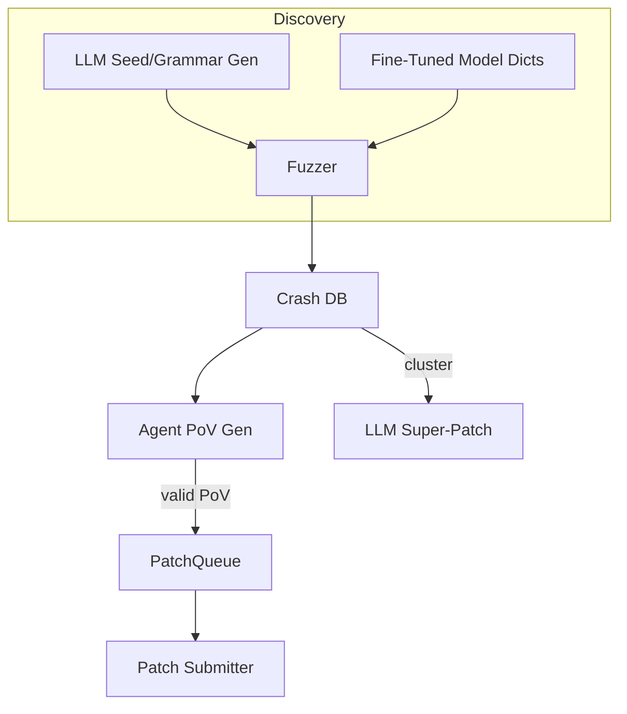

# Fuzzing assisté par IA et découverte automatisée de vulnérabilités

{{#include ../banners/hacktricks-training.md}}

## Vue d’ensemble
Les modèles de langage de grande taille (LLM) peuvent considérablement renforcer les pipelines traditionnels de recherche de vulnérabilités en générant des entrées sémantiquement riches, en faisant évoluer des grammaires, en analysant les données de crash et même en proposant des patchs corrigeant plusieurs bugs. Cette page rassemble les patterns les plus efficaces observés lors de la finale de l’AI Cyber Challenge (AIxCC) de la DARPA et dans d’autres travaux de recherche publics.

Ce qui suit ne décrit pas le système d’une compétition spécifique, mais constitue une abstraction des techniques afin que vous puissiez les reproduire dans vos propres workflows.

---

## 1. Entrées seed générées par des LLM

Les fuzzers traditionnels guidés par la couverture (AFL++, libFuzzer, Honggfuzz…) commencent avec un petit corpus de seeds et mutent les octets sans tenir compte de leur structure. Lorsque le format d’entrée cible est complexe (SQL, URLs, protocoles binaires personnalisés), les mutations aléatoires cassent généralement la syntaxe avant que les branches intéressantes ne soient atteintes.

Les LLM peuvent résoudre ce problème d’amorçage en produisant des *générateurs de seeds* : de courts scripts qui génèrent des **entrées syntaxiquement correctes mais pertinentes pour la sécurité**. Par exemple :
```prompt
SYSTEM: You are a helpful security engineer.
USER:
Write a Python3 program that prints 200 unique SQL injection strings targeting common anti-pattern mistakes (missing quotes, numeric context, stacked queries).  Ensure length ≤ 256 bytes / string so they survive common length limits.
```

```python
# gen_sqli_seeds.py (truncated)
PAYLOADS = [
"1 OR 1=1 -- ",
"' UNION SELECT NULL,NULL--",
"0; DROP TABLE users;--",
...
]
for p in PAYLOADS:
print(p)
```
Exécutez une fois et transmettez directement la sortie au corpus initial du fuzzer :
```bash
python3 gen_sqli_seeds.py > seeds.txt
afl-fuzz -i seeds.txt -o findings/ -- ./target @@
```
Benefits:
1. Validité sémantique → une couverture plus approfondie dès le début.
2. Régénérable : ajustez le prompt pour vous concentrer sur XSS, path traversal, binary blobs, etc.
3. Économique (< 1 ¢ avec GPT-3.5).

### Conseils
* Demandez au modèle de *diversifier* la longueur et l’encodage des payloads (UTF-8, URL-encoded, UTF-16-LE) afin de contourner les filtres superficiels.
* Demandez un *script unique et autonome* – cela évite les problèmes de formatage JSON.

---

## 2. Grammar-Evolution Fuzzing

Une variante plus puissante consiste à laisser le LLM **faire évoluer une grammar** plutôt que des seeds concrets. Le workflow (pattern « Grammar Guy ») est le suivant :

1. Générez une grammar ANTLR/Peach/LibFuzzer initiale via un prompt.
2. Effectuez le fuzzing pendant N minutes et recueillez les métriques de couverture (edges / blocks atteints).
3. Résumez les zones du programme non couvertes et transmettez le résumé au modèle :
```prompt
The previous grammar triggered 12 % of the program edges.  Functions not reached: parse_auth, handle_upload.  Add / modify rules to cover these.
```
4. Fusionnez les nouvelles rules, relancez le fuzzing et répétez.

Squelette de pseudo-code :
```python
for epoch in range(MAX_EPOCHS):
grammar = llm.refine(grammar, feedback=coverage_stats)
save(grammar, f"grammar_{epoch}.txt")
coverage_stats = run_fuzzer(grammar)
```
Points clés :
* Gardez un *budget* – chaque refinement utilise des tokens.
* Utilisez les instructions `diff` + `patch` afin que le modèle modifie le code au lieu de le réécrire.
* Arrêtez-vous lorsque Δcoverage < ε.

---

## 3. Génération de PoV (Exploit) basée sur des agents

Après avoir trouvé un crash, vous avez toujours besoin d'un **proof-of-vulnerability (PoV)** qui le déclenche de manière déterministe.

Une approche scalable consiste à lancer *des milliers d'agents* légers (<process/thread/container/prisoner>), chacun exécutant un LLM différent (GPT-4, Claude, Mixtral) ou utilisant un réglage de température différent.

Pipeline :
1. L'analyse statique/dynamique produit des *bug candidates* (struct avec le crash PC, l'input slice et le message du sanitizer).
2. L'orchestrateur distribue les candidates aux agents.
3. Étapes de raisonnement de l'agent :
a. Reproduire le bug localement avec `gdb` + l'input.
b. Suggérer un exploit payload minimal.
c. Valider l'exploit dans la sandbox.  En cas de succès → soumettre.
4. Les tentatives échouées sont **ré-encodées comme de nouvelles seeds** pour le coverage fuzzing (boucle de feedback).

Avantages :
* La parallelisation masque le manque de fiabilité d'un agent unique.
* Auto-tuning de la temp / de la taille du modèle en fonction du success-rate observé.

---

## 4. Directed Fuzzing avec des Code Models fine-tunés

Fine-tunez un modèle open-weight (par ex. Llama-7B) sur du code source C/C++ annoté avec des vulnerability patterns (integer overflow, buffer copy, format string).  Ensuite :

1. Exécutez une analyse statique pour obtenir la liste des fonctions + l'AST.
2. Faites le prompt du modèle : *« Give mutation dictionary entries that are likely to break memory safety in function X »*.
3. Insérez ces tokens dans un `AFL_CUSTOM_MUTATOR` personnalisé.

Exemple de sortie pour un wrapper `sprintf` :
```
{"pattern":"%99999999s"}
{"pattern":"AAAAAAAA....<1024>....%n"}
```
Empiriquement, cela réduit de plus de 2× le délai avant crash sur de vraies cibles.

---

## 5. Stratégies de Patching guidées par l’AI

### 5.1 Super Patches
Demandez au modèle de *clusteriser* les signatures de crash et de proposer un **patch unique** qui supprime la cause racine commune. Soumettez-le une seule fois, corrigez plusieurs bugs → moins de pénalités de précision dans les environnements où chaque mauvais patch fait perdre des points.

Structure du prompt :
```
Here are 10 stack traces + file snippets.  Identify the shared mistake and generate a unified diff fixing all occurrences.
```
### 5.2 Ratio de patches spéculatifs
Implémentez une queue où les patches confirmés et validés par PoV et les patches *spéculatifs* (sans PoV) sont intercalés selon un ratio de 1:​N ajusté aux règles de scoring (par exemple, 2 spéculatifs : 1 confirmé). Un modèle de coûts surveille les pénalités par rapport aux points et ajuste automatiquement N.

---

## 6. Revue déterministe du code par fichier avec l'IA

Un mode d'échec fréquent des revues assistées par l'IA consiste à demander à un agent d'inspecter un dépôt entier en espérant qu'il choisisse les bons fichiers et les bons termes de grep. Un modèle plus fiable consiste à **forcer la couverture du dépôt** :

1. Énumérer les fichiers source.
2. Envoyer **un fichier à la fois** avec un contexte minimal (point d'entrée, imports, routes/appelants proches).
3. Exiger un **rapport structuré** pour chaque fichier : sources, sink, validation manquante, préconditions d'exploitation et niveau de confiance.
4. Dédupliquer les rapports par **pattern source→sink** et valider manuellement ceux présentant le plus de risques.

Cette méthode consomme beaucoup de tokens et génère du bruit, mais elle est très efficace pour révéler des **bugs simples et à fort impact de type source/sink** que les revues agentiques globales manquent souvent.

### Patterns de triage à prioriser

- **Inclusion/dispatch PHP dynamique** : des noms de route/controller/module contrôlés par l'attaquant sont transmis à `require_once()`, `include()` ou `include_once()` sans allowlist stricte ni canonicalisation du chemin.
- **Exécution de shell dans les workflows d'administration/de compte** : des noms d'utilisateur, domaines, comptes FTP ou autres identifiants atteignent `exec()`, `system()`, `shell_exec()`, `passthru()`, `proc_open()` ou `popen()`.
- **Convergence d'entrées structurées** : le même paramètre est accepté depuis `$_GET`, `$_POST`, JSON, XML ou les body parsers d'un framework, puis réutilisé dans des sinks liés au système de fichiers ou à des commandes OS.

### Deux classes de bugs pratiques que cette méthode détecte bien

- **LFI/RCE via le dispatch d'un controller PHP** : si le nom du controller contrôlé par la requête est concaténé dans `require_once()` sans allowlist ni normalisation du chemin, des séquences de traversal telles que `../` peuvent amener PHP à inclure un fichier local `.php` non prévu. Si l'attaquant peut faire pointer l'inclusion vers un fichier PHP implanté ou autrement utile, la LFI devient une exécution de code. Voir [File Inclusion / Path Traversal](../pentesting-web/file-inclusion/README.md).
- **Command injection authentifiée dans les panneaux d'hébergement/d'administration** : si des champs de gestion de compte tels que les noms d'utilisateur sont intégrés dans des commandes shell, un utilisateur authentifié disposant de faibles privilèges peut transformer une action normale de création/suppression en RCE. L'impact augmente lorsque le panneau exécute la commande avec un compte de service plus privilégié. Voir [Command Injection](../pentesting-web/command-injection.md).

### Notes pratiques de revue

- Utilisez le LLM d'abord comme **reviewer des sources/sinks**, et non comme générateur d'exploits.
- Demandez-lui de lister explicitement le **champ contrôlé par l'attaquant**, la **lacune de normalisation/validation** et le **sink dangereux**.
- Pour les dépôts volumineux, une revue déterministe par fichier est souvent plus fiable qu'une exécution par un agent autonome unique, même lorsque ce dernier utilise un modèle plus puissant.
- Attendez-vous à de moins bons résultats concernant le **Broken Access Control** et les autres bugs de logique métier lorsque l'exploitabilité dépend d'hypothèses entre fichiers, de la sémantique des rôles ou de threat models propres au produit.

---

## Assemblage de tous les éléments
Un CRS (Cyber Reasoning System) de bout en bout peut relier les composants comme suit :

```mermaid
graph TD
subgraph Discovery
A[LLM Seed/Grammar Gen] --> B[Fuzzer]
C[Fine-Tuned Model Dicts] --> B
end
B --> D[Crash DB]
D --> E[Agent PoV Gen]
E -->|valid PoV| PatchQueue
D -->|cluster| F[LLM Super-Patch]
PatchQueue --> G[Patch Submitter]
```
---

## Références
* [Project Black - IA locale pour la cybersécurité : découverte d'une LFI dans phpIPAM et d'une RCE authentifiée dans myVesta](https://projectblack.io/blog/local-ai-for-cyber-security)
* [Strix](https://github.com/usestrix/strix)
* [Compétence de security-review de la communauté GitHub Copilot](https://github.com/github/awesome-copilot/blob/main/skills/security-review/SKILL.md)
* [Trail of Bits – finales de l'AIxCC : le bilan](https://blog.trailofbits.com/2025/08/07/aixcc-finals-tale-of-the-tape/)
* [Interviews des finalistes de l'AIxCC par CTF Radiooo](https://www.youtube.com/@ctfradiooo)
{{#include ../banners/hacktricks-training.md}}
