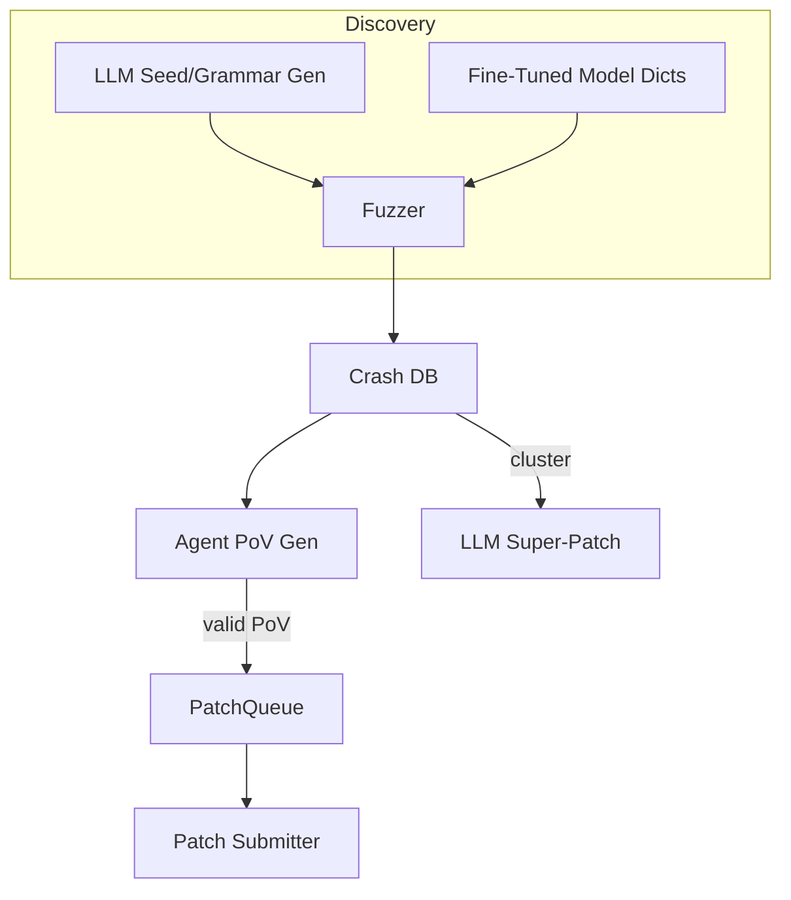

# AI-सहायित Fuzzing और स्वचालित Vulnerability Discovery

{{#include ../banners/hacktricks-training.md}}

## अवलोकन
Large-language models (LLMs) semantically rich inputs generate करके, grammars को evolve करके, crash data पर reasoning करके और यहाँ तक कि multi-bug patches प्रस्तावित करके traditional vulnerability-research pipelines को super-charge कर सकते हैं। यह page DARPA के AI Cyber Challenge (AIxCC) finals और अन्य public research के दौरान देखे गए सबसे प्रभावी patterns को एकत्र करता है।

निम्नलिखित किसी एक specific competition system का description नहीं है, बल्कि techniques का एक abstraction है, ताकि आप उन्हें अपने workflows में reproduce कर सकें।

---

## 1. LLM-Generated Seed Inputs

Traditional coverage–guided fuzzers (AFL++, libFuzzer, Honggfuzz…) seeds के एक छोटे corpus से शुरू होकर bytes को blind तरीके से mutate करते हैं। जब target input format complex हो (SQL, URLs, custom binary protocols), तो random mutations आमतौर पर interesting branches तक पहुँचने से पहले ही syntax को तोड़ देते हैं।

LLMs इस bootstrap problem को *seed generators* — ऐसे short scripts जो **syntax-correct लेकिन security-relevant inputs** output करते हैं — generate करके हल कर सकते हैं। उदाहरण के लिए:
```prompt
SYSTEM: You are a helpful security engineer.
USER:
Write a Python3 program that prints 200 unique SQL injection strings targeting common anti-pattern mistakes (missing quotes, numeric context, stacked queries).  Ensure length ≤ 256 bytes / string so they survive common length limits.
```

```python
# gen_sqli_seeds.py (truncated)
PAYLOADS = [
"1 OR 1=1 -- ",
"' UNION SELECT NULL,NULL--",
"0; DROP TABLE users;--",
...
]
for p in PAYLOADS:
print(p)
```
इसे एक बार चलाएँ और आउटपुट को सीधे fuzzer के initial corpus में feed करें:
```bash
python3 gen_sqli_seeds.py > seeds.txt
afl-fuzz -i seeds.txt -o findings/ -- ./target @@
```
लाभ:
1. Semantic validity → शुरुआत में अधिक गहरी coverage।
2. फिर से generate किया जा सकता है: XSS, path traversal, binary blobs आदि पर ध्यान केंद्रित करने के लिए prompt में बदलाव करें।
3. सस्ता (< 1 ¢ with GPT-3.5)।

### Tips
* superficial filters को bypass करने के लिए model को payload की length और encoding (UTF-8, URL-encoded, UTF-16-LE) में *विविधता लाने* का निर्देश दें।
* एक *single self-contained script* मांगें – इससे JSON formatting की समस्याएं नहीं होतीं।

---

## 2. Grammar-Evolution Fuzzing

एक अधिक शक्तिशाली variant concrete seeds के बजाय LLM को **grammar evolve** करने देना है। Workflow (“Grammar Guy” pattern) यह है:

1. prompt के माध्यम से एक initial ANTLR/Peach/LibFuzzer grammar generate करें।
2. N मिनट तक fuzz करें और coverage metrics (hit किए गए edges / blocks) एकत्र करें।
3. uncovered program areas का सारांश बनाएं और उसे model को वापस दें:
```prompt
The previous grammar triggered 12 % of the program edges.  Functions not reached: parse_auth, handle_upload.  Add / modify rules to cover these.
```
4. नए rules को merge करें, फिर से fuzz करें और दोहराएं।

Pseudo-code skeleton:
```python
for epoch in range(MAX_EPOCHS):
grammar = llm.refine(grammar, feedback=coverage_stats)
save(grammar, f"grammar_{epoch}.txt")
coverage_stats = run_fuzzer(grammar)
```
मुख्य बिंदु:
* एक *budget* बनाए रखें – प्रत्येक refinement tokens का उपयोग करता है।
* `diff` + `patch` instructions का उपयोग करें ताकि model rewrite करने के बजाय edits करे।
* जब Δcoverage < ε हो जाए, तब रुकें।

---

## 3. Agent-Based PoV (Exploit) Generation

Crash मिलने के बाद भी आपको एक **proof-of-vulnerability (PoV)** चाहिए जो उसे deterministic रूप से trigger करे।

एक scalable approach है *हजारों* lightweight agents (<process/thread/container/prisoner>) को spawn करना, जिनमें से प्रत्येक अलग LLM (GPT-4, Claude, Mixtral) या अलग temperature setting चला रहा हो।

Pipeline:
1. Static/ dynamic analysis *bug candidates* तैयार करता है (crash PC, input slice, sanitizer msg वाला struct)।
2. Orchestrator candidates को agents में वितरित करता है।
3. Agent reasoning steps:
a. `gdb` + input का उपयोग करके bug को locally reproduce करें।
b. Minimal exploit payload सुझाएँ।
c. Sandbox में exploit को validate करें। यदि success → submit करें।
4. Failed attempts को coverage fuzzing के लिए **new seeds** के रूप में re-queue किया जाता है (feedback loop)।

Advantages:
* Parallelisation single-agent unreliability को छिपा देती है।
* Observed success-rate के आधार पर temp / model size की auto-tuning।

---

## 4. Directed Fuzzing with Fine-Tuned Code Models

एक open-weight model (जैसे Llama-7B) को vulnerability patterns (integer overflow, buffer copy, format string) के साथ labelled C/C++ source पर fine-tune करें। फिर:

1. Function list + AST प्राप्त करने के लिए static analysis चलाएँ।
2. Model को prompt करें: *“Give mutation dictionary entries that are likely to break memory safety in function X”*.
3. उन tokens को custom `AFL_CUSTOM_MUTATOR` में insert करें।

एक `sprintf` wrapper के लिए example output:
```
{"pattern":"%99999999s"}
{"pattern":"AAAAAAAA....<1024>....%n"}
```
Empirically, यह real targets पर time-to-crash को >2× कम करता है।

---

## 5. AI-Guided Patching Strategies

### 5.1 Super Patches
Model से crash signatures को *cluster* करने और एक **single patch** प्रस्तावित करने के लिए कहें, जो common root cause को दूर कर दे। एक बार submit करें, कई bugs ठीक करें → ऐसे environments में accuracy penalties कम होती हैं, जहाँ प्रत्येक गलत patch पर points कटते हैं।

Prompt outline:
```
Here are 10 stack traces + file snippets.  Identify the shared mistake and generate a unified diff fixing all occurrences.
```
### 5.2 Speculative Patch Ratio
एक ऐसी queue implement करें जिसमें confirmed PoV-validated patches और *speculative* patches (बिना PoV) को scoring rules के अनुसार तय किए गए 1:​N ratio में interleave किया जाए (उदाहरण के लिए, 2 speculative : 1 confirmed)। एक cost model penalties बनाम points की निगरानी करता है और N को self-adjust करता है।

---

## 6. Deterministic File-by-File AI Code Review

AI-assisted review में एक सामान्य failure mode यह है कि एक agent से पूरे repository का inspection करने को कहा जाए और उम्मीद की जाए कि वह सही files और grep terms चुन लेगा। अधिक reliable pattern है **repository coverage को force करना**:

1. Source files enumerate करें।
2. एक बार में **एक file** भेजें, साथ में minimal context (entrypoint, imports, nearby routes/callers) दें।
3. प्रत्येक file के लिए **structured report** अनिवार्य करें: sources, sink, missing validation, exploit preconditions और confidence।
4. Reports को **source→sink pattern** के आधार पर deduplicate करें और high-risk वाले reports को manually validate करें।

इसमें tokens अधिक खर्च होते हैं और noise भी होता है, लेकिन यह **simple high-impact source/sink bugs** सामने लाने में बहुत effective है, जिन्हें broad agentic reviews अक्सर miss कर देते हैं।

### Triage patterns worth prioritising

- **Dynamic PHP include/dispatch**: attacker-controlled route/controller/module names का `require_once()`, `include()` या `include_once()` तक strict allowlisting और path canonicalisation के बिना flow होना।
- **Shell execution in admin/account workflows**: usernames, domains, FTP accounts या अन्य identifiers का `exec()`, `system()`, `shell_exec()`, `passthru()`, `proc_open()` या `popen()` तक पहुंचना।
- **Structured input fan-in**: वही parameter `$_GET`, `$_POST`, JSON, XML या framework body parsers से स्वीकार किया जाना और बाद में filesystem या OS-command sinks में reuse होना।

### Two practical bug classes this method finds well

- **PHP controller-dispatch LFI/RCE**: यदि request-controlled controller name को बिना allowlist/path normalisation के `require_once()` में concatenate किया जाता है, तो `../` जैसी traversal sequences PHP को किसी unintended local `.php` file को include करने दे सकती हैं। यदि attacker include को किसी planted या अन्यथा useful PHP file की ओर point कर सकता है, तो LFI code execution में बदल जाता है। See [File Inclusion / Path Traversal](../pentesting-web/file-inclusion/README.md)।
- **Authenticated command injection in hosting/admin panels**: यदि usernames जैसे account-management fields को shell commands में embed किया जाता है, तो low-privileged authenticated user सामान्य create/delete action को RCE में बदल सकता है। जब panel command को अधिक privileged service account के रूप में execute करता है, तब impact बढ़ जाता है। See [Command Injection](../pentesting-web/command-injection.md)।

### Practical review notes

- LLM को पहले **source/sink reviewer** के रूप में उपयोग करें, exploit generator के रूप में नहीं।
- उससे **attacker-controlled field**, **normalization/validation gap** और **dangerous sink** को स्पष्ट रूप से list करने को कहें।
- Large repos के लिए deterministic per-file review अक्सर single autonomous agent run से अधिक reliable होता है, भले ही बाद वाला stronger model का उपयोग करता हो।
- **Broken Access Control** और अन्य business-logic bugs पर weaker results की अपेक्षा रखें, जहां exploitability cross-file assumptions, role semantics या product-specific threat models पर निर्भर करती है।

---

## Putting It All Together
एक end-to-end CRS (Cyber Reasoning System) components को इस तरह wire कर सकता है:

```mermaid
graph TD
subgraph Discovery
A[LLM Seed/Grammar Gen] --> B[Fuzzer]
C[Fine-Tuned Model Dicts] --> B
end
B --> D[Crash DB]
D --> E[Agent PoV Gen]
E -->|valid PoV| PatchQueue
D -->|cluster| F[LLM Super-Patch]
PatchQueue --> G[Patch Submitter]
```
---

## संदर्भ
* [Project Black - Cyber Security के लिए Local AI: phpIPAM LFI और myVesta Authenticated RCE की खोज](https://projectblack.io/blog/local-ai-for-cyber-security)
* [Strix](https://github.com/usestrix/strix)
* [GitHub Copilot community security-review skill](https://github.com/github/awesome-copilot/blob/main/skills/security-review/SKILL.md)
* [Trail of Bits – AIxCC finals: टेप की कहानी](https://blog.trailofbits.com/2025/08/07/aixcc-finals-tale-of-the-tape/)
* [CTF Radiooo AIxCC finalist interviews](https://www.youtube.com/@ctfradiooo)
{{#include ../banners/hacktricks-training.md}}
