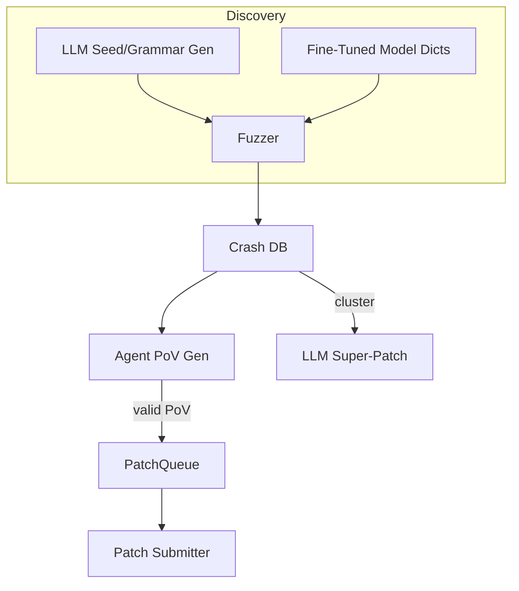

# AI-Assisted Fuzzing та автоматизоване виявлення вразливостей

{{#include ../banners/hacktricks-training.md}}

## Огляд
Великі мовні моделі (LLM) можуть значно посилити традиційні процеси дослідження вразливостей: генерувати семантично насичені вхідні дані, розвивати граматики, аналізувати дані про падіння та навіть пропонувати патчі для кількох помилок одночасно. На цій сторінці зібрано найефективніші підходи, виявлені під час фіналу DARPA’s AI Cyber Challenge (AIxCC) та інших публічних досліджень.

Наведений нижче матеріал не є описом конкретної системи змагання, а являє собою узагальнення методів, які можна відтворити у власних робочих процесах.

---

## 1. Seed inputs, згенеровані LLM

Традиційні coverage-guided fuzzers (AFL++, libFuzzer, Honggfuzz…) починають із невеликого corpus seed-файлів і бездумно мутують байти. Коли цільовий формат вхідних даних є складним (SQL, URL, custom binary protocols), випадкові мутації зазвичай порушують синтаксис ще до досягнення цікавих гілок виконання.

LLM можуть розв’язати цю проблему початкового завантаження, генеруючи *seed generators* — короткі скрипти, які виводять **синтаксично коректні, але релевантні для безпеки вхідні дані**. Наприклад:
```prompt
SYSTEM: You are a helpful security engineer.
USER:
Write a Python3 program that prints 200 unique SQL injection strings targeting common anti-pattern mistakes (missing quotes, numeric context, stacked queries).  Ensure length ≤ 256 bytes / string so they survive common length limits.
```

```python
# gen_sqli_seeds.py (truncated)
PAYLOADS = [
"1 OR 1=1 -- ",
"' UNION SELECT NULL,NULL--",
"0; DROP TABLE users;--",
...
]
for p in PAYLOADS:
print(p)
```
Запустіть один раз і передайте вивід безпосередньо до початкового корпусу fuzzer:
```bash
python3 gen_sqli_seeds.py > seeds.txt
afl-fuzz -i seeds.txt -o findings/ -- ./target @@
```
Переваги:
1. Семантична коректність → глибше покриття на ранньому етапі.
2. Можливість повторної генерації: змінюйте prompt, щоб зосередитися на XSS, path traversal, binary blobs тощо.
3. Дешево (< 1 ¢ із GPT-3.5).

### Поради
* Попросіть model *урізноманітнити* довжину та кодування payload (UTF-8, URL-encoded, UTF-16-LE), щоб обходити поверхневі фільтри.
* Попросіть *один самодостатній script* — це допомагає уникнути помилок форматування JSON.

---

## 2. Grammar-Evolution Fuzzing

Потужніший варіант — дозволити LLM **еволюціонувати grammar**, а не конкретні seeds. Workflow (патерн “Grammar Guy”) має такий вигляд:

1. Згенерувати початкову grammar ANTLR/Peach/LibFuzzer за допомогою prompt.
2. Виконувати fuzzing протягом N хвилин і збирати metrics покриття (досягнуті edges / blocks).
3. Узагальнити області програми, які не охоплено, і передати summary назад до model:
```prompt
The previous grammar triggered 12 % of the program edges.  Functions not reached: parse_auth, handle_upload.  Add / modify rules to cover these.
```
4. Об'єднати нові rules, повторно виконати fuzzing і повторювати цикл.

Каркас псевдокоду:
```python
for epoch in range(MAX_EPOCHS):
grammar = llm.refine(grammar, feedback=coverage_stats)
save(grammar, f"grammar_{epoch}.txt")
coverage_stats = run_fuzzer(grammar)
```
Ключові моменти:
* Дотримуйтеся *бюджету* — кожне уточнення використовує токени.
* Використовуйте інструкції `diff` + `patch`, щоб модель редагувала, а не переписувала текст.
* Зупиніться, коли Δcoverage < ε.

---

## 3. Генерація PoV (Exploit) на основі агентів

Після виявлення crash вам усе ще потрібен **proof-of-vulnerability (PoV)**, який детерміновано його відтворює.

Масштабований підхід полягає в запуску *тисяч* легковагих агентів (<process/thread/container/prisoner>), кожен із яких працює з іншою LLM (GPT-4, Claude, Mixtral) або іншим значенням temperature.

Pipeline:
1. Static/dynamic analysis створює *кандидатів на баги* (struct із crash PC, input slice, повідомленням sanitizer).
2. Orchestrator розподіляє кандидатів між агентами.
3. Етапи міркування агента:
a. Відтворити баг локально за допомогою `gdb` + input.
b. Запропонувати мінімальний exploit payload.
c. Перевірити exploit у sandbox. Якщо успішно → надіслати.
4. Невдалі спроби **повторно ставляться в чергу як нові seeds** для coverage fuzzing (feedback loop).

Переваги:
* Parallelisation приховує ненадійність окремих агентів.
* Auto-tuning temp / model size на основі спостережуваного success-rate.

---

## 4. Directed Fuzzing за допомогою Fine-Tuned Code Models

Fine-tune open-weight model (наприклад, Llama-7B) на вихідному коді C/C++, позначеному patterns вразливостей (integer overflow, buffer copy, format string). Потім:

1. Запустіть static analysis, щоб отримати список функцій + AST.
2. Prompt моделі: *“Give mutation dictionary entries that are likely to break memory safety in function X”*.
3. Вставте ці токени у власний `AFL_CUSTOM_MUTATOR`.

Приклад output для wrapper `sprintf`:
```
{"pattern":"%99999999s"}
{"pattern":"AAAAAAAA....<1024>....%n"}
```
Емпірично це скорочує час до crash більш ніж у 2 рази на реальних цілях.

---

## 5. Стратегії patching з AI-керуванням

### 5.1 Super Patches
Попросіть модель *кластеризувати* сигнатури crash і запропонувати **єдиний patch**, який усуває спільну першопричину. Надішліть його один раз, виправте кілька багів → менше штрафів за точність у середовищах, де кожен неправильний patch коштує балів.

Структура prompt:
```
Here are 10 stack traces + file snippets.  Identify the shared mistake and generate a unified diff fixing all occurrences.
```
### 5.2 Коефіцієнт спекулятивних патчів
Реалізуйте чергу, у якій підтверджені патчі, валідовані через PoV, і *спекулятивні* патчі (без PoV) чергуються у співвідношенні 1:​N, налаштованому відповідно до правил оцінювання (наприклад, 2 спекулятивні : 1 підтверджений). Модель витрат відстежує штрафи та бали й самостійно коригує N.

---

## 6. Детермінований AI Code Review файл за файлом

Поширена проблема під час AI-assisted review — доручити одному агенту перевірити весь репозиторій і сподіватися, що він вибере правильні файли та терміни для grep. Надійніший підхід — **примусово забезпечити охоплення репозиторію**:

1. Перелічити файли з вихідним кодом.
2. Надсилати **по одному файлу за раз** разом із мінімальним контекстом (entrypoint, імпорти, сусідні routes/callers).
3. Вимагати **структурований звіт** для кожного файлу: sources, sink, відсутня валідація, передумови експлуатації та рівень впевненості.
4. Дедуплікувати звіти за патерном **source→sink** і вручну перевіряти ті, що мають високий ризик.

Це потребує багато токенів і створює шум, але дуже ефективно виявляє **прості bugs із high-impact source/sink**, які broad agentic reviews часто пропускають.

### Патерни для triage, яким варто надати пріоритет

- **Dynamic PHP include/dispatch**: контрольовані атакувальником назви route/controller/module передаються до `require_once()`, `include()` або `include_once()` без суворого allowlisting і canonicalisation шляху.
- **Shell execution в admin/account workflows**: usernames, domains, FTP accounts або інші ідентифікатори потрапляють до `exec()`, `system()`, `shell_exec()`, `passthru()`, `proc_open()` або `popen()`.
- **Structured input fan-in**: один і той самий параметр приймається з `$_GET`, `$_POST`, JSON, XML або framework body parsers, а пізніше повторно використовується у filesystem або OS-command sinks.

### Два практичні класи bugs, які добре знаходить цей метод

- **PHP controller-dispatch LFI/RCE**: якщо контрольоване запитом ім’я controller конкатенується з `require_once()` без allowlist/path normalisation, послідовності обходу на кшталт `../` можуть змусити PHP підключити ненавмисний локальний `.php`-файл. Якщо атакувальник може вказати include на розміщений або іншим чином корисний PHP-файл, LFI перетворюється на code execution. Див. [File Inclusion / Path Traversal](../pentesting-web/file-inclusion/README.md).
- **Authenticated command injection в hosting/admin panels**: якщо поля керування обліковими записами, наприклад usernames, вбудовуються в shell commands, authenticated user із низькими привілеями може перетворити звичайну операцію створення/видалення на RCE. Вплив зростає, коли panel виконує command від імені service account із вищими привілеями. Див. [Command Injection](../pentesting-web/command-injection.md).

### Практичні нотатки щодо review

- Використовуйте LLM спочатку як **source/sink reviewer**, а не як генератор exploit.
- Просіть його явно перелічити **поле, контрольоване атакувальником**, **прогалину в normalization/validation** і **небезпечний sink**.
- Для великих репозиторіїв детермінований review файл за файлом часто надійніший за один автономний запуск агента, навіть якщо останній використовує сильнішу model.
- Очікуйте слабших результатів у випадках **Broken Access Control** та інших bugs бізнес-логіки, де exploitability залежить від припущень між файлами, семантики ролей або threat models, специфічних для продукту.

---

## Об’єднання всіх компонентів
End-to-end CRS (Cyber Reasoning System) може поєднати компоненти таким чином:

```mermaid
graph TD
subgraph Discovery
A[LLM Seed/Grammar Gen] --> B[Fuzzer]
C[Fine-Tuned Model Dicts] --> B
end
B --> D[Crash DB]
D --> E[Agent PoV Gen]
E -->|valid PoV| PatchQueue
D -->|cluster| F[LLM Super-Patch]
PatchQueue --> G[Patch Submitter]
```
---

## Посилання
* [Project Black - Local AI for Cyber Security: пошук LFI у phpIPAM та автентифікований RCE у myVesta](https://projectblack.io/blog/local-ai-for-cyber-security)
* [Strix](https://github.com/usestrix/strix)
* [Навичка перевірки безпеки спільноти GitHub Copilot](https://github.com/github/awesome-copilot/blob/main/skills/security-review/SKILL.md)
* [Trail of Bits – фінал AIxCC: розбір подій](https://blog.trailofbits.com/2025/08/07/aixcc-finals-tale-of-the-tape/)
* [Інтерв'ю з фіналістами CTF Radiooo AIxCC](https://www.youtube.com/@ctfradiooo)
{{#include ../banners/hacktricks-training.md}}
