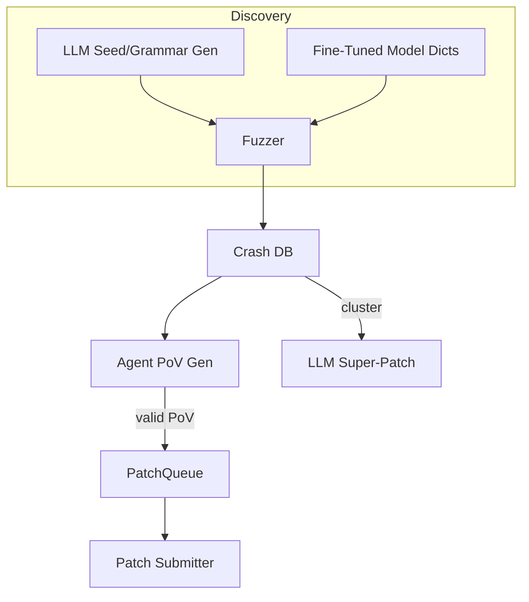

# AI-Assisted Fuzzing & Automated Vulnerability Discovery

{{#include ../banners/hacktricks-training.md}}

## Overview
Large-language models (LLMs) can super-charge traditional vulnerability-research pipelines by generating semantically rich inputs, evolving grammars, reasoning over crash data, and even proposing multi-bug patches.  This page collects the most effective patterns observed during DARPA’s AI Cyber Challenge (AIxCC) finals and other public research.

What follows is not a description of one specific competition system, but an abstraction of the techniques so you can reproduce them in your own workflows.

---

## 1. LLM-Generated Seed Inputs

Traditional coverage–guided fuzzers (AFL++, libFuzzer, Honggfuzz…) start with a small corpus of seeds and mutate bytes blindly.  When the target input format is complex (SQL, URLs, custom binary protocols) random mutations usually break the syntax before interesting branches are reached.

LLMs can solve this bootstrap problem by emitting *seed generators* – short scripts that output **syntax-correct but security-relevant inputs**.  For example:

```prompt
SYSTEM: You are a helpful security engineer.
USER:
Write a Python3 program that prints 200 unique SQL injection strings targeting common anti-pattern mistakes (missing quotes, numeric context, stacked queries).  Ensure length ≤ 256 bytes / string so they survive common length limits.
```

```python
# gen_sqli_seeds.py (truncated)
PAYLOADS = [
    "1 OR 1=1 -- ",
    "' UNION SELECT NULL,NULL--",
    "0; DROP TABLE users;--",
    ...
]
for p in PAYLOADS:
    print(p)
```

Run once and feed the output directly into the fuzzer’s initial corpus:

```bash
python3 gen_sqli_seeds.py > seeds.txt
afl-fuzz -i seeds.txt -o findings/ -- ./target @@
```

Benefits:
1. Semantic validity → deeper coverage early.
2. Re-generatable: tweak the prompt to focus on XSS, path traversal, binary blobs, etc.
3. Cheap (< 1 ¢ with GPT-3.5).

### Tips
* Instruct the model to *diversify* payload length and encoding (UTF-8, URL-encoded, UTF-16-LE) to bypass superficial filters.
* Ask for a *single self-contained script* – avoids JSON formatting hiccups.

---

## 2. Grammar-Evolution Fuzzing

A more powerful variant is to let the LLM **evolve a grammar** instead of concrete seeds.  The workflow (“Grammar Guy” pattern) is:

1. Generate an initial ANTLR/Peach/LibFuzzer grammar via prompt.
2. Fuzz for N minutes and collect coverage metrics (edges / blocks hit).
3. Summarise uncovered program areas and feed the summary back into the model:
   ```prompt
   The previous grammar triggered 12 % of the program edges.  Functions not reached: parse_auth, handle_upload.  Add / modify rules to cover these.
   ```
4. Merge the new rules, re-fuzz, repeat.

Pseudo-code skeleton:

```python
for epoch in range(MAX_EPOCHS):
    grammar = llm.refine(grammar, feedback=coverage_stats)
    save(grammar, f"grammar_{epoch}.txt")
    coverage_stats = run_fuzzer(grammar)
```

Key points:
* Keep a *budget* – each refinement uses tokens.
* Use `diff` + `patch` instructions so the model edits rather than rewrites.
* Stop when Δcoverage < ε.

---

## 3. Agent-Based PoV (Exploit) Generation

After a crash is found you still need a **proof-of-vulnerability (PoV)** that deterministically triggers it.

A scalable approach is to spawn *thousands* of lightweight agents (<process/thread/container/prisoner>), each running a different LLM (GPT-4, Claude, Mixtral) or temperature setting.

Pipeline:
1. Static/ dynamic analysis produces *bug candidates* (struct with crash PC, input slice, sanitizer msg).
2. Orchestrator distributes candidates to agents.
3. Agent reasoning steps:
   a. Reproduce bug locally with `gdb` + input.
   b. Suggest minimal exploit payload.
   c. Validate exploit in sandbox.  If success → submit.
4. Failed attempts are **re-queued as new seeds** for coverage fuzzing (feedback loop).

Advantages:
* Parallelisation hides single-agent unreliability.
* Auto-tuning of temp / model size based on observed success-rate.

---

## 4. Directed Fuzzing with Fine-Tuned Code Models

Fine-tune an open-weight model (e.g. Llama-7B) on C/C++ source labelled with vulnerability patterns (integer overflow, buffer copy, format string).  Then:

1. Run static analysis to get function list + AST.
2. Prompt model: *“Give mutation dictionary entries that are likely to break memory safety in function X”*.
3. Insert those tokens into a custom `AFL_CUSTOM_MUTATOR`.

Example output for a `sprintf` wrapper:
```
{"pattern":"%99999999s"}
{"pattern":"AAAAAAAA....<1024>....%n"}
```

Empirically this shrinks time-to-crash by >2× on real targets.

---

## 5. AI-Guided Patching Strategies

### 5.1 Super Patches
Ask the model to *cluster* crash signatures and propose a **single patch** that removes the common root cause.  Submit once, fix several bugs → fewer accuracy penalties in environments where each wrong patch costs points.

Prompt outline:
```
Here are 10 stack traces + file snippets.  Identify the shared mistake and generate a unified diff fixing all occurrences.
```

### 5.2 Speculative Patch Ratio
Implement a queue where confirmed PoV-validated patches and *speculative* patches (no PoV) are interleaved at a 1:​N ratio tuned to scoring rules (e.g. 2 speculative : 1 confirmed).  A cost model monitors penalties vs. points and self-adjusts N.

---

## 6. Deterministic File-by-File AI Code Review

A frequent failure mode in AI-assisted review is asking one agent to inspect a whole repository and hoping it chooses the right files and grep terms. A more reliable pattern is to **force repository coverage**:

1. Enumerate source files.
2. Send **one file at a time** plus minimal context (entrypoint, imports, nearby routes/callers).
3. Require a **structured report** for each file: sources, sink, missing validation, exploit preconditions, and confidence.
4. Deduplicate reports by **source→sink pattern** and manually validate the high-risk ones.

This is token-heavy and noisy, but it is very effective at surfacing **simple high-impact source/sink bugs** that broad agentic reviews often miss.

### Triage patterns worth prioritising

- **Dynamic PHP include/dispatch**: attacker-controlled route/controller/module names flowing into `require_once()`, `include()`, or `include_once()` without strict allowlisting and path canonicalisation.
- **Shell execution in admin/account workflows**: usernames, domains, FTP accounts, or other identifiers reaching `exec()`, `system()`, `shell_exec()`, `passthru()`, `proc_open()`, or `popen()`.
- **Structured input fan-in**: the same parameter accepted from `$_GET`, `$_POST`, JSON, XML, or framework body parsers and later reused in filesystem or OS-command sinks.

### Two practical bug classes this method finds well

- **PHP controller-dispatch LFI/RCE**: if a request-controlled controller name is concatenated into `require_once()` with no allowlist/path normalisation, traversal sequences such as `../` can make PHP include an unintended local `.php` file. If the attacker can point the include at a planted or otherwise useful PHP file, the LFI becomes code execution. See [File Inclusion / Path Traversal](../pentesting-web/file-inclusion/README.md).
- **Authenticated command injection in hosting/admin panels**: if account-management fields such as usernames are embedded into shell commands, a low-privileged authenticated user may turn a normal create/delete action into RCE. The impact increases when the panel executes the command as a more privileged service account. See [Command Injection](../pentesting-web/command-injection.md).

### Practical review notes

- Use the LLM as a **source/sink reviewer first**, not as an exploit generator.
- Ask it to explicitly list the **attacker-controlled field**, the **normalization/validation gap**, and the **dangerous sink**.
- For large repos, deterministic per-file review is often more reliable than a single autonomous agent run, even when the latter uses a stronger model.
- Expect weaker results on **Broken Access Control** and other business-logic bugs where exploitability depends on cross-file assumptions, role semantics, or product-specific threat models.

---

## Putting It All Together
An end-to-end CRS (Cyber Reasoning System) may wire the components like this:


```mermaid
graph TD
    subgraph Discovery
        A[LLM Seed/Grammar Gen] --> B[Fuzzer]
        C[Fine-Tuned Model Dicts] --> B
    end
    B --> D[Crash DB]
    D --> E[Agent PoV Gen]
    E -->|valid PoV| PatchQueue
    D -->|cluster| F[LLM Super-Patch]
    PatchQueue --> G[Patch Submitter]
```

---

## References
* [Project Black - Local AI for Cyber Security: Finding phpIPAM LFI and myVesta Authenticated RCE](https://projectblack.io/blog/local-ai-for-cyber-security)
* [Strix](https://github.com/usestrix/strix)
* [GitHub Copilot community security-review skill](https://github.com/github/awesome-copilot/blob/main/skills/security-review/SKILL.md)
* [Trail of Bits – AIxCC finals: Tale of the tape](https://blog.trailofbits.com/2025/08/07/aixcc-finals-tale-of-the-tape/)
* [CTF Radiooo AIxCC finalist interviews](https://www.youtube.com/@ctfradiooo)
{{#include ../banners/hacktricks-training.md}}
