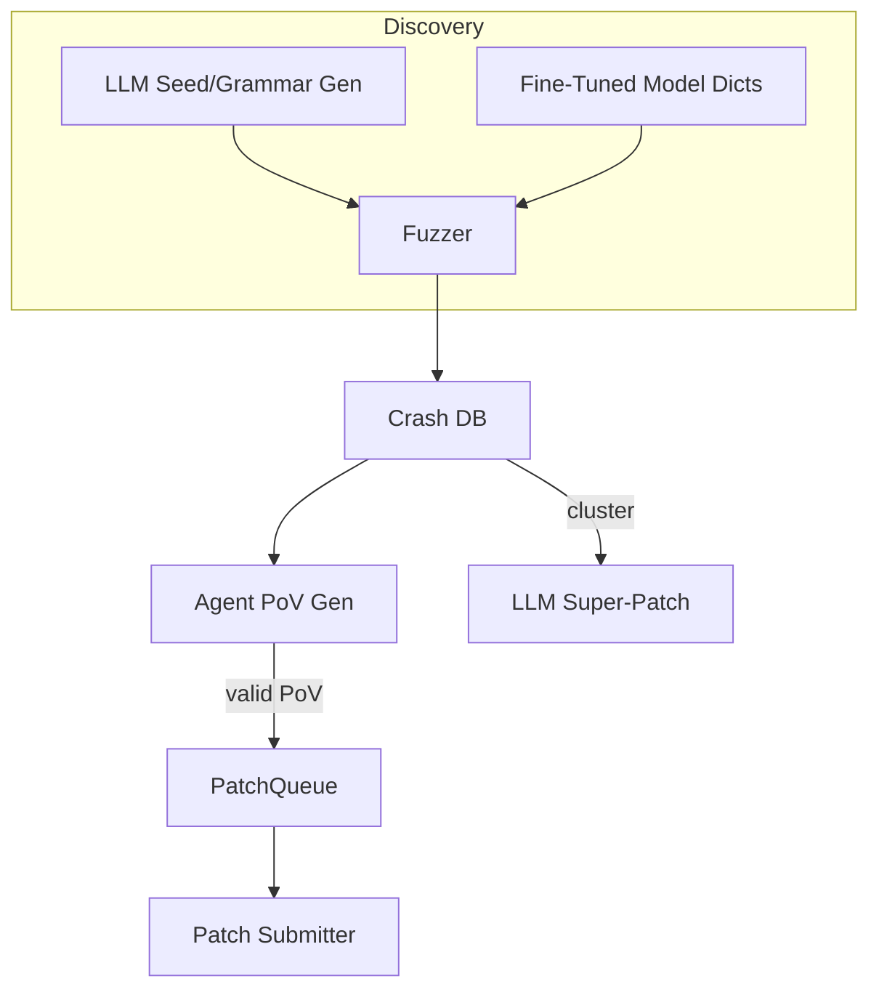

# Fuzzing із підтримкою AI та автоматизоване виявлення вразливостей

{{#include ../banners/hacktricks-training.md}}

## Огляд
Великі мовні моделі (LLM) можуть значно посилити традиційні конвеєри дослідження вразливостей, генеруючи семантично насичені вхідні дані, розвиваючи граматики, аналізуючи дані про збої та навіть пропонуючи патчі для кількох багів.  На цій сторінці зібрано найефективніші підходи, виявлені під час фіналу DARPA’s AI Cyber Challenge (AIxCC) та інших публічних досліджень.<sup>[[4]](#references)[[5]](#references)</sup>

Нижче наведено не опис конкретної змагальної системи, а узагальнення технік, щоб ви могли відтворити їх у власних робочих процесах.

---

## 1. Seed Inputs, згенеровані LLM

Традиційні coverage–guided fuzzers (AFL++, libFuzzer, Honggfuzz…) починають із невеликого корпусу seed-файлів і бездумно мутують байти.  Коли формат вхідних даних цілі є складним (SQL, URL, власні бінарні протоколи), випадкові мутації зазвичай порушують синтаксис ще до досягнення цікавих гілок виконання.

LLM можуть вирішити цю проблему початкової ініціалізації, генеруючи *seed generators* — короткі скрипти, які виводять **синтаксично коректні, але релевантні для безпеки вхідні дані**.  Наприклад:
```prompt
SYSTEM: You are a helpful security engineer.
USER:
Write a Python3 program that prints 200 unique SQL injection strings targeting common anti-pattern mistakes (missing quotes, numeric context, stacked queries).  Ensure length ≤ 256 bytes / string so they survive common length limits.
```

```python
# gen_sqli_seeds.py (truncated)
PAYLOADS = [
"1 OR 1=1 -- ",
"' UNION SELECT NULL,NULL--",
"0; DROP TABLE users;--",
...
]
for p in PAYLOADS:
print(p)
```
Запустіть один раз і передайте вивід безпосередньо до початкового корпусу fuzzer-а:
```bash
python3 gen_sqli_seeds.py > seeds.txt
afl-fuzz -i seeds.txt -o findings/ -- ./target @@
```
Переваги:
1. Семантична валідність → глибше покриття на ранньому етапі.
2. Можливість повторної генерації: змінюйте prompt, щоб зосередитися на XSS, path traversal, binary blobs тощо.
3. Дешево (< 1 ¢ з GPT-3.5).

### Поради
* Вкажіть моделі *урізноманітнювати* довжину та кодування payload (UTF-8, URL-encoded, UTF-16-LE), щоб обходити поверхневі фільтри.
* Попросіть створити *один самодостатній скрипт* — це допомагає уникнути проблем із форматуванням JSON.

---

## 2. Grammar-Evolution Fuzzing

Потужніший варіант — дозволити LLM **розвивати grammar**, а не конкретні seeds. Робочий процес (патерн “Grammar Guy”):

1. Згенерувати початкову grammar ANTLR/Peach/LibFuzzer за допомогою prompt.
2. Виконувати fuzzing протягом N хвилин і збирати метрики покриття (досягнуті edges / blocks).
3. Узагальнити непокриті ділянки програми та передати summary назад моделі:
```prompt
The previous grammar triggered 12 % of the program edges.  Functions not reached: parse_auth, handle_upload.  Add / modify rules to cover these.
```
4. Об’єднати нові rules, повторити fuzzing і продовжувати цикл.

Pseudo-code skeleton:
```python
for epoch in range(MAX_EPOCHS):
grammar = llm.refine(grammar, feedback=coverage_stats)
save(grammar, f"grammar_{epoch}.txt")
coverage_stats = run_fuzzer(grammar)
```
Ключові моменти:
* Ведіть *бюджет* — кожне уточнення використовує токени.
* Використовуйте інструкції `diff` + `patch`, щоб модель редагувала, а не переписувала.
* Зупиняйтеся, коли Δcoverage < ε.

---

## 3. Генерація PoV (Exploit) на основі агентів

Після виявлення crash вам усе ще потрібен **proof-of-vulnerability (PoV)**, який детерміновано його запускає.

Масштабований підхід полягає у запуску *тисяч* легковагових агентів (<process/thread/container/prisoner>), кожен з яких працює з іншою LLM (GPT-4, Claude, Mixtral) або іншим значенням temperature.

Pipeline:
1. Static/dynamic analysis створює *bug candidates* (struct із crash PC, input slice, sanitizer msg).
2. Orchestrator розподіляє candidates між агентами.
3. Кроки reasoning агента:
a. Відтворити bug локально за допомогою `gdb` + input.
b. Запропонувати мінімальний exploit payload.
c. Перевірити exploit у sandbox. Якщо успішно → надіслати.
4. Невдалі спроби **повторно додаються до черги як нові seeds** для coverage fuzzing (feedback loop).

Переваги:
* Parallelisation приховує ненадійність окремого агента.
* Auto-tuning temp / розміру моделі на основі спостережуваного success-rate.

---

## 4. Directed Fuzzing із Fine-Tuned Code Models

Виконайте fine-tune моделі з відкритими вагами (наприклад, Llama-7B) на C/C++ source, розміченому за vulnerability patterns (integer overflow, buffer copy, format string). Потім:

1. Запустіть static analysis, щоб отримати список функцій + AST.
2. Зробіть prompt моделі: *“Give mutation dictionary entries that are likely to break memory safety in function X”*.
3. Вставте ці токени в кастомний `AFL_CUSTOM_MUTATOR`.

Приклад output для wrapper `sprintf`:
```
{"pattern":"%99999999s"}
{"pattern":"AAAAAAAA....<1024>....%n"}
```
Емпірично це скорочує час до збою більш ніж удвічі на реальних цілях.

---

## 5. Стратегії патчингу під керуванням AI

### 5.1 Super Patches
Попросіть модель *кластеризувати* сигнатури збоїв і запропонувати **єдиний патч**, який усуває спільну першопричину. Надішліть його один раз і виправте кілька багів → менше штрафів за точність у середовищах, де кожен неправильний патч коштує балів.

Структура промпту:
```
Here are 10 stack traces + file snippets.  Identify the shared mistake and generate a unified diff fixing all occurrences.
```
### 5.2 Співвідношення спекулятивних патчів
Реалізуйте чергу, у якій підтверджені патчі, валідовані через PoV, і *спекулятивні* патчі (без PoV) чергуються у співвідношенні 1:​N, налаштованому відповідно до правил оцінювання (наприклад, 2 спекулятивні : 1 підтверджений). Модель витрат відстежує штрафи та бали й автоматично коригує N.

---

## 6. Детермінований AI Code Review файл за файлом

Поширена причина невдач під час AI-assisted review — доручити одному агенту перевірити весь репозиторій і сподіватися, що він вибере правильні файли та grep-терміни. Надійніший підхід — **примусово забезпечити охоплення репозиторію**:<sup>[[1]](#references)</sup>

1. Перелічити файли з вихідним кодом.
2. Надсилати **по одному файлу за раз** разом із мінімальним контекстом (entrypoint, imports, сусідні routes/callers).
3. Вимагати **структурований звіт** для кожного файлу: джерела, sink, відсутня валідація, передумови експлуатації та рівень впевненості.<sup>[[3]](#references)</sup>
4. Дедуплікувати звіти за **шаблоном source→sink** і вручну перевіряти знахідки з високим ризиком.

Це потребує багато токенів і створює шум, але дуже ефективно виявляє **прості source/sink-баги з великим впливом**, які широкі agentic review часто пропускають.

### Шаблони для triage, яким варто надати пріоритет

- **Dynamic PHP include/dispatch**: контрольовані атакувальником назви route/controller/module передаються до `require_once()`, `include()` або `include_once()` без суворого allowlisting і канонізації шляхів.
- **Shell execution у workflows адміністратора/облікових записів**: usernames, domains, FTP accounts або інші ідентифікатори передаються до `exec()`, `system()`, `shell_exec()`, `passthru()`, `proc_open()` або `popen()`.
- **Structured input fan-in**: той самий параметр приймається з `$_GET`, `$_POST`, JSON, XML або body parsers фреймворку, а згодом повторно використовується у файлових або OS-command sinks.

### Два практичні класи багів, які цей метод добре знаходить

- **PHP controller-dispatch LFI/RCE**: якщо контрольоване запитом ім’я controller конкатенується з `require_once()` без allowlist/path normalisation, такі traversal-послідовності, як `../`, можуть змусити PHP підключити ненавмисний локальний `.php`-файл. Якщо атакувальник може вказати на підготовлений або іншим чином корисний PHP-файл, LFI перетворюється на code execution. Див. [File Inclusion / Path Traversal](../pentesting-web/file-inclusion/README.md).<sup>[[1]](#references)</sup>
- **Authenticated command injection у hosting/admin panels**: якщо поля керування обліковими записами, такі як usernames, вставляються в shell-команди, автентифікований користувач із низькими привілеями може перетворити звичайну дію створення/видалення на RCE. Вплив зростає, коли панель виконує команду від імені привілейованішого service account. Див. [Command Injection](../pentesting-web/command-injection.md).<sup>[[1]](#references)</sup>

### Практичні нотатки щодо review

- Використовуйте LLM спочатку як **source/sink reviewer**, а не як генератор експлойтів.
- Попросіть його явно перелічити **поле, контрольоване атакувальником**, **прогалину в нормалізації/валідації** та **небезпечний sink**.
- Для великих репозиторіїв детермінований review файл за файлом часто надійніший за один запуск автономного агента, навіть якщо останній використовує потужнішу модель.<sup>[[2]](#references)</sup>
- Очікуйте слабших результатів щодо **Broken Access Control** та інших business-logic багів, де можливість експлуатації залежить від припущень між файлами, семантики ролей або специфічних для продукту threat models.

---

## Об’єднання всіх компонентів
End-to-end CRS (Cyber Reasoning System) може поєднати компоненти так:

```mermaid
graph TD
subgraph Discovery
A[LLM Seed/Grammar Gen] --> B[Fuzzer]
C[Fine-Tuned Model Dicts] --> B
end
B --> D[Crash DB]
D --> E[Agent PoV Gen]
E -->|valid PoV| PatchQueue
D -->|cluster| F[LLM Super-Patch]
PatchQueue --> G[Patch Submitter]
```
---

## Посилання

- [1] [Project Black - Local AI for Cyber Security: Finding phpIPAM LFI and myVesta Authenticated RCE](https://projectblack.io/blog/local-ai-for-cyber-security)
- [2] [Strix](https://github.com/usestrix/strix)
- [3] [Спільнота GitHub Copilot: security-review skill](https://github.com/github/awesome-copilot/blob/main/skills/security-review/SKILL.md)
- [4] [Trail of Bits – фінали AIxCC: історія змагання](https://blog.trailofbits.com/2025/08/07/aixcc-finals-tale-of-the-tape/)
- [5] [Інтерв'ю з фіналістами AIxCC від CTF Radiooo](https://www.youtube.com/@ctfradiooo)

{{#include ../banners/hacktricks-training.md}}
