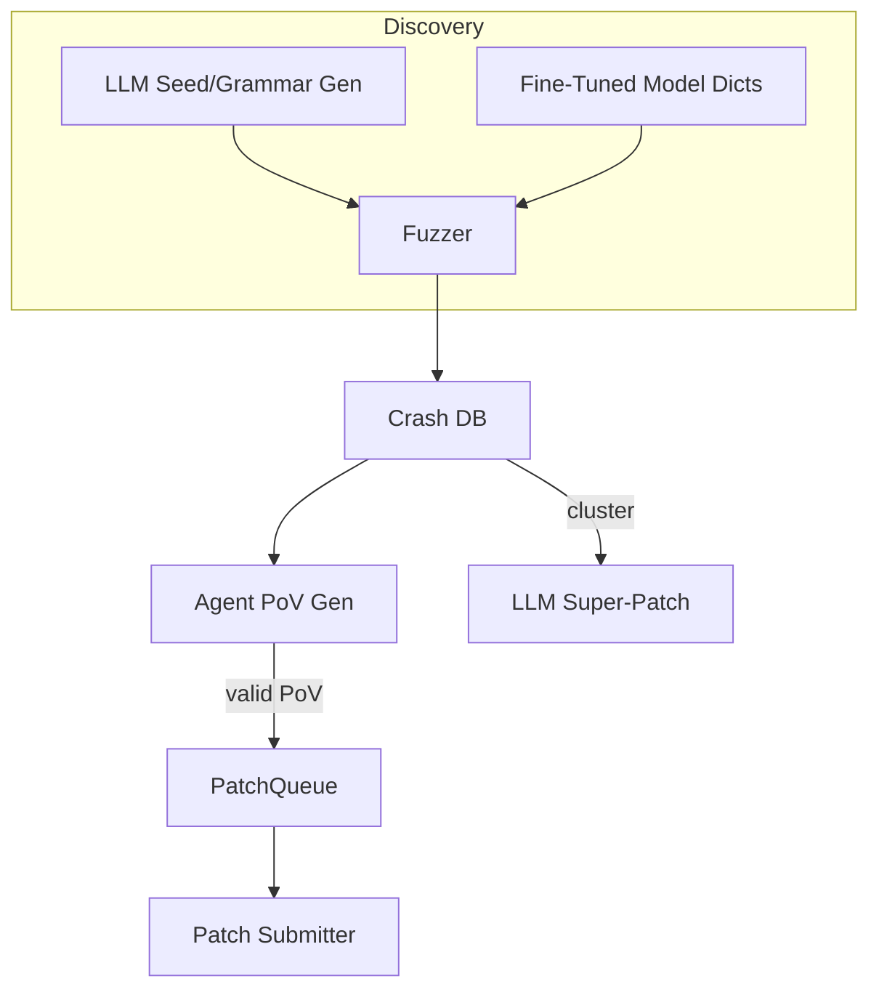

# Fuzzing Assistido por IA e Descoberta Automatizada de Vulnerabilidades

{{#include ../banners/hacktricks-training.md}}

## Visão geral
Modelos de linguagem de grande escala (LLMs) podem potencializar pipelines tradicionais de pesquisa de vulnerabilidades ao gerar entradas semanticamente ricas, evoluir gramáticas, raciocinar sobre dados de crashes e até propor patches para múltiplos bugs. Esta página reúne os padrões mais eficazes observados durante as finais do AI Cyber Challenge (AIxCC) da DARPA e em outras pesquisas públicas.<sup>[[4]](#references)</sup><sup>[[5]](#references)</sup>

O que segue não é uma descrição de um sistema específico de competição, mas uma abstração das técnicas para que você possa reproduzi-las em seus próprios workflows.

---

## 1. Entradas Seed Geradas por LLM

Fuzzers tradicionais guiados por coverage (AFL++, libFuzzer, Honggfuzz…) começam com um pequeno corpus de seeds e mutacionam bytes cegamente. Quando o formato de entrada do alvo é complexo (SQL, URLs, protocolos binários personalizados), mutações aleatórias geralmente quebram a sintaxe antes que branches interessantes sejam alcançados.

Os LLMs podem resolver esse problema de bootstrap emitindo *seed generators* – scripts curtos que produzem **entradas sintaticamente corretas, mas relevantes para a segurança**. Por exemplo:
```prompt
SYSTEM: You are a helpful security engineer.
USER:
Write a Python3 program that prints 200 unique SQL injection strings targeting common anti-pattern mistakes (missing quotes, numeric context, stacked queries).  Ensure length ≤ 256 bytes / string so they survive common length limits.
```

```python
# gen_sqli_seeds.py (truncated)
PAYLOADS = [
"1 OR 1=1 -- ",
"' UNION SELECT NULL,NULL--",
"0; DROP TABLE users;--",
...
]
for p in PAYLOADS:
print(p)
```
Execute uma vez e alimente a saída diretamente no corpus inicial do fuzzer:
```bash
python3 gen_sqli_seeds.py > seeds.txt
afl-fuzz -i seeds.txt -o findings/ -- ./target @@
```
Benefícios:
1. Validade semântica → cobertura mais profunda desde o início.
2. Regenerável: ajuste o prompt para focar em XSS, path traversal, binary blobs etc.
3. Barato (< 1 ¢ com GPT-3.5).

### Dicas
* Instrua o modelo a *diversificar* o comprimento e a codificação dos payloads (UTF-8, URL-encoded, UTF-16-LE) para contornar filtros superficiais.
* Peça um *script único e autocontido* – evita problemas de formatação JSON.

---

## 2. Grammar-Evolution Fuzzing

Uma variante mais poderosa é permitir que o LLM **evolua uma grammar** em vez de seeds concretas. O fluxo de trabalho (padrão “Grammar Guy”) é:

1. Gere uma grammar inicial de ANTLR/Peach/LibFuzzer por meio de um prompt.
2. Execute o fuzzing por N minutos e colete métricas de cobertura (edges / blocks atingidos).
3. Resuma as áreas não cobertas do programa e envie o resumo de volta ao modelo:
```prompt
The previous grammar triggered 12 % of the program edges.  Functions not reached: parse_auth, handle_upload.  Add / modify rules to cover these.
```
4. Mescle as novas regras, execute o fuzzing novamente e repita.

Esqueleto de pseudo-código:
```python
for epoch in range(MAX_EPOCHS):
grammar = llm.refine(grammar, feedback=coverage_stats)
save(grammar, f"grammar_{epoch}.txt")
coverage_stats = run_fuzzer(grammar)
```
Pontos principais:
* Mantenha um *budget* – cada refinamento usa tokens.
* Use instruções `diff` + `patch` para que o modelo edite em vez de reescrever.
* Pare quando Δcoverage < ε.

---

## 3. Engenharia de Harness do libFuzzer com LLM local

Para código-fonte que não pode sair da estação de trabalho de um analista, um modelo local de código pode criar o pequeno adaptador entre os bytes do fuzzer e uma API C/C++. O limite de segurança útil é explícito: **o modelo escreve e revisa a infraestrutura de testes; a mutação guiada por coverage explora as entradas; os sanitizers reportam operações inválidas; um humano revisa o harness e faz a triagem dos achados**.<sup>[[9]](#references)</sup>

Para técnicas de corpus, feedback, snapshot e stateful-fuzzing em nível de engine que não dependem de um LLM, consulte a [Fuzzing Methodology](../generic-methodologies-and-resources/fuzzing.md) geral.

Comece com a declaração exata copiada do header do alvo e restrinja o formato da saída. Um prompt restrito reduz APIs inventadas e facilita a revisão do resultado:<sup>[[8]](#references)[[9]](#references)</sup>
```prompt
Write a libFuzzer target for this exact declaration:
int parse_records(const uint8_t *data, size_t size);

Output only C code. Implement LLVMFuzzerTestOneInput, include the
declaration, pass data and size unchanged, and do not use files,
network access, randomness, clocks, threads, or persistent state.
```
Para um parser de bytes brutos, o resultado esperado não deve ser mais complicado do que:<sup>[[6]](#references)[[9]](#references)</sup>
```c
#include <stddef.h>
#include <stdint.h>

extern int parse_records(const uint8_t *, size_t);

int LLVMFuzzerTestOneInput(const uint8_t *data, size_t size) {
(void)parse_records(data, size);
return 0;
}
```
A compilação é apenas o primeiro gate de validação. Revise cada target gerado com base nestes invariantes antes de gastar tempo de CPU nele:<sup>[[6]](#references)[[8]](#references)[[9]](#references)</sup>

- **API exata:** compare tipos, regras de ownership, inicialização, teardown e calling convention com o header real e os callers existentes.
- **Segurança do harness:** proteja toda leitura de `data`; os achados do sanitizer devem ter origem no target, não no glue gerado.
- **Repetibilidade:** faça com que o resultado seja uma função de `data` e `size`; remova I/O externo, tempo, aleatoriedade não controlada, threads não aguardadas e estado que persista entre chamadas.
- **Throughput:** inicialize o estado imutável caro apenas uma vez, somente quando isso não puder afetar o comportamento; limite o tamanho da entrada, suprima logs e libere as alocações por entrada.
- **Reachability:** verifique se as funções e branches pretendidos são executados. Um target que compila, mas exercita apenas caminhos de rejeição, é uma falha silenciosa.

### Targets orientados à estrutura: preserve invariantes sem ocultar bugs

Se a maioria das entradas brutas falhar em um gate de magic, tamanho, versão ou checksum, use os bytes do fuzz como **material de campos tipados** e reconstrua um objeto válido. Corrija as constantes do formato, mantenha os campos semânticos e os bytes do payload mutáveis e derive os metadados de integridade a partir do payload reconstruído. `FuzzedDataProvider` é útil para consumir valores tipados limitados, enquanto o adapter continua responsável por limitar qualquer alocação e conversão gerada.<sup>[[9]](#references)</sup>

<details>
<summary>Exemplo de target C++ orientado à estrutura</summary>
```cpp
#include <fuzzer/FuzzedDataProvider.h>
#include <stddef.h>
#include <stdint.h>
#include <vector>

extern "C" int parse_message(const uint8_t *, size_t);

extern "C" int LLVMFuzzerTestOneInput(const uint8_t *data, size_t size) {
FuzzedDataProvider fdp(data, size);
uint8_t version = fdp.ConsumeIntegral<uint8_t>();
auto body = fdp.ConsumeRemainingBytes<uint8_t>();
if (body.size() > UINT16_MAX) body.resize(UINT16_MAX);
uint16_t len = static_cast<uint16_t>(body.size());
std::vector<uint8_t> msg = {0x8b, 'M', 'S', 'G', version,
static_cast<uint8_t>(len >> 8),
static_cast<uint8_t>(len)};
msg.insert(msg.end(), body.begin(), body.end());
(void)parse_message(msg.data(), msg.size());
return 0;
}
```
</details>

Não use um único target que faça reparação de estruturas para todas as perguntas. Mantenha um target que derive comprimentos/checksums para explorar estados válidos profundos e outro que mantenha os metadados **declarados** sob controle do fuzzer, limitando apenas as próprias leituras e alocações do harness. O segundo target preserva superfícies de ataque de comprimentos incompatíveis e integridade inválida que a reparação automática eliminaria.<sup>[[9]](#references)</sup>

### Seeds, dictionaries, sanitizers e feedback de coverage

Peça ao modelo para gerar um script que grave seeds binários, em vez de pedir que ele imprima binário diretamente. Use como seeds objetos vazios, mínimos, típicos e válidos nos limites; depois extraia valores mágicos, tags, codificações de enums e palavras-chave do parser para um dictionary revisado. O libFuzzer aceita esse dictionary com `-dict=`, e mantém no corpus as mutations que expõem nova coverage.<sup>[[6]](#references)[[9]](#references)</sup>
```text
magic="\x8bMSG"
version_min="\x00"
version_max="\xff"
config_tag="CONFIG"
```
Compile o mesmo target com instrumentation complementar. ASan e UBSan podem compartilhar um binário de fuzzing; use um build separado do MSan e instrumente suas dependências para evitar reports causados por código não instrumentado.<sup>[[6]](#references)[[9]](#references)</sup>
```bash
clang++ -g -O1 -fsanitize=fuzzer,address,undefined \
-fno-sanitize-recover=undefined target.cc harness.cc -o fuzz_target
./fuzz_target corpus -dict=msg.dict -max_len=65535

clang++ -g -O1 -fsanitize=fuzzer,memory \
target.cc harness.cc -o fuzz_target_msan
```
Trate a cobertura como o avaliador de cada revisão do modelo. Na saída do libFuzzer, `cov`/`ft` inicialmente estáveis e um corpus estático geralmente significam framing incorreto, um retorno antecipado restritivo demais ou a chamada errada; `exec/s` baixo aponta para configuração dispendiosa, I/O, alocação ou estado vazado. `NEW` prova apenas que um recurso de cobertura mudou, não que o parser pretendido foi alcançado.<sup>[[6]](#references)[[9]](#references)</sup>

Para obter feedback em nível de código-fonte, faça um build com cobertura, execute o fuzzing e forneça ao modelo apenas as funções não cobertas e suas condições de proteção. Verifique o diff resultante do harness/seed/dictionary e meça novamente:<sup>[[7]](#references)[[8]](#references)[[9]](#references)</sup>
```bash
clang++ -g -O1 -fsanitize=fuzzer \
-fprofile-instr-generate -fcoverage-mapping target.cc harness.cc -o fuzz_cov
mkdir -p profiles
LLVM_PROFILE_FILE='profiles/%p.profraw' ./fuzz_cov -max_total_time=300 corpus
llvm-profdata merge -sparse profiles/*.profraw -o fuzz.profdata
llvm-cov report ./fuzz_cov -instr-profile=fuzz.profdata
llvm-cov show ./fuzz_cov -instr-profile=fuzz.profdata \
--show-branches=count --region-coverage-lt=1 target.cc
```
O loop escalável é, portanto, **generate → compile/link → smoke-test under sanitizers → measure target coverage → provide the smallest relevant coverage/source context → revise → re-measure**. OSS-Fuzz-Gen aplica o mesmo princípio avaliando os targets gerados quanto à compilabilidade, falhas em runtime, coverage e melhoria de coverage em relação aos targets existentes, em vez de aceitar código plausível sem uma verificação mais aprofundada.<sup>[[7]](#references)[[8]](#references)</sup>

---

## 4. Geração de PoV (Exploit) Baseada em Agents

Depois que um crash é encontrado, você ainda precisa de um **proof-of-vulnerability (PoV)** que o acione de forma determinística.

Uma abordagem escalável consiste em iniciar muitos workers leves (processos, threads ou containers), cada um usando um modelo ou uma configuração de sampling diferente. O AIxCC finalist survey apresenta exemplos concretos de escala: uma equipe usou **milhares de agents simultâneos** para a geração de PoV orientada por AI, enquanto outra orquestrou **300–500 agents de fuzzing** e reservou LLMs para o raciocínio semântico de nível mais alto.<sup>[[4]](#references)</sup>

Pipeline:
1. A análise estática/dinâmica produz *bug candidates* (struct com crash PC, input slice e mensagem do sanitizer).
2. O orchestrator distribui os candidates aos agents.
3. Etapas de raciocínio do agent:
a. Reproduzir o bug localmente com `gdb` + input.
b. Sugerir o payload de exploit mínimo.
c. Validar o exploit no sandbox.  Se tiver sucesso → enviar.
4. As tentativas malsucedidas são **colocadas novamente na fila como novos seeds** para o coverage fuzzing (feedback loop).

Vantagens:
* A paralelização oculta a falta de confiabilidade de um único agent.
* Ajuste automático de temp / tamanho do model com base na taxa de sucesso observada.

---

## 5. Directed Fuzzing com Code Models Fine-Tuned

Faça fine-tune de um model de pesos abertos (por exemplo, Llama-7B) usando código-fonte C/C++ rotulado com padrões de vulnerabilidade (integer overflow, buffer copy, format string). Em seguida:

1. Execute uma análise estática para obter a lista de funções + AST.
2. Faça um prompt ao model: *“Give mutation dictionary entries that are likely to break memory safety in function X”*.
3. Insira esses tokens em um `AFL_CUSTOM_MUTATOR` personalizado.

Exemplo de output para um wrapper de `sprintf`:
```
{"pattern":"%99999999s"}
{"pattern":"AAAAAAAA....<1024>....%n"}
```
Empiricamente, isso reduz o time-to-crash em mais de 2× em alvos reais.

---

## 6. Estratégias de Patching Orientadas por IA

### 6.1 Super Patches
Peça ao modelo para *clusterizar* as assinaturas de crash e propor um **único patch** que elimine a causa raiz comum. Envie uma vez, corrija vários bugs → menos penalidades de precisão em ambientes nos quais cada patch incorreto custa pontos.

Esquema do prompt:
```
Here are 10 stack traces + file snippets.  Identify the shared mistake and generate a unified diff fixing all occurrences.
```
### 6.2 Taxa de Patch Especulativo
Implemente uma fila na qual patches confirmados e validados por PoV e patches *especulativos* (sem PoV) sejam intercalados em uma proporção de 1:​N ajustada às regras de pontuação (por exemplo, 2 especulativos : 1 confirmado). Um modelo de custo monitora as penalidades versus os pontos e ajusta N automaticamente.

---

## 7. Code Review Determinístico por Arquivo com IA

Um modo frequente de falha em reviews assistidos por IA é pedir a um agente que inspecione um repositório inteiro e esperar que ele escolha os arquivos e termos de grep corretos. Um padrão mais confiável é **forçar a cobertura do repositório**:<sup>[[1]](#references)</sup>

1. Enumere os arquivos de código-fonte.
2. Envie **um arquivo por vez**, juntamente com o contexto mínimo (entrypoint, imports, rotas/callers próximos).
3. Exija um **relatório estruturado** para cada arquivo: sources, sink, validação ausente, pré-condições de exploração e confiança.<sup>[[3]](#references)</sup>
4. Remova relatórios duplicados por **padrão source→sink** e valide manualmente os itens de alto risco.

Isso exige muitos tokens e gera ruído, mas é muito eficaz para revelar **bugs simples de alto impacto em source/sink** que reviews agentic abrangentes frequentemente não identificam.

### Padrões de triagem que vale a pena priorizar

- **Include/dispatch dinâmico em PHP**: nomes de rota/controller/module controlados pelo atacante fluindo para `require_once()`, `include()` ou `include_once()` sem uma allowlist estrita e canonicalisation do path.
- **Execução de shell em workflows de administração/conta**: usernames, domínios, contas FTP ou outros identificadores chegando a `exec()`, `system()`, `shell_exec()`, `passthru()`, `proc_open()` ou `popen()`.
- **Fan-in de input estruturado**: o mesmo parâmetro aceito de `$_GET`, `$_POST`, JSON, XML ou body parsers do framework e posteriormente reutilizado em sinks de filesystem ou comandos do OS.

### Duas classes práticas de bugs que esse método encontra bem

- **LFI/RCE por controller-dispatch em PHP**: se o nome do controller controlado pela requisição for concatenado em `require_once()` sem allowlist ou normalização do path, sequências de traversal como `../` podem fazer o PHP incluir um arquivo `.php` local não pretendido. Se o atacante puder apontar o include para um arquivo PHP implantado ou de outra forma útil, o LFI se torna execução de código. Consulte [File Inclusion / Path Traversal](../pentesting-web/file-inclusion/README.md).<sup>[[1]](#references)</sup>
- **Command injection autenticado em painéis de hosting/admin**: se campos de gerenciamento de contas, como usernames, forem incorporados a comandos de shell, um usuário autenticado com poucos privilégios poderá transformar uma ação normal de criação/exclusão em RCE. O impacto aumenta quando o painel executa o comando como uma service account com mais privilégios. Consulte [Command Injection](../pentesting-web/command-injection.md).<sup>[[1]](#references)</sup>

### Observações práticas de review

- Use o LLM primeiro como um **reviewer de source/sink**, não como um gerador de exploits.
- Peça que ele liste explicitamente o **campo controlado pelo atacante**, a **lacuna de normalização/validação** e o **sink perigoso**.
- Em repositórios grandes, o review determinístico por arquivo costuma ser mais confiável do que uma única execução de um agente autônomo, mesmo quando esta usa um modelo mais forte.<sup>[[2]](#references)</sup>
- Espere resultados mais fracos em **Broken Access Control** e outros bugs de lógica de negócio nos quais a explorabilidade depende de suposições entre arquivos, semântica de roles ou threat models específicos do produto.

---

## Unindo Tudo
Um CRS (Cyber Reasoning System) end-to-end pode conectar os componentes desta forma:

```mermaid
graph TD
subgraph Discovery
A[LLM Seed/Grammar Gen] --> B[Fuzzer]
C[Fine-Tuned Model Dicts] --> B
end
B --> D[Crash DB]
D --> E[Agent PoV Gen]
E -->|valid PoV| PatchQueue
D -->|cluster| F[LLM Super-Patch]
PatchQueue --> G[Patch Submitter]
```
---

## References

- [1] [Project Black - IA local para Cyber Security: Encontrando LFI em phpIPAM e RCE autenticado em myVesta](https://projectblack.io/blog/local-ai-for-cyber-security)
- [2] [Strix](https://github.com/usestrix/strix)
- [3] [Skill de security-review da comunidade do GitHub Copilot](https://github.com/github/awesome-copilot/blob/main/skills/security-review/SKILL.md)
- [4] [Trail of Bits – Finais do AIxCC: A história da fita](https://blog.trailofbits.com/2025/08/07/aixcc-finals-tale-of-the-tape/)
- [5] [Entrevistas com finalistas do AIxCC do CTF Radiooo](https://www.youtube.com/@ctfradiooo)
- [6] [LLVM — libFuzzer: uma biblioteca para testes de fuzzing guiados por cobertura](https://llvm.org/docs/LibFuzzer.html)
- [7] [Google — OSS-Fuzz-Gen](https://github.com/google/oss-fuzz-gen)
- [8] [Google Online Security Blog — Elevando o nível do Fuzzing: Encontrando mais vulnerabilidades com IA](https://security.googleblog.com/2024/11/leveling-up-fuzzing-finding-more.html)
- [9] [8kSec — Geração de Harness de Fuzzing assistida por IA com um LLM local](https://8ksec.io/ai-assisted-fuzzing-harness-local-llm)
{{#include ../banners/hacktricks-training.md}}
