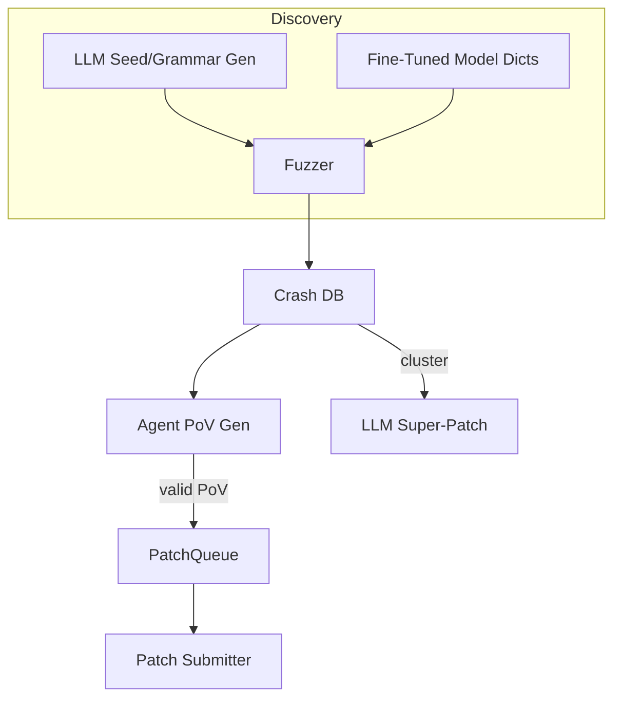

# Fuzzing asistido por IA y descubrimiento automatizado de vulnerabilidades

{{#include ../banners/hacktricks-training.md}}

## Descripción general
Los modelos de lenguaje de gran tamaño (LLM) pueden potenciar enormemente los pipelines tradicionales de investigación de vulnerabilidades al generar entradas semánticamente enriquecidas, evolucionar gramáticas, razonar sobre datos de fallos e incluso proponer parches para múltiples bugs. Esta página recopila los patrones más eficaces observados durante las finales del AI Cyber Challenge (AIxCC) de DARPA y otras investigaciones públicas.<sup>[[4]](#references)</sup><sup>[[5]](#references)</sup>

Lo que sigue no es una descripción de un sistema específico de competición, sino una abstracción de las técnicas para que puedas reproducirlas en tus propios workflows.

---

## 1. Entradas seed generadas por LLM

Los fuzzers tradicionales guiados por cobertura (AFL++, libFuzzer, Honggfuzz…) comienzan con un corpus pequeño de seeds y mutan bytes a ciegas. Cuando el formato de entrada objetivo es complejo (SQL, URLs, protocolos binarios personalizados), las mutaciones aleatorias normalmente rompen la sintaxis antes de alcanzar ramas interesantes.

Los LLM pueden resolver este problema inicial generando *seed generators*: scripts cortos que producen **entradas sintácticamente correctas pero relevantes para la seguridad**. Por ejemplo:
```prompt
SYSTEM: You are a helpful security engineer.
USER:
Write a Python3 program that prints 200 unique SQL injection strings targeting common anti-pattern mistakes (missing quotes, numeric context, stacked queries).  Ensure length ≤ 256 bytes / string so they survive common length limits.
```

```python
# gen_sqli_seeds.py (truncated)
PAYLOADS = [
"1 OR 1=1 -- ",
"' UNION SELECT NULL,NULL--",
"0; DROP TABLE users;--",
...
]
for p in PAYLOADS:
print(p)
```
Ejecútalo una vez y alimenta la salida directamente al corpus inicial del fuzzer:
```bash
python3 gen_sqli_seeds.py > seeds.txt
afl-fuzz -i seeds.txt -o findings/ -- ./target @@
```
Beneficios:
1. Validez semántica → mayor cobertura desde el principio.
2. Re-generable: ajusta el prompt para centrarse en XSS, path traversal, binary blobs, etc.
3. Económico (< 1 ¢ con GPT-3.5).

### Consejos
* Indica al modelo que *diversifique* la longitud y la codificación de los payloads (UTF-8, URL-encoded, UTF-16-LE) para eludir filtros superficiales.
* Solicita un *single self-contained script* – evita problemas con el formato JSON.

---

## 2. Grammar-Evolution Fuzzing

Una variante más potente consiste en permitir que el LLM **evolucione una gramática** en lugar de seeds concretos. El flujo de trabajo (patrón “Grammar Guy”) es:

1. Generar una gramática inicial de ANTLR/Peach/LibFuzzer mediante un prompt.
2. Ejecutar fuzzing durante N minutos y recopilar métricas de cobertura (edges / blocks alcanzados).
3. Resumir las áreas del programa que no se han cubierto y proporcionar el resumen al modelo:
```prompt
La gramática anterior activó el 12 % de los edges del programa.  Funciones no alcanzadas: parse_auth, handle_upload.  Añade / modifica reglas para cubrirlas.
```
4. Combinar las nuevas reglas, volver a ejecutar fuzzing y repetir.

Esqueleto de pseudo-código:
```python
for epoch in range(MAX_EPOCHS):
grammar = llm.refine(grammar, feedback=coverage_stats)
save(grammar, f"grammar_{epoch}.txt")
coverage_stats = run_fuzzer(grammar)
```
Puntos clave:
* Mantén un *presupuesto*: cada refinamiento consume tokens.
* Usa instrucciones `diff` + `patch` para que el modelo edite en lugar de reescribir.
* Detente cuando Δcoverage < ε.

---

## 3. Generación de PoV (Exploit) basada en agentes

Después de encontrar un crash, todavía necesitas un **proof-of-vulnerability (PoV)** que lo active de forma determinista.

Un enfoque escalable consiste en iniciar muchos workers ligeros (procesos, hilos o contenedores), cada uno usando un modelo o una configuración de sampling diferente. La encuesta de finalistas de AIxCC ofrece ejemplos concretos de escala: un equipo utilizó **miles de agentes concurrentes** para la generación de PoV basada principalmente en AI, mientras que otro orquestó **300–500 agentes de fuzzing** y reservó los LLM para el razonamiento semántico de mayor nivel.<sup>[[4]](#references)</sup>

Pipeline:
1. El análisis estático/dinámico produce *bug candidates* (struct con crash PC, input slice y mensaje del sanitizer).
2. El orchestrator distribuye los candidatos entre los agentes.
3. Pasos de razonamiento del agente:
a. Reproducir el bug localmente con `gdb` + input.
b. Sugerir un exploit payload mínimo.
c. Validar el exploit en un sandbox. Si tiene éxito → enviarlo.
4. Los intentos fallidos se vuelven a poner en cola como **nuevos seeds** para el coverage fuzzing (feedback loop).

Ventajas:
* La paralelización oculta la falta de fiabilidad de un único agente.
* Auto-tuning de temp / tamaño del modelo según la tasa de éxito observada.

---

## 4. Directed Fuzzing con modelos de código Fine-Tuned

Aplica Fine-tune a un modelo de pesos abiertos (por ejemplo, Llama-7B) usando código fuente C/C++ etiquetado con patrones de vulnerabilidad (integer overflow, buffer copy, format string). Después:

1. Ejecuta un análisis estático para obtener la lista de funciones + AST.
2. Haz esta pregunta al modelo: *“Give mutation dictionary entries that are likely to break memory safety in function X”*.
3. Inserta esos tokens en un `AFL_CUSTOM_MUTATOR` personalizado.

Ejemplo de salida para un wrapper de `sprintf`:
```
{"pattern":"%99999999s"}
{"pattern":"AAAAAAAA....<1024>....%n"}
```
Empíricamente, esto reduce el tiempo hasta el crash en más de 2× en objetivos reales.

---

## 5. Estrategias de Patching Guiadas por IA

### 5.1 Super Patches
Pide al modelo que *agrupe* las firmas de crash y proponga un **único patch** que elimine la causa raíz común. Envíalo una vez, corrige varios bugs → menos penalizaciones por precisión en entornos donde cada patch incorrecto cuesta puntos.

Esquema del prompt:
```
Here are 10 stack traces + file snippets.  Identify the shared mistake and generate a unified diff fixing all occurrences.
```
### 5.2 Ratio de Parches Especulativos
Implementa una cola donde los parches confirmados y validados mediante PoV y los parches *especulativos* (sin PoV) se intercalen en una proporción 1:​N ajustada a las reglas de puntuación (por ejemplo, 2 especulativos : 1 confirmado). Un modelo de costes monitoriza las penalizaciones frente a los puntos y ajusta N automáticamente.

---

## 6. Revisión Determinista de Código AI Archivo por Archivo

Un modo frecuente de fallo en la revisión asistida por AI consiste en pedir a un agente que inspeccione todo un repositorio y esperar que elija los archivos y términos de grep adecuados. Un patrón más fiable es **forzar la cobertura del repositorio**:<sup>[[1]](#references)</sup>

1. Enumera los archivos de código fuente.
2. Envía **un archivo cada vez** junto con el contexto mínimo (entrypoint, imports, rutas y callers cercanos).
3. Exige un **informe estructurado** para cada archivo: sources, sink, validación ausente, precondiciones de exploit y confianza.<sup>[[3]](#references)</sup>
4. Deduplica los informes por **patrón source→sink** y valida manualmente los de mayor riesgo.

Esto consume muchos tokens y genera ruido, pero es muy eficaz para descubrir **bugs simples de alto impacto en source/sink** que las revisiones agentic amplias suelen pasar por alto.

### Patrones de triage que conviene priorizar

- **Dynamic PHP include/dispatch**: nombres de rutas/controllers/modules controlados por el atacante que llegan a `require_once()`, `include()` o `include_once()` sin una allowlist estricta ni canonicalización de rutas.
- **Shell execution en flujos de administración/cuentas**: usernames, domains, cuentas FTP u otros identificadores que llegan a `exec()`, `system()`, `shell_exec()`, `passthru()`, `proc_open()` o `popen()`.
- **Convergencia de structured input**: el mismo parámetro aceptado desde `$_GET`, `$_POST`, JSON, XML o parsers de body del framework y posteriormente reutilizado en sinks del filesystem o de comandos del sistema operativo.

### Dos clases prácticas de bugs que este método detecta bien

- **PHP controller-dispatch LFI/RCE**: si el nombre del controller controlado por la request se concatena en `require_once()` sin allowlist ni normalización de rutas, secuencias de traversal como `../` pueden hacer que PHP incluya un archivo `.php` local no previsto. Si el atacante puede dirigir el include hacia un archivo PHP plantado o útil por otro motivo, el LFI se convierte en code execution. Consulta [File Inclusion / Path Traversal](../pentesting-web/file-inclusion/README.md).<sup>[[1]](#references)</sup>
- **Command injection autenticada en paneles de hosting/administración**: si los campos de gestión de cuentas, como los usernames, se insertan en comandos shell, un usuario autenticado con pocos privilegios puede convertir una acción normal de creación/eliminación en RCE. El impacto aumenta cuando el panel ejecuta el comando como una service account con más privilegios. Consulta [Command Injection](../pentesting-web/command-injection.md).<sup>[[1]](#references)</sup>

### Notas prácticas de revisión

- Usa el LLM primero como **revisor de source/sink**, no como generador de exploits.
- Pídele que enumere explícitamente el **campo controlado por el atacante**, la **brecha de normalización/validación** y el **sink peligroso**.
- En repositorios grandes, la revisión determinista archivo por archivo suele ser más fiable que una única ejecución de un agente autónomo, incluso cuando esta utiliza un modelo más potente.<sup>[[2]](#references)</sup>
- Espera resultados más débiles en **Broken Access Control** y otros bugs de lógica de negocio cuya explotabilidad dependa de suposiciones entre archivos, semántica de roles o threat models específicos del producto.

---

## Putting It All Together
Un CRS (Cyber Reasoning System) end-to-end puede conectar los componentes de la siguiente manera:

```mermaid
graph TD
subgraph Discovery
A[LLM Seed/Grammar Gen] --> B[Fuzzer]
C[Fine-Tuned Model Dicts] --> B
end
B --> D[Crash DB]
D --> E[Agent PoV Gen]
E -->|valid PoV| PatchQueue
D -->|cluster| F[LLM Super-Patch]
PatchQueue --> G[Patch Submitter]
```
---

## References

- [1] [Project Black - IA local para Cyber Security: Encontrando LFI en phpIPAM y RCE autenticado en myVesta](https://projectblack.io/blog/local-ai-for-cyber-security)
- [2] [Strix](https://github.com/usestrix/strix)
- [3] [skill de revisión de seguridad de la comunidad de GitHub Copilot](https://github.com/github/awesome-copilot/blob/main/skills/security-review/SKILL.md)
- [4] [Trail of Bits – finales de AIxCC: El relato de la cinta](https://blog.trailofbits.com/2025/08/07/aixcc-finals-tale-of-the-tape/)
- [5] [Entrevistas a finalistas de AIxCC de CTF Radiooo](https://www.youtube.com/@ctfradiooo)
{{#include ../banners/hacktricks-training.md}}
