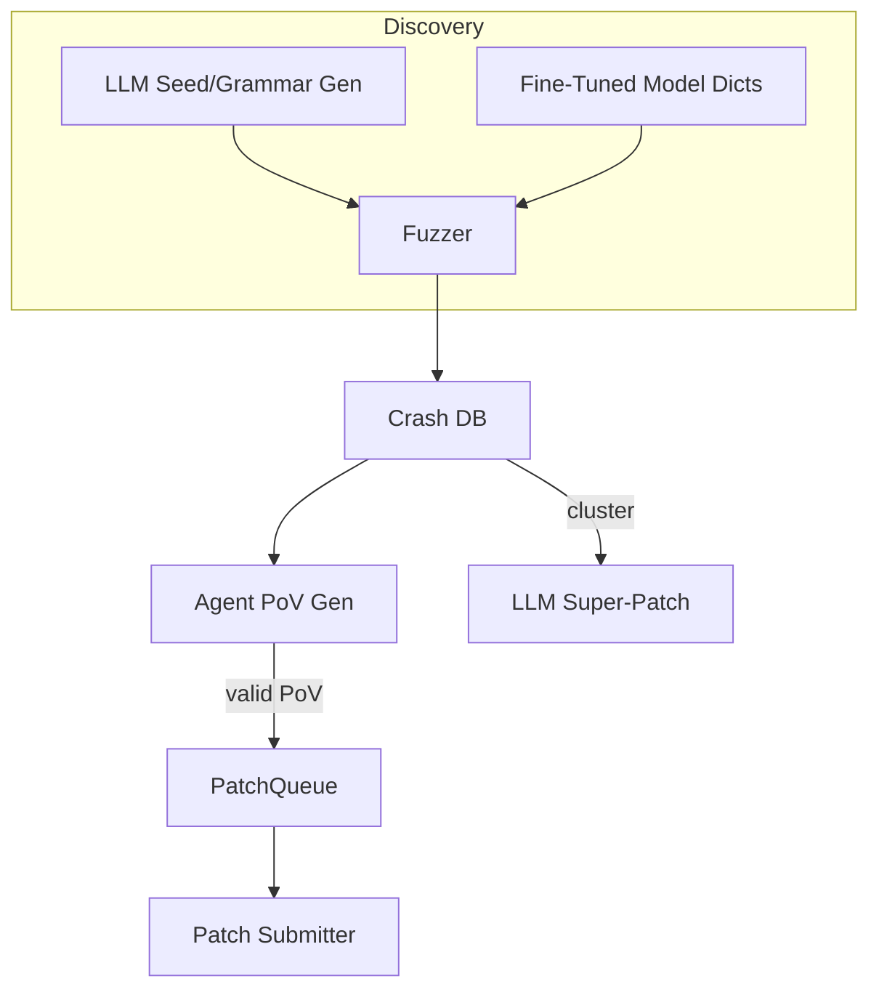

# AI-Assisted Fuzzing & Automated Vulnerability Discovery

{{#include ../banners/hacktricks-training.md}}

## 概要
Large-language models（LLM）は、意味的に豊かな入力の生成、grammarの進化、crashデータの推論、さらには複数のbugに対するpatchの提案まで行うことで、従来のvulnerability-researchパイプラインを大幅に強化できます。このページでは、DARPAのAI Cyber Challenge（AIxCC）finalsやその他の公開researchで確認された、最も効果的なパターンをまとめます。<sup>[[4]](#references)</sup><sup>[[5]](#references)</sup>

以下では、特定のcompetition systemを説明するのではなく、独自のworkflowで再現できるよう、techniqueを抽象化して説明します。

---

## 1. LLM-Generated Seed Inputs

従来のcoverage–guided fuzzer（AFL++、libFuzzer、Honggfuzz…）は、小規模なseed corpusから開始し、byteを盲目的にmutateします。target input formatが複雑（SQL、URL、custom binary protocol）な場合、random mutationでは通常、興味深いbranchに到達する前にsyntaxが壊れます。

LLMは、*seed generator*（**syntax-correctかつsecurity-relevantなinput**を出力する短いscript）を生成することで、このbootstrap problemを解決できます。例:
```prompt
SYSTEM: You are a helpful security engineer.
USER:
Write a Python3 program that prints 200 unique SQL injection strings targeting common anti-pattern mistakes (missing quotes, numeric context, stacked queries).  Ensure length ≤ 256 bytes / string so they survive common length limits.
```

```python
# gen_sqli_seeds.py (truncated)
PAYLOADS = [
"1 OR 1=1 -- ",
"' UNION SELECT NULL,NULL--",
"0; DROP TABLE users;--",
...
]
for p in PAYLOADS:
print(p)
```
1回実行し、出力を直接fuzzerの初期コーパスに入力する：
```bash
python3 gen_sqli_seeds.py > seeds.txt
afl-fuzz -i seeds.txt -o findings/ -- ./target @@
```
Benefits:
1. Semantic validity → より早い段階で、より深い coverage。
2. Re-generatable: prompt を調整して、XSS、path traversal、binary blobs などに焦点を当てられる。
3. Cheap（GPT-3.5 なら 1 ¢ 未満）。

### Tips
* 表面的なフィルターを bypass するため、payload の長さと encoding（UTF-8、URL-encoded、UTF-16-LE）を *diversify* するよう model に指示する。
* *single self-contained script* を要求する ― JSON formatting の不具合を回避できる。

---

## 2. Grammar-Evolution Fuzzing

より強力な variant では、具体的な seeds ではなく、LLM に **grammar を evolve** させる。workflow（「Grammar Guy」pattern）は次のとおり。

1. prompt を使って初期 ANTLR/Peach/LibFuzzer grammar を生成する。
2. N 分間 fuzzing し、coverage metrics（到達した edges / blocks）を収集する。
3. 未到達の program areas を要約し、その summary を model に送り返す。
```prompt
The previous grammar triggered 12 % of the program edges.  Functions not reached: parse_auth, handle_upload.  Add / modify rules to cover these.
```
4. 新しい rules を merge し、再度 fuzzing を実行して繰り返す。

Pseudo-code skeleton:
```python
for epoch in range(MAX_EPOCHS):
grammar = llm.refine(grammar, feedback=coverage_stats)
save(grammar, f"grammar_{epoch}.txt")
coverage_stats = run_fuzzer(grammar)
```
要点:
* *budget* を維持する – 各 refinement は tokens を消費する。
* モデルが書き直すのではなく編集するように、`diff` + `patch` instructions を使用する。
* Δcoverage < ε になったら停止する。

---

## 3. Agent-Based PoV (Exploit) Generation

crash が見つかった後も、それを確実に trigger する **proof-of-vulnerability (PoV)** が必要です。

scalable な approach は、多数の軽量な worker（process、thread、または container）を spawn し、それぞれで異なる model または sampling configuration を使用することです。AIxCC finalist survey では具体的な規模の例が示されています。ある team は AI-first PoV generation のために **thousands of concurrent agents** を使用し、別の team は **300–500 fuzzing agents** を orchestrate し、LLM は higher-level semantic reasoning 用に確保していました。<sup>[[4]](#references)</sup>

Pipeline:
1. Static/ dynamic analysis により *bug candidates*（crash PC、input slice、sanitizer msg を含む struct）を生成する。
2. Orchestrator が candidates を agents に配布する。
3. Agent の reasoning steps:
a. `gdb` + input を使用して bug をローカルで再現する。
b. 最小限の exploit payload を提案する。
c. sandbox 内で exploit を検証する。成功した場合 → submit。
4. 失敗した試行は、coverage fuzzing 用の **new seeds** として **re-queue** される（feedback loop）。

Advantages:
* Parallelisation により、single-agent の信頼性の低さを隠せる。
* 観測された success-rate に基づいて temp / model size を auto-tuning できる。

---

## 4. Directed Fuzzing with Fine-Tuned Code Models

open-weight model（例: Llama-7B）を、vulnerability patterns（integer overflow、buffer copy、format string）のラベル付き C/C++ source で fine-tune します。その後:

1. Static analysis を実行して function list + AST を取得する。
2. Model に prompt する: *“Give mutation dictionary entries that are likely to break memory safety in function X”*
3. それらの tokens を custom `AFL_CUSTOM_MUTATOR` に挿入する。

`sprintf` wrapper の Example output:
```
{"pattern":"%99999999s"}
{"pattern":"AAAAAAAA....<1024>....%n"}
```
実際の target では、これにより crash までの時間が 2 倍以上短縮されます。

---

## 5. AI による Patching 戦略

### 5.1 Super Patches
モデルに crash signature を *cluster* させ、共通する root cause を取り除く **single patch** を提案させます。1 回の Submit で複数の bug を修正できるため、誤った patch ごとに points が減点される環境では accuracy penalty を減らせます。

Prompt の概要:
```
Here are 10 stack traces + file snippets.  Identify the shared mistake and generate a unified diff fixing all occurrences.
```
### 5.2 Speculative Patch Ratio
confirmed PoV-validated patches と *speculative* patches（PoV なし）を 1:​N の比率で交互に処理する queue を実装します。この比率は scoring rules に合わせて調整します（例: speculative 2 件 : confirmed 1 件）。cost model が penalties と points を監視し、N を自動調整します。

---

## 6. Deterministic File-by-File AI Code Review

AI-assisted review で頻繁に発生する failure mode は、1 つの agent に repository 全体を調査させ、適切なファイルや grep terms を選ぶことを期待する方法です。より信頼性の高いパターンは、**repository coverage を強制すること**です:<sup>[[1]](#references)</sup>

1. source files を列挙します。
2. **1 回につき 1 ファイル**と、最小限の context（entrypoint、imports、近隣の routes/callers）を送信します。
3. 各ファイルについて、sources、sink、missing validation、exploit preconditions、confidence を含む **structured report** を要求します。<sup>[[3]](#references)</sup>
4. **source→sink pattern** ごとに reports の重複を排除し、high-risk なものを手動で検証します。

これは token-heavy で noisy ですが、広範な agentic review では見落とされがちな **単純で impact の大きい source/sink bugs** を発見するうえで非常に効果的です。

### Triage patterns worth prioritising

- **Dynamic PHP include/dispatch**: attacker-controlled な route/controller/module names が、strict allowlisting と path canonicalisation なしに `require_once()`、`include()`、または `include_once()` に流れ込むケース。
- **Shell execution in admin/account workflows**: usernames、domains、FTP accounts、その他の identifiers が `exec()`、`system()`、`shell_exec()`、`passthru()`、`proc_open()`、または `popen()` に到達するケース。
- **Structured input fan-in**: 同じ parameter が `$_GET`、`$_POST`、JSON、XML、または framework body parsers から受け入れられ、その後 filesystem または OS-command sinks で再利用されるケース。

### Two practical bug classes this method finds well

- **PHP controller-dispatch LFI/RCE**: request-controlled な controller name が allowlist/path normalisation なしで `require_once()` に連結されている場合、`../` などの traversal sequences により、PHP が意図しないローカルの `.php` file を include する可能性があります。攻撃者が include 先を、配置した、またはその他の有用な PHP file に指定できる場合、LFI は code execution になります。[File Inclusion / Path Traversal](../pentesting-web/file-inclusion/README.md) を参照してください。<sup>[[1]](#references)</sup>
- **Authenticated command injection in hosting/admin panels**: usernames などの account-management fields が shell commands に埋め込まれている場合、low-privileged な authenticated user は通常の create/delete action を RCE に変える可能性があります。panel がより privileged な service account として command を実行する場合、impact はさらに大きくなります。[Command Injection](../pentesting-web/command-injection.md) を参照してください。<sup>[[1]](#references)</sup>

### Practical review notes

- LLM は exploit generator としてではなく、まず **source/sink reviewer** として使用します。
- **attacker-controlled field**、**normalization/validation gap**、**dangerous sink** を明示的に列挙するよう要求します。
- 大規模な repos では、より強力な model を使用する単一の autonomous agent run よりも、deterministic な per-file review のほうが信頼性の高い場合があります。<sup>[[2]](#references)</sup>
- **Broken Access Control** やその他の business-logic bugs では、exploitability が cross-file assumptions、role semantics、または product-specific threat models に依存するため、結果が弱くなることを想定してください。

---

## Putting It All Together
end-to-end CRS (Cyber Reasoning System) は、次のように components を接続できます:

```mermaid
graph TD
subgraph Discovery
A[LLM Seed/Grammar Gen] --> B[Fuzzer]
C[Fine-Tuned Model Dicts] --> B
end
B --> D[Crash DB]
D --> E[Agent PoV Gen]
E -->|valid PoV| PatchQueue
D -->|cluster| F[LLM Super-Patch]
PatchQueue --> G[Patch Submitter]
```
---

## References

- [1] [Project Black - Cyber Security向けのローカルAI：phpIPAM LFIとmyVesta認証済みRCEの発見](https://projectblack.io/blog/local-ai-for-cyber-security)
- [2] [Strix](https://github.com/usestrix/strix)
- [3] [GitHub Copilotコミュニティのsecurity-review skill](https://github.com/github/awesome-copilot/blob/main/skills/security-review/SKILL.md)
- [4] [Trail of Bits – AIxCC決勝：記録の物語](https://blog.trailofbits.com/2025/08/07/aixcc-finals-tale-of-the-tape/)
- [5] [CTF RadioooによるAIxCCファイナリストインタビュー](https://www.youtube.com/@ctfradiooo)
{{#include ../banners/hacktricks-training.md}}
