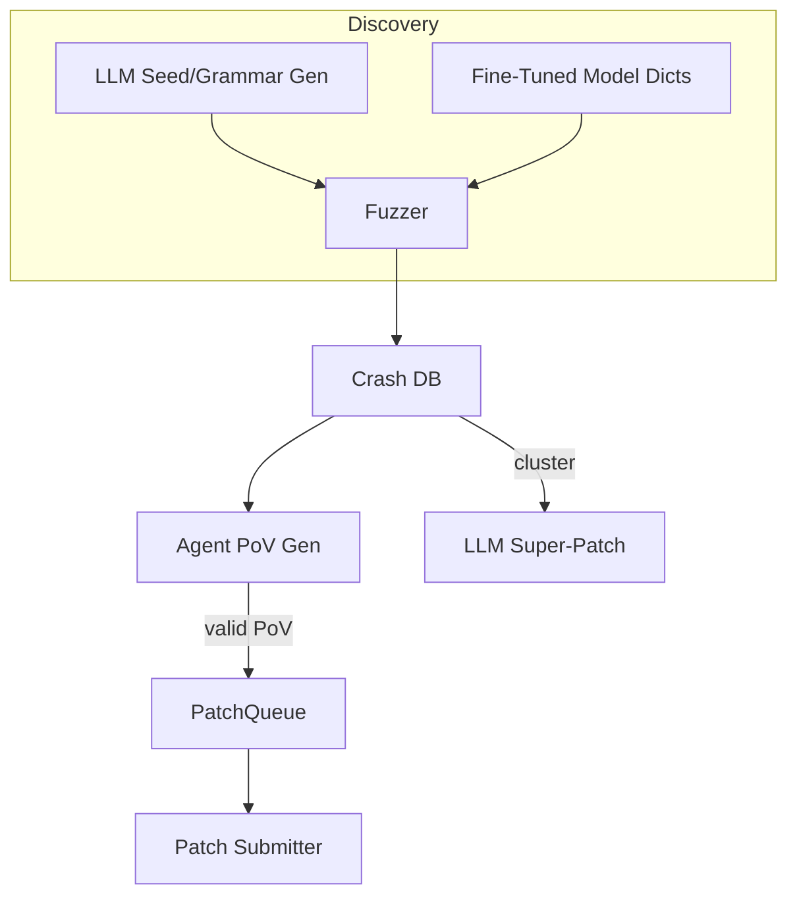

# Fuzzing wspomagany przez AI i automatyczne wykrywanie podatności

{{#include ../banners/hacktricks-training.md}}

## Przegląd
Large-language models (LLM) mogą znacząco usprawnić tradycyjne pipeline’y badania podatności, generując semantycznie bogate dane wejściowe, rozwijając gramatyki, analizując dane o crashach, a nawet proponując poprawki obejmujące wiele bugów. Ta strona zbiera najskuteczniejsze wzorce zaobserwowane podczas finałów DARPA’s AI Cyber Challenge (AIxCC) oraz w innych publicznych badaniach.<sup>[[4]](#references)</sup><sup>[[5]](#references)</sup>

Poniższy opis nie przedstawia jednego konkretnego systemu konkursowego, lecz stanowi abstrakcję technik, dzięki której możesz odtworzyć je we własnych workflow.

---

## 1. Dane wejściowe seedów generowane przez LLM

Tradycyjne fuzzery sterowane pokryciem (AFL++, libFuzzer, Honggfuzz…) rozpoczynają działanie od niewielkiego korpusu seedów i mutują bajty w sposób ślepy. Gdy format danych wejściowych celu jest złożony (SQL, URL-e, niestandardowe protokoły binarne), losowe mutacje zazwyczaj niszczą składnię, zanim zostaną osiągnięte interesujące gałęzie.

LLM mogą rozwiązać ten problem inicjalizacji, generując *generatory seedów* – krótkie skrypty, które wypisują **poprawne składniowo, lecz istotne z punktu widzenia bezpieczeństwa dane wejściowe**. Na przykład:
```prompt
SYSTEM: You are a helpful security engineer.
USER:
Write a Python3 program that prints 200 unique SQL injection strings targeting common anti-pattern mistakes (missing quotes, numeric context, stacked queries).  Ensure length ≤ 256 bytes / string so they survive common length limits.
```

```python
# gen_sqli_seeds.py (truncated)
PAYLOADS = [
"1 OR 1=1 -- ",
"' UNION SELECT NULL,NULL--",
"0; DROP TABLE users;--",
...
]
for p in PAYLOADS:
print(p)
```
Uruchom raz i przekaż wynik bezpośrednio do początkowego corpus fuzzera:
```bash
python3 gen_sqli_seeds.py > seeds.txt
afl-fuzz -i seeds.txt -o findings/ -- ./target @@
```
Korzyści:
1. Poprawność semantyczna → większy zasięg na wczesnym etapie.
2. Możliwość ponownego generowania: zmień prompt, aby skupić się na XSS, path traversal, binary blobs itp.
3. Niski koszt (< 1 ¢ z GPT-3.5).

### Wskazówki
* Poinstruuj model, aby *zróżnicował* długość i kodowanie payloadów (UTF-8, URL-encoded, UTF-16-LE), aby ominąć powierzchowne filtry.
* Poproś o *pojedynczy, samodzielny skrypt* – pozwala uniknąć problemów z formatowaniem JSON.

---

## 2. Grammar-Evolution Fuzzing

Bardziej zaawansowany wariant polega na tym, aby pozwolić LLM-owi **ewoluować gramatykę** zamiast konkretnych seedów. Workflow (wzorzec „Grammar Guy”) wygląda następująco:

1. Wygeneruj początkową gramatykę ANTLR/Peach/LibFuzzer za pomocą promptu.
2. Wykonuj fuzzing przez N minut i zbieraj metryki coverage (trafione krawędzie / bloki).
3. Podsumuj niepokryte obszary programu i przekaż podsumowanie z powrotem do modelu:
```prompt
The previous grammar triggered 12 % of the program edges.  Functions not reached: parse_auth, handle_upload.  Add / modify rules to cover these.
```
4. Scal nowe reguły, ponownie wykonaj fuzzing i powtarzaj.

Szkielet pseudokodu:
```python
for epoch in range(MAX_EPOCHS):
grammar = llm.refine(grammar, feedback=coverage_stats)
save(grammar, f"grammar_{epoch}.txt")
coverage_stats = run_fuzzer(grammar)
```
Najważniejsze punkty:
* Zachowaj *budżet* – każde udoskonalenie zużywa tokeny.
* Używaj instrukcji `diff` + `patch`, aby model edytował kod zamiast przepisywać go od nowa.
* Zatrzymaj się, gdy Δcoverage < ε.

---

## 3. Inżynieria harnessu libFuzzer z użyciem Local-LLM

W przypadku kodu źródłowego, który nie może opuścić stacji roboczej analityka, lokalny model kodu może przygotować mały adapter między bajtami fuzzera a API C/C++. Jawna granica bezpieczeństwa jest następująca: **model tworzy i poprawia infrastrukturę testową; mutacje sterowane coverage badają dane wejściowe; sanitizery zgłaszają nieprawidłowe operacje; człowiek weryfikuje harness i przeprowadza triage wyników**.<sup>[[9]](#references)</sup>

W przypadku technik związanych z corpus, feedbackiem, snapshotami i stateful-fuzzingiem na poziomie silnika, które nie zależą od LLM, zobacz ogólną metodologię [Fuzzing Methodology](../generic-methodologies-and-resources/fuzzing.md).

Zacznij od dokładnej deklaracji skopiowanej z nagłówka targetu i ogranicz format wyjściowy. Wąski prompt zmniejsza liczbę zmyślonych API i ułatwia weryfikację wyniku:<sup>[[8]](#references)[[9]](#references)</sup>
```prompt
Write a libFuzzer target for this exact declaration:
int parse_records(const uint8_t *data, size_t size);

Output only C code. Implement LLVMFuzzerTestOneInput, include the
declaration, pass data and size unchanged, and do not use files,
network access, randomness, clocks, threads, or persistent state.
```
W przypadku parsera surowych bajtów oczekiwany wynik nie powinien być bardziej skomplikowany niż:<sup>[[6]](#references)[[9]](#references)</sup>
```c
#include <stddef.h>
#include <stdint.h>

extern int parse_records(const uint8_t *, size_t);

int LLVMFuzzerTestOneInput(const uint8_t *data, size_t size) {
(void)parse_records(data, size);
return 0;
}
```
Kompilacja to dopiero pierwsza bramka walidacyjna. Przed poświęceniem mocy obliczeniowej na każdy wygenerowany target sprawdź go pod kątem tych niezmienników:<sup>[[6]](#references)[[8]](#references)[[9]](#references)</sup>

- **Exact API:** porównaj typy, zasady własności, inicjalizację, sprzątanie oraz calling convention z rzeczywistym nagłówkiem i istniejącymi callerami.
- **Harness safety:** zabezpiecz każdy odczyt z `data`; ustalenia sanitizerów muszą pochodzić z targetu, a nie z wygenerowanego glue code.
- **Repeatability:** spraw, aby wynik był funkcją `data` i `size`; usuń zewnętrzne I/O, czas, niekontrolowaną losowość, niepołączone wątki oraz stan utrzymujący się między wywołaniami.
- **Throughput:** inicjalizuj kosztowny niezmienny stan tylko raz, ale wyłącznie wtedy, gdy nie może to wpłynąć na zachowanie, ogranicz rozmiar wejścia, wyłącz logowanie i zwalniaj alokacje dla poszczególnych wejść.
- **Reachability:** zweryfikuj, czy wykonywane są zamierzone funkcje i branche. Target, który się kompiluje, ale przechodzi wyłącznie przez ścieżki odrzucenia, to cichy błąd.

### Structure-aware targets: zachowuj niezmienniki bez ukrywania błędów

Jeśli większość surowych wejść odpada na bramce magic, długości, wersji lub checksum, użyj bajtów fuzzingu jako **materiału typowanych pól** i odbuduj poprawny obiekt. Ustal stałe formatu, pozostaw pola semantyczne i bajty payloadu jako zmienne, a metadane integralności wyprowadź ze zrekonstruowanego payloadu. `FuzzedDataProvider` jest przydatny do pobierania ograniczonych wartości typowanych, natomiast adapter nadal odpowiada za ograniczanie każdej wygenerowanej alokacji i konwersji.<sup>[[9]](#references)</sup>

<details>
<summary>Przykład structure-aware targetu w C++</summary>
```cpp
#include <fuzzer/FuzzedDataProvider.h>
#include <stddef.h>
#include <stdint.h>
#include <vector>

extern "C" int parse_message(const uint8_t *, size_t);

extern "C" int LLVMFuzzerTestOneInput(const uint8_t *data, size_t size) {
FuzzedDataProvider fdp(data, size);
uint8_t version = fdp.ConsumeIntegral<uint8_t>();
auto body = fdp.ConsumeRemainingBytes<uint8_t>();
if (body.size() > UINT16_MAX) body.resize(UINT16_MAX);
uint16_t len = static_cast<uint16_t>(body.size());
std::vector<uint8_t> msg = {0x8b, 'M', 'S', 'G', version,
static_cast<uint8_t>(len >> 8),
static_cast<uint8_t>(len)};
msg.insert(msg.end(), body.begin(), body.end());
(void)parse_message(msg.data(), msg.size());
return 0;
}
```
</details>

Nie używaj jednej struktury naprawiającej `target` dla każdego pytania. Utrzymuj jeden `target`, który wylicza długości i sumy kontrolne w celu eksplorowania głębokich, poprawnych stanów, oraz drugi, który pozostawia **zadeklarowane** metadane pod kontrolą fuzzera, ograniczając wyłącznie odczyty i alokacje wykonywane przez sam harness. Drugi `target` zachowuje powierzchnie ataku związane z niezgodnymi długościami i błędną integralnością, które automatyczna naprawa w przeciwnym razie usunęłaby.<sup>[[9]](#references)</sup>

### Seedy, dictionaries, sanitizers i feedback dotyczący coverage

Poproś model o wygenerowanie skryptu zapisującego binarne seedy zamiast proszenia go o bezpośrednie wypisywanie danych binarnych. Przygotuj seedy zawierające puste, minimalne, typowe i poprawne obiekty brzegowe, a następnie wyodrębnij wartości magiczne, tagi, kodowania enumów i keywords parsera do przejrzanego dictionary. libFuzzer akceptuje ten dictionary za pomocą `-dict=`, zachowując w corpus mutacje ujawniające nowy coverage.<sup>[[6]](#references)[[9]](#references)</sup>
```text
magic="\x8bMSG"
version_min="\x00"
version_max="\xff"
config_tag="CONFIG"
```
Zbuduj ten sam target z uzupełniającą instrumentacją. ASan i UBSan mogą współdzielić binarkę fuzzingową; użyj osobnego builda MSan i zinstrumentuj jego zależności, aby uniknąć raportów powodowanych przez niezinstrumentowany kod.<sup>[[6]](#references)[[9]](#references)</sup>
```bash
clang++ -g -O1 -fsanitize=fuzzer,address,undefined \
-fno-sanitize-recover=undefined target.cc harness.cc -o fuzz_target
./fuzz_target corpus -dict=msg.dict -max_len=65535

clang++ -g -O1 -fsanitize=fuzzer,memory \
target.cc harness.cc -o fuzz_target_msan
```
Traktuj pokrycie jako kryterium oceny dla każdej wersji modelu. W danych wyjściowych libFuzzer wczesne, płaskie wartości `cov`/`ft` oraz statyczny corpus zwykle oznaczają nieprawidłowe ramkowanie, nadmiernie restrykcyjny wczesny return albo niewłaściwe wywołanie; niskie `exec/s` wskazuje na kosztowną konfigurację, operacje I/O, alokacje lub wyciek stanu. `NEW` dowodzi jedynie, że zmieniła się funkcja pokrycia, a nie że osiągnięto zamierzony parser.<sup>[[6]](#references)[[9]](#references)</sup>

Aby uzyskać feedback na poziomie źródła, utwórz build z coverage, wykonaj fuzzing i przekaż modelowi wyłącznie niepokryte funkcje wraz z warunkami, które je chronią. Zweryfikuj wynikający z tego diff harness/seed/dictionary i ponownie wykonaj pomiar:<sup>[[7]](#references)[[8]](#references)[[9]](#references)</sup>
```bash
clang++ -g -O1 -fsanitize=fuzzer \
-fprofile-instr-generate -fcoverage-mapping target.cc harness.cc -o fuzz_cov
mkdir -p profiles
LLVM_PROFILE_FILE='profiles/%p.profraw' ./fuzz_cov -max_total_time=300 corpus
llvm-profdata merge -sparse profiles/*.profraw -o fuzz.profdata
llvm-cov report ./fuzz_cov -instr-profile=fuzz.profdata
llvm-cov show ./fuzz_cov -instr-profile=fuzz.profdata \
--show-branches=count --region-coverage-lt=1 target.cc
```
Skalowalna pętla wygląda zatem następująco: **generate → compile/link → smoke-test under sanitizers → measure target coverage → provide the smallest relevant coverage/source context → revise → re-measure**. OSS-Fuzz-Gen stosuje tę samą zasadę, oceniając wygenerowane targety pod kątem możliwości kompilacji, błędów w czasie działania, coverage oraz poprawy coverage względem istniejących targetów, zamiast uznawać wiarygodnie wyglądający kod za poprawny bez dalszej weryfikacji.<sup>[[7]](#references)[[8]](#references)</sup>

---

## 4. Generowanie PoV (Exploit) oparte na agentach

Po znalezieniu crasha nadal potrzebujesz **proof-of-vulnerability (PoV)**, który deterministycznie go wywoła.

Skalowalne podejście polega na uruchomieniu wielu lekkich workerów (procesów, wątków lub kontenerów), z których każdy korzysta z innego modelu lub konfiguracji próbkowania. Ankieta finalistów AIxCC podaje konkretne przykłady skali: jeden zespół korzystał z **tysięcy równoczesnych agentów** do generowania PoV w podejściu AI-first, podczas gdy inny koordynował **300–500 agentów fuzzingu** i rezerwował LLM-y do rozumowania na wyższym poziomie semantycznym.<sup>[[4]](#references)</sup>

Pipeline:
1. Analiza statyczna/dynamiczna generuje *kandydatów na błędy* (`struct` z crash PC, input slice i komunikatem sanitizera).
2. Orchestrator rozdziela kandydatów między agentów.
3. Kroki rozumowania agenta:
a. Odtwórz błąd lokalnie za pomocą `gdb` + inputu.
b. Zaproponuj minimalny exploit payload.
c. Zwaliduj exploit w sandboxie.  Jeśli się powiedzie → prześlij.
4. Nieudane próby są **ponownie kolejkowane jako nowe seedy** do fuzzingu coverage (pętla sprzężenia zwrotnego).

Zalety:
* Równoległość ukrywa zawodność pojedynczego agenta.
* Automatyczne dostrajanie `temp` / rozmiaru modelu na podstawie zaobserwowanego wskaźnika powodzenia.

---

## 5. Directed Fuzzing z dostrajanymi modelami kodu

Dostrój model open-weight (np. Llama-7B) na kodzie źródłowym C/C++ oznaczonym wzorcami podatności (integer overflow, buffer copy, format string). Następnie:

1. Uruchom analizę statyczną, aby uzyskać listę funkcji + AST.
2. Przekaż modelowi prompt: *„Give mutation dictionary entries that are likely to break memory safety in function X”*.
3. Wstaw te tokeny do niestandardowego `AFL_CUSTOM_MUTATOR`.

Przykładowy output dla wrappera `sprintf`:
```
{"pattern":"%99999999s"}
{"pattern":"AAAAAAAA....<1024>....%n"}
```
Empirycznie skraca to time-to-crash o >2× na rzeczywistych targetach.

---

## 6. Strategie patchowania wspomaganego przez AI

### 6.1 Super Patches
Poproś model o *clustering* sygnatur crashy i zaproponowanie **pojedynczego patcha**, który usuwa wspólną przyczynę źródłową. Prześlij go raz, napraw kilka bugów → mniej kar za accuracy w środowiskach, w których każdy błędny patch kosztuje punkty.

Zarys promptu:
```
Here are 10 stack traces + file snippets.  Identify the shared mistake and generate a unified diff fixing all occurrences.
```
### 6.2 Współczynnik Speculative Patch
Zaimplementuj kolejkę, w której potwierdzone patche zweryfikowane za pomocą PoV oraz *speculative* patche (bez PoV) są przeplatane w proporcji 1:​N dostosowanej do zasad scoringu (np. 2 speculative : 1 confirmed). Model kosztów monitoruje kary względem punktów i samodzielnie dostosowuje N.

---

## 7. Deterministic File-by-File AI Code Review

Częstym trybem niepowodzenia podczas review wspomaganego przez AI jest poproszenie jednego agenta o przeanalizowanie całego repozytorium i liczenie na to, że wybierze odpowiednie pliki oraz terminy grep. Bardziej niezawodnym wzorcem jest **wymuszenie pokrycia repozytorium**:<sup>[[1]](#references)</sup>

1. Wylicz pliki źródłowe.
2. Wysyłaj **jeden plik naraz** wraz z minimalnym kontekstem (entrypoint, importy, pobliskie routes/callers).
3. Wymagaj **ustrukturyzowanego raportu** dla każdego pliku: sources, sink, brakująca walidacja, preconditions exploita oraz confidence.<sup>[[3]](#references)</sup>
4. Usuń duplikaty raportów według wzorca **source→sink** i ręcznie zweryfikuj te o wysokim ryzyku.

To podejście wymaga dużej liczby tokenów i generuje szum, ale jest bardzo skuteczne w wykrywaniu **prostych, wysoko wpływowych błędów source/sink**, które często umykają szerokim agentic reviews.

### Wzorce triage warte priorytetyzacji

- **Dynamic PHP include/dispatch**: kontrolowane przez atakującego nazwy route/controller/module przepływające do `require_once()`, `include()` lub `include_once()` bez ścisłego allowlistingu i canonicalizacji ścieżek.
- **Shell execution w workflow admin/account**: usernames, domeny, konta FTP lub inne identyfikatory trafiające do `exec()`, `system()`, `shell_exec()`, `passthru()`, `proc_open()` lub `popen()`.
- **Structured input fan-in**: ten sam parametr akceptowany z `$_GET`, `$_POST`, JSON, XML lub framework body parsers, a następnie ponownie używany w sinkach filesystem lub OS-command.

### Dwie praktyczne klasy błędów, które ta metoda dobrze wykrywa

- **PHP controller-dispatch LFI/RCE**: jeśli kontrolowana przez request nazwa controllera jest konkatenowana z `require_once()` bez allowlisty lub normalizacji ścieżki, sekwencje traversal, takie jak `../`, mogą spowodować, że PHP dołączy niezamierzony lokalny plik `.php`. Jeśli atakujący może wskazać umieszczony przez siebie lub w inny sposób użyteczny plik PHP, LFI przechodzi w code execution. Zobacz [File Inclusion / Path Traversal](../pentesting-web/file-inclusion/README.md).<sup>[[1]](#references)</sup>
- **Authenticated command injection w hosting/admin panels**: jeśli pola zarządzania kontem, takie jak usernames, są osadzane w poleceniach shell, uwierzytelniony użytkownik o niskich uprawnieniach może zmienić zwykłą operację create/delete w RCE. Skutek jest większy, gdy panel wykonuje polecenie jako bardziej uprzywilejowane konto serwisowe. Zobacz [Command Injection](../pentesting-web/command-injection.md).<sup>[[1]](#references)</sup>

### Praktyczne uwagi dotyczące review

- Używaj LLM najpierw jako **source/sink reviewer**, a nie generatora exploitów.
- Poproś go o jawne wyszczególnienie **pola kontrolowanego przez atakującego**, **luki w normalizacji/walidacji** oraz **niebezpiecznego sinka**.
- W przypadku dużych repozytoriów deterministyczne review per-file jest często bardziej niezawodne niż pojedyncze autonomiczne uruchomienie agenta, nawet jeśli to drugie wykorzystuje silniejszy model.<sup>[[2]](#references)</sup>
- Oczekuj słabszych wyników w przypadku **Broken Access Control** i innych błędów business logic, gdy exploitability zależy od założeń między plikami, semantyki ról lub threat models specyficznych dla produktu.

---

## Putting It All Together
End-to-end CRS (Cyber Reasoning System) może połączyć komponenty w następujący sposób:

```mermaid
graph TD
subgraph Discovery
A[LLM Seed/Grammar Gen] --> B[Fuzzer]
C[Fine-Tuned Model Dicts] --> B
end
B --> D[Crash DB]
D --> E[Agent PoV Gen]
E -->|valid PoV| PatchQueue
D -->|cluster| F[LLM Super-Patch]
PatchQueue --> G[Patch Submitter]
```
---

## References

- [1] [Project Black - Lokalna AI dla cyberbezpieczeństwa: wykrywanie phpIPAM LFI i uwierzytelnionego RCE myVesta](https://projectblack.io/blog/local-ai-for-cyber-security)
- [2] [Strix](https://github.com/usestrix/strix)
- [3] [Umiejętność security-review społeczności GitHub Copilot](https://github.com/github/awesome-copilot/blob/main/skills/security-review/SKILL.md)
- [4] [Trail of Bits – Finały AIxCC: relacja](https://blog.trailofbits.com/2025/08/07/aixcc-finals-tale-of-the-tape/)
- [5] [Wywiady z finalistami AIxCC przeprowadzone przez CTF Radiooo](https://www.youtube.com/@ctfradiooo)
- [6] [LLVM — libFuzzer: biblioteka do fuzz testingu sterowanego pokryciem](https://llvm.org/docs/LibFuzzer.html)
- [7] [Google — OSS-Fuzz-Gen](https://github.com/google/oss-fuzz-gen)
- [8] [Google Online Security Blog — Podnoszenie poziomu fuzzingu: znajdowanie większej liczby podatności za pomocą AI](https://security.googleblog.com/2024/11/leveling-up-fuzzing-finding-more.html)
- [9] [8kSec — Generowanie fuzzing harness z pomocą AI przy użyciu lokalnego LLM](https://8ksec.io/ai-assisted-fuzzing-harness-local-llm)
{{#include ../banners/hacktricks-training.md}}
