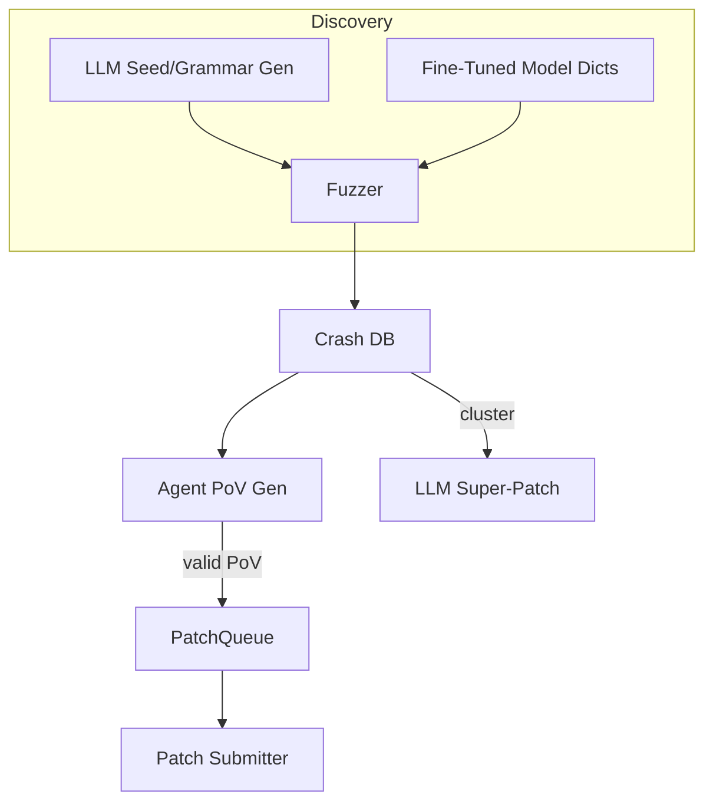

# AI-Assisted Fuzzing & Geoutomatiseerde Ontdekking van Kwesbaarhede

{{#include ../banners/hacktricks-training.md}}

## Oorsig
Large-language models (LLM's) kan tradisionele navorsingspyplyne vir kwesbaarhede aansienlik versterk deur semanties ryk invoer te genereer, grammatikas te ontwikkel, oor crash-data te redeneer, en selfs multi-bug patches voor te stel. Hierdie bladsy versamel die doeltreffendste patrone wat tydens DARPA se AI Cyber Challenge (AIxCC)-finaal en ander openbare navorsing waargeneem is.<sup>[[4]](#references)</sup><sup>[[5]](#references)</sup>

Wat volg, is nie ’n beskrywing van een spesifieke kompetisiestelsel nie, maar ’n abstraksie van die tegnieke sodat jy dit in jou eie workflows kan reproduseer.

---

## 1. LLM-gegenereerde Seed Inputs

Tradisionele coverage–guided fuzzers (AFL++, libFuzzer, Honggfuzz…) begin met ’n klein corpus van seeds en muteer grepe blindelings. Wanneer die teiken-invoerformaat kompleks is (SQL, URL's, custom binary protocols), breek ewekansige mutasies gewoonlik die sintaksis voordat interessante takke bereik word.

LLM's kan hierdie bootstrap-probleem oplos deur *seed generators* uit te stuur – kort scripts wat **sintaksis-korrekte maar sekuriteitsrelevante invoer** lewer. Byvoorbeeld:
```prompt
SYSTEM: You are a helpful security engineer.
USER:
Write a Python3 program that prints 200 unique SQL injection strings targeting common anti-pattern mistakes (missing quotes, numeric context, stacked queries).  Ensure length ≤ 256 bytes / string so they survive common length limits.
```

```python
# gen_sqli_seeds.py (truncated)
PAYLOADS = [
"1 OR 1=1 -- ",
"' UNION SELECT NULL,NULL--",
"0; DROP TABLE users;--",
...
]
for p in PAYLOADS:
print(p)
```
Voer een keer uit en voer die uitvoer direk in die fuzzer se aanvanklike korpus in:
```bash
python3 gen_sqli_seeds.py > seeds.txt
afl-fuzz -i seeds.txt -o findings/ -- ./target @@
```
Voordele:
1. Semantiese geldigheid → dieper coverage vroegtydig.
2. Kan weer gegenereer word: pas die prompt aan om op XSS, path traversal, binary blobs, ens. te fokus.
3. Goedkoop (< 1 ¢ met GPT-3.5).

### Wenke
* Gee die model opdrag om die lengte en encoding van payloads te *diversifiseer* (UTF-8, URL-encoded, UTF-16-LE) om oppervlakkige filters te omseil.
* Vra vir ’n *enkele self-contained script* – dit voorkom probleme met JSON-formattering.

---

## 2. Grammar-Evolution Fuzzing

’n Kragtiger variant is om die LLM ’n **grammar te laat ontwikkel** in plaas van konkrete seeds. Die workflow (“Grammar Guy”-patroon) is:

1. Genereer ’n aanvanklike ANTLR/Peach/LibFuzzer-grammar via ’n prompt.
2. Fuzz vir N minute en versamel coverage-metrieke (edges / blocks hit).
3. Som ongedekte programareas op en voer die opsomming terug na die model:
```prompt
The previous grammar triggered 12 % of the program edges.  Functions not reached: parse_auth, handle_upload.  Add / modify rules to cover these.
```
4. Voeg die nuwe rules saam, fuzz weer en herhaal.

Pseudo-code-skelet:
```python
for epoch in range(MAX_EPOCHS):
grammar = llm.refine(grammar, feedback=coverage_stats)
save(grammar, f"grammar_{epoch}.txt")
coverage_stats = run_fuzzer(grammar)
```
Sleutelpunte:
* Handhaaf ’n *budget* – elke verfyning gebruik tokens.
* Gebruik `diff` + `patch`-instruksies sodat die model wysigings aanbring eerder as om te herskryf.
* Stop wanneer Δcoverage < ε.

---

## 3. Local-LLM libFuzzer Harness Engineering

Vir bronkode wat nie ’n analyst se workstation kan verlaat nie, kan ’n plaaslike kodemodel die klein adapter tussen fuzzer-bytes en ’n C/C++ API opstel. Die nuttige security-grens is eksplisiet: **die model skryf en hersien test infrastructure; coverage-guided mutation ondersoek inputs; sanitizers rapporteer ongeldige operasies; ’n mens hersien die harness en triage bevindings**.<sup>[[9]](#references)</sup>

Vir engine-level corpus-, feedback-, snapshot- en stateful-fuzzing-tegnieke wat nie van ’n LLM afhanklik is nie, sien die algemene [Fuzzing Methodology](../generic-methodologies-and-resources/fuzzing.md).

Begin met die presiese deklarasie wat uit die target-header gekopieer is en beperk die output-formaat. ’n Eng prompt verminder uitgedinkte APIs en maak die resultaat maklik om te hersien:<sup>[[8]](#references)[[9]](#references)</sup>
```prompt
Write a libFuzzer target for this exact declaration:
int parse_records(const uint8_t *data, size_t size);

Output only C code. Implement LLVMFuzzerTestOneInput, include the
declaration, pass data and size unchanged, and do not use files,
network access, randomness, clocks, threads, or persistent state.
```
Vir ’n raw byte parser behoort die verwagte resultaat nie ingewikkelder te wees as nie:<sup>[[6]](#references)[[9]](#references)</sup>
```c
#include <stddef.h>
#include <stdint.h>

extern int parse_records(const uint8_t *, size_t);

int LLVMFuzzerTestOneInput(const uint8_t *data, size_t size) {
(void)parse_records(data, size);
return 0;
}
```
Kompilasie is slegs die eerste validasiehek. Hersien elke gegenereerde target teen hierdie invariants voordat jy CPU-tyd daaraan bestee:<sup>[[6]](#references)[[8]](#references)[[9]](#references)</sup>

- **Exact API:** vergelyk tipes, eienaarskapreëls, inisialisering, afbreek, en roepingskonvensie met die werklike header en bestaande callers.
- **Harness safety:** beskerm elke leesaksie vanaf `data`; sanitizer-bevindings moet in die target ontstaan, nie in gegenereerde glue nie.
- **Repeatability:** maak die resultaat ’n funksie van `data` en `size`; verwyder eksterne I/O, tyd, onbeheerde randomness, onsaamgevoegde threads, en state wat tussen calls voortbestaan.
- **Throughput:** inisialiseer duur immutable state slegs een keer wanneer dit nie gedrag kan beïnvloed nie, beperk input-grootte, onderdruk logging, en maak per-input allocations vry.
- **Reachability:** verifieer dat die beoogde funksies en branches uitgevoer word. ’n Target wat kompileer maar slegs rejection paths oefen, is ’n stille mislukking.

### Structure-aware targets: behou invariants sonder om bugs te verberg

As die meeste raw inputs op ’n magic-, length-, version- of checksum-gate misluk, gebruik die fuzz-bytes as **typed field material** en bou ’n geldige objek opnuut. Stel format-konstantes reg, laat semantic fields en payload-bytes mutable, en lei integrity metadata van die gerekonstitueerde payload af. `FuzzedDataProvider` is nuttig om begrensde typed values te verbruik, terwyl die adapter verantwoordelik bly vir die beperking van enige gegenereerde allocation en conversion.<sup>[[9]](#references)</sup>

<details>
<summary>Voorbeeld van ’n structure-aware C++ target</summary>
```cpp
#include <fuzzer/FuzzedDataProvider.h>
#include <stddef.h>
#include <stdint.h>
#include <vector>

extern "C" int parse_message(const uint8_t *, size_t);

extern "C" int LLVMFuzzerTestOneInput(const uint8_t *data, size_t size) {
FuzzedDataProvider fdp(data, size);
uint8_t version = fdp.ConsumeIntegral<uint8_t>();
auto body = fdp.ConsumeRemainingBytes<uint8_t>();
if (body.size() > UINT16_MAX) body.resize(UINT16_MAX);
uint16_t len = static_cast<uint16_t>(body.size());
std::vector<uint8_t> msg = {0x8b, 'M', 'S', 'G', version,
static_cast<uint8_t>(len >> 8),
static_cast<uint8_t>(len)};
msg.insert(msg.end(), body.begin(), body.end());
(void)parse_message(msg.data(), msg.size());
return 0;
}
```
</details>

Moenie een struktuurherstellende teiken vir elke vraag gebruik nie. Handhaaf een teiken wat lengtes/kontrolesomme aflei om diep geldige toestande te verken, en nog een wat die **verklaarde** metadata deur die fuzzer beheer laat word, terwyl slegs die harness se eie leesbewerkings en allokasies begrens word. Die tweede teiken behou aanvalsvlakke met lengteverskille en swak integriteit wat outomatiese herstel andersins sou uitwis.<sup>[[9]](#references)</sup>

### Seeds, woordeboeke, sanitizers en coverage-terugvoer

Vra die model om ’n script te genereer wat binêre seeds skryf eerder as om dit te vra om binêre data direk uit te druk. Seed leë, minimale, tipiese en grensgeldige objekte; onttrek dan magic values, tags, enum-enkoderings en parser-sleutelwoorde in ’n nagegane woordeboek. libFuzzer aanvaar daardie woordeboek met `-dict=`, en behou mutasies wat nuwe coverage in die corpus blootlê.<sup>[[6]](#references)[[9]](#references)</sup>
```text
magic="\x8bMSG"
version_min="\x00"
version_max="\xff"
config_tag="CONFIG"
```
Bou dieselfde target met aanvullende instrumentation. ASan en UBSan kan ’n fuzzing-binary deel; gebruik ’n aparte MSan-build en instrumenteer die afhanklikhede daarvan om verslae wat deur ongeïnstrumenteerde code veroorsaak word, te vermy.<sup>[[6]](#references)[[9]](#references)</sup>
```bash
clang++ -g -O1 -fsanitize=fuzzer,address,undefined \
-fno-sanitize-recover=undefined target.cc harness.cc -o fuzz_target
./fuzz_target corpus -dict=msg.dict -max_len=65535

clang++ -g -O1 -fsanitize=fuzzer,memory \
target.cc harness.cc -o fuzz_target_msan
```
Behandel dekking as die evalueerder vir elke modelhersiening. In libFuzzer-uitset beteken vroeë, plat `cov`/`ft` en ’n statiese corpus gewoonlik swak framing, ’n buitensporig beperkende vroeë terugkeer, of die verkeerde oproep; lae `exec/s` dui op duur opstelling, I/O, allokasie of uitlekking van toestand. `NEW` bewys slegs dat ’n dekkingskenmerk verander het, nie dat die beoogde parser bereik is nie.<sup>[[6]](#references)[[9]](#references)</sup>

Vir terugvoer op bronvlak, maak ’n dekking-build, fuzz dit, en gee die model slegs die ongedekte funksies plus hul beskermende voorwaardes. Verifieer die resulterende harness/seed/dictionary-diff en meet weer:<sup>[[7]](#references)[[8]](#references)[[9]](#references)</sup>
```bash
clang++ -g -O1 -fsanitize=fuzzer \
-fprofile-instr-generate -fcoverage-mapping target.cc harness.cc -o fuzz_cov
mkdir -p profiles
LLVM_PROFILE_FILE='profiles/%p.profraw' ./fuzz_cov -max_total_time=300 corpus
llvm-profdata merge -sparse profiles/*.profraw -o fuzz.profdata
llvm-cov report ./fuzz_cov -instr-profile=fuzz.profdata
llvm-cov show ./fuzz_cov -instr-profile=fuzz.profdata \
--show-branches=count --region-coverage-lt=1 target.cc
```
Die skaalbare lus is dus **genereer → compileer/link → smoke-test onder sanitizers → meet target coverage → verskaf die kleinste relevante coverage/source-konteks → hersien → meet weer**. OSS-Fuzz-Gen pas dieselfde beginsel toe deur gegenereerde targets te evalueer vir compileerbaarheid, runtime-foute, coverage en coverage-verbetering teenoor bestaande targets, eerder as om aanvaarbare kode bloot op sigwaarde te aanvaar.<sup>[[7]](#references)[[8]](#references)</sup>

---

## 4. Agent-Based PoV (Exploit)-generering

Nadat ’n crash gevind is, benodig jy steeds ’n **proof-of-vulnerability (PoV)** wat dit deterministies aktiveer.

’n Skaalbare benadering is om baie liggewig workers (prosesse, threads of containers) te begin, waar elkeen ’n verskillende model- of sampling-konfigurasie gebruik. Die AIxCC-finaliste-opname gee konkrete voorbeelde van skaal: een span het **duisende gelyktydige agents** vir AI-first PoV-generering gebruik, terwyl ’n ander **300–500 fuzzing agents** georkestreer het en LLMs vir hoërvlak-semantiese redenasie gereserveer het.<sup>[[4]](#references)</sup>

Pipeline:
1. Static/ dynamic analysis produseer *bug candidates* (struct met crash PC, input slice, sanitizer-boodskap).
2. Orchestrator versprei candidates na agents.
3. Agent se redenasiestappe:
a. Reproduceer die bug plaaslik met `gdb` + input.
b. Stel ’n minimale exploit-payload voor.
c. Valideer die exploit in ’n sandbox.  Indien suksesvol → submit.
4. Mislukte pogings word **weer as nuwe seeds in die queue geplaas** vir coverage fuzzing (feedback-lus).

Voordele:
* Parallelisering verberg onbetroubaarheid van individuele agents.
* Outomatiese tuning van temp / modelgrootte gebaseer op die waargenome sukseskoers.

---

## 5. Directed Fuzzing met Fine-Tuned Code Models

Fine-tune ’n open-weight-model (bv. Llama-7B) op C/C++-source wat met vulnerability patterns (integer overflow, buffer copy, format string) gemerk is.  Dan:

1. Voer static analysis uit om ’n funksielys + AST te verkry.
2. Prompt die model: *“Give mutation dictionary entries that are likely to break memory safety in function X”*.
3. Voeg daardie tokens in ’n pasgemaakte `AFL_CUSTOM_MUTATOR` in.

Voorbeeld-uitset vir ’n `sprintf`-wrapper:
```
{"pattern":"%99999999s"}
{"pattern":"AAAAAAAA....<1024>....%n"}
```
Empiries verminder dit time-to-crash met >2× op werklike teikens.

---

## 6. AI-Guided Patching Strategies

### 6.1 Super Patches
Vra die model om crash signatures te *cluster* en ’n **single patch** voor te stel wat die algemene root cause verwyder. Submit dit een keer, fix verskeie bugs → minder accuracy penalties in omgewings waar elke verkeerde patch punte kos.

Prompt outline:
```
Here are 10 stack traces + file snippets.  Identify the shared mistake and generate a unified diff fixing all occurrences.
```
### 6.2 Spekulatiewe Patch-verhouding
Implementeer ’n queue waar bevestigde, deur PoV-gevalideerde patches en *spekulatiewe* patches (geen PoV nie) teen ’n 1:​N-verhouding, aangepas volgens die scoring rules (bv. 2 spekulatiewe : 1 bevestigde), afgewissel word. ’n Kostemodel monitor penalties teenoor points en pas N outomaties aan.

---

## 7. Deterministiese Lêer-vir-lêer AI Code Review

’n Gereelde failure mode in AI-assisted review is om een agent te vra om ’n hele repository te inspekteer en te hoop dat dit die regte lêers en grep-terme kies. ’n Meer betroubare patroon is om **repository coverage af te dwing**:<sup>[[1]](#references)</sup>

1. Lys source files.
2. Stuur **een lêer op ’n slag** plus minimale context (entrypoint, imports, nabygeleë routes/callers).
3. Vereis ’n **gestruktureerde report** vir elke lêer: sources, sink, ontbrekende validation, exploit preconditions en confidence.<sup>[[3]](#references)</sup>
4. Deduplicate reports volgens **source→sink-patroon** en valideer die hoërisiko-gevalle handmatig.

Dit gebruik baie tokens en lewer raserige resultate, maar dit is baie effektief om **eenvoudige source/sink-bugs met ’n groot impak** uit te wys wat breë agentic reviews dikwels mis.

### Triage-patrone wat prioriteit verdien

- **Dynamic PHP include/dispatch**: aanvaller-beheerde route/controller/module-name vloei na `require_once()`, `include()` of `include_once()` sonder streng allowlisting en path canonicalisation.
- **Shell execution in admin/account-workflows**: usernames, domains, FTP accounts of ander identifiers bereik `exec()`, `system()`, `shell_exec()`, `passthru()`, `proc_open()` of `popen()`.
- **Structured input fan-in**: dieselfde parameter word aanvaar vanaf `$_GET`, `$_POST`, JSON, XML of framework body parsers en later hergebruik in filesystem- of OS-command-sinks.

### Twee praktiese bug-klasse wat hierdie metode goed vind

- **PHP controller-dispatch LFI/RCE**: as ’n request-beheerde controller-name in `require_once()` aaneengeskakel word sonder ’n allowlist/path normalisation, kan traversal sequences soos `../` veroorsaak dat PHP ’n onbedoelde plaaslike `.php`-lêer insluit. As die aanvaller die include na ’n geplante of andersins nuttige PHP-lêer kan laat wys, word die LFI code execution. Sien [File Inclusion / Path Traversal](../pentesting-web/file-inclusion/README.md).<sup>[[1]](#references)</sup>
- **Authenticated command injection in hosting/admin-panels**: as account-management-velde soos usernames in shell commands ingebed word, kan ’n authenticated user met lae privileges ’n normale create/delete-aksie in RCE omskep. Die impak neem toe wanneer die panel die command as ’n meer bevoorregte service account uitvoer. Sien [Command Injection](../pentesting-web/command-injection.md).<sup>[[1]](#references)</sup>

### Praktiese review-notas

- Gebruik die LLM eers as ’n **source/sink-reviewer**, nie as ’n exploit-generator nie.
- Vra dit om uitdruklik die **aanvaller-beheerde veld**, die **normalization/validation-gap** en die **gevaarlike sink** te lys.
- Vir groot repos is deterministiese per-file review dikwels meer betroubaar as ’n enkele outonome agent run, selfs wanneer laasgenoemde ’n sterker model gebruik.<sup>[[2]](#references)</sup>
- Verwag swakker resultate met **Broken Access Control** en ander business-logic-bugs waar exploitability afhang van cross-file-aannames, role semantics of product-specific threat models.

---

## Om Alles Saam Te Voeg
’n End-to-end CRS (Cyber Reasoning System) kan die komponente soos volg koppel:

```mermaid
graph TD
subgraph Discovery
A[LLM Seed/Grammar Gen] --> B[Fuzzer]
C[Fine-Tuned Model Dicts] --> B
end
B --> D[Crash DB]
D --> E[Agent PoV Gen]
E -->|valid PoV| PatchQueue
D -->|cluster| F[LLM Super-Patch]
PatchQueue --> G[Patch Submitter]
```
---

## References

- [1] [Project Black - Plaaslike AI vir Cyber Security: Vind phpIPAM LFI en myVesta Geauthentiseerde RCE](https://projectblack.io/blog/local-ai-for-cyber-security)
- [2] [Strix](https://github.com/usestrix/strix)
- [3] [GitHub Copilot community security-review skill](https://github.com/github/awesome-copilot/blob/main/skills/security-review/SKILL.md)
- [4] [Trail of Bits – AIxCC-eindronde: Die verhaal van die band](https://blog.trailofbits.com/2025/08/07/aixcc-finals-tale-of-the-tape/)
- [5] [CTF Radiooo AIxCC-finaliste-onderhoude](https://www.youtube.com/@ctfradiooo)
- [6] [LLVM — libFuzzer: ’n biblioteek vir coverage-guided fuzz testing](https://llvm.org/docs/LibFuzzer.html)
- [7] [Google — OSS-Fuzz-Gen](https://github.com/google/oss-fuzz-gen)
- [8] [Google Online Security Blog — Neem fuzzing na ’n hoër vlak: Vind meer kwesbaarhede met AI](https://security.googleblog.com/2024/11/leveling-up-fuzzing-finding-more.html)
- [9] [8kSec — AI-Assisted Fuzzing Harness Generation with a Local LLM](https://8ksec.io/ai-assisted-fuzzing-harness-local-llm)
{{#include ../banners/hacktricks-training.md}}
