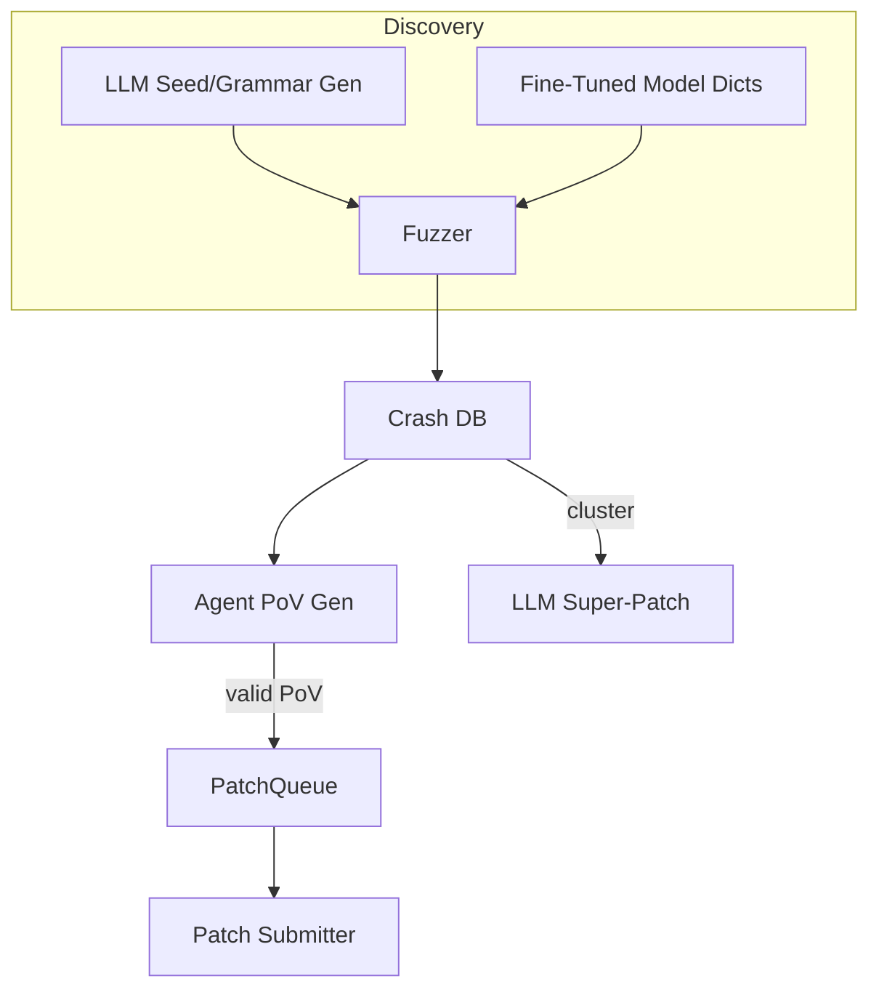

# Fuzzing wspomagany przez AI i automatyczne wykrywanie podatności

{{#include ../banners/hacktricks-training.md}}

## Przegląd
Duże modele językowe (LLM) mogą znacznie zwiększyć skuteczność tradycyjnych pipeline'ów badania podatności, generując semantycznie bogate dane wejściowe, rozwijając gramatyki, analizując dane o awariach, a nawet proponując poprawki obejmujące wiele błędów. Ta strona zbiera najbardziej skuteczne wzorce zaobserwowane podczas finałów DARPA AI Cyber Challenge (AIxCC) oraz w innych publicznych badaniach.<sup>[[4]](#references)</sup><sup>[[5]](#references)</sup>

Poniższy opis nie przedstawia jednego konkretnego systemu konkursowego, lecz stanowi abstrakcję tych technik, aby można było odtworzyć je we własnych workflowach.

---

## 1. Seed inputs generowane przez LLM

Tradycyjne fuzzery sterowane pokryciem (AFL++, libFuzzer, Honggfuzz…) rozpoczynają działanie od małego corpusu seedów i ślepo mutują bajty. Gdy format danych wejściowych celu jest złożony (SQL, URL-e, niestandardowe protokoły binarne), losowe mutacje zwykle psują składnię, zanim zostaną osiągnięte interesujące branche.

LLM-y mogą rozwiązać ten problem inicjalizacji, generując *generatory seedów* — krótkie skrypty, które zwracają **dane wejściowe poprawne składniowo, ale istotne z punktu widzenia bezpieczeństwa**. Na przykład:
```prompt
SYSTEM: You are a helpful security engineer.
USER:
Write a Python3 program that prints 200 unique SQL injection strings targeting common anti-pattern mistakes (missing quotes, numeric context, stacked queries).  Ensure length ≤ 256 bytes / string so they survive common length limits.
```

```python
# gen_sqli_seeds.py (truncated)
PAYLOADS = [
"1 OR 1=1 -- ",
"' UNION SELECT NULL,NULL--",
"0; DROP TABLE users;--",
...
]
for p in PAYLOADS:
print(p)
```
Uruchom raz i przekaż wyjście bezpośrednio do początkowego korpusu fuzzera:
```bash
python3 gen_sqli_seeds.py > seeds.txt
afl-fuzz -i seeds.txt -o findings/ -- ./target @@
```
Korzyści:
1. Poprawność semantyczna → większy zakres pokrycia na wczesnym etapie.
2. Możliwość ponownego generowania: zmień prompt, aby skupić się na XSS, path traversal, binary blobs itd.
3. Niski koszt (< 1 ¢ przy użyciu GPT-3.5).

### Wskazówki
* Poinstruuj model, aby *zróżnicował* długość i kodowanie payloadów (UTF-8, URL-encoded, UTF-16-LE), aby omijać powierzchowne filtry.
* Poproś o *pojedynczy, samodzielny skrypt* – pozwala uniknąć problemów z formatowaniem JSON.

---

## 2. Grammar-Evolution Fuzzing

Bardziej zaawansowany wariant polega na tym, aby pozwolić LLM-owi **ewoluować gramatykę** zamiast konkretnych seedów. Workflow (wzorzec „Grammar Guy”) wygląda następująco:

1. Wygeneruj początkową gramatykę ANTLR/Peach/LibFuzzer za pomocą promptu.
2. Wykonuj fuzzing przez N minut i zbieraj metryki pokrycia (trafione krawędzie / bloki).
3. Podsumuj niepokryte obszary programu i przekaż podsumowanie z powrotem do modelu:
```prompt
The previous grammar triggered 12 % of the program edges.  Functions not reached: parse_auth, handle_upload.  Add / modify rules to cover these.
```
4. Połącz nowe reguły, wykonaj fuzzing ponownie i powtarzaj.

Szkielet pseudokodu:
```python
for epoch in range(MAX_EPOCHS):
grammar = llm.refine(grammar, feedback=coverage_stats)
save(grammar, f"grammar_{epoch}.txt")
coverage_stats = run_fuzzer(grammar)
```
Kluczowe punkty:
* Zachowaj *budget* – każde udoskonalenie zużywa tokeny.
* Używaj instrukcji `diff` + `patch`, aby model edytował zamiast przepisywać.
* Zatrzymaj się, gdy Δcoverage < ε.

---

## 3. Generowanie PoV (Exploit) na podstawie agentów

Po znalezieniu crasha nadal potrzebujesz **proof-of-vulnerability (PoV)**, który deterministycznie go wywołuje.

Skalowalne podejście polega na uruchomieniu wielu lekkich workerów (procesów, wątków lub kontenerów), z których każdy korzysta z innego modelu lub konfiguracji próbkowania. Survey finalistów AIxCC podaje konkretne przykłady skali: jeden zespół użył **tysięcy równoczesnych agentów** do generowania PoV w podejściu AI-first, podczas gdy inny koordynował **300–500 agentów fuzzingowych** i rezerwował LLM-y do rozumowania semantycznego wyższego poziomu.<sup>[[4]](#references)</sup>

Pipeline:
1. Analiza statyczna/dynamiczna generuje *bug candidates* (struct z crash PC, input slice i komunikatem sanitizera).
2. Orchestrator rozdziela candidates agentom.
3. Kroki rozumowania agenta:
a. Odtwórz błąd lokalnie za pomocą `gdb` + inputu.
b. Zaproponuj minimalny exploit payload.
c. Zweryfikuj exploit w sandboxie. Jeśli się powiedzie → prześlij.
4. Nieudane próby są **ponownie umieszczane w kolejce jako nowe seedy** do fuzzingu pod kątem coverage (pętla sprzężenia zwrotnego).

Zalety:
* Parallelisation ukrywa zawodność pojedynczego agenta.
* Automatyczne dostrajanie temp / rozmiaru modelu na podstawie obserwowanego success-rate.

---

## 4. Directed Fuzzing z Fine-Tuned Code Models

Fine-tune'uj model open-weight (np. Llama-7B) na kodzie źródłowym C/C++ oznaczonym wzorcami podatności (integer overflow, buffer copy, format string). Następnie:

1. Uruchom analizę statyczną, aby uzyskać listę funkcji + AST.
2. Przekaż modelowi prompt: *„Give mutation dictionary entries that are likely to break memory safety in function X”*.
3. Wstaw te tokeny do niestandardowego `AFL_CUSTOM_MUTATOR`.

Przykładowy output dla wrappera `sprintf`:
```
{"pattern":"%99999999s"}
{"pattern":"AAAAAAAA....<1024>....%n"}
```
Empirycznie skraca to czas do wystąpienia crashu o >2× na rzeczywistych celach.

---

## 5. Strategie patchowania wspomaganego przez AI

### 5.1 Super Patches
Poproś model o *cluster* sygnatur crashy i zaproponowanie **pojedynczego patcha**, który usuwa wspólną przyczynę źródłową.  Prześlij go raz, napraw kilka błędów → mniej kar za poprawność w środowiskach, w których każdy błędny patch kosztuje punkty.

Zarys promptu:
```
Here are 10 stack traces + file snippets.  Identify the shared mistake and generate a unified diff fixing all occurrences.
```
### 5.2 Współczynnik spekulatywnych poprawek
Zaimplementuj kolejkę, w której potwierdzone poprawki zweryfikowane przez PoV oraz *spekulatywne* poprawki (bez PoV) są przeplatane w proporcji 1:​N dostosowanej do zasad punktacji (np. 2 spekulatywne : 1 potwierdzona). Model kosztów monitoruje kary w stosunku do punktów i samodzielnie dostosowuje N.

---

## 6. Deterministyczny przegląd kodu AI plik po pliku

Częstym trybem awarii w przeglądach wspomaganych przez AI jest poproszenie jednego agenta o sprawdzenie całego repozytorium i nadzieja, że wybierze właściwe pliki oraz terminy grep. Bardziej niezawodnym wzorcem jest **wymuszenie pokrycia repozytorium**:<sup>[[1]](#references)</sup>

1. Wylicz pliki źródłowe.
2. Wysyłaj **jeden plik naraz** wraz z minimalnym kontekstem (entrypoint, importy, pobliskie routes/callers).
3. Wymagaj **ustrukturyzowanego raportu** dla każdego pliku: sources, sink, brakująca walidacja, warunki wstępne exploita oraz poziom pewności.<sup>[[3]](#references)</sup>
4. Usuń duplikaty raportów według wzorca **source→sink** i ręcznie zweryfikuj te o wysokim ryzyku.

Metoda ta wymaga dużej liczby tokenów i generuje dużo szumu, ale jest bardzo skuteczna w wykrywaniu **prostych bugów source/sink o dużym wpływie**, które często umykają szerokim przeglądom agentic.

### Wzorce triage, które warto traktować priorytetowo

- **Dynamiczne dołączanie/dispatch w PHP**: kontrolowane przez atakującego nazwy route/controller/module przepływające do `require_once()`, `include()` lub `include_once()` bez ścisłego allowlistingu i kanonikalizacji ścieżki.
- **Wykonywanie poleceń powłoki w workflows administratora/konta**: usernames, domeny, konta FTP lub inne identyfikatory trafiające do `exec()`, `system()`, `shell_exec()`, `passthru()`, `proc_open()` lub `popen()`.
- **Fan-in ustrukturyzowanych danych wejściowych**: ten sam parametr akceptowany z `$_GET`, `$_POST`, JSON, XML lub parserów body frameworka, a następnie ponownie używany w sinkach systemu plików lub poleceń systemu operacyjnego.

### Dwie praktyczne klasy bugów, które ta metoda dobrze wykrywa

- **LFI/RCE w dispatchu kontrolera PHP**: jeśli kontrolowana przez request nazwa kontrolera jest konkatenowana z `require_once()` bez allowlisty/normalizacji ścieżki, sekwencje traversal, takie jak `../`, mogą spowodować, że PHP dołączy niezamierzony lokalny plik `.php`. Jeśli atakujący może wskazać umieszczony przez siebie lub w inny sposób użyteczny plik PHP, LFI przechodzi w wykonanie kodu. Zobacz [File Inclusion / Path Traversal](../pentesting-web/file-inclusion/README.md).<sup>[[1]](#references)</sup>
- **Uwierzytelnione command injection w panelach hostingowych/administracyjnych**: jeśli pola zarządzania kontem, takie jak usernames, są osadzane w poleceniach powłoki, uwierzytelniony użytkownik o niskich uprawnieniach może zmienić zwykłą akcję tworzenia/usuwania w RCE. Wpływ jest większy, gdy panel wykonuje polecenie jako konto usługi o wyższych uprawnieniach. Zobacz [Command Injection](../pentesting-web/command-injection.md).<sup>[[1]](#references)</sup>

### Praktyczne uwagi dotyczące przeglądu

- Używaj LLM przede wszystkim jako **reviewera source/sink**, a nie generatora exploita.
- Poproś go o jednoznaczne wyszczególnienie **pola kontrolowanego przez atakującego**, **luki w normalizacji/walidacji** oraz **niebezpiecznego sinka**.
- W przypadku dużych repozytoriów deterministyczny przegląd plik po pliku jest często bardziej niezawodny niż pojedyncze autonomiczne uruchomienie agenta, nawet jeśli to drugie korzysta z silniejszego modelu.<sup>[[2]](#references)</sup>
- Spodziewaj się słabszych wyników w przypadku **Broken Access Control** i innych bugów logiki biznesowej, w których exploitatability zależy od założeń dotyczących wielu plików, semantyki ról lub modeli zagrożeń specyficznych dla produktu.

---

## Połączenie wszystkich elementów
System CRS (Cyber Reasoning System) typu end-to-end może połączyć te komponenty w następujący sposób:

```mermaid
graph TD
subgraph Discovery
A[LLM Seed/Grammar Gen] --> B[Fuzzer]
C[Fine-Tuned Model Dicts] --> B
end
B --> D[Crash DB]
D --> E[Agent PoV Gen]
E -->|valid PoV| PatchQueue
D -->|cluster| F[LLM Super-Patch]
PatchQueue --> G[Patch Submitter]
```
---

## References

- [1] [Project Black - Lokalne AI dla cyberbezpieczeństwa: znalezienie LFI w phpIPAM i uwierzytelnionego RCE w myVesta](https://projectblack.io/blog/local-ai-for-cyber-security)
- [2] [Strix](https://github.com/usestrix/strix)
- [3] [Umiejętność przeglądu bezpieczeństwa społeczności GitHub Copilot](https://github.com/github/awesome-copilot/blob/main/skills/security-review/SKILL.md)
- [4] [Trail of Bits – finały AIxCC: opowieść o przebiegu rywalizacji](https://blog.trailofbits.com/2025/08/07/aixcc-finals-tale-of-the-tape/)
- [5] [Wywiady z finalistami CTF Radiooo AIxCC](https://www.youtube.com/@ctfradiooo)
{{#include ../banners/hacktricks-training.md}}
