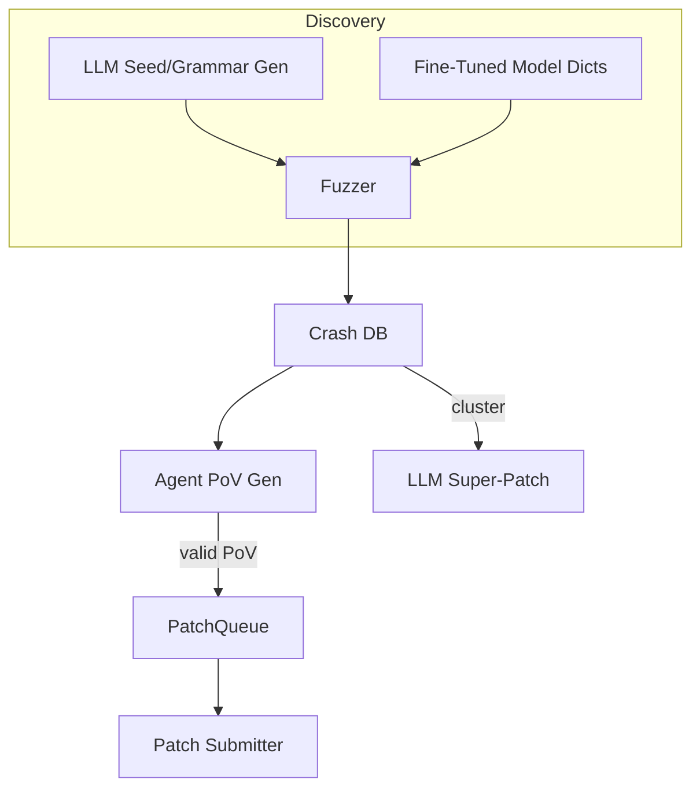

# AI-Assisted Fuzzing & Automated Vulnerability Discovery

{{#include ../banners/hacktricks-training.md}}

## Muhtasari
Large-language models (LLMs) zinaweza kuongeza kwa kiasi kikubwa nguvu za pipelines za jadi za vulnerability research kwa kuzalisha inputs zenye maana ya kisemantiki, kubadilisha grammars, kufanya reasoning kuhusu data za crashes, na hata kupendekeza patches zinazoshughulikia bugs nyingi. Ukurasa huu unakusanya mifumo yenye ufanisi zaidi iliyobainika wakati wa fainali za DARPA’s AI Cyber Challenge (AIxCC) na utafiti mwingine wa umma.<sup>[[4]](#references)</sup><sup>[[5]](#references)</sup>

Kinachofuata si maelezo ya mfumo maalum wa competition moja, bali ni muhtasari wa techniques ili uweze kuzitumia tena katika workflows zako mwenyewe.

---

## 1. LLM-Generated Seed Inputs

Coverage–guided fuzzers za kawaida (AFL++, libFuzzer, Honggfuzz…) huanza na corpus ndogo ya seeds na hubadilisha bytes bila mpangilio. Wakati target input format ni tata (SQL, URLs, custom binary protocols), mutations za random mara nyingi huvunja syntax kabla branches zinazovutia hazijafikiwa.

LLMs zinaweza kutatua tatizo hili la bootstrap kwa kutoa *seed generators* – scripts fupi zinazotoa **inputs zilizo sahihi kisintaksia lakini zinazohusiana na usalama**. Kwa mfano:
```prompt
SYSTEM: You are a helpful security engineer.
USER:
Write a Python3 program that prints 200 unique SQL injection strings targeting common anti-pattern mistakes (missing quotes, numeric context, stacked queries).  Ensure length ≤ 256 bytes / string so they survive common length limits.
```

```python
# gen_sqli_seeds.py (truncated)
PAYLOADS = [
"1 OR 1=1 -- ",
"' UNION SELECT NULL,NULL--",
"0; DROP TABLE users;--",
...
]
for p in PAYLOADS:
print(p)
```
Endesha mara moja na upeleke matokeo moja kwa moja kwenye corpus ya awali ya fuzzer:
```bash
python3 gen_sqli_seeds.py > seeds.txt
afl-fuzz -i seeds.txt -o findings/ -- ./target @@
```
Benefits:
1. Uhalali wa kisemantiki → coverage ya kina mapema.
2. Inaweza kutengenezwa upya: rekebisha prompt ili kuzingatia XSS, path traversal, binary blobs, n.k.
3. Nafuu (< 1 ¢ kwa GPT-3.5).

### Vidokezo
* Iambie model *itofautishe* urefu na encoding ya payload (UTF-8, URL-encoded, UTF-16-LE) ili kupita filters za juu juu.
* Omba *script moja inayojitosheleza* – huepuka matatizo ya uumbizaji wa JSON.

---

## 2. Grammar-Evolution Fuzzing

Toleo lenye nguvu zaidi ni kuacha LLM **iboreshe grammar** badala ya seeds halisi. Workflow (“Grammar Guy” pattern) ni:

1. Generate grammar ya awali ya ANTLR/Peach/LibFuzzer kupitia prompt.
2. Fuzz kwa dakika N na kukusanya vipimo vya coverage (edges / blocks zilizofikiwa).
3. Fanya muhtasari wa maeneo ya program ambayo hayajafikiwa na urudishe muhtasari huo kwenye model:
```prompt
The previous grammar triggered 12 % of the program edges.  Functions not reached: parse_auth, handle_upload.  Add / modify rules to cover these.
```
4. Unganisha rules mpya, fanya fuzz tena, kisha rudia.

Msingi wa pseudo-code:
```python
for epoch in range(MAX_EPOCHS):
grammar = llm.refine(grammar, feedback=coverage_stats)
save(grammar, f"grammar_{epoch}.txt")
coverage_stats = run_fuzzer(grammar)
```
Mambo muhimu:
* Weka *budget* – kila refinement hutumia tokens.
* Tumia maagizo ya `diff` + `patch` ili model ifanye uhariri badala ya kuandika upya.
* Simama wakati Δcoverage < ε.

---

## 3. Uzalishaji wa PoV (Exploit) kwa kutumia Agents

Baada ya crash kupatikana, bado unahitaji **proof-of-vulnerability (PoV)** inayouanzisha kwa uhakika.

Mbinu inayoweza kupanuka ni kuanzisha workers wengi wepesi (processes, threads, au containers), kila mmoja akitumia model au sampling configuration tofauti. Utafiti wa AIxCC finalist unatoa mifano halisi ya kiwango: timu moja ilitumia **maelfu ya agents wanaofanya kazi kwa wakati mmoja** kwa ajili ya uzalishaji wa PoV unaoongozwa na AI, huku nyingine ikiendesha **agents 300–500 za fuzzing** na kuhifadhi LLMs kwa reasoning ya semantic ya kiwango cha juu.<sup>[[4]](#references)</sup>

Pipeline:
1. Static/dynamic analysis huzalisha *bug candidates* (struct yenye crash PC, input slice, na sanitizer msg).
2. Orchestrator husambaza candidates kwa agents.
3. Hatua za reasoning za agent:
a. Reproduce bug locally kwa `gdb` + input.
b. Pendekeza exploit payload ndogo zaidi.
c. Validate exploit katika sandbox.  Ikifanikiwa → submit.
4. Majaribio yaliyoshindwa **huwekwa tena kwenye foleni kama seeds mpya** kwa ajili ya coverage fuzzing (feedback loop).

Faida:
* Parallelisation huficha kutotegemeka kwa agent mmoja.
* Auto-tuning ya temp / model size kulingana na success-rate iliyozingatiwa.

---

## 4. Directed Fuzzing kwa kutumia Fine-Tuned Code Models

Fine-tune model yenye open-weight (mfano Llama-7B) kwa kutumia source code ya C/C++ iliyo na labels za vulnerability patterns (integer overflow, buffer copy, format string). Kisha:

1. Endesha static analysis ili kupata function list + AST.
2. Prompt model: *“Give mutation dictionary entries that are likely to break memory safety in function X”*.
3. Ingiza tokens hizo katika `AFL_CUSTOM_MUTATOR`.

Mfano wa output kwa `sprintf` wrapper:
```
{"pattern":"%99999999s"}
{"pattern":"AAAAAAAA....<1024>....%n"}
```
Kitaaluma, hii hupunguza time-to-crash kwa zaidi ya 2× kwenye targets halisi.

---

## 5. Mikakati ya AI-Guided Patching

### 5.1 Super Patches
Iombe model *icluster* crash signatures na ipendekeze **single patch** inayoondoa chanzo cha pamoja.  Tuma mara moja, rekebisha bugs kadhaa → penalties chache za accuracy katika mazingira ambapo kila patch isiyo sahihi hugharimu points.

Muhtasari wa prompt:
```
Here are 10 stack traces + file snippets.  Identify the shared mistake and generate a unified diff fixing all occurrences.
```
### 5.2 Uwiano wa Speculative Patch
Tekeleza queue ambapo patches zilizothibitishwa na ku-validate-ikiwa na PoV pamoja na patches za *speculative* (bila PoV) zinaingiliana kwa uwiano wa 1:​N uliowekwa kulingana na scoring rules (kwa mfano, 2 speculative : 1 confirmed). Cost model hufuatilia penalties dhidi ya points na kujirekebisha yenyewe kwa N.

---

## 6. AI Code Review ya Deterministic File-by-File

Failure mode ya mara kwa mara katika review inayosaidiwa na AI ni kumwomba agent mmoja kukagua repository nzima na kutumaini kwamba itachagua files na grep terms zinazofaa. Pattern inayotegemeka zaidi ni **kulazimisha repository coverage**:<sup>[[1]](#references)</sup>

1. Orodhesha source files.
2. Tuma **file moja kwa wakati** pamoja na context ndogo (entrypoint, imports, routes/callers zilizo karibu).
3. Dai **structured report** kwa kila file: sources, sink, validation inayokosekana, exploit preconditions, na confidence.<sup>[[3]](#references)</sup>
4. Ondoa reports zinazojirudia kulingana na **source→sink pattern**, kisha validate manually zile zenye risk kubwa.

Njia hii hutumia tokens nyingi na hutoa noise, lakini ni yenye ufanisi mkubwa katika kufichua **bugs rahisi zenye impact kubwa za source/sink** ambazo reviews pana za agentic mara nyingi hukosa.

### Triage patterns zinazofaa kupewa kipaumbele

- **Dynamic PHP include/dispatch**: majina ya route/controller/module yanayodhibitiwa na attacker na yanayopita hadi `require_once()`, `include()`, au `include_once()` bila allowlisting kali na path canonicalisation.
- **Shell execution katika admin/account workflows**: usernames, domains, FTP accounts, au identifiers nyingine zinazofika kwenye `exec()`, `system()`, `shell_exec()`, `passthru()`, `proc_open()`, au `popen()`.
- **Structured input fan-in**: parameter ileile inayokubaliwa kutoka `$_GET`, `$_POST`, JSON, XML, au framework body parsers na baadaye kutumiwa tena katika filesystem au OS-command sinks.

### Bug classes mbili za kivitendo ambazo method hii huzipata vizuri

- **PHP controller-dispatch LFI/RCE**: ikiwa jina la controller linalodhibitiwa na request linaunganishwa kwenye `require_once()` bila allowlist/path normalisation, traversal sequences kama `../` zinaweza kufanya PHP i-include local `.php` file isiyokusudiwa. Ikiwa attacker anaweza kuelekeza include kwenye PHP file iliyopandikizwa au yenye manufaa kwa njia nyingine, LFI hubadilika kuwa code execution. Tazama [File Inclusion / Path Traversal](../pentesting-web/file-inclusion/README.md).<sup>[[1]](#references)</sup>
- **Authenticated command injection katika hosting/admin panels**: ikiwa fields za account-management kama usernames zinawekwa ndani ya shell commands, authenticated user mwenye privileges ndogo anaweza kubadilisha create/delete action ya kawaida kuwa RCE. Impact huongezeka wakati panel inatekeleza command kama service account yenye privileges zaidi. Tazama [Command Injection](../pentesting-web/command-injection.md).<sup>[[1]](#references)</sup>

### Practical review notes

- Tumia LLM kama **source/sink reviewer kwanza**, si kama exploit generator.
- Iombe itaje wazi **attacker-controlled field**, **normalization/validation gap**, na **dangerous sink**.
- Kwa repos kubwa, review ya deterministic per-file mara nyingi hutegemeka zaidi kuliko single autonomous agent run, hata pale ya pili inapotumia model yenye nguvu zaidi.<sup>[[2]](#references)</sup>
- Tarajia matokeo dhaifu zaidi kwenye **Broken Access Control** na business-logic bugs nyingine ambapo exploitability inategemea assumptions za files mbalimbali, role semantics, au threat models maalum za product.

---

## Kuiunganisha Yote
CRS (Cyber Reasoning System) ya end-to-end inaweza kuunganisha components kama hivi:

```mermaid
graph TD
subgraph Discovery
A[LLM Seed/Grammar Gen] --> B[Fuzzer]
C[Fine-Tuned Model Dicts] --> B
end
B --> D[Crash DB]
D --> E[Agent PoV Gen]
E -->|valid PoV| PatchQueue
D -->|cluster| F[LLM Super-Patch]
PatchQueue --> G[Patch Submitter]
```
---

## References

- [1] [Project Black - AI ya ndani kwa Cyber Security: Kupata LFI ya phpIPAM na RCE iliyothibitishwa kwa Authenticated](https://projectblack.io/blog/local-ai-for-cyber-security)
- [2] [Strix](https://github.com/usestrix/strix)
- [3] [Ujuzi wa mapitio ya usalama wa jamii wa GitHub Copilot](https://github.com/github/awesome-copilot/blob/main/skills/security-review/SKILL.md)
- [4] [Trail of Bits – Fainali za AIxCC: Simulizi la ushahidi](https://blog.trailofbits.com/2025/08/07/aixcc-finals-tale-of-the-tape/)
- [5] [Mahojiano ya finalists wa CTF Radiooo AIxCC](https://www.youtube.com/@ctfradiooo)
{{#include ../banners/hacktricks-training.md}}
